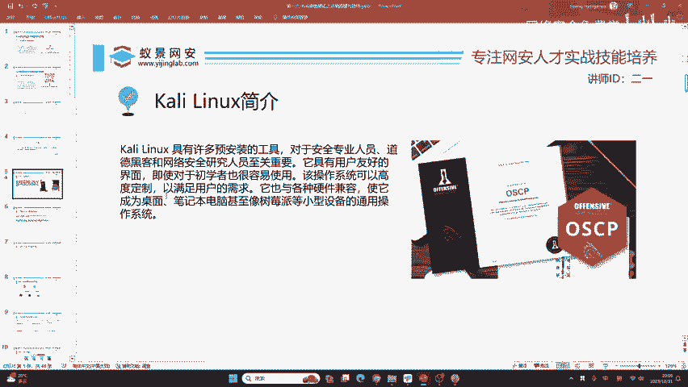
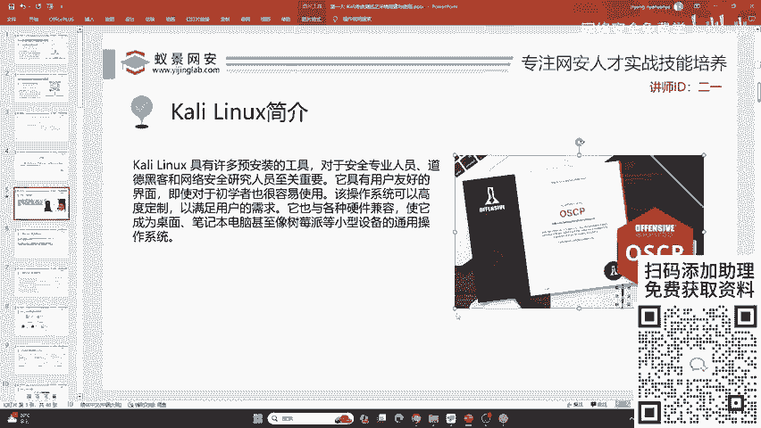
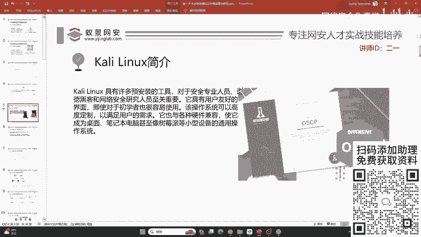
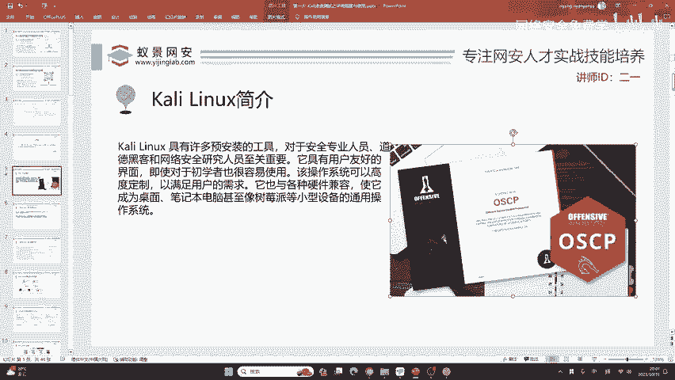
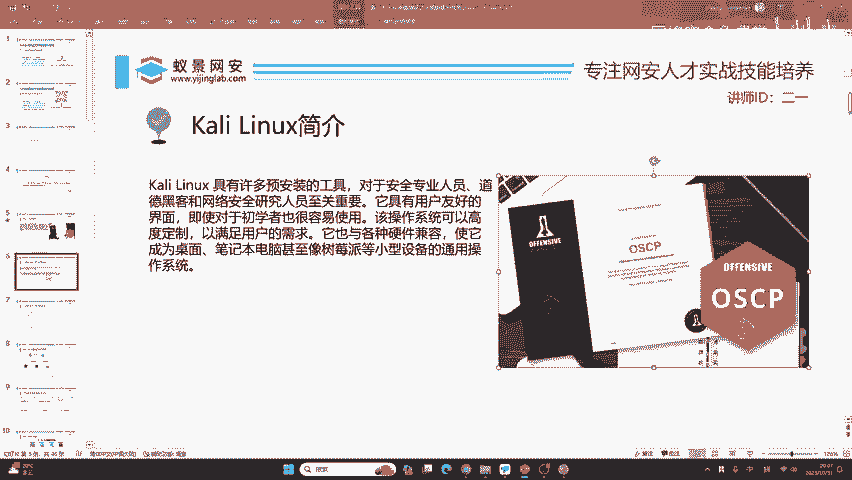

# 网络安全入门：P14：Kali Linux介绍 🐧

在本节课中，我们将要学习Kali Linux，一个在网络安全领域至关重要的操作系统。我们将了解它的起源、核心价值以及为何它是初学者进入安全领域的理想起点。

## 概述

Kali Linux是一个专为渗透测试和网络安全评估设计的Linux发行版。它预装了大量的安全工具，为安全从业者提供了一个开箱即用的强大平台。

## Kali Linux的核心价值

首先，我们用一句话概括Kali Linux：它是一个对网络安全工作帮助极大的操作系统。

虽然它预装了非常多的工具，但这些工具本身可能并非直接有用。那么，我们为什么还要学习它呢？

以下是几个关键原因：

1.  **它是网络安全的大门**：学习Kali Linux是进入网络安全领域的重要第一步，我们需要打开这扇门。
2.  **工具的开源与权威性**：它所集成的工具都是开源且著名的。许多当前使用的新颖技术和高阶技术，都是在这些工具的基础上进行丰富和拓展的。
3.  **深厚的技术底蕴**：Kali Linux由世界顶级的网络安全公司Offensive Security（简称OffSec）开发与维护。

## Offensive Security与OSCP认证

上一节我们介绍了Kali Linux的开发者。本节中，我们来具体看看这家公司及其提供的价值。

Offensive Security不仅维护Kali Linux，还提供一项国际公认的认证：**OSCP**（Offensive Security Certified Professional）。

如果你已经具备工作经验，获取OSCP证书对于实现安全领域的高级岗位目标，包括寻找境外的工作机会，非常有帮助。

因此，Kali Linux是值得学习的。

## 总结

本节课中，我们一起学习了Kali Linux的基本介绍。我们了解到它是一个由Offensive Security开发的、集成了大量安全工具的Linux发行版，是网络安全入门的关键，并且其背后的OSCP认证在职业发展上具有重要价值。它为后续深入学习具体的渗透测试技术和工具打下了坚实的基础。