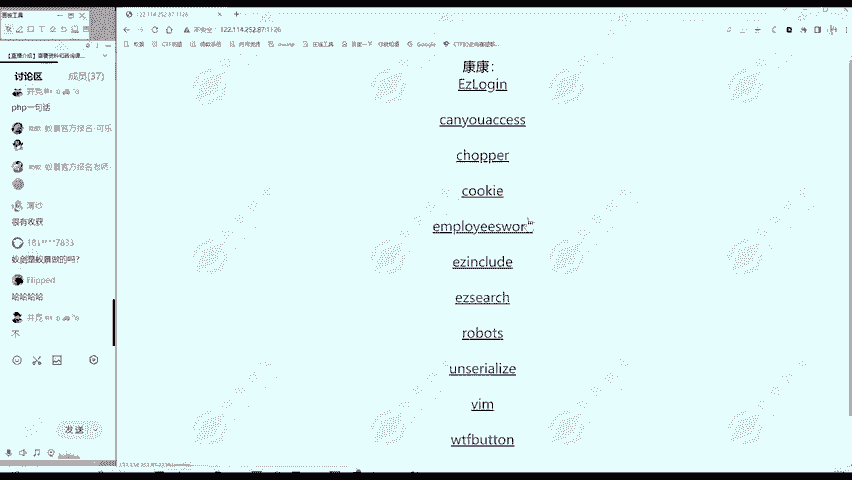
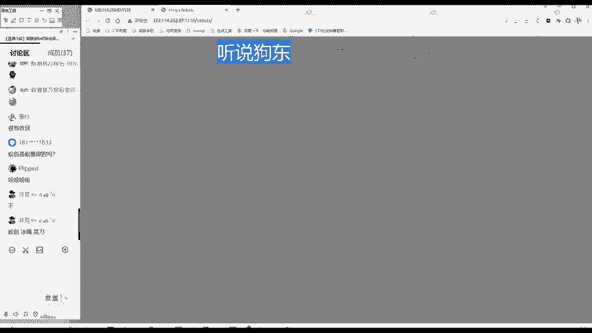
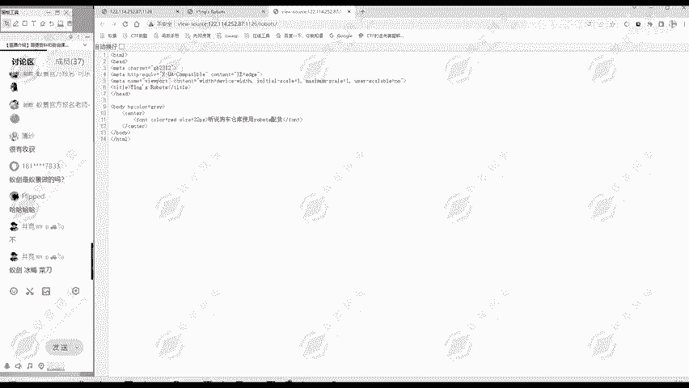
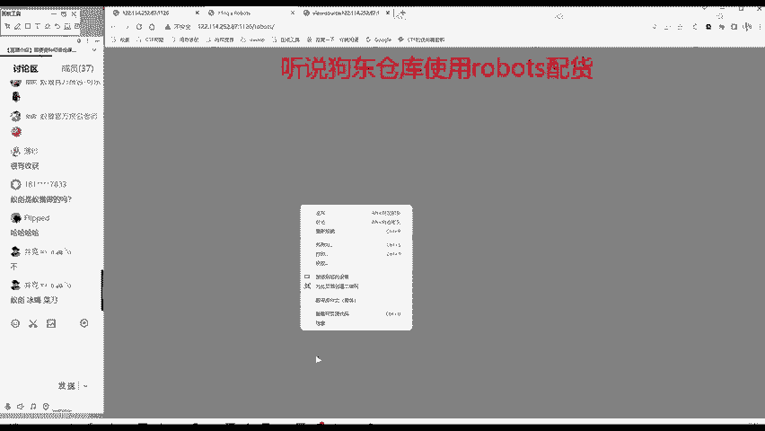
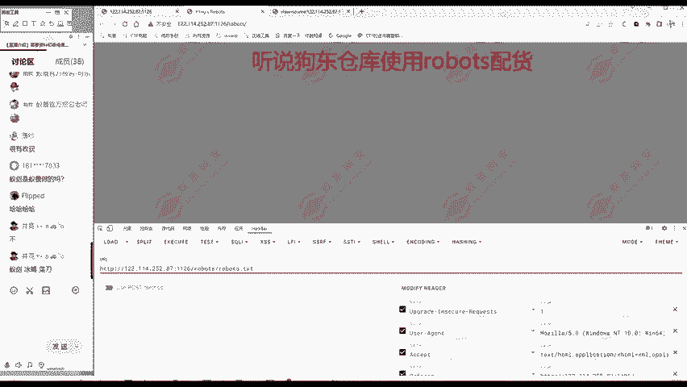
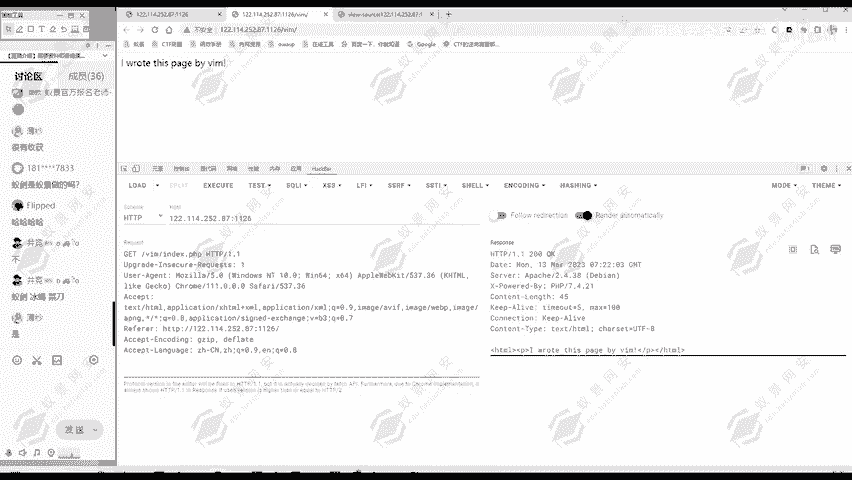

# 网络安全入门：P151：真题讲解—robots与VIM





在本节课中，我们将通过两道CTF真题，学习信息搜集中的两个关键知识点：`robots`协议和`VIM`编辑器备份文件。我们将分析题目线索，并一步步找到隐藏的`flag`。

## 题目一：Robots协议

上一节我们介绍了信息搜集的基本思路，本节中我们来看看如何利用`robots`协议解题。



首先，我们分析题目给出的信息。网页标题和URL都提示了“Robots”。网页内容显示“狗东仓库使用robots配货”，源代码部分没有额外信息。





通过分析，此题应与`robots`协议相关。`robots`协议是互联网上一种用于告知网络爬虫哪些页面可以抓取、哪些不能抓取的声明性协议。其核心是一个名为 `robots.txt` 的文本文件，通常放置在网站的根目录下。

以下是访问 `robots.txt` 文件的步骤：
1.  在浏览器或Burp Suite等工具中，访问目标网址后加上 `/robots.txt` 路径。
2.  查看该文件内容，分析其中禁止访问的目录。

我们访问 `http://目标网址/robots.txt`，得到以下内容：
```
User-agent: *
Disallow: /robots/
Disallow: /flag.html
```
这段代码的含义是：对于所有爬虫（`User-agent: *`），不允许访问 `/robots/` 和 `/flag.html` 这两个路径。这通常意味着这些路径是真实存在的。

因此，我们尝试访问这两个被禁止的路径。访问 `/robots/` 目录时，页面看似空白。此时，我们需要查看网页源代码，因为服务器返回的原始数据可能包含页面上未直接显示的内容。

在 `/robots/` 目录页面的源代码中，我们在大量空白行之后找到了隐藏的 `flag`。如果此处没有，则应继续尝试访问 `/flag.html`。

**总结**：本题考察对 `robots` 协议的理解。该协议可能泄露网站不希望被公开访问的目录或文件路径，从而成为信息搜集的突破口。

## 题目二：VIM编辑器备份文件

在理解了 `robots` 协议后，我们来看另一道与开发工具相关的题目。

首先进行信息搜集。题目名称为“VIM”，网页内容显示“I wrote this page by VIM”（我用VIM写的这个页面）。源代码中无其他有用信息。

由此推测，此题应与 `VIM` 编辑器相关。`VIM` 是 `Linux` 系统中一个强大的文本编辑器。在网络安全中，我们关注其一个特性：当 `VIM` 非正常退出（如崩溃或未保存就关闭）时，它会自动生成一个备份文件，以防止工作内容丢失。

这个备份文件的命名规则是一个**公式**：
```
.[原文件名].swp
```
例如，编辑 `index.php` 时非正常退出，会生成 `.index.php.swp` 文件。在 `Linux` 系统中，以点 `.` 开头的文件是隐藏文件，容易被管理员忽略，从而可能导致源代码等敏感信息泄露。

题目提示网站由 `VIM` 编写，那么它是否可能存在这样的备份文件呢？关键是要找到“原文件名”。我们当前访问的路径是 `/vim/`，这通常是一个目录，其默认访问的文件可能是 `index.php`。

为了验证，我们可以查看HTTP响应的原始数据（例如使用Burp Suite抓包），在响应头中可能会发现 `X-Powered-By: PHP/7.4.21` 这样的信息，这确认了后端使用PHP。因此，默认文件名很可能是 `index.php`。



根据备份文件命名规则，我们尝试访问：
```
http://目标网址/vim/.index.php.swp
```
访问后，我们成功找到了包含 `flag` 的备份文件内容。

**总结**：本题考察 `VIM` 编辑器自动生成备份文件的特性。这些隐藏的 `.swp` 文件如果未被及时清理，可能造成源代码泄露，是信息搜集时一个值得尝试的路径。

---

本节课中我们一起学习了两个重要的信息搜集技巧：通过 `robots.txt` 文件发现隐藏路径，以及利用 `VIM` 编辑器特性寻找备份文件。掌握这些思路，能帮助你在CTF比赛或渗透测试信息搜集阶段发现更多线索。