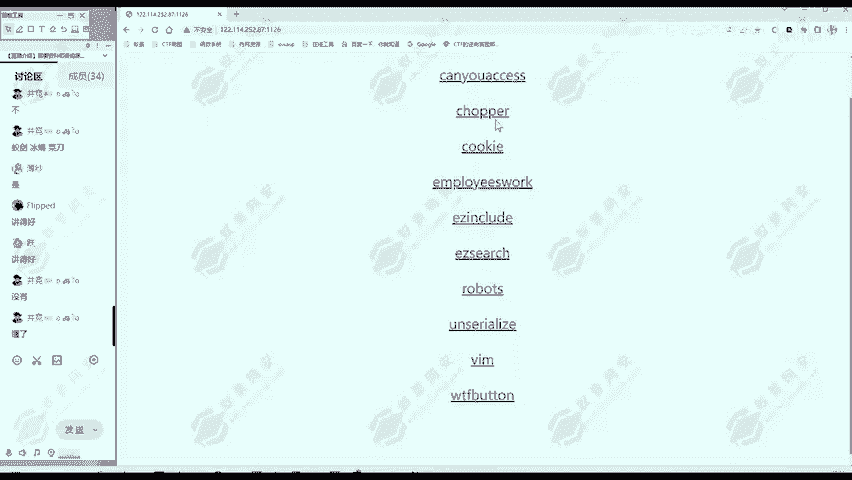
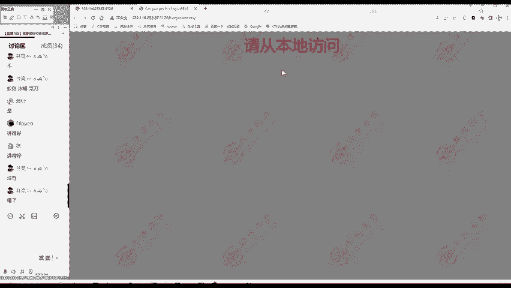
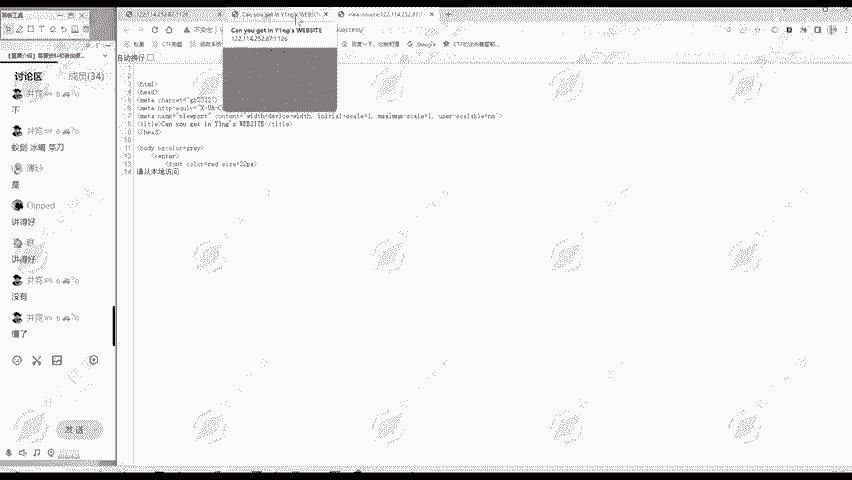
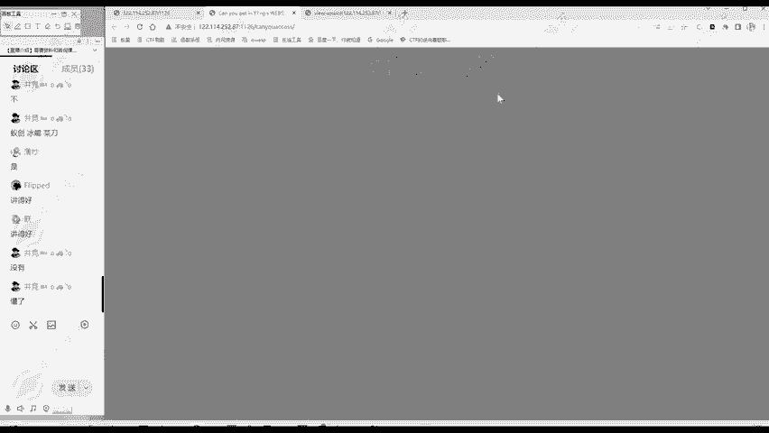
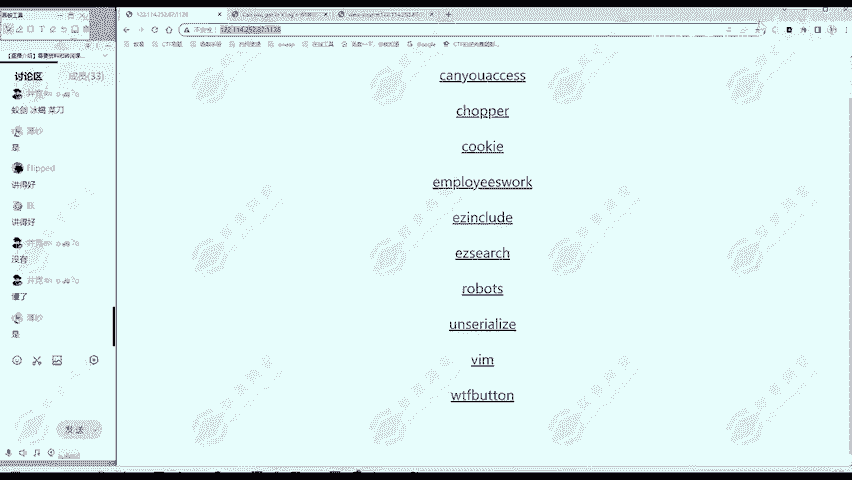

# 网络安全入门：P152：真题讲解—canyouaccess



在本节课中，我们将学习如何通过分析HTTP协议头来绕过服务器的访问限制，解决一道名为“canyouaccess”的CTF题目。我们将从信息收集开始，逐步理解服务器如何判断客户端信息，并最终获取Flag。

## 题目信息收集



我们首先查看题目页面。页面标题为“can you access”，正文提示“请从本地访问”。这表明服务器对访问来源有特定限制。



## 理解服务器如何判断访问来源

上一节我们介绍了题目的基本要求，本节中我们来看看服务器如何判断我们是否从“本地”访问。服务器部署在远程，我们无法真正从本地访问。因此，服务器必然是通过分析我们发送的HTTP请求包中的信息来进行判断的。

HTTP请求头中包含多个字段，服务器可以读取这些字段来获取客户端信息，例如：
*   `Host`: 请求的主机名。
*   `User-Agent`: 客户端的浏览器信息。
*   `Referer`: 指示请求的来源页面。



那么，服务器如何知道我们的IP地址呢？通常，可以通过 `X-Forwarded-For` 这样的字段来指示客户端的原始IP地址。

## 第一步：尝试伪装本地IP

为了测试我们的思路，我们使用抓包工具（如Burp Suite）拦截请求，并尝试在请求头中添加 `X-Forwarded-For` 字段，将其值设置为本地IP `127.0.0.1`。

**修改请求头示例：**
```
X-Forwarded-For: 127.0.0.1
```
发送请求后，页面提示从“请从本地访问”变为“你以为我不知道X-Forwarded-For”。这说明我们的思路正确，但服务器过滤了这个特定字段。

## 第二步：绕过IP字段过滤

既然 `X-Forwarded-For` 被过滤，我们需要使用其他表示客户端IP的HTTP头字段来绕过。服务器不太可能过滤所有相关字段。

以下是常见的用于指示客户端IP的HTTP头字段列表，我们可以批量添加进行尝试：
```
Client-IP: 127.0.0.1
X-Real-IP: 127.0.0.1
X-Forwarded-Host: 127.0.0.1
X-Originating-IP: 127.0.0.1
X-Remote-IP: 127.0.0.1
X-Remote-Addr: 127.0.0.1
... (以及其他数十个类似字段)
```
将包含这些字段的请求发送后，页面提示变为“请从google.com访问”。这表明我们成功绕过了IP检查，服务器现在认为我们是从本地访问的。

## 第三步：伪装访问来源

现在，服务器要求我们从 `google.com` 访问。HTTP请求中，`Referer` 字段专门用于指示请求的来源网址。

因此，我们将请求头中的 `Referer` 字段值修改为 `https://www.google.com`。

**修改请求头示例：**
```
Referer: https://www.google.com
```
发送请求后，页面提示变为“请使用ABC浏览器”。这说明我们成功通过了来源检查。

## 第四步：伪装浏览器类型



最后，服务器要求我们使用“ABC浏览器”。HTTP请求中，`User-Agent` 字段用于标识客户端使用的浏览器和操作系统。

因此，我们将请求头中的 `User-Agent` 字段值修改为 `ABC Browser`。

**修改请求头示例：**
```
User-Agent: ABC Browser
```
发送此请求后，页面上成功显示出Flag。

## 总结

本节课中我们一起学习了如何通过修改HTTP请求头来应对服务器的访问控制挑战。解题的核心思路在于理解服务器如何通过不同的HTTP头字段（如 `X-Forwarded-For`、`Referer`、`User-Agent`）来验证客户端信息，并灵活运用或绕过这些检查。掌握这些HTTP协议的基础知识，是进行Web安全测试和CTF解题的重要技能。