# 网络安全入门：P153：真题讲解—employeeswork

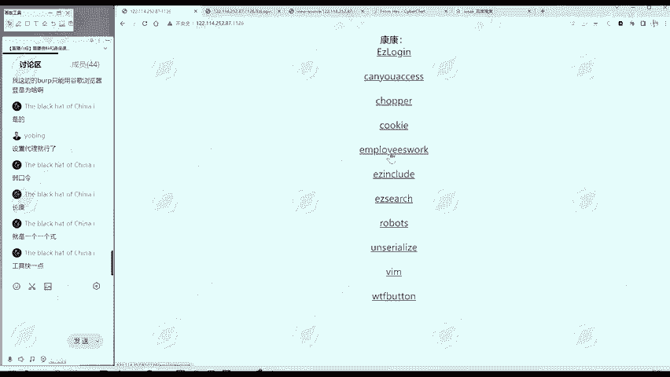

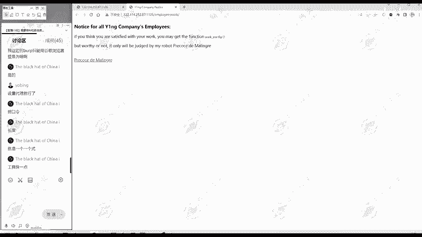

## 📖 概述
在本节课中，我们将一起学习如何分析并解决一道典型的CTF（Capture The Flag）题目。我们将从信息搜集开始，逐步分析网页代码，理解其逻辑，并最终利用“双写绕过”技术获取flag。整个过程将帮助你建立解题的基本思路。

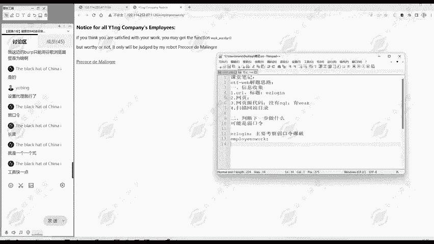

---

## 🔍 第一步：信息搜集
我们拿到这个题目。首先进行信息搜集。

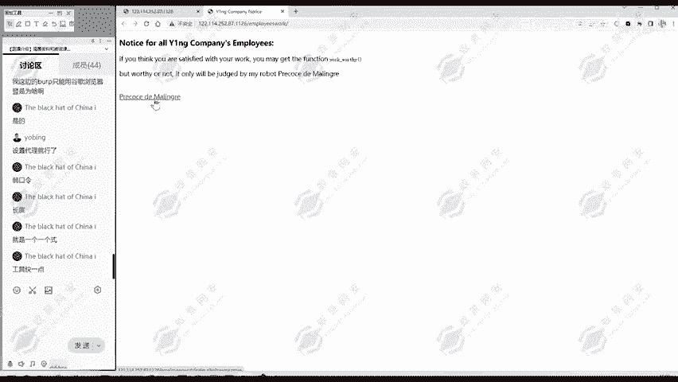

我们寻找我们需要的信息，根据找到的信息判断下一步做什么。题目是“Employees work”。

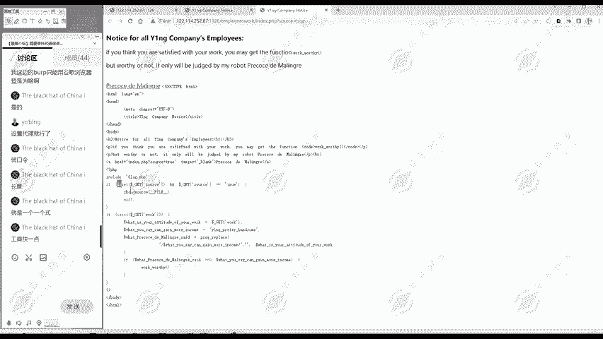

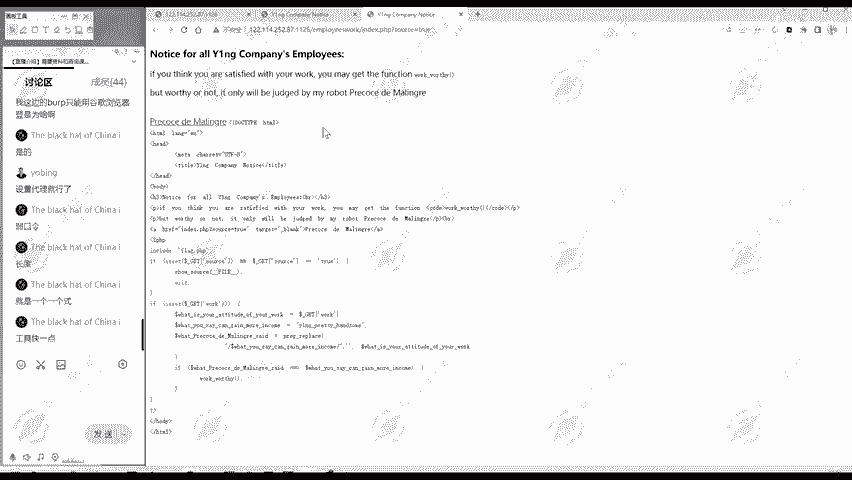

网页标题是“YENGcomp notice”。网页部分有一段英文。

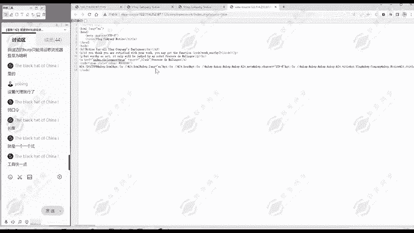

注意到这里面跟其他不一样，不一样的地方我们就要注意一下。

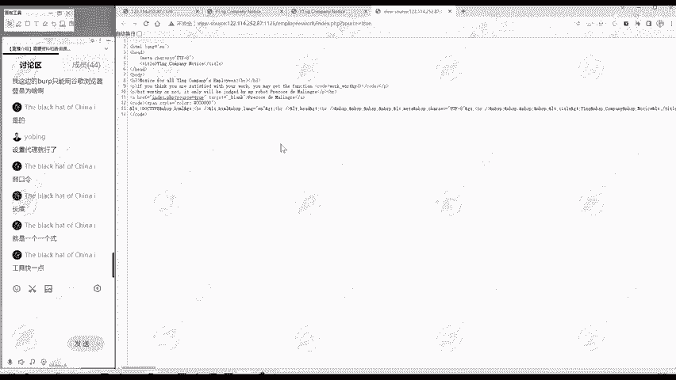

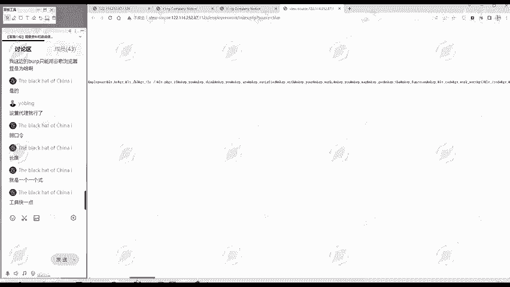

这好像是一个函数，`workworthyy()` 一个括号，这像一个函数。然后，这里面有一个好像链接一样的东西，我们点一下。

---

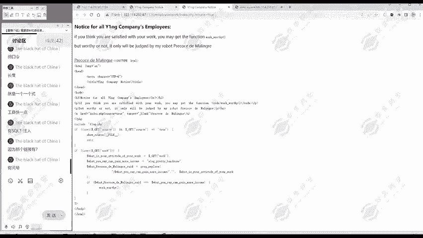

## 💻 第二步：分析关键代码
点这个链接，发现显示出来一段代码。

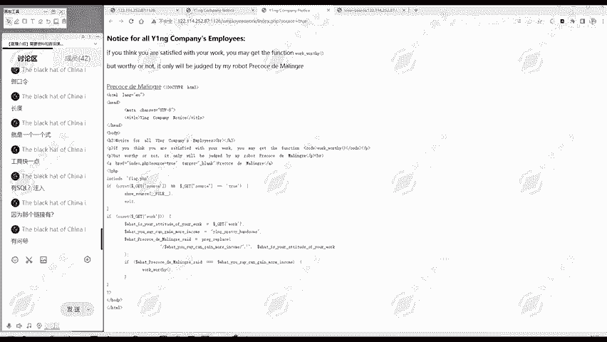

这段代码可能对我们非常有用。

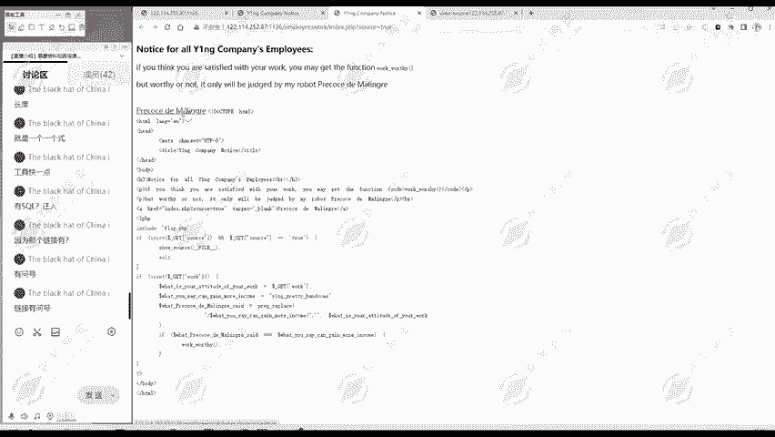

但我们先不看这个代码，我们先看一下网页源代码。

查看网页源代码时，重点看两部分。第一部分是注释，像我们刚才那道题的注释信息。第二部分是看有没有一些隐藏的代码。这里没写什么代码。

现在通过我们刚才的分析和信息搜集，发现了一段PHP代码。

那我们下面就应该要分析这个代码，这个代码是我们下一步工作、解题的一个重点。

---

## 📝 第三步：理解PHP代码逻辑
我们看一下这代码是什么意思。

之前，这个链接它是不一样的字体，所以说我们可以点击一下试试，进行一个尝试。这有可能是解题的关键，但也有可能不是。在我们题目做出之前，什么都有可能。

这里是一段PHP的代码。没学过PHP也没关系，我们一起来看一下。

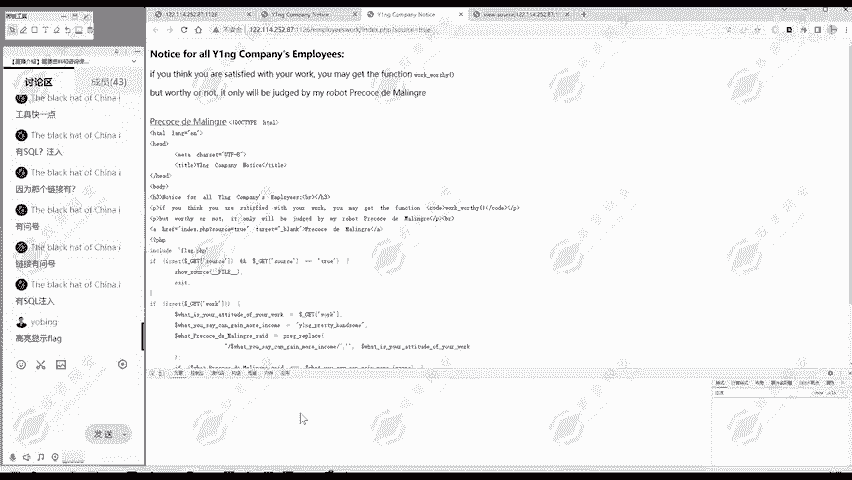

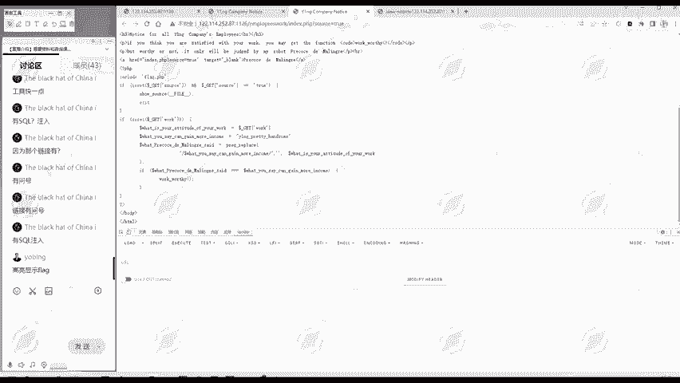

以下是代码分析：
```php
<?php
include "flag.php";
if (isset($_GET['source'])) {
    $source = true;
    highlight_file(__FILE__);
    exit;
}
if (isset($_GET['work'])) {
    $your_work_attitude = $_GET['work'];
    $your_income = "YENGpretty handsome";
    $sad = preg_replace("/$your_income/", "", $your_work_attitude);
    if ($sad === $your_income) {
        workworthyy();
    }
}
?>
```

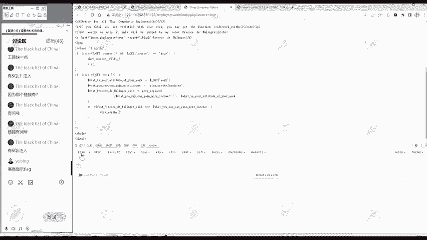

**代码解析：**
1.  `include "flag.php";`：包含了一个名为 `flag.php` 的文件，这通常意味着flag就在这个文件里。
2.  `if (isset($_GET['source']))`：检查URL中是否通过GET方法传递了名为 `source` 的参数。如果传递了，就高亮显示当前文件的源代码并退出。
3.  `if (isset($_GET['work']))`：检查是否传递了 `work` 参数。这是我们用户可控的地方。
4.  `$sad = preg_replace("/$your_income/", "", $your_work_attitude);`：这行代码是关键。它使用 `preg_replace` 函数，在我们传递的 `work` 参数值中，寻找字符串 `$your_income`（即 `"YENGpretty handsome"`），如果找到，就将其替换为空字符串。
5.  `if ($sad === $your_income)`：判断替换后的字符串 `$sad` 是否严格等于 `$your_income`（即 `"YENGpretty handsome"`）。如果相等，就调用 `workworthyy()` 函数，这个函数很可能输出flag。

所以，我们的目标就是构造一个 `work` 参数的值，使得经过上述替换操作后，结果恰好等于 `"YENGpretty handsome"`。

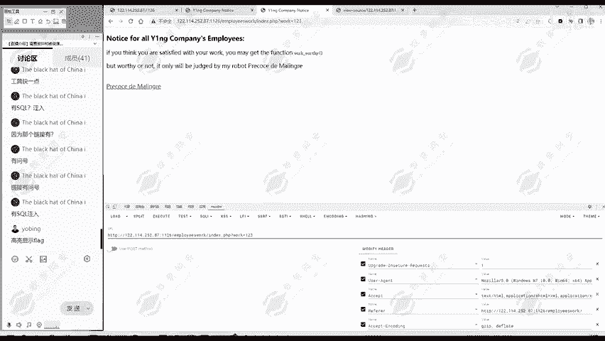

---

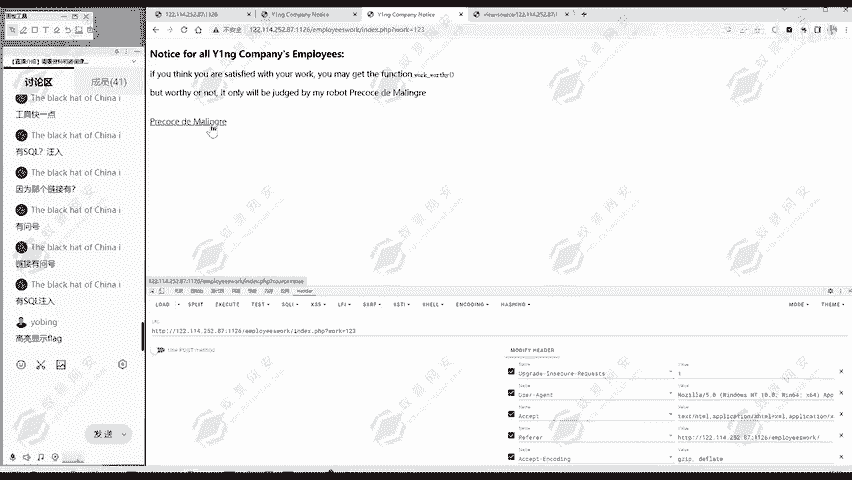

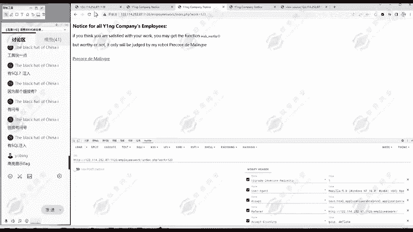

## 🛠️ 第四步：尝试与思考
我们如何传递这个 `work` 参数呢？我们可以使用浏览器的开发者工具或Burp Suite等工具。

首先，我们尝试随便输入一个值，比如 `work=123`，发送请求。

结果没有出现flag，又回到了最开始访问的界面。这说明我们传递的 `123` 不符合代码中的判定条件。

这时就要仔细分析这个判定条件。它要求：一个字符串（我们传入的 `work` 值），在将其中的 `"YENGpretty handsome"` 子串替换为空之后，剩下的部分还必须等于 `"YENGpretty handsome"`。

这听起来似乎不可能。但有一种方法可以实现，叫做 **“双写绕过”**。

---

## 🧩 第五步：应用“双写绕过”
“双写绕过”是什么意思呢？我们来看一个例子。

假设目标字符串是 `"YENGpretty handsome"`。我们把它写两遍，变成 `"YENGpretty handsomeYENGpretty handsome"`。

现在，代码会寻找中间的 `"YENGpretty handsome"` 并将其替换为空。替换后，字符串就变成了 `"YENGpretty handsome"`。

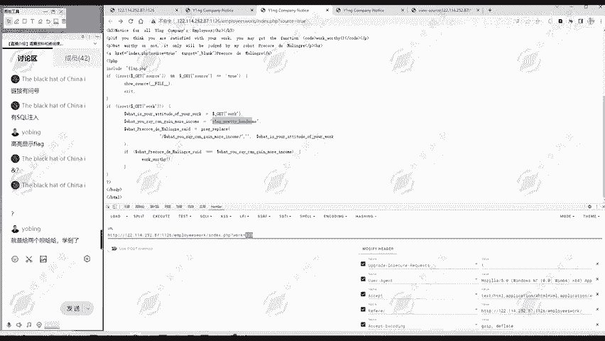

看，替换后的结果正好等于目标字符串本身！这就满足了 `if ($sad === $your_income)` 的条件。

所以，我们需要传入的 `work` 参数值应该是：`YENGpretty handsomeYENGpretty handsome`。

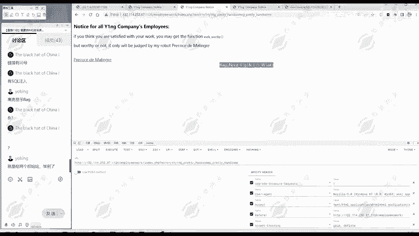

---

## 🚀 第六步：构造Payload并获取Flag
现在，我们使用工具（如HackBar或直接在URL中修改）来发送请求。

我们需要构造的URL如下（假设题目地址是 `http://example.com/challenge.php`）：
```
http://example.com/challenge.php?work=YENGpretty handsomeYENGpretty handsome
```

发送这个请求后，代码逻辑得到满足，`workworthyy()` 函数被执行，flag就会显示在页面上。

---

## ✅ 总结
本节课中我们一起学习了一道CTF题目的完整解题流程。

1.  **信息搜集**：观察网页标题、内容、源代码，寻找异常点（如特殊函数、链接）。
2.  **代码分析**：找到关键PHP代码，理解其包含文件、参数接收、字符串替换和条件判断的逻辑。
3.  **思路突破**：识别出代码的核心挑战是构造一个字符串，使其在删除特定子串后仍等于该子串。
4.  **技术应用**：运用“双写绕过”技术构造出符合要求的Payload。
5.  **获取Flag**：发送构造好的请求，触发目标函数，成功获得flag。

解题的关键在于清晰的思路和对基础技术（如代码审计、双写绕过）的理解。希望这个流程能帮助你未来面对类似挑战时，知道从何入手，如何思考。