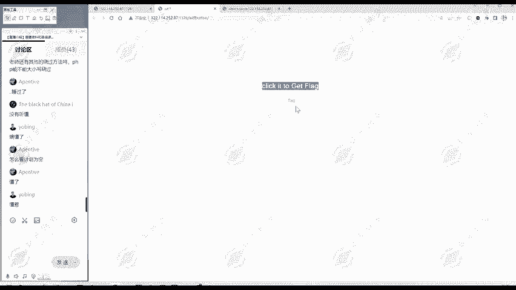
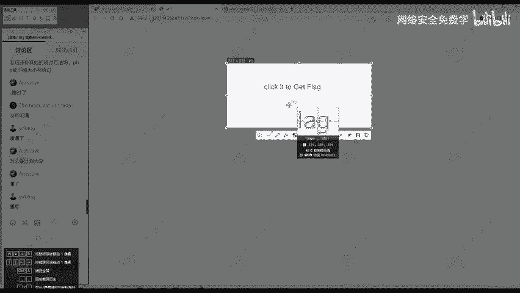
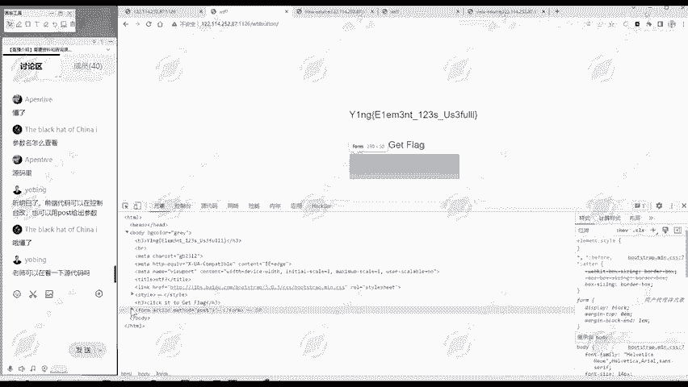

# 网络安全入门：P154：真题讲解—WTFButton 🧩

在本节课中，我们将学习如何解决一道名为“WTFButton”的CTF题目。这道题主要考察信息收集和前端基础知识的应用，我们将通过两种不同的方法来获取隐藏的Flag。

## 信息收集 🔍

首先，我们访问题目页面。页面上有一个非常显眼的按钮，上面写着“点击获得flag”。然而，当我们尝试点击这个按钮时，发现它没有任何反应。

## 分析问题与源代码





上一节我们进行了初步观察，本节中我们来看看问题的根源。既然点击无效，我们就需要查看网页的源代码，寻找线索。

在网页源代码中，我们重点关注“点击获得flag”按钮对应的HTML代码部分。这段代码揭示了按钮的工作原理。

```html
<form action="" method="post">
    <input disabled class="..." style="..." type="submit" value="flag" name="w">
</form>
```

从代码中我们可以分析出以下几点：
*   **`method="post"`**：点击按钮后，会向当前页面（`action=""`）发送一个POST请求。
*   **`value="flag"`**：这是提交的值。
*   **`name="w"`**：这是提交的参数名。
*   **`disabled`**：这个属性是关键，它使得这个输入框（按钮）被禁用，无法点击。

因此，我们面临的核心问题是：按钮被 `disabled` 属性锁定了。

## 解决方案一：修改前端元素 🛠️

既然问题出在 `disabled` 属性上，最直接的方法就是移除它。以下是操作步骤：

1.  在网页上右键，选择“检查”或“审查元素”，打开开发者工具。
2.  使用开发者工具左上角的“选择元素”箭头图标，点击页面上无法点击的按钮。工具会自动定位到对应的HTML代码行。
3.  在代码中找到 `disabled` 这个单词，将其删除或双击进行修改。
4.  删除后，按钮的禁用状态被解除，此时再点击按钮，即可成功提交表单并获得Flag。

## 解决方案二：直接发送POST请求 📤

上一节我们通过修改前端元素解决了问题，本节中我们来看看另一种更“黑客”的思路。我们已经从源代码中知道了提交表单所需的参数，那么完全可以绕过前端界面，直接模拟这个提交请求。

我们可以使用浏览器插件（如HackBar）或命令行工具（如curl）来手动发送POST请求。

以下是使用HackBar插件的示例步骤：
1.  在开发者工具的“控制台”（Console）或HackBar插件中，选择POST请求方式。
2.  输入当前页面的URL。
3.  在POST数据区域，填入我们从源代码中分析出的参数：`w=flag`。
4.  发送请求。服务器会直接处理这个POST数据，并返回包含Flag的响应。

使用curl命令的等效操作如下：
```bash
curl -X POST -d “w=flag” [题目URL]
```

## 总结与回顾

本节课中我们一起学习了如何解决“WTFButton”这道CTF题目。我们主要掌握了两个核心技能：

1.  **前端代码分析**：通过查看网页源代码，理解表单提交的机制（`method`, `action`, `name`, `value`），并识别出阻止操作的属性（`disabled`）。
2.  **两种解题方法**：
    *   **前端修改法**：利用浏览器开发者工具，直接修改HTML元素属性（删除`disabled`），恢复按钮功能。
    *   **请求模拟法**：根据分析出的请求参数，手动构造并发送HTTP POST请求（如`w=flag`），绕过前端限制。



这道题的关键在于细心观察和基础知识的应用。信息收集是渗透测试的第一步，而理解Web前端的基本工作原理，能帮助我们快速定位并解决许多看似复杂的问题。