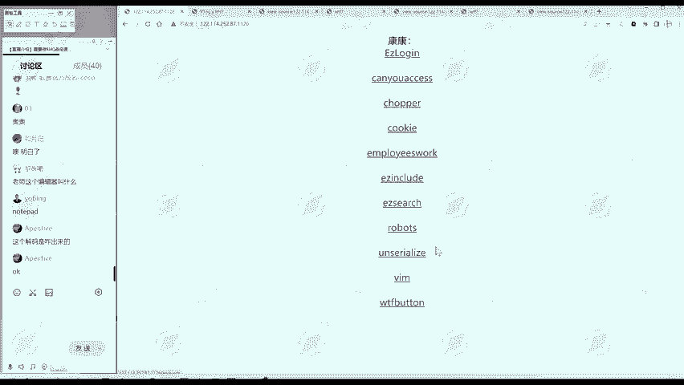
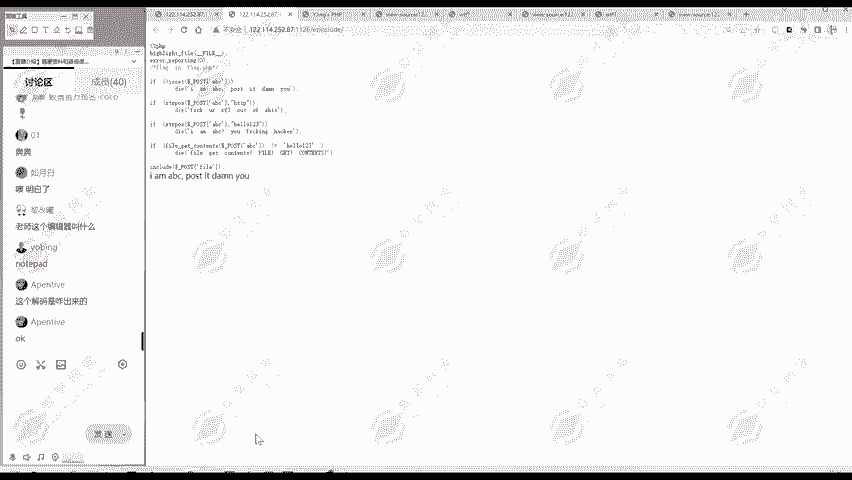
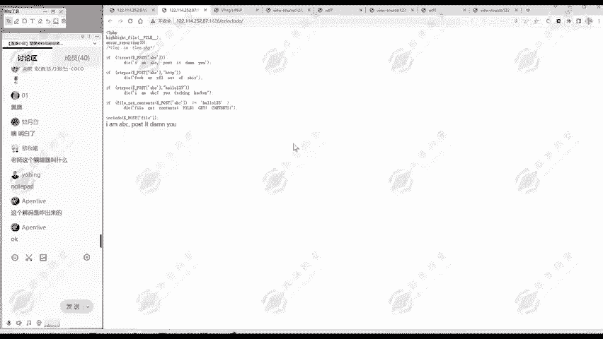
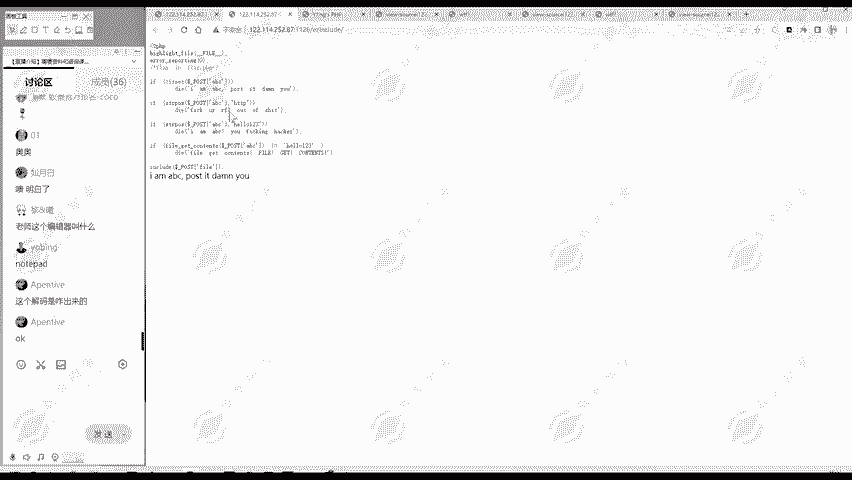

# 网络安全入门：P156：真题讲解—ezinclude 🎯



## 概述
在本节课中，我们将学习一道名为“ezinclude”的网络安全挑战题。这道题的核心是文件包含漏洞的利用。我们将通过分析题目给出的PHP代码，理解其设定的四个关卡，并学习如何利用`data://`协议和`php://filter`协议来绕过限制，最终读取目标文件`flag.php`的内容。

---

## 题目背景与目标
题目提示`flag`位于`flag.php`文件中。这是一个典型的文件包含题目。代码最后有一个`include`语句，它包含我们通过`file`参数传递的文件。因此，我们的目标是：通过代码前面的四个判定条件，然后让`include`语句成功包含并显示出`flag.php`的内容。

上一节我们了解了题目的基本目标，本节中我们来看看具体的代码逻辑和限制条件。



## 代码逻辑分析
以下是题目代码的核心逻辑，我们需要逐一通过其设定的四个检查点。



### 第一关：参数检查
代码首先检查是否通过`POST`方法传递了名为`abc`的参数。
```php
if(!isset($_POST['abc'])) {
    exit('no abc');
}
```
**含义**：如果没有传递`abc`参数，程序会输出“no abc”并退出。

### 第二关：字符串过滤（HTTP）
接着，代码检查`abc`参数的值中是否包含字符串“HTTP”。
```php
if(strpos($_POST['abc'], 'HTTP') !== false) {
    exit('no http');
}
```
**含义**：如果`abc`的值里能找到“HTTP”这个子串，程序会退出。这意味着我们传入的字符串不能包含“HTTP”。

### 第三关：字符串过滤（hello123）
然后，代码检查`abc`参数的值是否等于字符串“hello123”。
```php
if($_POST['abc'] == 'hello123') {
    exit('no hello123');
}
```
**含义**：如果`abc`的值直接等于“hello123”，程序也会退出。我们不能直接传递这个字符串。

### 第四关：文件内容验证
这是最关键的一关。代码使用`file_get_contents()`函数读取`abc`参数值所代表的“文件”内容，并检查该内容是否等于“hello123”。
```php
if(file_get_contents($_POST['abc']) != 'hello123') {
    exit('no file content hello123');
}
```
**含义**：`file_get_contents()`函数会尝试打开`abc`参数指定的文件或数据流，并读取其内容。读取到的内容必须**等于**字符串“hello123”，否则程序退出。

### 成功后的文件包含
只有全部通过以上四关，代码才会执行包含操作：
```php
include($_POST['file']);
```
**含义**：此时，我们可以通过`file`参数指定要包含的文件路径。

我们已经分析了四道关卡，关键在于如何通过第四关。接下来，我们探讨解决方案。

## 漏洞利用思路
第四关要求我们提供一个“文件”，其内容为“hello123”。服务器上显然不存在这样的文件。这里需要利用PHP的文件包含特性。

### 使用 data:// 协议
`data://`协议允许我们将数据直接内嵌在URI中，作为文件内容被读取。其基本格式为：
```
data://<MIME-type>;base64,<base64编码的数据>
```
我们可以将“hello123”进行Base64编码后，通过`data://`协议传递。

1.  **对“hello123”进行Base64编码**：
    ```
    hello123 -> aGVsbG8xMjM=
    ```
2.  **构造`abc`参数的值**：
    ```
    abc=data://text/plain;base64,aGVsbG8xMjM=
    ```
    当`file_get_contents()`读取这个URI时，会解码并获得字符串“hello123”，从而满足第四关的条件。

### 使用 php://filter 协议读取源码
通过第四关后，我们可以控制`file`参数。如果直接`file=flag.php`，代码会被执行，但我们看不到源代码（可能只输出了某些变量结果）。为了获取`flag.php`的源代码，我们需要使用`php://filter`协议。

`php://filter`是一种封装器，可以用于在读取数据流时应用过滤器。我们可以用它来读取文件的Base64编码内容，从而避免PHP代码被执行。
```
file=php://filter/convert.base64-encode/resource=flag.php
```
这行代码会读取`flag.php`文件的内容，并将其进行Base64编码后输出。我们收到后，再解码即可得到原始源代码。

## 完整攻击步骤
以下是利用上述思路发起攻击的完整步骤：

1.  使用工具（如Burp Suite、HackBar或curl）向目标URL发送一个`POST`请求。
2.  在请求体中设置两个参数：
    *   `abc=data://text/plain;base64,aGVsbG8xMjM=`
    *   `file=php://filter/convert.base64-encode/resource=flag.php`
3.  发送请求后，服务器会返回经过Base64编码的`flag.php`文件内容。
4.  将返回的Base64字符串解码，即可得到`flag.php`的源代码，从中找到flag。

以下是具体的操作要点列表：
*   **第一步：准备数据**。将字符串“hello123”进行Base64编码，得到`aGVsbG8xMjM=`。
*   **第二步：构造POST请求**。请求中需包含两个字段：`abc`和`file`。
*   **第三步：发送并获取响应**。响应体是`flag.php`的Base64编码文本。
*   **第四步：解码获取Flag**。对响应进行Base64解码，查看源码寻找flag。



## 总结
本节课中我们一起学习了一道结合了字符串过滤和文件包含漏洞的CTF题目“ezinclude”。我们深入分析了代码的四层防御逻辑，并找到了利用`data://`协议绕过文件内容检查，以及利用`php://filter`协议读取文件源代码的方法。这道题综合考察了对PHP协议封装器的理解以及实际漏洞利用的能力，是一个很好的学习案例。建议学习者亲自动手实践，以巩固对这些核心概念的理解。