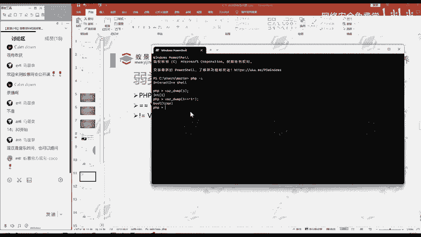
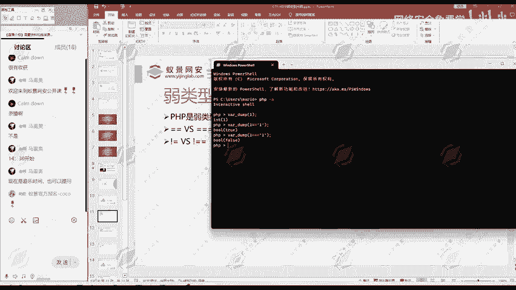

# 网络安全基础：P157：弱类型语言与安全

在本节课中，我们将要学习编程语言中的“弱类型”概念，了解它与“强类型”的区别，并重点探讨弱类型语言中“强相等”与“弱相等”比较可能引发的安全问题。这对于理解某些Web安全漏洞至关重要。

## 什么是弱类型与强类型

上一节我们介绍了课程主题，本节中我们来看看弱类型与强类型语言的核心区别。

与弱类型语言相对应的是强类型语言。例如，大学课程中常见的C语言就是一种强类型语言。它的特点是：在定义一个变量时，必须明确声明该变量的数据类型。

**代码示例（C语言）：**
```c
int i = 1; // 必须声明变量i为int（整数）类型
```

相反，弱类型语言在定义变量时则不需要预先指定其数据类型。PHP和Python都属于弱类型语言。

**代码示例（PHP）：**
```php
$i = 1; // 直接赋值，无需声明$i是整数、字符串还是其他类型
```

PHP就是一种典型的弱类型语言。

## 强相等与弱相等

理解了类型系统的差异后，我们来看看弱类型语言中一个关键且容易引发问题的概念：比较运算。

在PHP这类弱类型语言中，比较两个值是否相等时，存在“强相等”和“弱相等”两种方式，它们使用不同的运算符。

以下是两种比较方式的演示：

我们打开终端，进入PHP执行环境。使用 `var_dump()` 函数可以输出一个变量的类型和值。例如，`var_dump(1)` 会显示其为整数类型，值为1。

现在有一个问题：数字 `1` 和字符串 `"1"` 是否相等？

我们使用两个等号 `==`（弱相等）进行比较测试：

```php
var_dump(1 == “1”); // 输出结果为 bool(true)
```



结果显示为 `true`（真），说明它们被认为是相等的。尽管一个是数字，另一个是字符串，但在弱相等比较下，只要它们的“值”在某种转换后相同，就被判定为相等。你可以简单理解为“看起来差不多就相等”。

接下来，我们使用三个等号 `===`（强相等）进行比较：



```php
var_dump(1 === “1”); // 输出结果为 bool(false)
```

这次结果为 `false`（假）。强相等要求比较的两者必须“一模一样”，即值和数据类型都必须完全相同。

与相等比较相对应，不相等比较也存在强弱之分：
*   `!=` 或 `<>` 是弱不相等比较。
*   `!==` 是强不相等比较。

## 弱类型导致的安全问题

上一节我们介绍了强相等和弱相等的区别，本节中我们来看看它如何引发安全问题。

在某些情况下，这种强相等与弱相等的差异可以被利用，从而构成安全漏洞。在CTF（Capture The Flag）网络安全竞赛中，经常会出现专门考察选手能否识别和利用此类弱类型比较漏洞的题目。

例如，在一些代码审计场景中，如果开发者错误地使用了弱相等 `==` 来判断用户输入（如密码、令牌），攻击者可能通过构造特殊输入（如字符串 `“1abc”` 在弱比较下可能与数字 `1` 相等），绕过安全验证。

这就是由弱类型语言特性，特别是比较运算的宽松性，可能引发的“弱类型安全问题”。

## 总结

本节课中我们一起学习了编程语言中弱类型与强类型的核心区别，明确了PHP作为一种弱类型语言的特点。我们深入探讨了弱类型环境下 `==`（弱相等）与 `===`（强相等）比较运算符的根本不同，并通过实例看到了它们的结果差异。最后，我们了解到这种差异在特定条件下可能被利用，构成安全漏洞，这是在网络安全学习和渗透测试中需要重点关注的一个知识点。