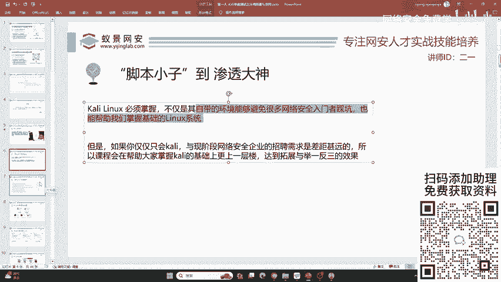
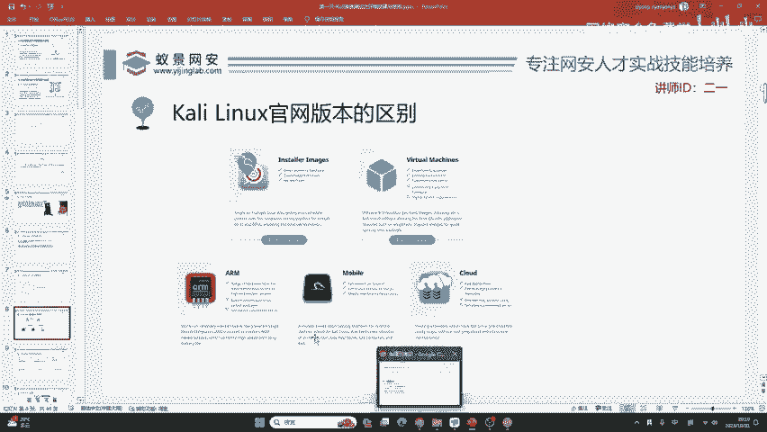
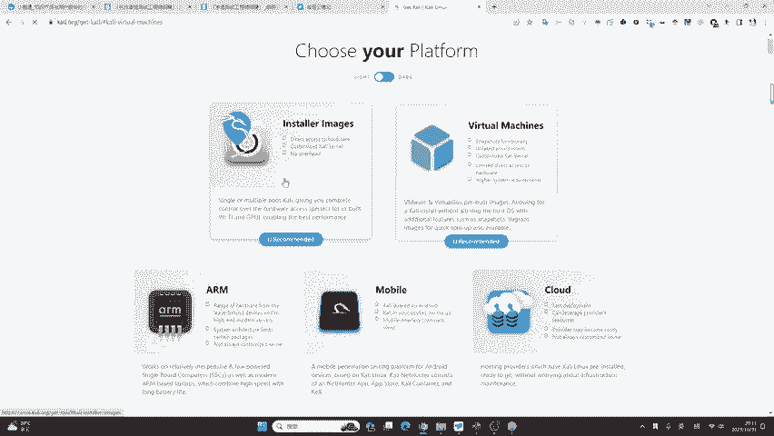
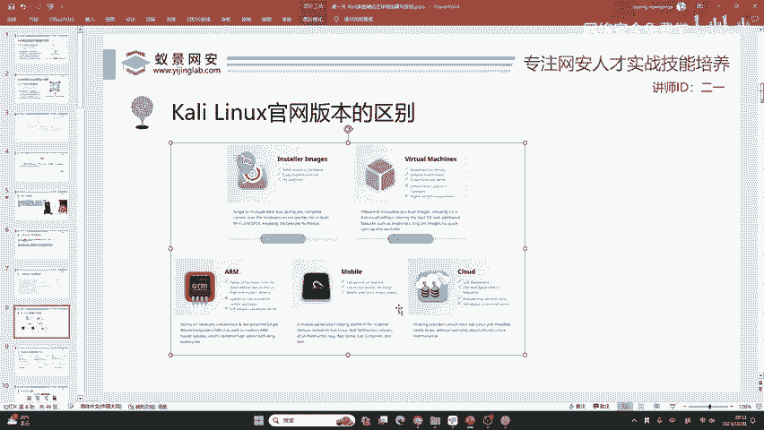
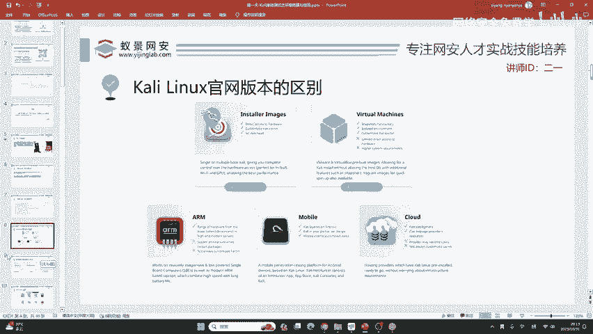

# 网络安全入门：P15：从“脚本小子”到渗透大神

在本节课中，我们将探讨如何超越仅仅使用Kali Linux工具，构建满足企业需求的全面网络安全技能体系。我们将分析真实招聘要求，明确Kali Linux的定位，并规划一条系统性的学习路径。

## 课程概述

上一节我们介绍了网络安全的基本概念，本节中我们来看看如何构建扎实的实践基础。Kali Linux是网络安全领域广为人知的工具集，但仅掌握它远远不够。本课程的目标是在帮助大家掌握Kali的基础上，进行拓展与举一反三，这才是我们讲课的重点。

如果你想学习Kali，网上的教程非常多。在3-4年前，我也录制过一些Kali视频，在B站上可以轻松搜到。我不会再做过多讲解，因为它确实太基础，并且说实话，没有特别大的用处。

## Kali Linux的定位与价值

我们掌握Kali，首先是因为其自带的环境能够避免很多网络安全入门者踩坑，也能帮助我们掌握基础的Linux操作系统。我这里的观点并非凭空而来。

我在上课前，从Boss直聘上查看了启明星辰（一家北京的上市企业）的渗透测试岗位需求。该岗位在北京的月薪是20K。我们来看一下它对渗透测试工程师的技术要求。从其列出的11点技术要求中，完全看不到“Kali”这四个字。

但是Kali有没有用呢？我们从中也可以发现，里面有非常多Kali所涉及到的工具。

以下是Kali中包含的部分工具示例：
*   比如Kali中自带的Burp Suite。
*   比如Kali中自带的Nmap。
*   比如Kali中自带的Sqlmap。
*   以及我们第三天要讲的Metasploit。
*   还有Cobalt Strike（基于Metasploit改编）。

这些都是在Kali中自带的。所以说，我们很需要学习Kali，但是只学习Kali是远远不够的。

你可以清楚地看到，这是我在上课前几分钟截取下来的启明星辰招聘网站，现在仍在招聘。

其次，我们需要对Linux操作系统能够熟练使用。Kali能够帮助我们学会使用Linux系统，搭建各种常见的应用环境。

再者，我们需要掌握编程语言。例如这些大厂20K以上的岗位，需要你会其中一种语言。

以下是常见的编程语言要求：
*   Go
*   Java
*   PHP
*   Python
*   Perl

这些编程语言的环境配置可能非常复杂，而Kali中已经帮你配置好了，可以直接使用。所以说，它能够帮助我们更快地入门网络安全。

其他的要求你可以再看，比如内网渗透、预渗透和后渗透能力，这一点Kli就不再提供了。包括有一定的逆向分析能力，这一点Kali也是不存在的。所以说，我们要把Kali掌握之后，做一个全方位的拓展，才能够满足一个月薪2万的工作需求。

## 系统性学习路径规划

这个东西肯定不是一蹴而就的，我们要把它分解开来逐一学习。

首先，Kali的安装包我已经上传到了我们的工具库里面，大家可以自行下载。如果你有科学上网环境，也可以直接从Kali官网下载。如果你的上网环境比较差，那就不需要从官网下载了，因为它下载速度可能还没有百度网盘快，没有必要多此一举，直接从百度网盘中下载即可。

在Kali官网中，它给出了非常多的版本，这里叫做“Platform”。这时就来为大家解答一个问题。在我们的交流群里，有同学提到这样一个问题：我有必要把Kali安装到自己的物理机，或者把Kali安装到自己的手机上面来实现一些无线攻击吗？

答案是否定的。首先我在上课前给大家讲过，Kali没有特别大的用处。

安装在物理机上，首先它不能兼容常见的应用，比如QQ、微信、钉钉、企业微信等APP，这会对你正常工作产生严重影响。安装双系统的话，不如使用虚拟机来得方便快捷。因为虚拟机发展到今天，几乎不会出现性能折损。

其次是手机。手机安装会出现一个瓶颈：咱们国内的硬件不支持Kali安装。除非有两种手机：
1.  卡里官方推荐的一加手机（One Plus）。
2.  谷歌的官方手机Google Pixel。

如果你没有这两类手机，就不要再去想在手机上安装Kali了。它会非常麻烦、非常费劲，而且可能导致你的手机变成板砖。

其他的我们就不需要在意了。关键我们要区分两个版本：一个叫“Installer Image”。我看到互动区有同学提到小米手机是不是也行。在以前，小米手机是可以的。但是现在小米手机越来越转向闭源的操作系统，包括从MIUI的更新，以及前几天小米发布会发布的澎湃OS。这些新的小米手机没有办法安装Kali。如果是老版本的，比如小米3那个年代，可以进行刷机，那当然可以安装我们的Kali。

用笔记本可以安装，等一下会给你讲。我们今天的课程有一个要点，就是让你把虚拟环境运用得婉转自如。

下面我们来看，“你这个性能不够呀”——它当然可以安装，但是性能可能不够。包括一些测试机、骁龙的测试机都可以装，但它可能驱动不太兼容。对，手机也很麻烦。

## 总结

本节课中，我们一起学习了Kali Linux在网络安全学习中的真实定位。我们认识到，Kali是一个优秀的入门和工具集成环境，能帮助我们快速上手Linux和基础安全工具。然而，要满足企业级渗透测试岗位（如月薪20K）的要求，必须超越Kali，系统性地学习Linux操作系统、至少一门编程语言（如Python/Go/Java）、内网渗透、逆向分析等更广泛的知识与技能。建议初学者在虚拟机中安装和使用Kali，避免安装在物理机或手机上带来的兼容性与实用性困扰。接下来的课程，我们将以此为基础，展开更深层次的学习。