# 网络安全实战：P160：真题练习—非洲之旅 🎯

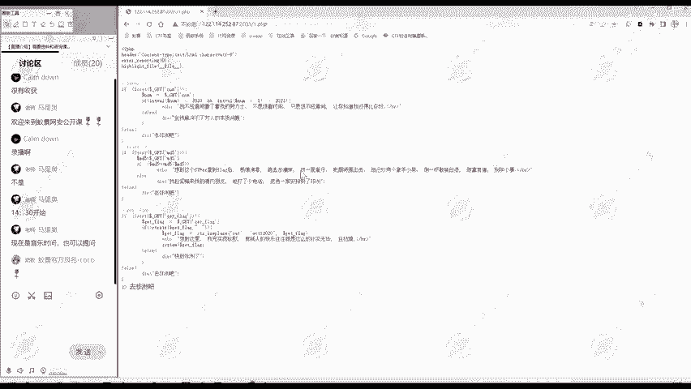

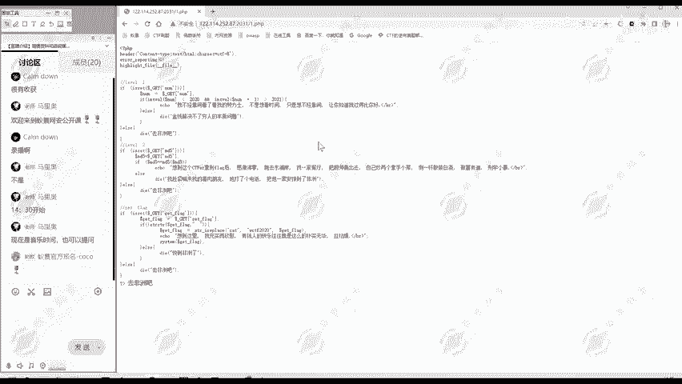

在本节课中，我们将通过一道具体的CTF题目，来综合运用之前学到的知识。我们将学习如何分析Web题目、进行代码审计，并利用PHP弱类型、函数漏洞和命令执行绕过等技巧来解题。

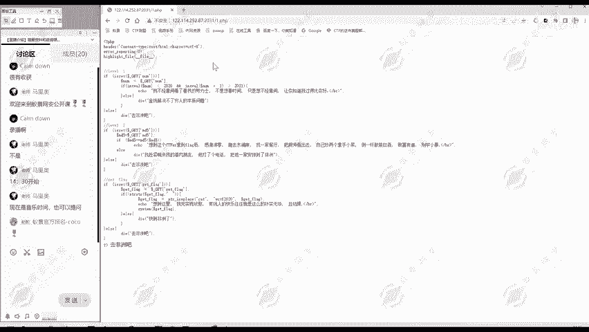

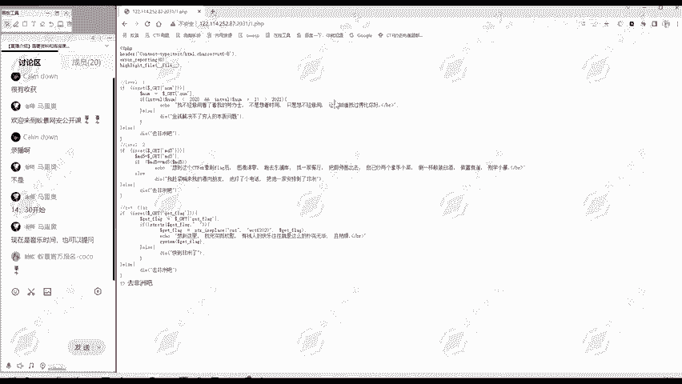

---

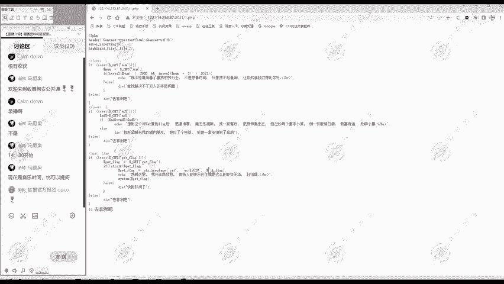


## 解题思路与信息收集 🔍

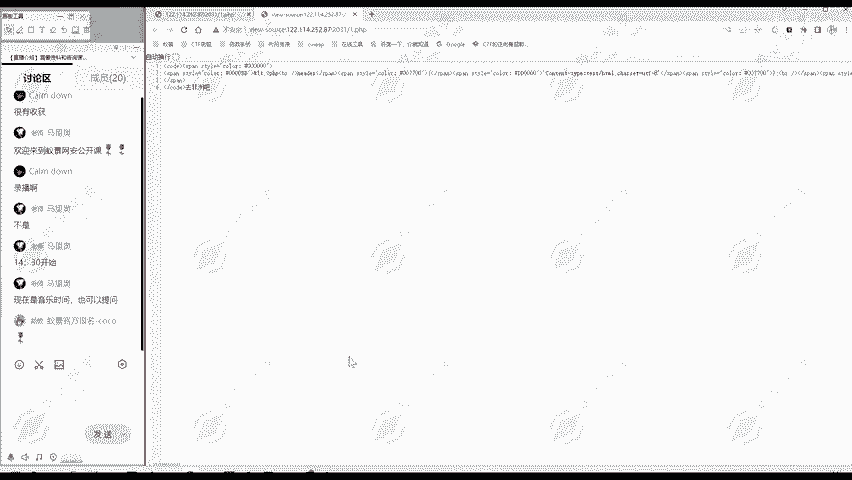

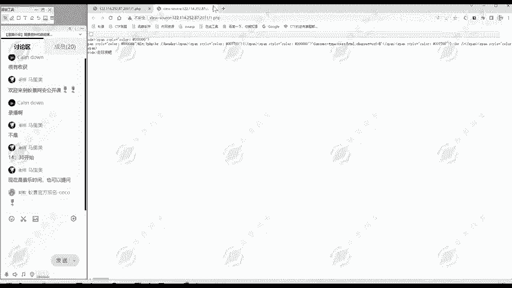

上一节我们介绍了Web安全的基础知识，本节中我们来看看如何将这些知识应用到实际解题中。

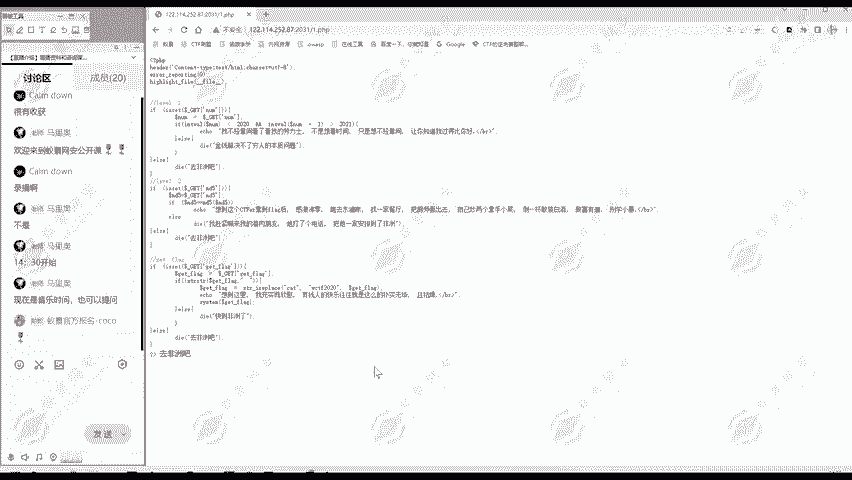

首先，我们打开题目页面。这是一道部署在靶场中的Web题目。

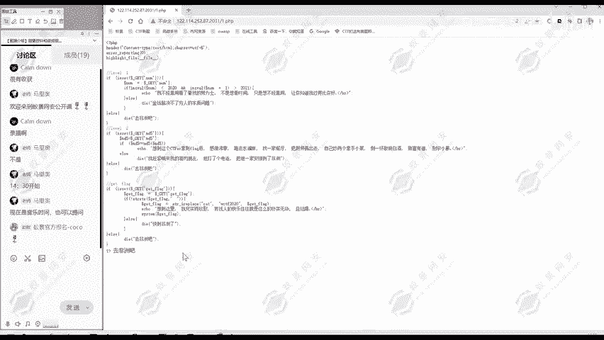

做Web题目通常遵循一个清晰的思路。以下是解题的一般步骤：

1.  **信息收集**：收集关于目标的所有可用信息。
2.  **代码审计**：如果题目提供了源代码，需要仔细分析。
3.  **漏洞利用**：根据分析结果，构造Payload进行利用。
4.  **获取Flag**：最终目标是拿到题目隐藏的Flag。

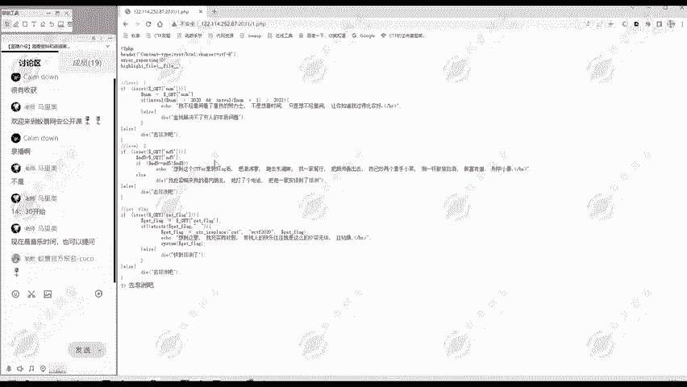

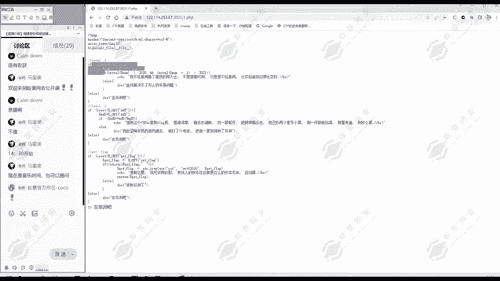

对于当前这道题，页面直接显示了一段PHP代码。这说明解题的核心在于**代码审计**。我们需要仔细分析这段代码的逻辑。

我们也可以查看网页源代码，但其中没有额外的注释或隐藏信息。因此，当前的任务就是分析页面上显示的这段PHP代码。

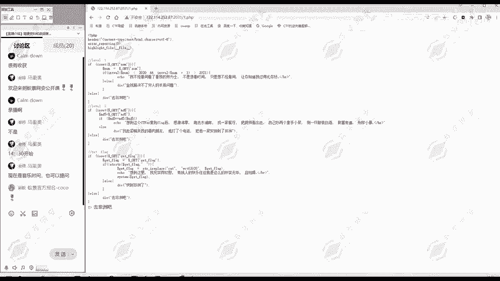

为了获取更多环境信息，我们可以打开浏览器的开发者工具（按F12），切换到“网络”标签页，然后刷新页面。在第一个请求的响应头中，我们可以找到 `X-Powered-By` 字段，它显示了服务器使用的PHP版本是5.6.40。了解PHP版本有时对解题有帮助，因为某些漏洞只在特定版本中存在。

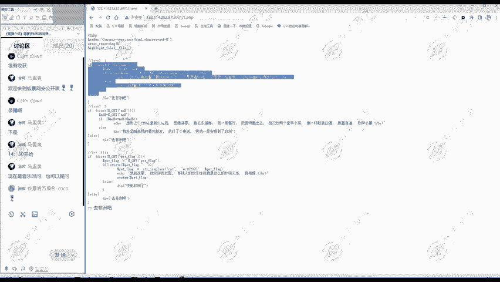

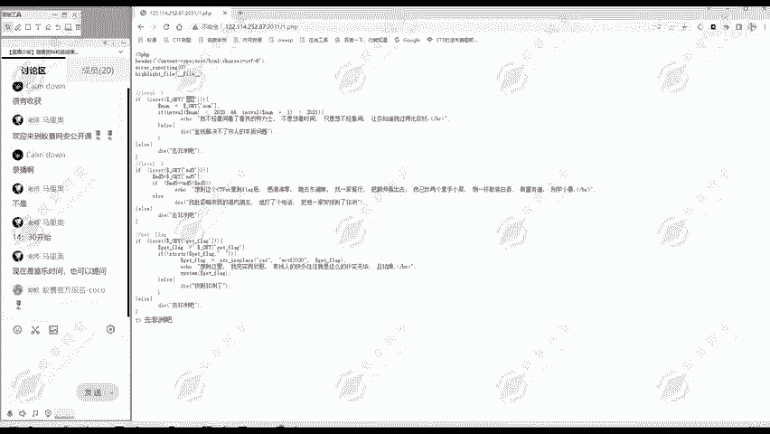

---

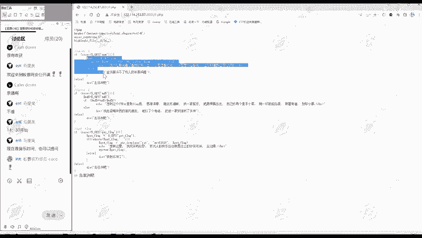

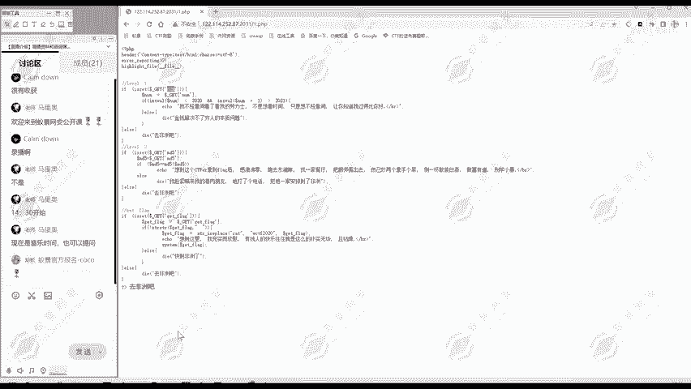

## 代码结构概览 📄

在深入细节之前，我们先从整体上分析一下代码结构。这样可以帮助我们理清解题的脉络。

这段代码大致可以分为四个部分：
1.  第一部分是基础的PHP设置（如错误报告、显示源代码），与解题核心关系不大。
2.  第二部分是一个 `if-else` 判断，注释为 `level1`，这是第一关。
3.  第三部分是另一个 `if-else` 判断，注释为 `level2`，这是第二关。
4.  第四部分是一个获取Flag的 `if-else` 判断，注释为 `get flag`，这是第三关。

程序会从上到下顺序执行。因此，解题思路很明确：我们需要依次通过第一关、第二关，最终在第三关拿到Flag。下面，我们就逐关进行分析。

---

## 第一关：整数转换漏洞 💡

现在，我们把注意力集中到第一关的代码上。我们需要逐行分析，理解其判断逻辑。

第一关的代码如下：
```php
if(isset($_GET[‘num’])){
    $num = $_GET[‘num’];
    if(intval($num) < 2020 && intval($num + 1) > 2021){
        echo “不经意间看到劳力士”;
    }else{
        die(“金钱解决不了穷人的本质问题”);
    }
}else{
    die(“去非洲吧”);
}
```

**代码逻辑分析：**
1.  首先检查是否通过GET方法传递了名为 `num` 的参数。如果没有，程序输出“去非洲吧”并结束。
2.  如果传递了参数，则将其值赋给变量 `$num`。
3.  然后进行一个关键判断：要求 `$num` 经过 `intval()` 转换后的整数**小于2020**，并且 `$num + 1` 经过 `intval()` 转换后的整数**大于2021**。
4.  如果条件满足，输出“不经意间看到劳力士”，进入下一关；否则，输出“金钱解决不了穷人的本质问题”并结束。

**矛盾与思考：**
这个条件看起来是矛盾的：一个数本身小于2020，但它加1后却大于2021？这样的数显然不存在。因此，我们不能寻找一个普通的数字，而应该思考 `intval()` 函数是否存在问题。

**漏洞利用：**
在PHP 5.x版本中，`intval()` 函数处理**科学计数法字符串**时存在缺陷。例如，字符串 `”2e4″` 表示2乘以10的4次方，即20000。但 `intval(“2e4”)` 会将其中的 `”e”` 视为非法字符而停止转换，最终只得到整数 `2`。然而，在进行 `$num + 1` 运算时，PHP会尝试进行数学计算，将 `”2e4″` 转换为数字20000，然后加1得到20001，再经过 `intval()` 转换得到 `20001`。

**构造Payload：**
我们可以利用这个特性。例如，传入 `num=2e4`：
*   `intval(“2e4”)` 的结果是 `2`，满足 `< 2020`。
*   `”2e4″ + 1` 的结果是 `20001`，`intval(20001)` 的结果是 `20001`，满足 `> 2021`。

这样，我们就成功绕过了第一关的判断。在URL中，我们传递参数 `?num=2e4`，页面会显示“不经意间看到劳力士”，表示通过。

---

## 第二关：MD5弱类型比较 🔐

成功通过第一关后，我们来看第二关的代码。

```php
if(isset($_GET[‘md5’])){
   $md5=$_GET[‘md5’];
   if($md5==md5($md5)){
       echo “想拿到flag吗？快向黑人头领讨要吧”;
   }else{
       die(“喊南九肉朋友把他安排到非洲”);
   }
}else{
   die(“去非洲吧”);
}
```

**代码逻辑分析：**
1.  检查是否传递了 `md5` 参数。如果没有，输出“去非洲吧”。
2.  如果传递了，则进行判断：要求 `$md5` 的值与 `md5($md5)` 计算出的哈希值**相等**。
3.  这里使用的是 `==`（弱相等比较），而不是 `===`（严格相等比较）。

**漏洞利用：**
让一个字符串和它的MD5哈希值完全相等是不可能的。但这里存在**弱类型比较**漏洞。在PHP中，当使用 `==` 比较一个字符串和另一个字符串时，如果字符串以 `0e` 开头，后面全是数字，PHP会将其视为科学计数法（0乘以10的n次方），其值会被转换为整数 `0`。

因此，我们需要找到一个字符串，满足：
*   字符串本身是 `0exxxx` 的形式（例如 `0e123`）。
*   该字符串的MD5哈希值也是 `0eyyyy` 的形式。

这样，在弱比较时，两者都会被当作数字 `0`，从而满足 `0 == 0` 的条件。

**构造Payload：**
已知这样的字符串是存在的，例如：`0e215962017`。它的MD5值是 `0e291242476940776845150308577824`。
我们在URL中传递参数：`&md5=0e215962017`。
页面会显示“想拿到flag吗？快向黑人头领讨要吧”，表示第二关通过。

---

## 第三关：命令执行与绕过技巧 ⚙️

通过前两关后，我们来到了最终的 `get flag` 环节。

```php
if(isset($_GET[‘get_flag’])){
    $get_flag = $_GET[‘get_flag’];
    if(!strpos($get_flag, ” “)){
        $get_flag = str_ireplace(“cat”, “WCTF”, $get_flag);
        echo “想到这里，”;
        system($get_flag);
    }else{
        die(“快到非洲了”);
    }
}else{
    die(“去非洲吧”);
}
```

**代码逻辑分析：**
1.  检查是否传递了 `get_flag` 参数。
2.  使用 `strpos()` 检查参数值中**是否包含空格**。如果包含，输出“快到非洲了”并结束。`!strpos()` 表示“不包含空格”时才为真。
3.  如果不包含空格，则使用 `str_ireplace()` 函数，将参数值中所有不区分大小写的 `cat` 字符串替换为 `WCTF`。
4.  最后，使用 `system()` 函数执行处理后的 `$get_flag` 变量。

**目标与限制：**
我们的目标是让 `system()` 执行命令来读取Flag文件（例如 `flag.php`）。但有两个限制：
1.  不能使用空格。
2.  不能使用 `cat` 命令（因为会被替换掉）。

**构造Payload：**
1.  **绕过空格限制**：在Linux中，可以使用 `${IFS}` 替代空格。`IFS` 是内部字段分隔符，默认包含空格、制表符等。
2.  **绕过`cat`过滤**：可以使用 `cat` 的反写 `tac` 命令，它同样可以显示文件内容，只是顺序相反。

首先，我们尝试列出目录文件，确认Flag文件位置。Payload为：`&get_flag=ls`。执行成功，显示目录下有 `flag.php` 文件。

接下来，读取 `flag.php` 文件。最终Payload为：`&get_flag=tac${IFS}flag.php`。
*   `tac` 代替了被过滤的 `cat`。
*   `${IFS}` 代替了空格。
*   执行后，成功显示出 `flag.php` 文件中的Flag内容。

---

## 总结与回顾 🏁

本节课中，我们一起学习并完成了一道综合性的CTF Web题目“非洲之旅”。我们来回顾一下解题的关键步骤和知识点：

1.  **信息收集与结构分析**：首先查看代码，将其分为初始化、第一关、第二关、第三关四个部分，明确了循序渐进的通关思路。
2.  **第一关 - PHP `intval()` 漏洞**：利用了PHP 5.x中 `intval()` 函数处理科学计数法字符串时的缺陷，通过传入 `2e4` 这样的值，满足了看似矛盾的条件判断。
3.  **第二关 - MD5弱类型比较**：利用了PHP `==` 弱比较的特性，通过寻找原值和MD5哈希值都是 `0e` 开头的字符串（如 `0e215962017`），使得两者在弱比较时都等于数字0，从而绕过验证。
4.  **第三关 - 命令执行与绕过**：目标是执行系统命令读取Flag。通过使用 `${IFS}` 替代空格，以及使用 `tac` 命令替代被过滤的 `cat` 命令，成功构造出可执行的Payload：`tac${IFS}flag.php`。

这道题目涵盖了代码审计、PHP特性漏洞、哈希绕过、命令注入绕过等多个常见考点，是一道非常经典的练习题目。希望大家通过本次实战，能够加深对Web安全漏洞原理和利用方法的理解。