# 网络安全入门：P162：为什么要学习反序列化

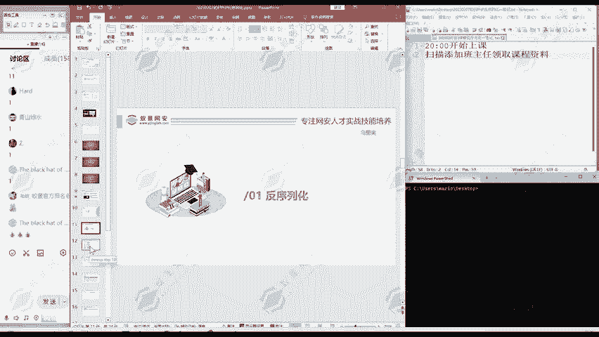

在本节课中，我们将探讨反序列化漏洞在网络安全领域的重要性，并理解为何它是安全从业者必须掌握的核心知识之一。

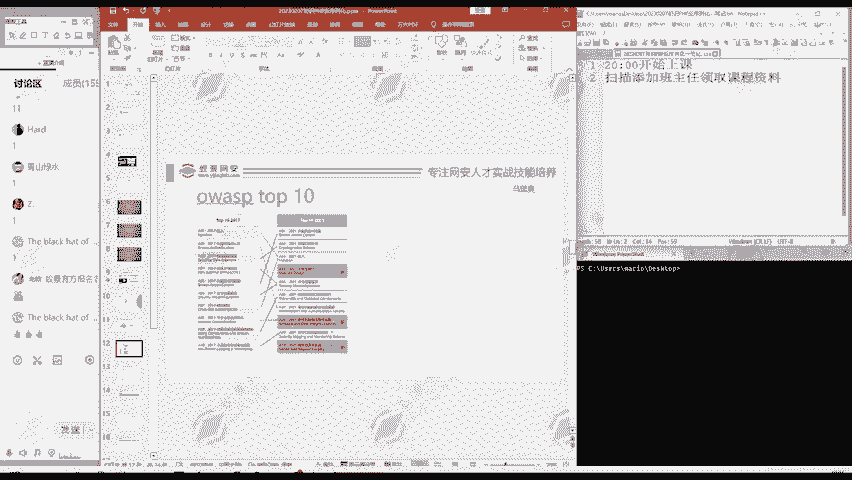

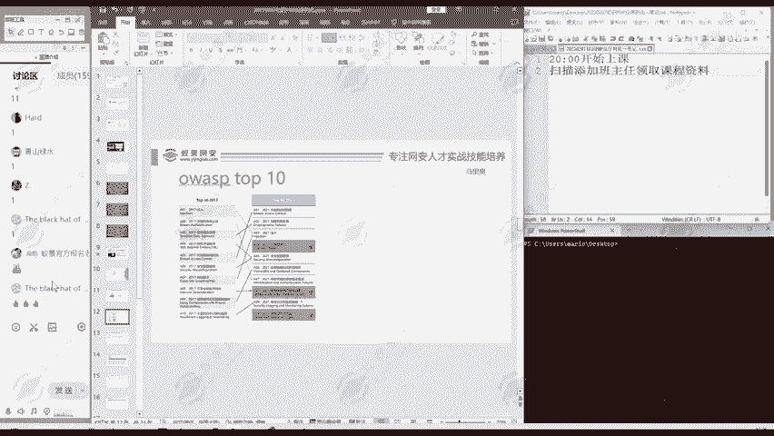

## OWASP Top 10与反序列化漏洞

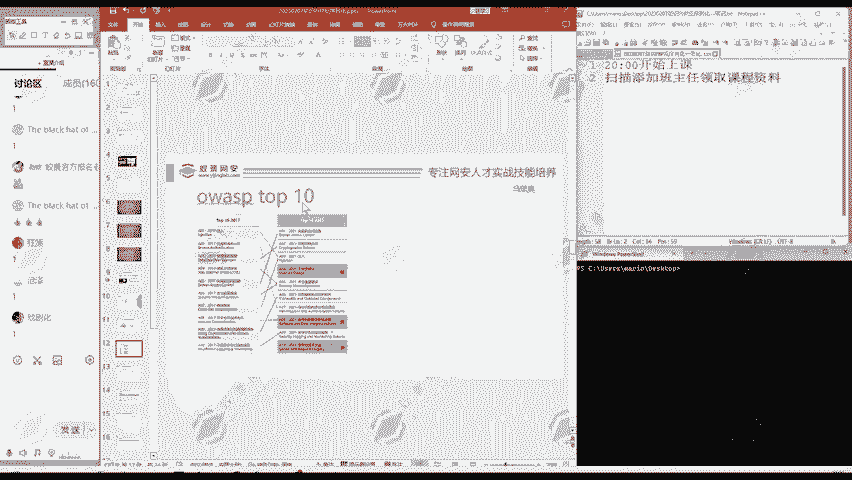

上一节我们介绍了课程背景，本节中我们来看看一个权威的漏洞排名列表。

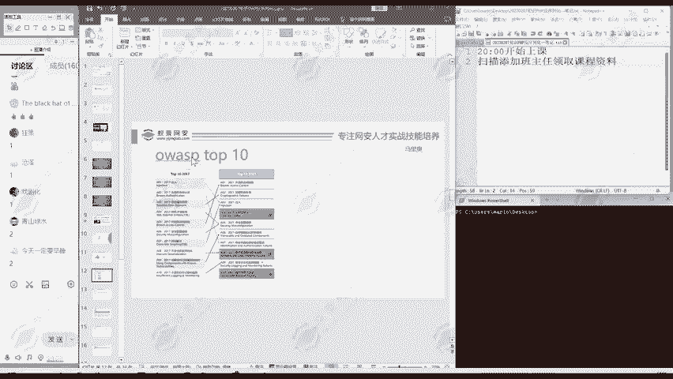

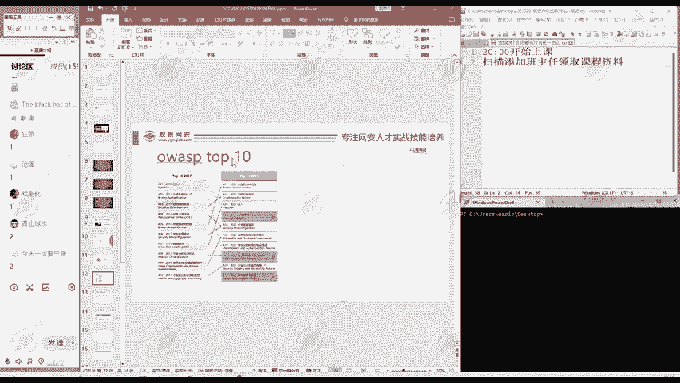

大家听说过OWASP Top 10这个漏洞列表吗？它是一个非常权威的组织评选出的十个最常见网络安全漏洞的列表。该列表每四年评选一次，最近一次是2021年，上一次是2017年。它统计的是网络安全领域中，出现频率最高的十类漏洞。

以下是2017年与2021年OWASP Top 10列表的简要对比：

*   在2017年的列表中，**A8:2017-不安全的反序列化** 被明确列为一项独立的高风险漏洞。
*   在2021年的列表中，反序列化问题被归入 **A08:2021-软件和数据完整性故障** 这一大类中。这本质上仍然是反序列化相关的安全问题。

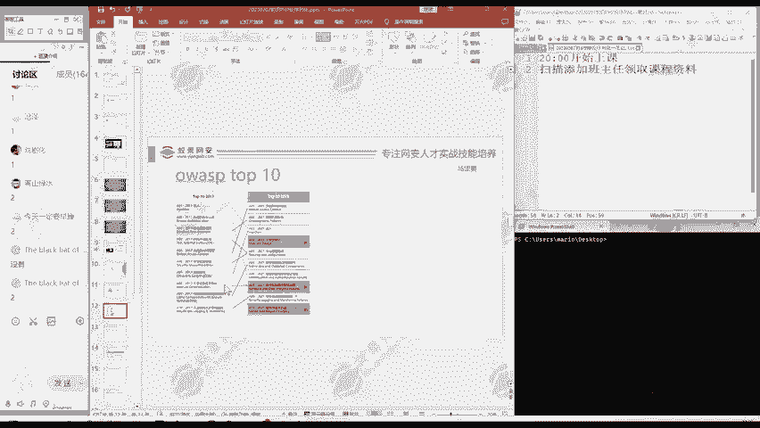

由此可见，反序列化方面的漏洞在互联网中出现的频率非常高，是网络安全领域持续关注的重点。

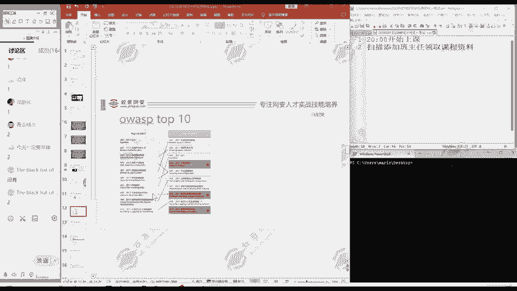

## 学习反序列化的现实意义

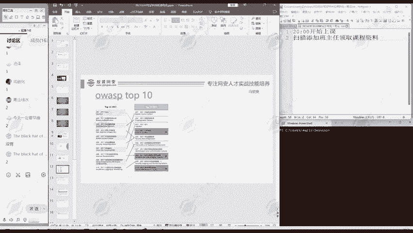

了解了反序列化漏洞的普遍性后，我们来看看学习它的现实意义。

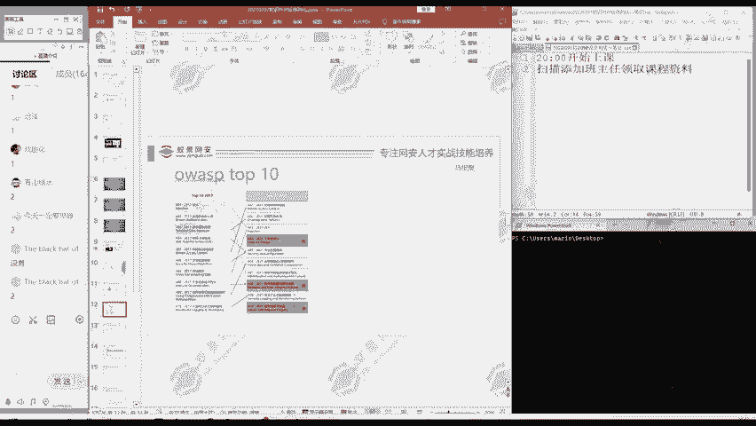

在求职和面试时，或者打开招聘软件查看职位要求时，经常会发现企业要求安全人员掌握OWASP Top 10中的漏洞。反序列化作为其中一项重要漏洞，是必须学好并掌握的知识点。

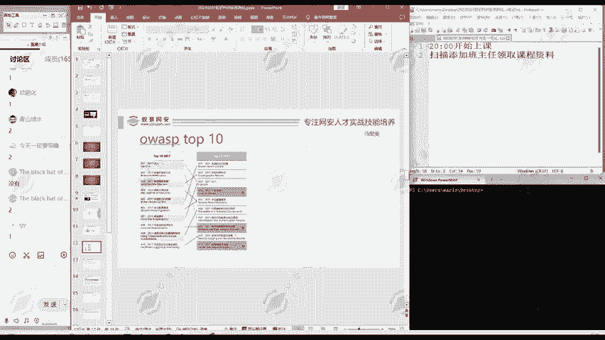

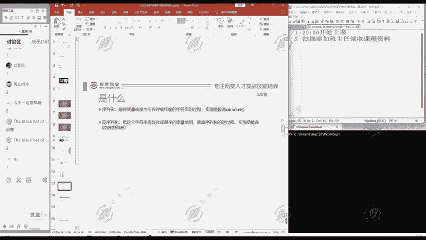

本节课中我们一起学习了反序列化漏洞在权威安全榜单（OWASP Top 10）中的重要地位，以及掌握该技术对于网络安全求职和实战的必要性。理解其普遍性和危害性是深入学习具体攻击与防御技术的前提。