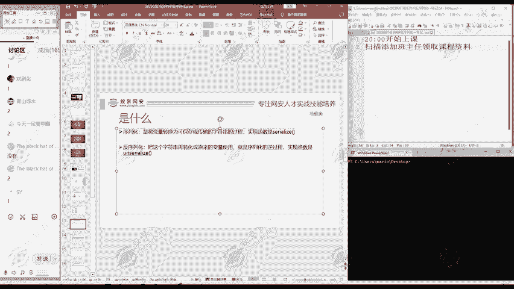
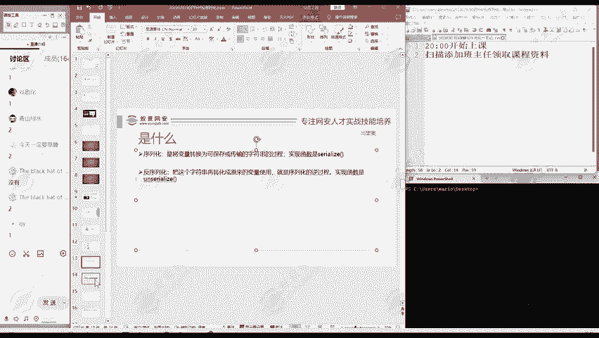

网络安全入门：P163：序列化与反序列化详解 🔐

在本节课中，我们将要学习网络安全领域中两个重要的基础概念：序列化与反序列化。理解这两个过程对于后续学习Web安全、漏洞挖掘等内容至关重要。

---

### 什么是序列化？📦


上一节我们介绍了课程主题，本节中我们来看看序列化的具体含义。

序列化是将变量转换为可以保存或方便传输的字符串的过程。简单来说，就是把变量转化成一个字符串。

这个过程的核心目的是将程序运行时的对象状态（如内存中的数据）转化为一种可以存储（例如存入文件）或通过网络发送的格式。

### 什么是反序列化？🔄


理解了序列化之后，反序列化就很好理解了。

反序列化是序列化的逆过程，它将序列化后生成的字符串再转化回原来的变量。


这个过程的核心目的是将存储或传输来的数据，重新构建为程序可以理解和操作的内存中的对象。

---


### 如何进行序列化与反序列化？💻

我们知道概念之后，接下来看看怎样进行序列化和反序列化。这里我们进行一个演示。

以下是使用Python语言进行序列化（使用`pickle`模块）和反序列化的一个简单示例：


```python
import pickle

# 定义一个示例对象（变量）
data_to_save = {
    ‘name‘: ‘测试用户‘,
    ‘level‘: 100,
    ‘skills‘: [‘渗透测试‘, ‘漏洞分析‘]
}



# 序列化过程：将对象转换为字节流（字符串）
serialized_data = pickle.dumps(data_to_save)
print(“序列化后的数据（字节流）:“, serialized_data)

# 反序列化过程：将字节流转换回对象
deserialized_data = pickle.loads(serialized_data)
print(“反序列化恢复的对象:“, deserialized_data)
```

代码执行逻辑如下：
1.  **序列化 (`pickle.dumps()`)**：将 `data_to_save` 这个字典对象转换为一串特殊的字节码（`serialized_data`）。
2.  **反序列化 (`pickle.loads()`)**：将这串字节码（`serialized_data`）重新转换回一个字典对象（`deserialized_data`）。


通过这个例子，可以清晰地看到数据从可读的结构化对象，变为便于传输/存储的格式，再恢复原状的过程。

---

### 总结 📝



本节课中我们一起学习了序列化与反序列化的核心概念。
*   **序列化**是将内存中的对象状态转换为可存储或传输的格式（如字符串、字节流）的过程。
*   **反序列化**是上述过程的逆操作，将存储或传输的格式重新构建为内存中的对象。

理解这一对概念是学习后续众多Web安全漏洞（如反序列化漏洞）的基础。