# 网络安全入门：P164：序列化与反序列化详解 🔐

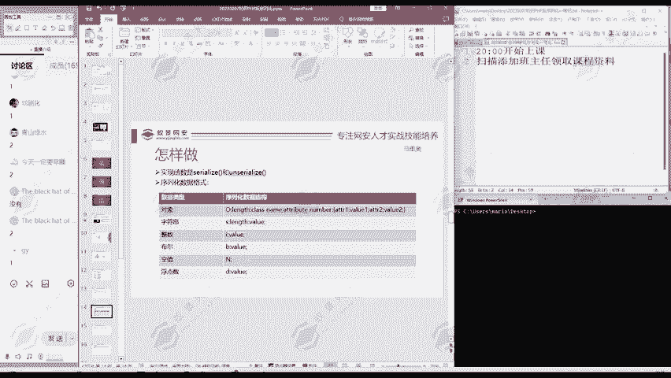

在本节课中，我们将要学习编程中两个重要的概念：**序列化**与**反序列化**。我们将通过一个简单的PHP代码示例，来理解它们如何将复杂的数据结构（如对象）转换为字符串，以及如何从字符串恢复回原始数据。这对于理解数据传输、存储以及网络安全中的相关漏洞至关重要。

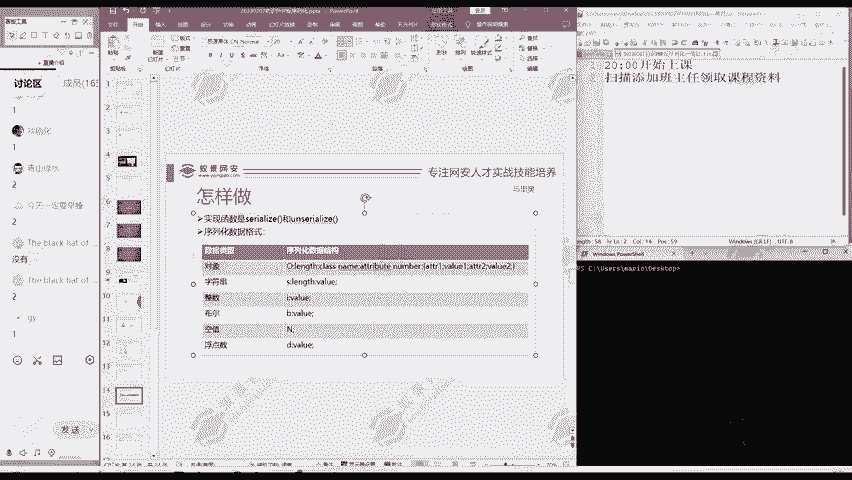

## 核心概念与函数

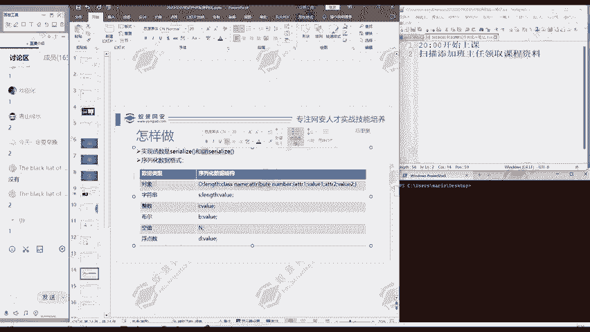

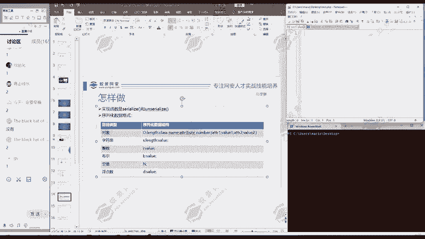

序列化与反序列化主要通过两个函数实现：
*   **序列化函数**：`serialize()`。其作用是将变量（如对象、数组）转换为可存储或传输的字符串格式。
*   **反序列化函数**：`unserialize()`。其作用是将序列化后的字符串恢复为原始的PHP变量值。

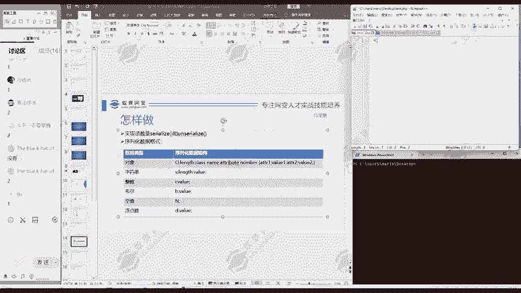

上一节我们介绍了基本概念，本节中我们来看看如何通过代码实践。

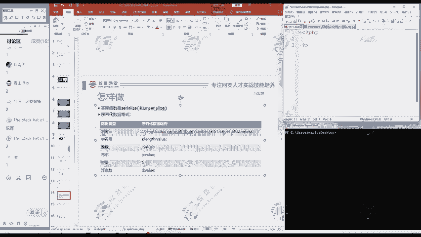

## 代码实践：定义一个类

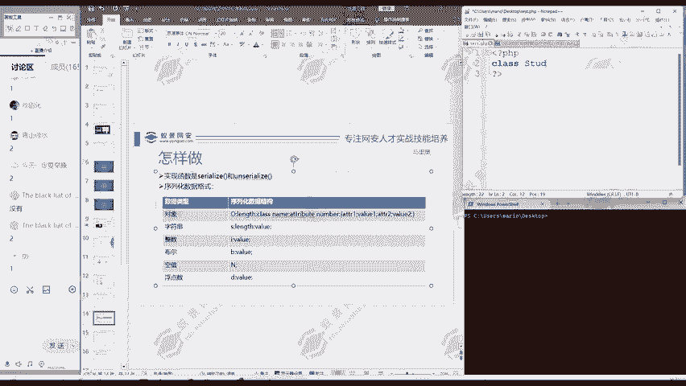

我们可以写一段PHP代码来演示这个过程。以下是实现步骤：


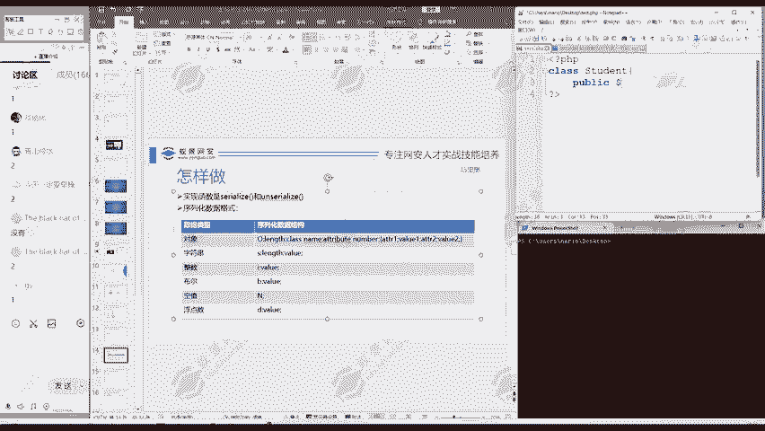

首先，我们创建一个PHP文件，并定义一个名为 `Student` 的学生类。

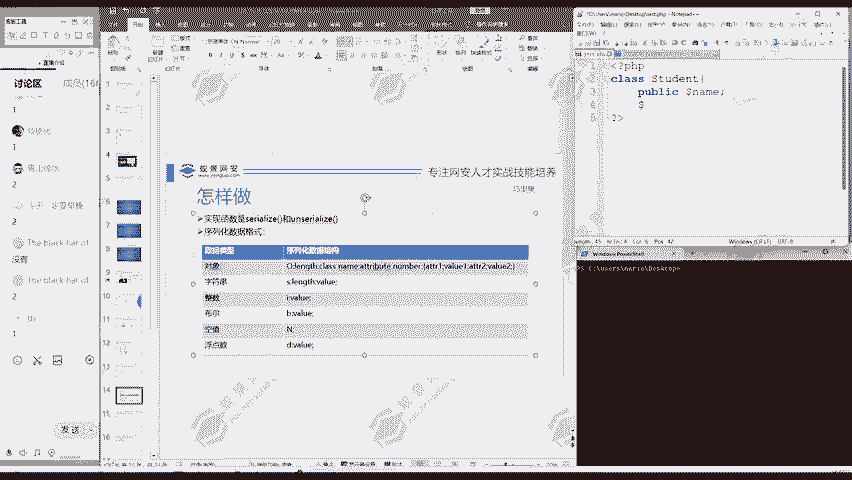

```php
<?php
// 定义一个Student类
class Student {
    public $name;   // 学生姓名属性
    public $grade;  // 学生成绩属性
}
```

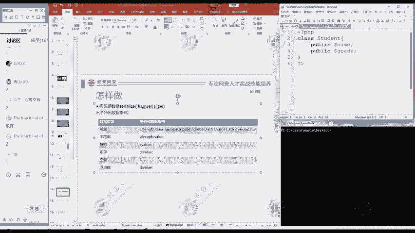

## 创建对象并赋值


定义类之后，我们可以创建这个类的一个对象，并为其属性赋值。

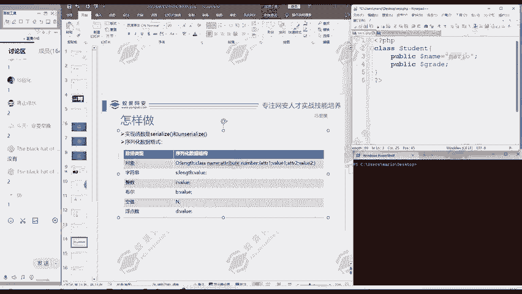

```php
// 创建一个Student对象
$s = new Student();
// 为对象属性赋值
$s->name = "马里奥";
$s->grade = 90;
```

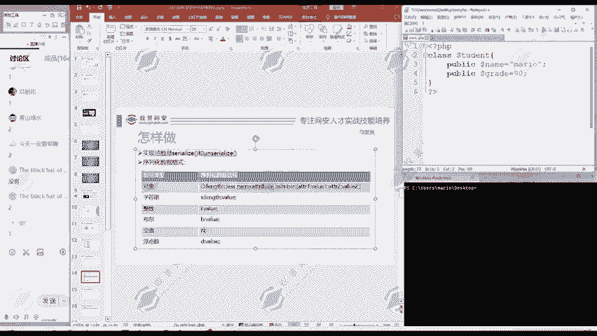


此时，变量 `$s` 是一个包含具体数据的对象。

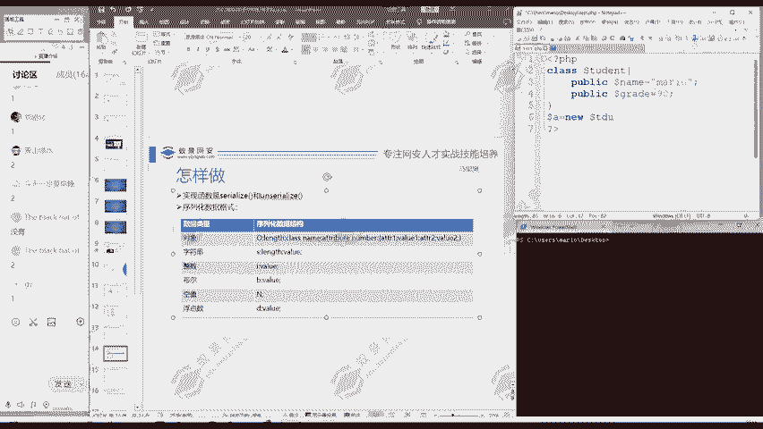

## 查看对象与进行序列化

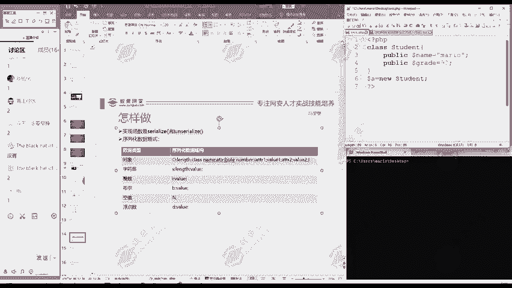

为了查看对象的内部结构，我们可以使用 `var_dump()` 函数。更重要的是，我们将使用 `serialize()` 函数对这个对象进行序列化。

```php
// 输出原始对象结构
var_dump($s);
echo "\n"; // 输出换行以便区分

// 将对象序列化为字符串
$serialized_string = serialize($s);
// 输出序列化后的字符串
echo $serialized_string;
```

执行这段代码后，你会看到两段输出。第一段是对象的详细结构，第二段则是一个特殊的字符串，这就是序列化的结果。

## 理解序列化字符串格式

序列化生成的字符串遵循特定的格式。以上述代码为例，生成的字符串大致为：
`O:7:"Student":2:{s:4:"name";s:5:"马里奥";s:5:"grade";i:90;}`

我们可以对照以下规则进行解读：
*   `O` 表示这是一个对象（Object）。
*   `7` 表示类名 `"Student"` 的长度为7个字符。
*   `2` 表示该对象有2个属性。
*   大括号 `{}` 内描述了各个属性：
    *   `s:4:"name";` 表示第一个属性名是长度为4的字符串 `"name"`。
    *   `s:5:"马里奥";` 表示 `name` 属性的值是字符串 `"马里奥"`。
    *   `s:5:"grade";` 表示第二个属性名是字符串 `"grade"`。
    *   `i:90;` 表示 `grade` 属性的值是整数 `90`。

通过这个格式，一个复杂的对象就被“拉平”成了一个标准的字符串。

## 进行反序列化

序列化的目的是为了传输或存储，最终我们通常需要将其恢复为原始数据。这个过程就是反序列化，使用 `unserialize()` 函数。

```php
// 将序列化字符串反序列化为对象
$restored_object = unserialize($serialized_string);
// 输出恢复后的对象
var_dump($restored_object);
```

执行后，你会发现 `$restored_object` 的输出与最初的 `$s` 对象完全一致。这表明我们成功地将字符串恢复成了原始的变量。

## 总结

本节课中我们一起学习了序列化与反序列化的完整过程。我们了解到：
1.  **序列化** 使用 `serialize()` 函数，将变量（如对象）转换为字符串。
2.  序列化字符串有特定格式，清晰描述了数据的结构和内容。
3.  **反序列化** 使用 `unserialize()` 函数，将序列化字符串还原为原始的PHP变量。

这个过程是许多应用进行数据交换的基础。理解它不仅能帮助初学者掌握数据处理的基本方法，也是后续学习网络安全中“反序列化漏洞”的重要前提。