# 网络安全：P166：序列化反序列化真题讲解

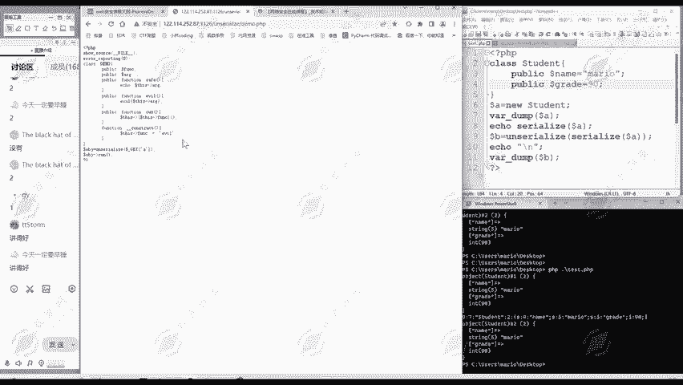

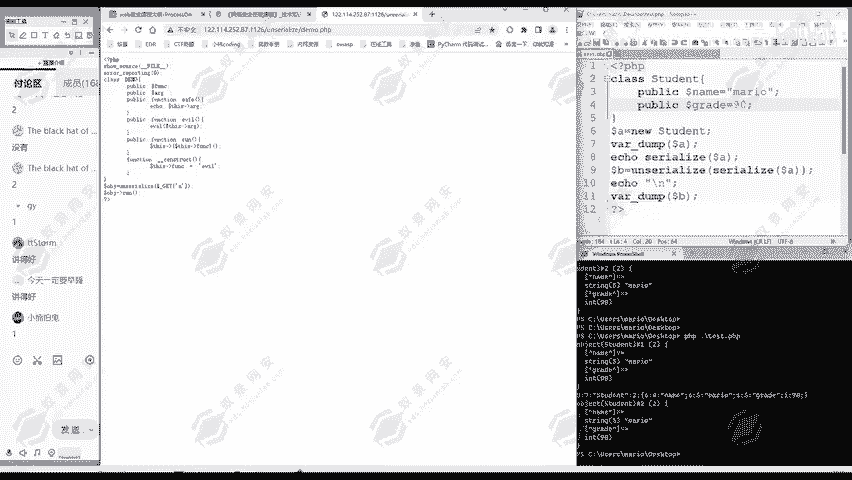

在本节课中，我们将通过一道具体的PHP反序列化题目，学习如何分析漏洞、构造利用链并最终执行任意命令。我们将从代码分析开始，逐步完成整个攻击流程。

## 概述

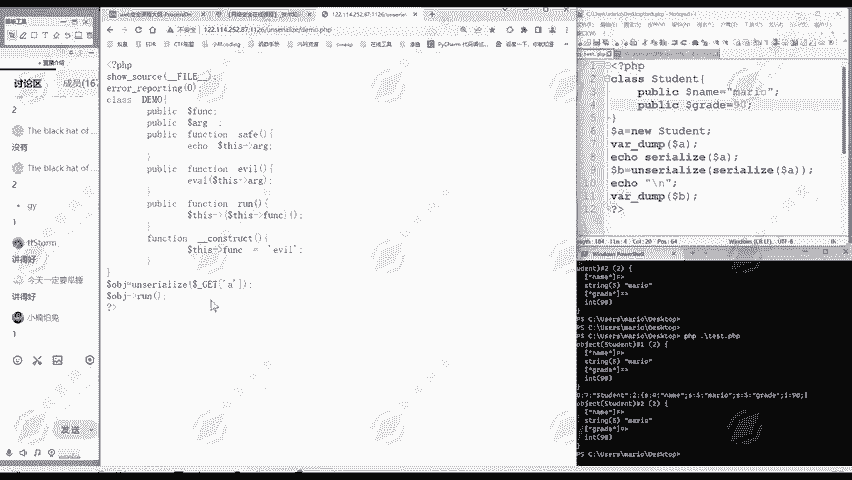

上一节我们介绍了序列化与反序列化的基本概念。本节中，我们来看看如何将这些概念应用于实战，分析并利用一个真实存在的反序列化漏洞。

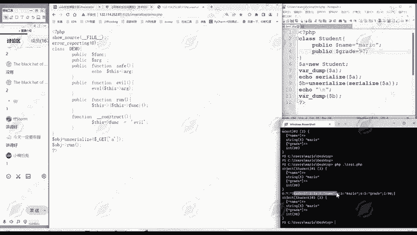

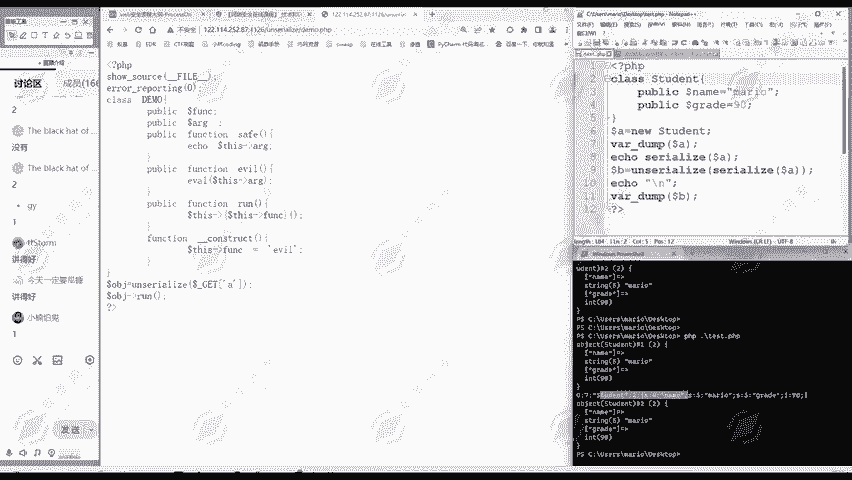

## 代码逻辑分析

首先，我们来看演示程序 `demo.php` 的源代码逻辑。

```php
// 显示文件内容，此处不报错（与我们关系不大）
// ... 部分代码 ...

// 定义一个类，名为 demo
class demo {
    public $func;
    public $arg;

    // 类中定义了多个方法
    public function s() {
        echo $this->arg;
    }
    public function e() {
        eval($this->arg); // eval函数会将其中的字符串当作PHP代码执行
    }
    public function run() {
        // 此方法会调用 $this->func 属性所指向的函数
        ($this->func)();
    }
    public function __construct() {
        $this->func = "e"; // 构造函数将 func 属性默认设置为 "e"
    }
}

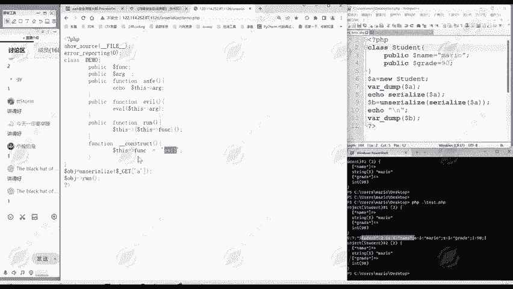


// 通过GET方式接收参数a
$obj = unserialize($_GET['a']);
// 对反序列化得到的对象执行run方法
$obj->run();
```

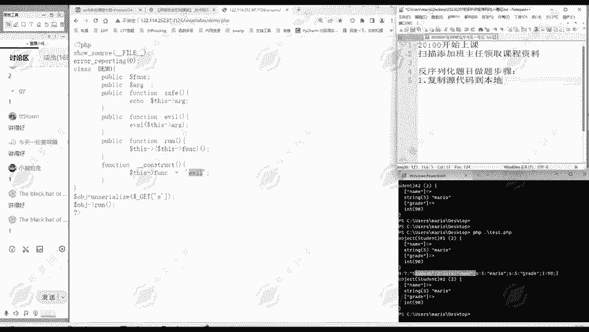

程序的核心流程如下：
1.  通过 `$_GET[‘a’]` 接收用户输入。
2.  将输入进行反序列化，得到一个对象 `$obj`。
3.  调用该对象的 `run()` 方法。

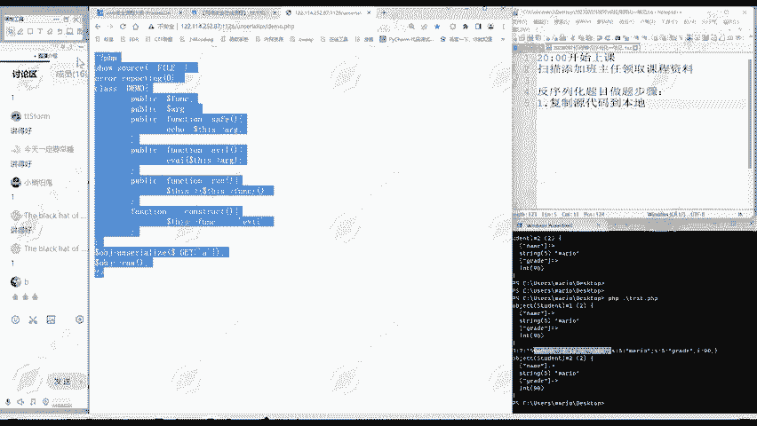

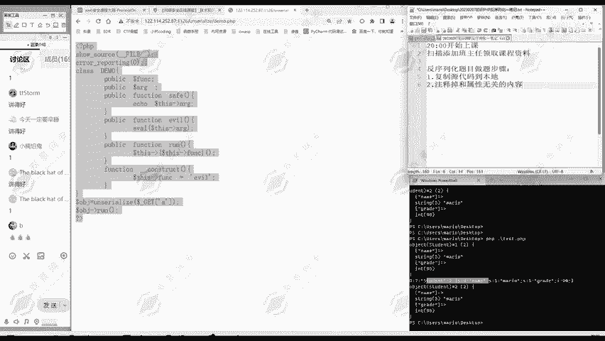

风险点在于，如果我们可以控制反序列化后对象的属性，并让 `run()` 方法最终执行到 `e()` 方法，那么我们就可以通过控制 `$arg` 属性来执行任意PHP代码。

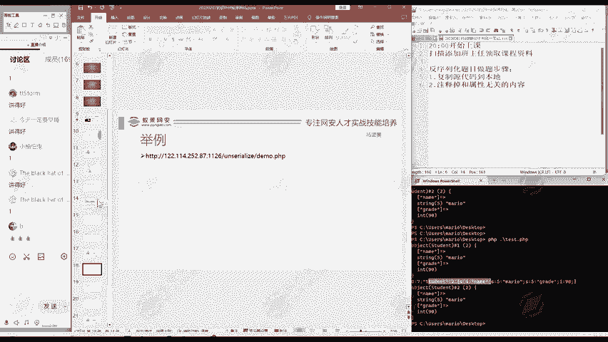

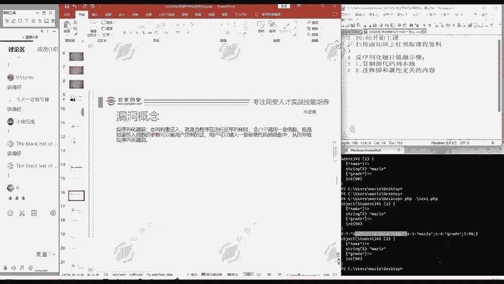

## 漏洞利用步骤

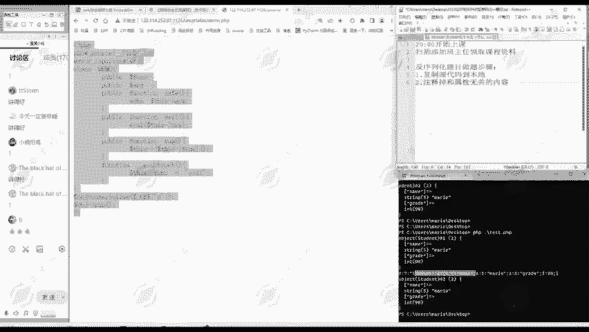

以下是利用此类反序列化漏洞的通用步骤。

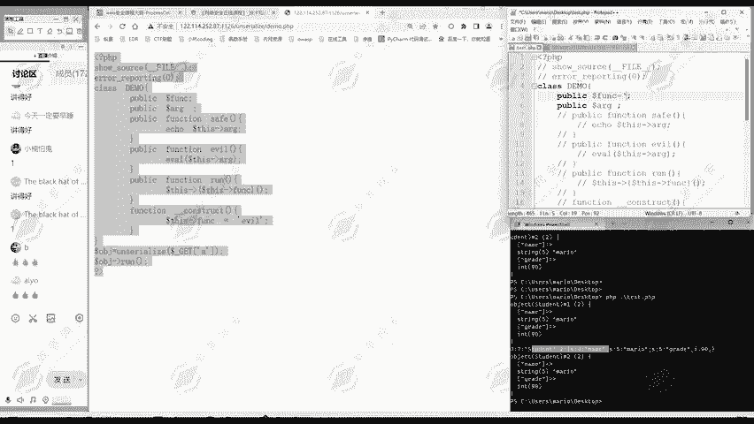

### 第一步：复制源代码到本地

将目标服务器上的漏洞源代码完整复制到本地环境（例如 `test.php` 文件中），以便进行分析和调试。

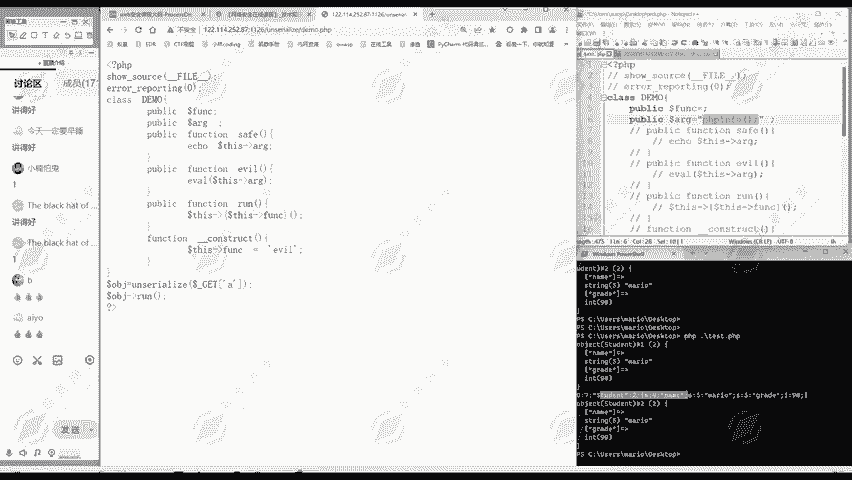

### 第二步：注释掉与属性无关的内容

反序列化漏洞的核心是控制对象的属性。因此，我们需要聚焦于与属性赋值和调用相关的代码，将与属性无关的代码（如某些固定的函数逻辑、无关的类定义等）注释掉，简化分析目标。

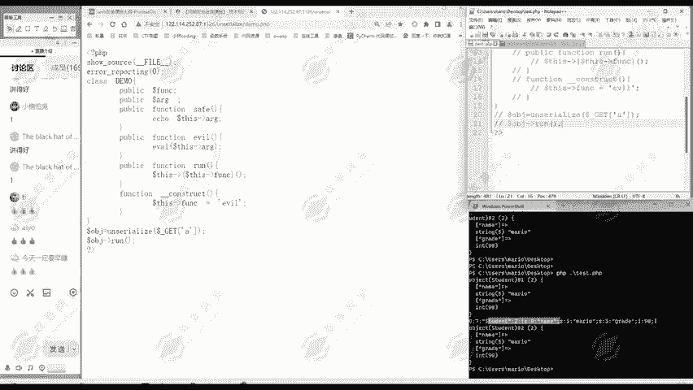

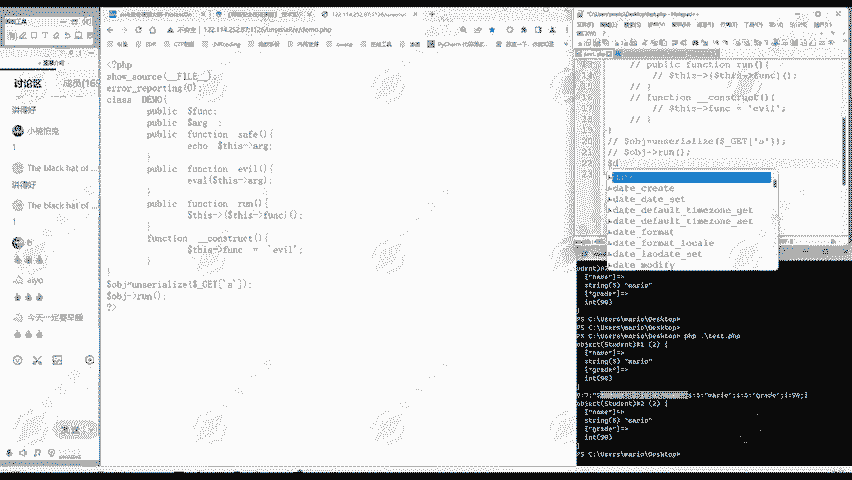

对于本例，我们主要关注 `demo` 类的定义以及最后几行接收参数和调用方法的代码。

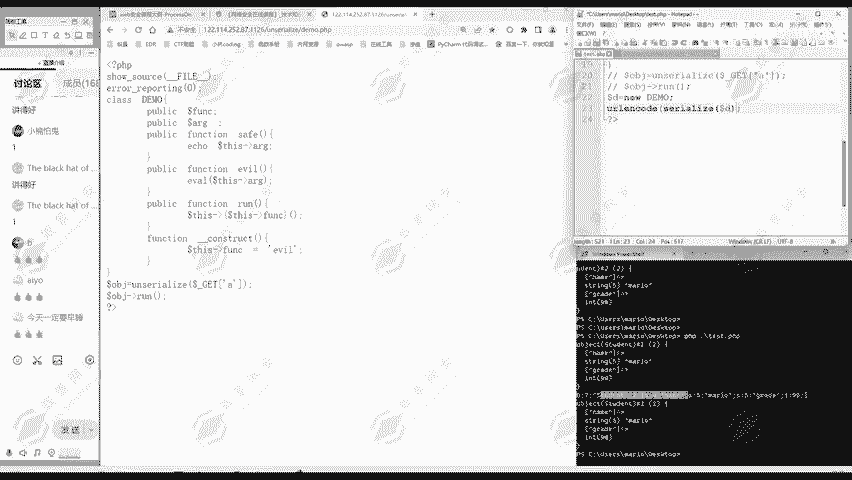

### 第三步：根据题目需要给属性赋值

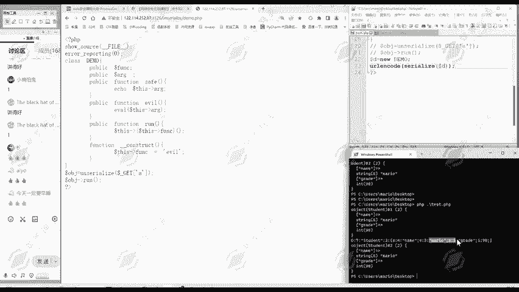

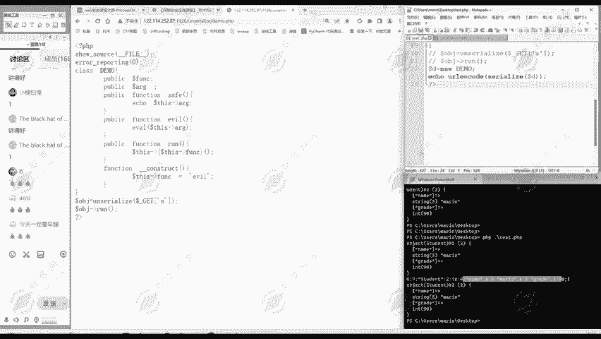

这是最关键的一步。我们需要分析如何给对象的属性赋值，才能让程序执行流走到危险函数（本例中的 `eval`）。

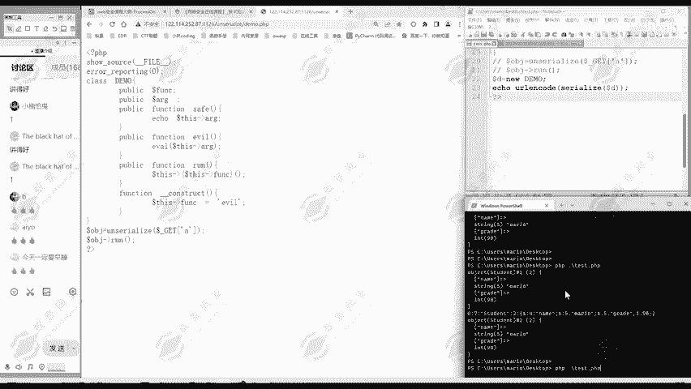

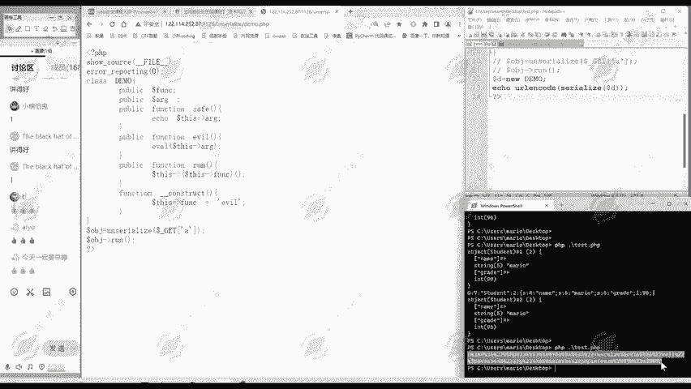

以下是我们的分析过程：
1.  **目标**：执行 `eval($this->arg)`。
2.  **触发路径**：`run()` 方法会调用 `$this->func` 所指向的函数。因此，我们需要让 `$this->func` 的值为 `”e”`，以调用 `e()` 方法。
3.  **执行代码**：在 `e()` 方法中，`eval` 执行的是 `$this->arg` 的值。因此，我们需要让 `$this->arg` 等于我们想执行的PHP代码，例如 `phpinfo();` 或 `system(‘ls’);`。

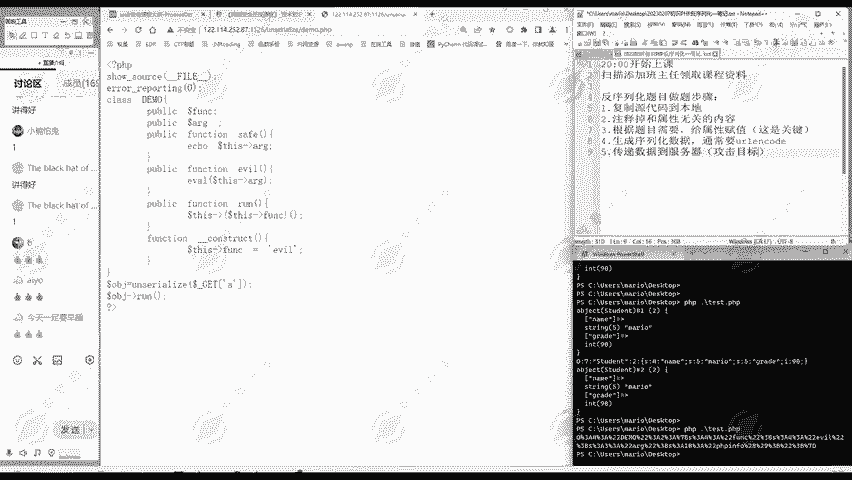

因此，我们构造的对象属性应如下赋值：
```php
$d = new demo();
$d->func = “e”; // 触发执行 e() 方法
$d->arg = “system(‘ls’);”; // 在 e() 方法中将被 eval 执行的代码
```

### 第四步：生成序列化数据

将我们构造好的对象进行序列化，生成字符串。由于序列化字符串中可能包含特殊字符（如空字符、引号等），在通过URL传输时容易出错，因此通常需要对其进行URL编码。

```php
$serialized_data = serialize($d);
$payload = urlencode($serialized_data);
echo $payload; // 输出编码后的payload
```

执行上述代码，我们将得到一个经过URL编码的序列化字符串，这就是我们的攻击载荷（Payload）。

### 第五步：传递数据到服务器

将生成的Payload通过GET请求发送给目标服务器。根据源代码，参数名为 `a`。

最终的访问URL格式为：
```
http://target.com/demo.php?a={上一步生成的Payload}
```

当服务器接收到这个请求后，会执行 `unserialize($_GET[‘a’])`，还原出我们精心构造的对象，并调用其 `run()` 方法，最终实现任意代码执行。

## 漏洞原理回顾

本节课中我们一起学习了如何利用一个PHP反序列化漏洞。我们通过分析代码，发现程序将用户可控的数据进行了反序列化，并且未对反序列化后对象的属性进行任何检查。

攻击者通过构造一个恶意的序列化字符串，其中包含了能触发危险方法（如 `eval`）的属性值。服务器在反序列化该字符串后，生成了一个符合攻击者预期的对象，并在后续的 `$obj->run()` 调用中，按照攻击者设计的逻辑执行了任意系统命令。

## 总结

本节课我们通过一道真题，完整演练了反序列化漏洞的利用过程：
1.  **代码分析**：定位反序列化点及可利用的危险方法。
2.  **构造利用链**：分析如何控制对象属性以触发漏洞。
3.  **生成Payload**：序列化恶意对象并进行URL编码。
4.  **发起攻击**：将Payload发送至服务器以验证漏洞。

理解这个过程是学习Web安全中反序列化漏洞的基础。请务必掌握每一步的思路，并尝试在安全的实验环境中进行练习。