# PHP安全教程：P169：数组特性 🧩

在本节课中，我们将要学习PHP语言中一个独特且容易被忽视的特性——**数组特性**。这个特性在某些情况下可能被开发者忽略，从而成为潜在的安全漏洞。我们将通过定义、代码演示和原理分析，帮助你彻底理解这个概念。

## 概述

上一节我们介绍了PHP中的一些基础概念。本节中我们来看看PHP的**数组特性**。具体来说，我们将探讨当一个数组被当作函数调用时会发生什么，以及这如何与安全漏洞产生关联。

## 数组特性详解

数组特性的核心定义是：在PHP中，如果一个数组被当作函数调用，并且该数组的第一个元素是一个对象，第二个元素是该对象下某个方法的名称（字符串形式），那么PHP会直接调用该对象下的对应方法。

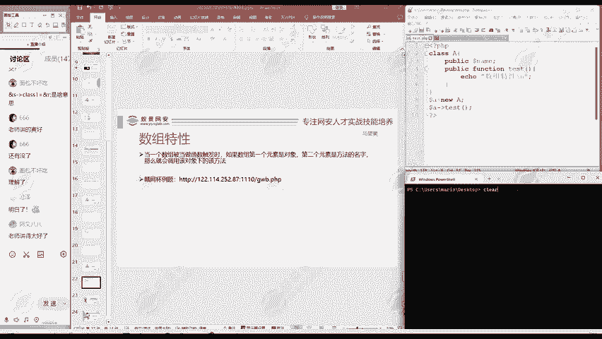

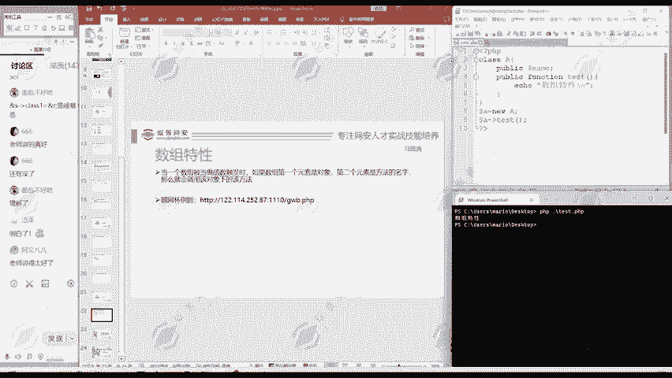


听起来可能有些抽象，我们通过代码来演示。

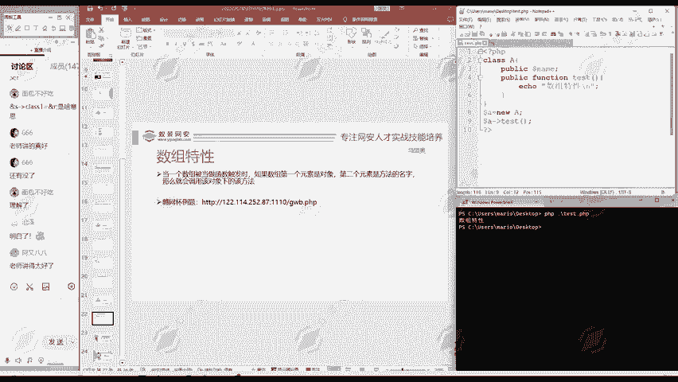

### 代码演示与解析

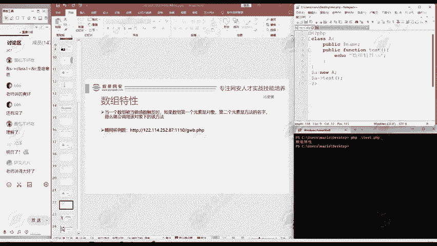


首先，我们创建一个简单的类 `A`，并为其定义一个方法。


```php
class A {
    public $attribute = '这是一个属性';

    public function test() {
        echo "数组特性\n";
    }
}
```

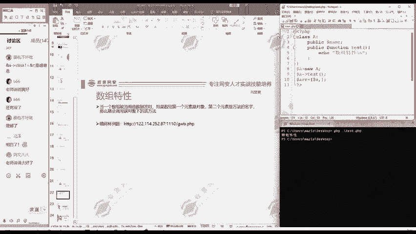

接下来，我们看看如何正常调用这个 `test` 方法。

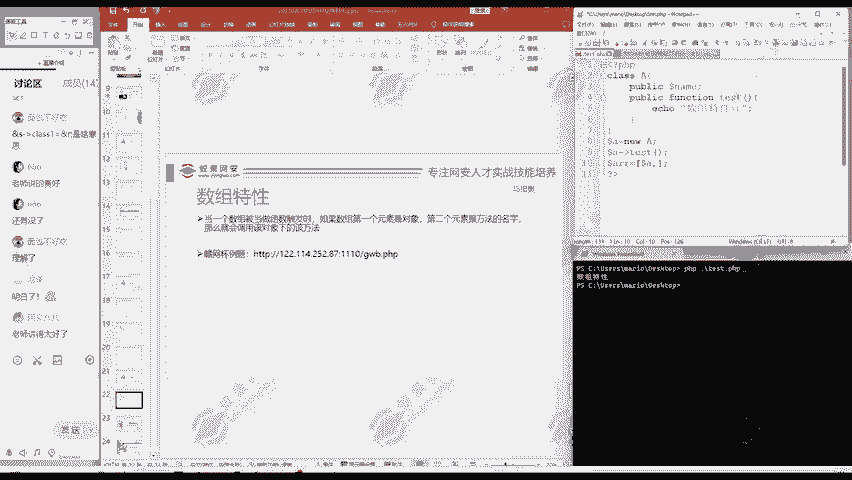

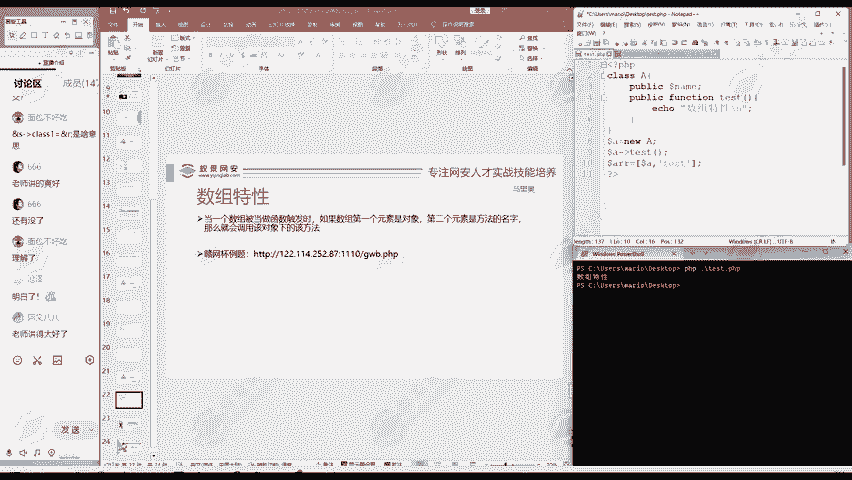

```php
$a = new A(); // 创建A类的对象
$a->test();   // 正常调用对象的方法
```
执行这段代码，会输出“数组特性”。


现在，我们运用数组特性来实现同样的调用。以下是具体步骤：


1.  首先，创建一个数组 `$arr`。
2.  让数组的第一个元素是对象 `$a`。
3.  让数组的第二个元素是方法名 `'test'`（注意是字符串形式）。
4.  最后，将这个数组当作函数来调用。

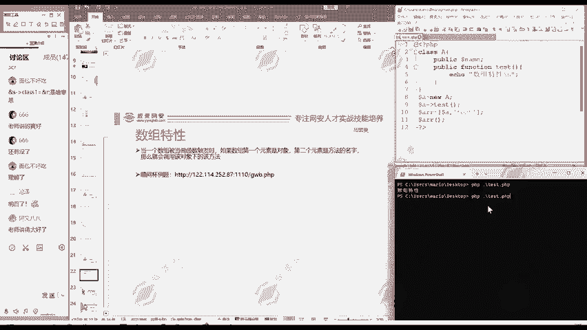

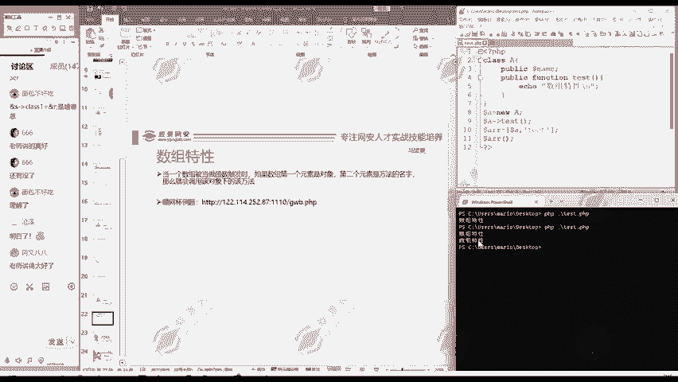

```php
$a = new A();
$arr = [$a, 'test']; // 构造符合数组特性的数组
$arr();              // 将数组作为函数调用
```

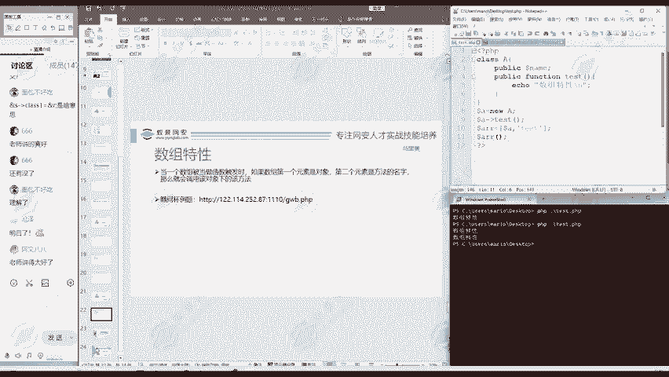


执行这段代码，你会发现它同样输出了“数组特性”。这说明 `$arr()` 这种调用方式，其效果等同于 `$a->test()`。

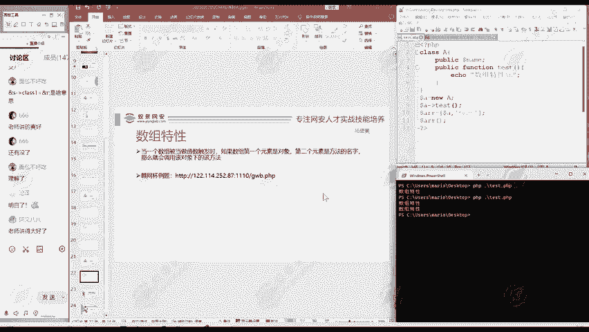


### 安全意义

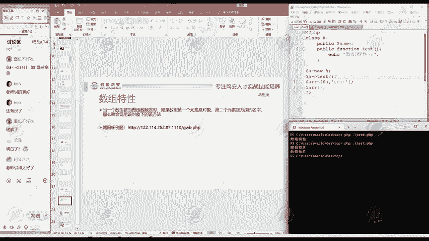


这个特性本身是PHP语言设计的一部分。然而，如果开发人员在代码中无意地将一个用户可控的数组当作函数来调用，就可能产生严重的安全问题。


考虑以下场景：
*   开发者本意是调用一个固定的函数，但错误地使用了来自用户输入的变量来构造调用。
*   攻击者可以精心构造一个数组，其第一个元素是某个有害的对象（例如，能执行系统命令的对象），第二个元素是该对象的一个危险方法名。
*   当这个被构造的数组被当作函数执行时，攻击者指定的方法就会被调用，从而可能实现远程代码执行等攻击。

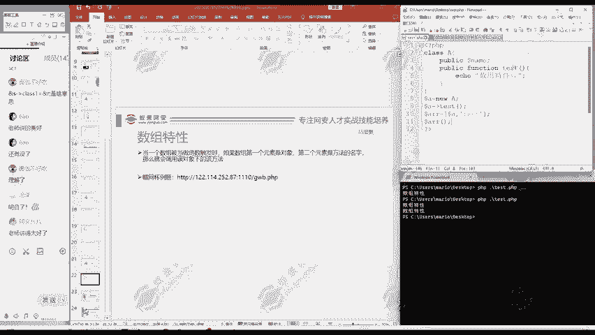


因此，理解这个特性有助于我们在代码审计和开发中，识别和避免此类潜在的风险点。

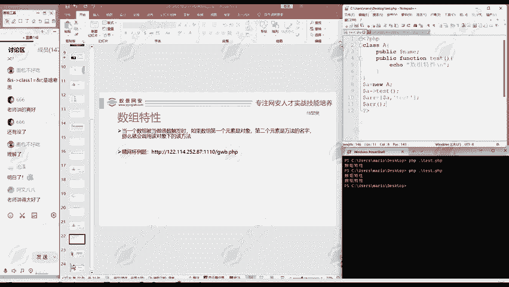


## 总结


本节课中我们一起学习了PHP的**数组特性**。我们明确了它的定义：当数组被当作函数调用，且其结构为 `[对象, '方法名']` 时，会触发对象中对应方法的执行。我们通过代码演示验证了这一行为，并探讨了其可能被恶意利用从而引发安全漏洞的原理。理解这些语言特性是构建安全代码和进行渗透测试的基础。

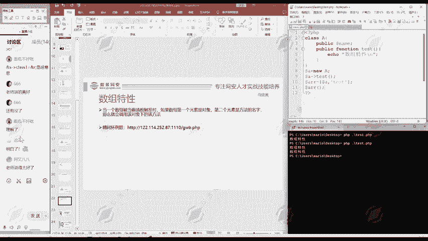

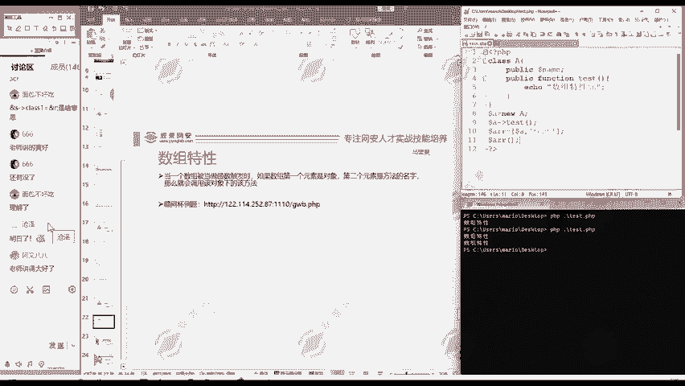

---


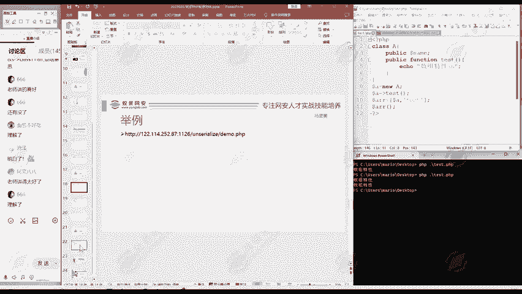

**课程资料提示**：课程中涉及的靶场地址、工具等资料，请联系班主任领取。听课满30分钟的同学，可发送直播间截图至班主任处进行打卡。