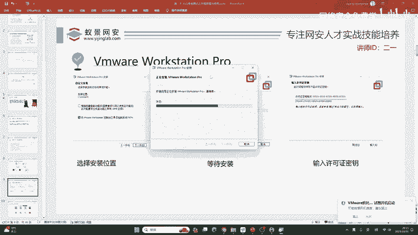
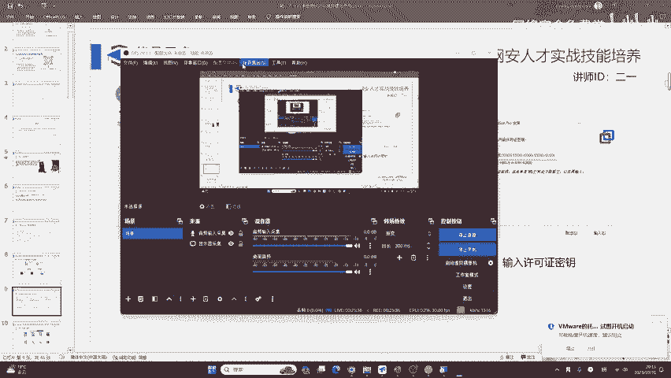
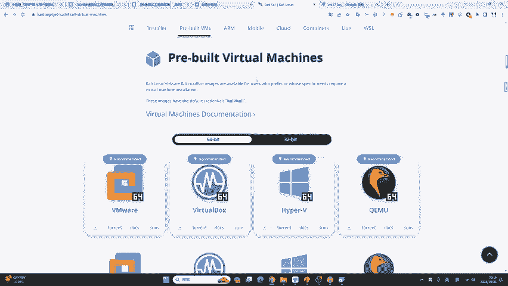
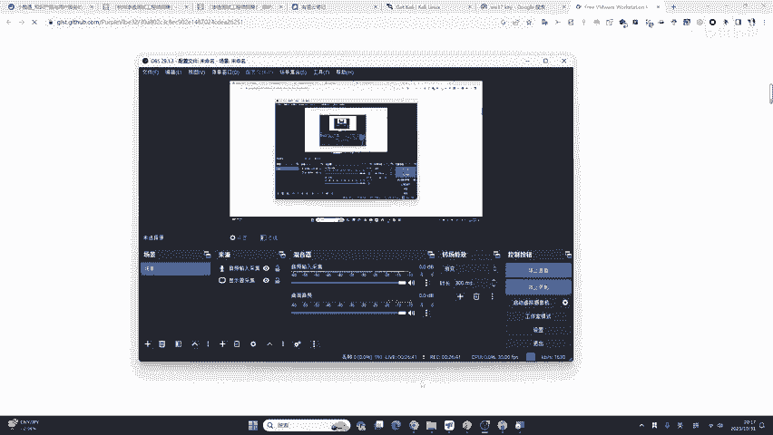
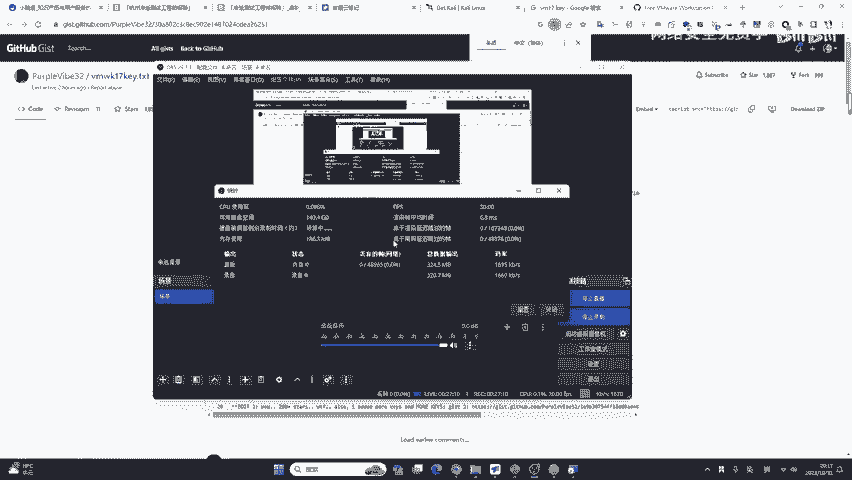
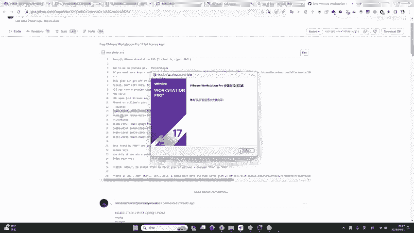
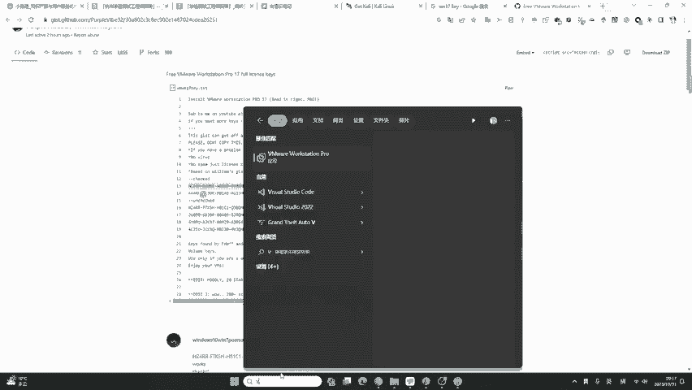
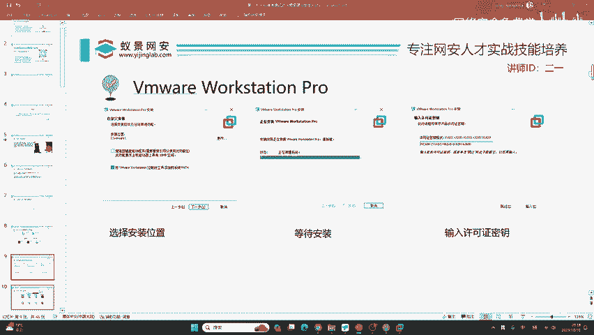

# 网络安全入门：P16：安装虚拟机 🖥️

在本节课中，我们将学习如何安装虚拟机软件 VMware Workstation Pro。这是搭建网络安全学习环境的第一步，通过虚拟机，我们可以在自己的电脑上安全地运行不同的操作系统（如 Kali Linux）进行实验。

## 概述

虚拟机软件允许我们在现有操作系统内模拟出另一台完整的计算机。对于网络安全学习而言，这是至关重要的工具，因为它能提供一个隔离、安全且可随时重置的实验环境。本节教程将详细演示 VMware Workstation Pro 的安装过程。

---

## 安装前准备

首先，你需要获取 VMware Workstation Pro 的安装程序。你可以从官方网站下载，或者使用课程资料包中提供的安装包。本教程不涉及系统镜像的安装，仅专注于虚拟机软件本身的安装。

## 安装步骤详解

安装过程主要分为三个步骤：选择安装位置、等待安装完成、输入许可证密钥。下面我们按顺序进行。

### 步骤一：启动安装程序并同意许可

双击下载好的安装包（大小约为600MB），启动安装向导。

1.  程序加载后，点击 **“下一步”**。
2.  在许可协议页面，勾选 **“我接受许可协议中的条款”**，然后点击 **“下一步”**。

### 步骤二：选择自定义安装路径

默认安装路径通常在系统C盘。由于虚拟机软件及其创建的虚拟机会占用较大存储空间，建议更改到其他磁盘分区。

1.  在“自定义安装”页面，点击 **“更改…”** 按钮。
2.  在弹出的窗口中，选择目标磁盘和文件夹（例如：`D:\VMware\`）。
3.  点击 **“确定”** 返回。
4.  **注意**：安装选项中的“增强型键盘驱动程序”通常无需勾选。
5.  确认路径后，点击 **“下一步”**。

### 步骤三：完成安装与输入密钥

1.  在后续的用户体验设置页面，可以根据个人喜好选择是否加入客户体验改进计划，然后点击 **“下一步”**。
2.  点击 **“安装”** 按钮，开始正式安装。此过程通常需要1-2分钟。安装过程中，软件可能会配置虚拟网络驱动，导致网络短暂中断，这是正常现象。
3.  安装完成后，点击 **“完成”** 按钮退出向导。此时，软件会提示需要许可证密钥。

VMware Workstation Pro 是一款商业软件，需要有效的许可证密钥才能使用全部功能。

1.  启动 VMware Workstation Pro。
2.  在提示输入许可证的界面，将准备好的密钥粘贴到输入框中。
    *   **获取密钥**：你可以在课程资料包或通过搜索引擎查找“VMware Workstation 17 密钥”来获得可用的测试密钥。
3.  点击 **“输入”** 完成激活。

至此，VMware Workstation Pro 已成功安装并激活。

---

## 安装后验证

安装完成后，你可以在开始菜单或桌面上找到 VMware Workstation Pro 的图标。双击打开，你将看到软件的主界面。主界面会列出已创建的虚拟机（初次安装时列表为空），后续课程我们将在这里创建和运行我们的第一个虚拟机（如 Kali Linux）。

---

## 总结

本节课中，我们一起完成了网络安全学习环境的基石——虚拟机软件的安装。我们详细讲解了从启动安装程序、更改安装路径到输入许可证密钥的完整流程。现在，你的电脑上已经拥有了一个功能强大的虚拟化平台，为后续安装 Kali Linux 等渗透测试操作系统做好了准备。

记住，虚拟机是网络安全实践的安全沙盒，你可以在其中大胆尝试各种工具和技术，而无需担心对真实系统造成影响。下一节，我们将利用这个已安装好的 VMware Workstation Pro 来创建我们的第一个虚拟机。