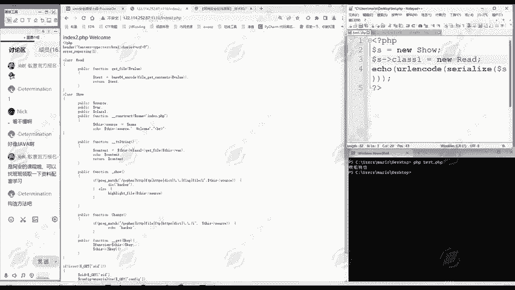
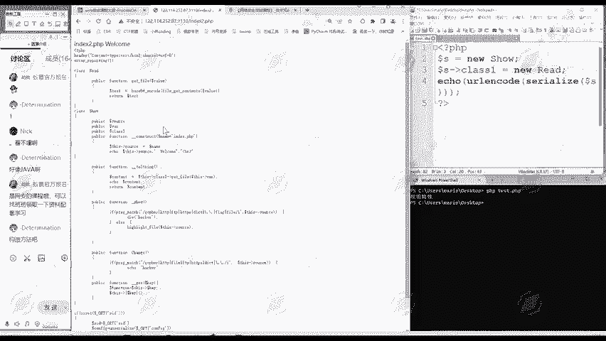
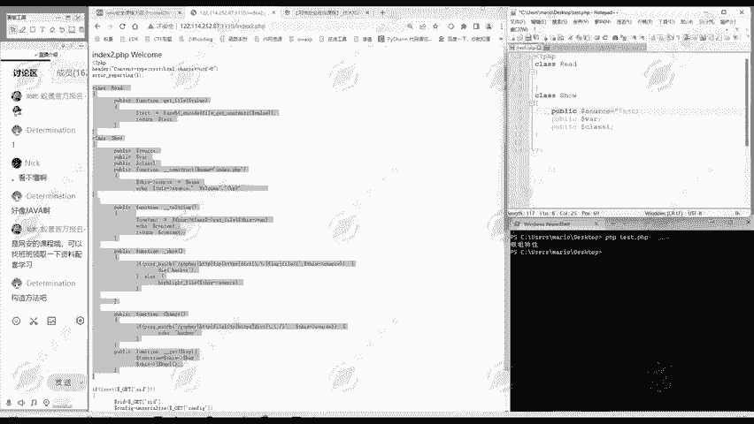
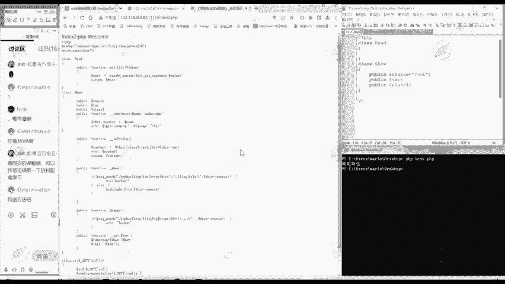
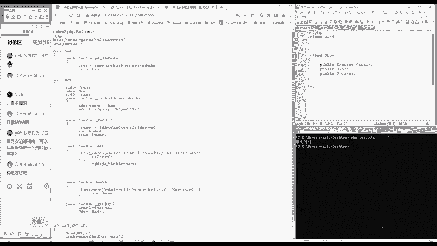

# PHP反序列化教程：P171：属性赋值

在本节课中，我们将要学习PHP中对象属性赋值的三种核心方法。理解这些方法是掌握反序列化漏洞利用的关键，因为它们决定了我们如何控制对象的内部状态。

上一节我们介绍了反序列化的基本概念，本节中我们来看看如何具体地为一个对象的属性赋值。

## 概述：三种赋值方法

在PHP中，为一个对象的属性赋值主要有三种途径。每种方法都有其适用场景和限制。以下是这三种方法的总结：



1.  **直接赋值法**：在类定义内部直接为属性赋值。
2.  **外部赋值法**：在类定义外部，通过对象实例来修改其属性。
3.  **构造方法赋值法**：在类的魔术方法 `__construct()` 中为属性赋值。

接下来，我们将逐一详细讲解。



## 方法一：直接赋值法

直接赋值法是最简单直观的方式。它在定义类的同时，直接为属性赋予一个初始值。

我们以一段简单的代码为例。为了清晰，我们移除了与当前主题无关的函数。

```php
class Example {
    public $source = ‘test_string‘;
}
```



在上面的代码中，我们定义了一个名为 `Example` 的类，并直接将其公有属性 `$source` 赋值为字符串 `‘test_string‘`。



**优点**：这种方法非常方便快捷。
**缺点**：它只能用于赋值**字符串**、数字等基本数据类型。无法直接赋予一个对象或数组等复杂值。



## 方法二：外部赋值法

当我们无法在类定义内部直接赋值（例如需要赋一个对象值），或者需要在对象创建后动态修改属性时，就需要用到外部赋值法。

这种方法在类的外部，通过已实例化的对象来操作其属性。就像我们昨天解题时做的那样：

```php
// 首先，定义一个类
class Show {
    public $class;
}

// 然后，实例化一个对象
$obj = new Show();

// 最后，在外部为对象的属性赋值
$obj->class = new Read(); // 可以赋一个对象
$obj->class = ‘a string‘; // 也可以赋一个字符串
$obj->class = array(1, 2, 3); // 还可以赋一个数组
```

**优点**：它突破了直接赋值法只能赋基本类型的限制，可以赋予**任意类型**的值，包括其他对象、数组等。
**缺点**：它只能操作**公有（public）**属性。对于受保护（protected）或私有（private）属性，这种方法将失效。

在绝大多数反序列化题目中，结合直接赋值和外部赋值这两种方法，就足以完成对所有必要属性的操控。

## 方法三：构造方法赋值法

第三种方法是通过类的构造函数 `__construct()` 来赋值。这是一个魔术方法，在每次创建对象的新实例时会被自动调用。

虽然在实际解题中用的不多，但作为一种“万能”方法，有必要了解。

```php
class Example {
    public $x;
    public $y;

    // 定义构造函数
    public function __construct() {
        $this->x = ‘assigned_in_constructor‘;
        $this->y = new AnotherClass(); // 这里可以赋予任何值
    }
}

// 当实例化对象时，属性会自动被赋值
$obj = new Example(); // 此时 $obj->x 和 $obj->y 已被设置
```

**优点**：能力非常全面，可以在对象创建时执行任何复杂的赋值逻辑。
**缺点**：相对麻烦，需要手动编写构造函数。在反序列化场景中，如果类本身没有构造函数，我们通常更倾向于使用前两种更直接的方法。

## 总结

本节课中我们一起学习了PHP中对象属性赋值的三种核心方法：
1.  **直接赋值法**：在类内部定义时赋值，简单但只能赋基本类型。
2.  **外部赋值法**：通过对象实例在类外部赋值，灵活可赋任意类型，但仅限公有属性。
3.  **构造方法赋值法**：在 `__construct()` 函数内赋值，功能强大但步骤稍多。

掌握这些方法，意味着你能够通过反序列化操作，随心所欲地控制目标对象的属性状态，无论其值是一个字符串、一个数组还是另一个对象。这是后续构建有效反序列化利用链的基础。