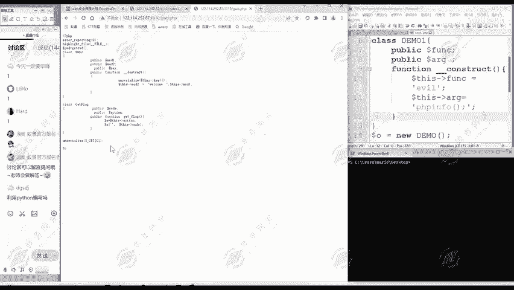
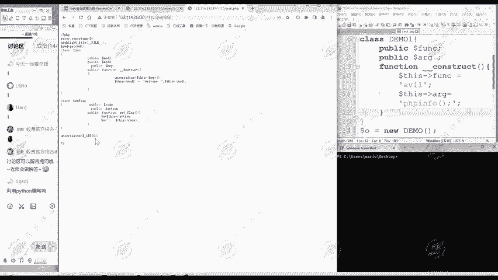
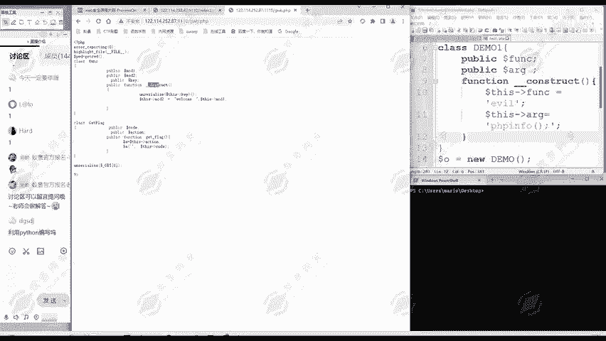
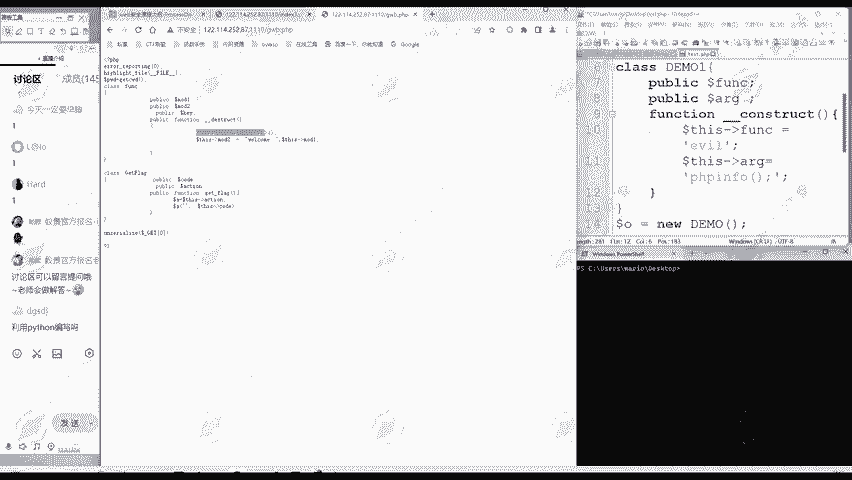
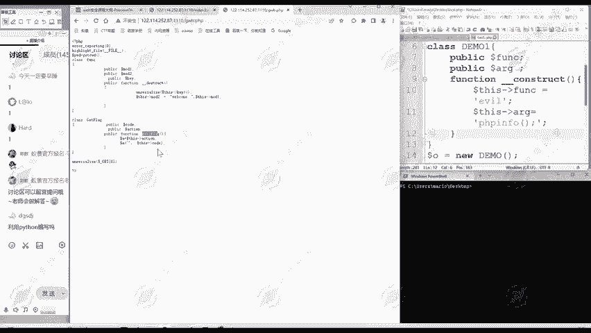
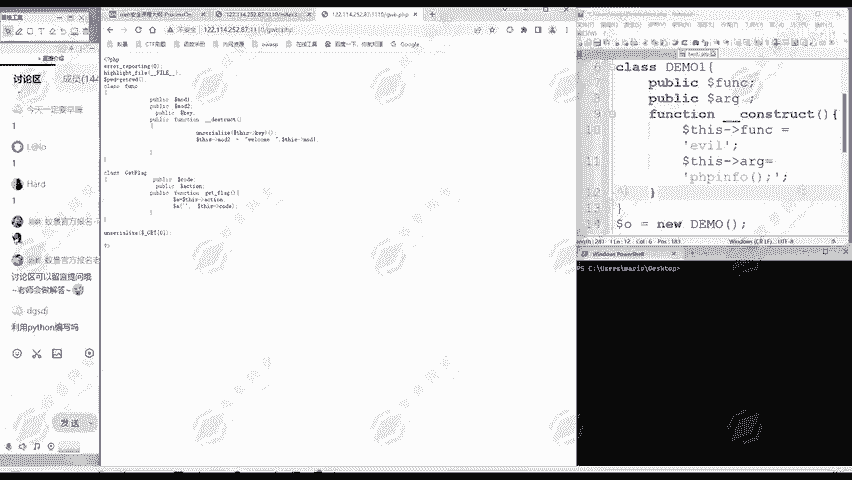
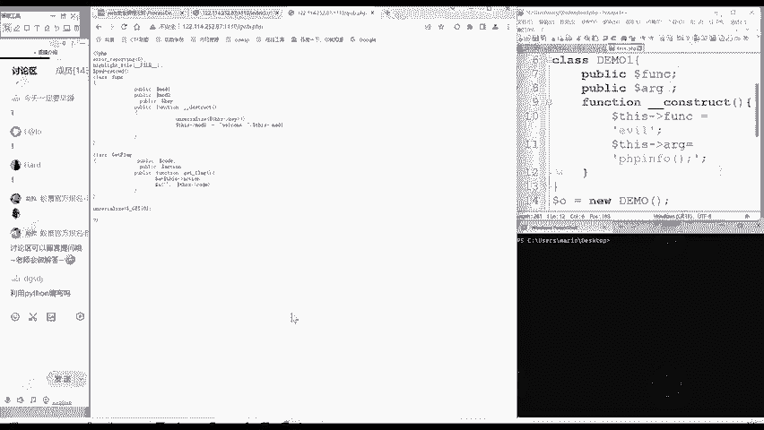

# 网络安全：P175：POP链（2）

在本节课中，我们将系统性地学习POP链的核心概念，理解其在反序列化漏洞利用中的作用。我们将通过一个具体的例子，清晰地展示如何从现有代码中构造调用链，最终实现攻击目的。

## 概述

POP是“面向属性编程”的英文缩写。POP链是指从现有的运行环境中寻找一系列代码或指令调用点，并根据需求构造出一组连续的调用链。

上一节我们通过一个实例接触了反序列化利用。本节中，我们来看看其背后的核心理论——POP链。

## POP链的含义与作用

反序列化漏洞利用的核心，就是要找到合适的POP链。我们可以回顾昨天的题目，它就是一个反序列化利用链。

通过用GET方法传递序列化数据，然后触发反序列化。反序列化之后，程序会自动调用`__destruct`魔术方法。

## 构造调用链的过程

以下是POP链的构造过程，它通过一系列代码或指令的调用来实现攻击目的。

1.  反序列化触发点：程序对传入的数据进行反序列化操作。
2.  自动调用魔术方法：反序列化会触发对象的`__destruct`或`__wakeup`等方法。
3.  利用属性特性跳转：在`__destruct`方法中，通过访问对象的某个属性（例如 `$this->a`），可以触发该属性所属对象的`__get`魔术方法。
4.  链式调用至目标方法：在`__get`方法中，可以进一步调用其他方法，最终指向目标函数（例如`getflag`方法）。

一系列代码或指令调用，从`__destruct`开始，再通过这里的属性特性，调用到下面的`__get`方法，最终抵达`getflag`方法。

## 核心总结

这就是通过寻找并串联一系列代码或指令调用点（即POP链），来实现反序列化漏洞利用的目的。

本节课中，我们一起学习了POP链的系统理论。反序列化利用的关键，就在于寻找这样一条能够从触发点连贯执行到目标函数的POP链。理解这个过程，对于分析和利用反序列化漏洞至关重要。