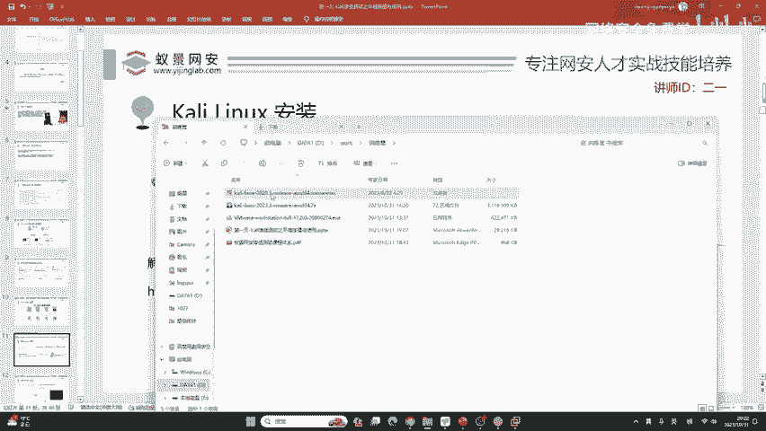
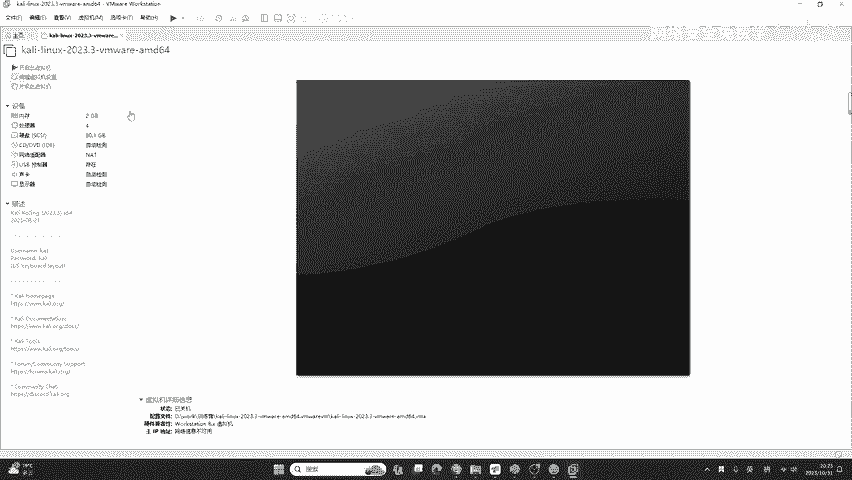
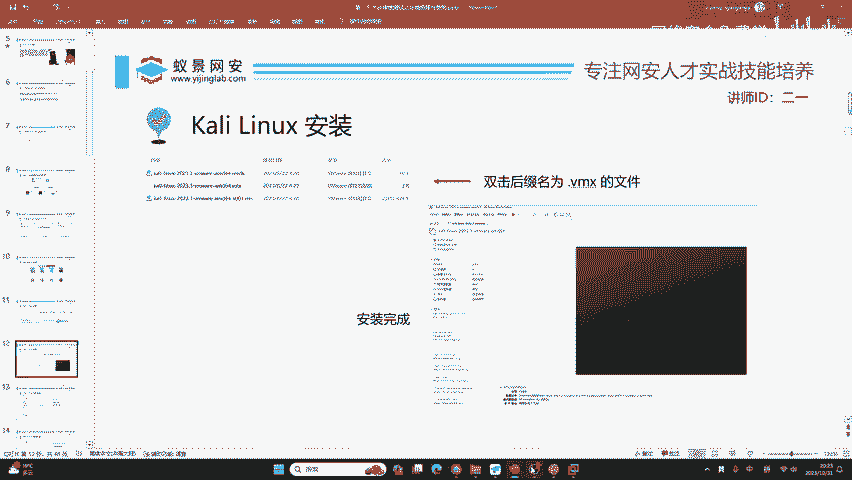
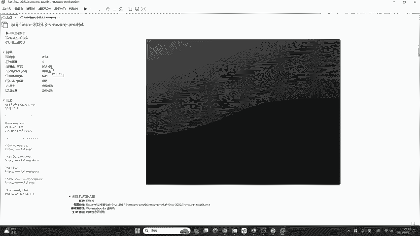
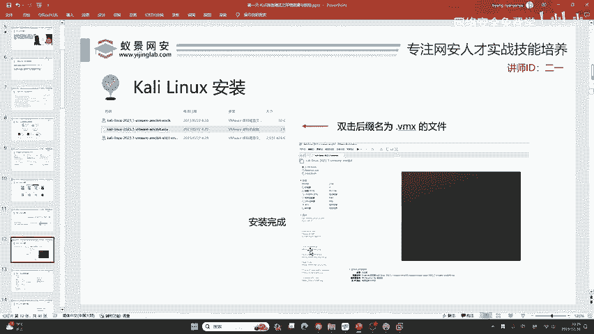

# 网络安全入门：P17：Kali Linux安装指南 🚀

在本节课中，我们将学习如何下载、解压并配置Kali Linux虚拟机，这是学习网络安全和渗透测试的第一步。整个过程将尽可能简单明了，确保初学者能够顺利上手。

## 虚拟机版本选择

上一节我们提到了Kali Linux的重要性，本节中我们来看看如何获取它。在Kali Linux官网的虚拟机下载页面，提供了四种不同的版本以适应不同的虚拟化环境。

以下是各个版本的简要介绍：
*   **VMware (VMX)**：这是我们今天将使用的版本。它对新手最为友好，但VMware Workstation本身是商业软件（非免费）。课程资料中提供了激活密钥。
*   **VirtualBox (VBOX)**：这是一个免费且开源的虚拟机软件，是VMware的一个优秀替代品。
*   **Hyper-V (VHDX)**：这是Windows操作系统自带的CPU虚拟化技术。例如，从微软商店安装的Kali Linux或Windows子系统Linux(WSL)都基于此技术。
*   **QEMU (QCOW2)**：这是一个被广泛用于各种虚拟化设备的虚拟机模拟程序。

为了照顾大多数初学者，本教程将使用VMware版本进行讲解。

## 解压虚拟机文件

如果你从课程资料中下载了Kali Linux，你会得到一个`.7z`格式的压缩包。在运行之前，必须先将其解压。

这里有一个关键点：Windows系统自带的解压功能可能无法很好地处理某些压缩格式。因此，建议安装一个第三方解压软件。

以下是推荐的解压软件选项：
*   **Bandizip**：一款免费且好用的解压软件。
*   **7-Zip**：一款经典、免费且开源的压缩软件。
*   **WinRAR**：功能强大，但有广告或需要购买。

> **注意**：一些国内软件（如360压缩、2345压缩等）可能包含较多广告或捆绑安装，请谨慎选择。

解压过程非常简单：右键点击`.7z`文件，选择“解压到当前文件夹”即可。

## 导入与启动虚拟机

完成上一步的解压后，你会在文件夹中看到一个以`.vmx`结尾的虚拟机配置文件。

在确保你已经安装好VMware Workstation的前提下，只需**双击**这个`.vmx`文件。VMware会自动将其导入并启动，你无需经历复杂的安装和配置等待过程。

> 双击`.vmx`文件是导入虚拟机的关键步骤。

## 虚拟机基础配置

成功导入Kali Linux仅仅是第一步。接下来，我们需要对其进行一些基础配置，使其成为一台高效、易用的Linux学习环境。许多初学者常对以下设置感到困惑。

以下是Kali Linux虚拟机推荐的初始配置参数：
*   **内存**：建议分配 **4GB (4096 MB)** 或以上。如果主机内存充足，分配8GB会获得更流畅的体验。
*   **处理器**：建议分配 **2个CPU核心**。这能保证系统有足够的计算资源运行各种安全工具。
*   **默认密码**：Kali Linux虚拟机的默认登录凭证为：
    *   用户名：`kali`
    *   密码：`kali`

你可以通过点击VMware菜单栏的“虚拟机” -> “设置”来调整内存和处理器配置。

---

本节课中，我们一起学习了如何获取Kali Linux虚拟机、使用第三方软件解压压缩包、通过双击`.vmx`文件快速导入虚拟机，并了解了推荐的基础硬件配置和默认登录信息。现在，你已经拥有了一个可以随时启动和使用的Kali Linux渗透测试环境，为后续的网络安全学习打下了坚实的基础。