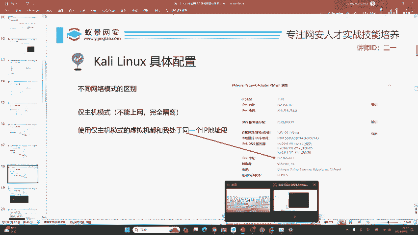
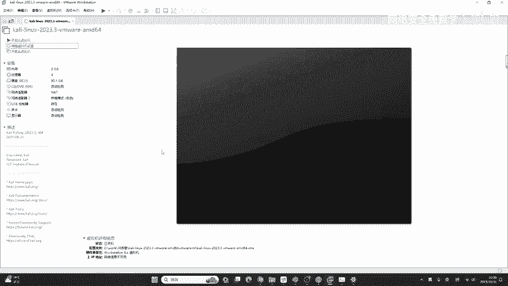
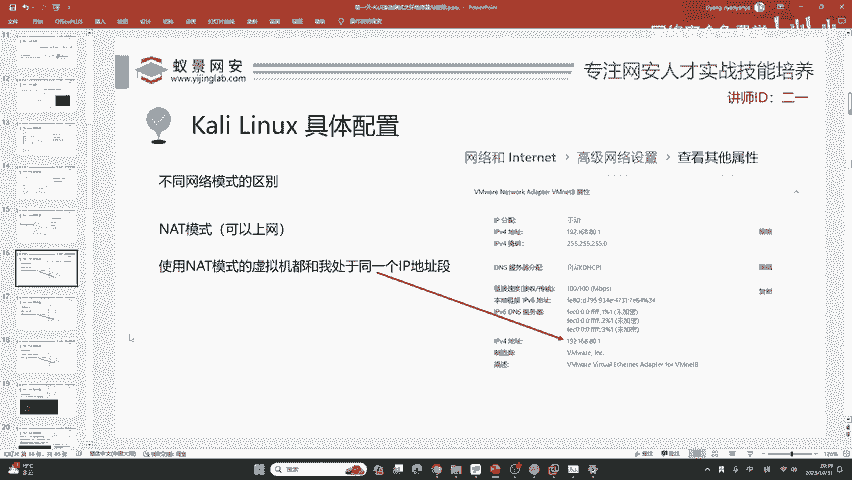
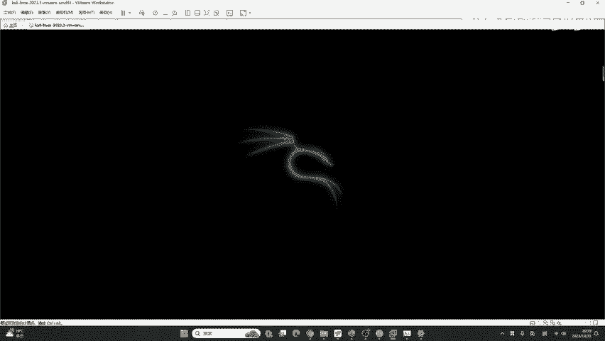
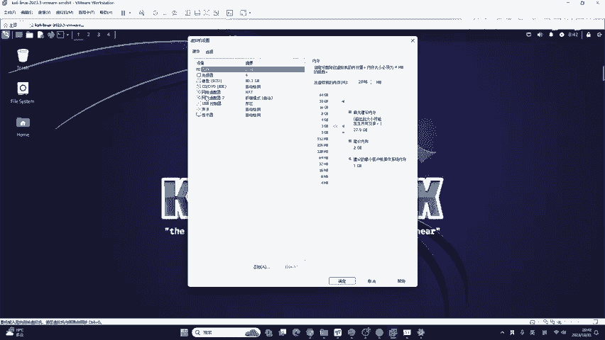
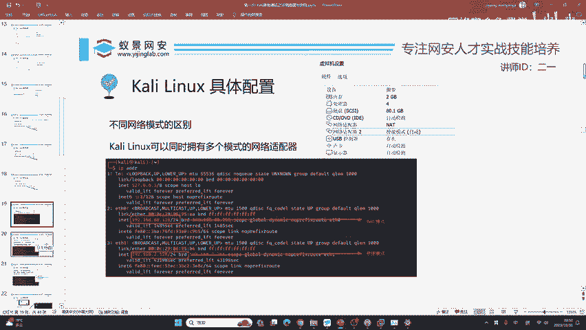

# Kali Linux 配置教程：P18：Kali Linux 具体配置 🛠️

在本节课中，我们将学习如何配置 Kali Linux 虚拟机，特别是网络适配器的三种核心模式。掌握这些知识，不仅能让你顺利配置 Kali，还能举一反三，应用到其他虚拟化平台中。

## 概述
首先，Kali Linux 虚拟机的默认用户名和密码均为 `kali`。网络及硬件配置是本节的重点，其原理适用于所有虚拟机环境，包括 OpenStack、PVE 等高级虚拟化平台。

## 硬件资源配置 💻
以下是虚拟机硬件配置的建议。

**内存配置**：
*   默认内存为 2GB。如果仅使用 Kali 内置工具且不安装额外软件，2GB 足够。
*   如果需要更新工具、进行内网渗透、预渗透或免杀测试，建议设置为 4GB。

**处理器配置**：
*   默认 4 核处理器足够使用。
*   如果不清楚自己电脑的配置，可以打开任务管理器查看。例如，在“性能”选项卡中，CPU 图表显示的波形数量代表逻辑处理器核心数。

## 网络适配器模式详解 🌐
上一节我们介绍了硬件配置，本节中我们来看看网络配置。网络适配器默认模式为 NAT。有同学问，如果想用 Kali 与其他设备（如室友的电脑）进行交互，或搭建钓鱼网站让同学测试，仅用 NAT 模式可行吗？答案是不可行。为了掌握不同场景下的网络配置，我们需要理解以下三种模式。

在 VMware 中，网络适配器共有三种模式：NAT 模式、桥接模式以及仅主机模式。本节课将帮助你从根本上理解它们的区别。

### 1. NAT 模式
首先，我们来了解默认的 NAT 模式。安装虚拟机后，你的物理机（真实电脑）上会虚拟出两张网卡：`VMnet1` 和 `VMnet8`。我们主要关注 `VMnet8`。

查看 `VMnet8` 的属性，其 IPv4 地址（例如 `192.168.80.1`）是关键。**当虚拟机使用 NAT 模式时，它的 IP 地址将与物理机 `VMnet8` 网卡处于同一网段**。例如，如果 `VMnet8` 的 IP 是 `192.168.80.1`，那么虚拟机的 IP 将是 `192.168.80.x`。NAT 模式下的虚拟机可以访问外网。

### 2. 桥接模式
接下来，我们看看桥接模式。桥接模式下的虚拟机也可以上网。其原理是：**虚拟机会与你的物理机当前使用的真实网卡（如连接的路由器无线网或有线网卡）处于同一 IP 地址段**。

例如，如果你的无线网 IP 是 `192.168.2.187`，那么使用桥接模式的虚拟机 IP 将是 `192.168.2.x`。可以理解为，桥接模式在虚拟机和你的家庭/宿舍路由器之间“搭了一座桥”。

### 3. 仅主机模式
最后是仅主机模式。这种模式对应物理机上的 `VMnet1` 虚拟网卡。**当虚拟机使用仅主机模式时，它的 IP 地址将与 `VMnet1` 网卡处于同一网段**。例如，如果 `VMnet1` 的 IP 是 `192.168.44.1`，那么虚拟机的 IP 将是 `192.168.44.x`。此模式通常用于虚拟机与物理机之间的封闭网络通信。

> **核心概念总结**：
> *   **NAT 模式**：虚拟机 IP 与 `VMnet8` 同网段。
> *   **桥接模式**：虚拟机 IP 与物理机真实网卡（连接的路由器）同网段。
> *   **仅主机模式**：虚拟机 IP 与 `VMnet1` 同网段。

这些模式的具体 IP 由 DHCP 自动分配，无需纠结最后一位数字。理解这三种对应关系，你就完全掌握了虚拟网络配置的核心。

## 多网卡配置与常见问题解决 🔧
理解了单一模式后，我们来看看更实用的多网卡配置。在 Kali 中，你可以添加多个网卡，例如同时使用 NAT 和桥接模式。但配置时常常会遇到问题，下面我们来彻底解决它。

### 如何添加第二张网卡
1.  点击“编辑虚拟机设置”。
2.  点击“添加”，选择“网络适配器”，完成添加。
3.  此时会出现两个适配器。将新添加的“网络适配器2”的模式改为“桥接模式”。
4.  注意：不建议勾选“复制物理网络连接状态”，这可能导致无法上网。

配置完成后启动 Kali，使用 `ip addr` 命令查看 IP 地址。你应该能看到两个 IP，分别对应 NAT 网段（如 `192.168.80.x`）和桥接网段（如 `192.168.2.x`）。

### 桥接模式无法上网的解决方案
桥接模式无法获取 IP 是初学者最常见的问题。其根本原因往往是 VMware 的桥接自动选择功能选错了物理网卡。

以下是解决步骤，能解决 90% 的问题：
1.  在 VMware 主界面，点击“编辑” -> “虚拟网络编辑器”。
2.  点击右下角“更改设置”获取管理员权限。
3.  在编辑器窗口中，找到类型为“桥接模式”的 `VMnet0`。
4.  在“桥接到”的下拉菜单中，**手动选择**你当前正在使用的物理网卡：
    *   如果使用**无线网**，选择带有“无线”或 “Wi-Fi”标识的网卡。
    *   如果使用**有线网**，通常选择 “Realtek” 开头的网卡。
    *   如果使用**外置 USB 网卡**，选择对应的品牌设备。
5.  点击“确定”保存，然后重启 Kali 虚拟机。

### 特殊网络环境说明
如果按照上述步骤操作后桥接依然无效，可能是由于网络环境限制：
*   **需要认证的网络**：如校园网、机场/火车站 Wi-Fi。这类网络**不支持**桥接模式，你只能使用 NAT 模式。
*   **特殊路由器**：某些安装了高级固件（如 OpenWRT、高恪）或支持游戏加速的路由器可能导致桥接异常。普通家用路由器（TP-Link、小米、华为等）通常无此问题。
*   **手机热点**：同样属于需要认证的网络，**不支持**桥接模式。

## 总结
本节课中，我们一起学习了 Kali Linux 的具体配置。
1.  我们了解了虚拟机内存和处理器的配置建议。
2.  我们深入剖析了网络适配器的三种核心模式：**NAT**、**桥接**和**仅主机**，并掌握了它们的对应关系。
3.  我们实践了为 Kali 配置多张网卡的方法。
4.  我们重点解决了桥接模式无法上网这一常见问题，并分析了特殊网络环境的限制。

掌握这些配置原理，你就能轻松驾驭 Kali Linux 的网络环境，为后续的渗透测试学习打下坚实基础。