# Kali Linux基础使用：P19：Kali Linux基础使用

## 概述

在本节课中，我们将学习Kali Linux操作系统的基础使用方法。课程将涵盖Kali的桌面环境、核心工具、软件管理、服务配置以及如何高效地学习和使用这个渗透测试专用系统。我们的目标是让初学者能够快速上手，并理解在网络安全领域如何有效利用Kali，避免在不必要的知识点上耗费精力。

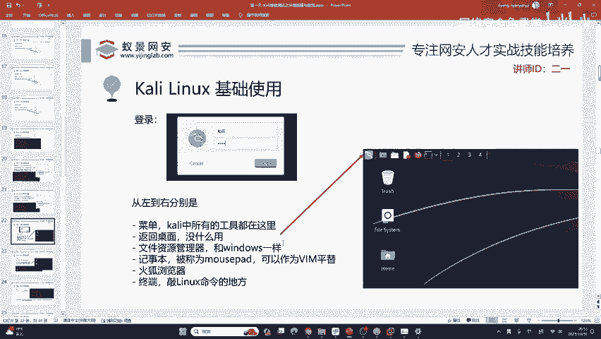

---

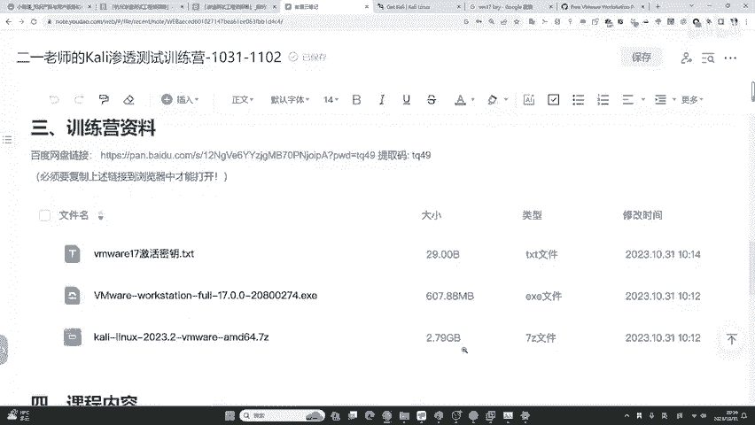

## 桌面环境与核心组件

上一节我们介绍了课程的整体目标，本节中我们来看看Kali Linux的桌面环境布局和核心组件。

Kali Linux的桌面顶部有一排图标，它们构成了系统的主要操作入口。

以下是这些图标的功能说明：

*   **菜单**：点击后可以展开Kali中预装的所有工具分类，例如信息收集、漏洞分析、Web应用分析、密码攻击等。如果遇到不认识的英文分类，使用翻译软件即可。
*   **显示桌面**：此功能用于快速返回桌面，清除所有窗口。
*   **文件资源管理器**：类似于Windows的资源管理器，用于浏览和管理系统文件。
*   **文本编辑器 (Mousepad)**：一个简单的图形化文本编辑器，可以作为Vim编辑器的替代品，对初学者更友好。
*   **火狐浏览器 (Firefox)**：用于浏览网页和进行Web渗透测试的浏览器。
*   **终端 (Terminal)**：执行Linux命令和运行命令行工具的核心区域。

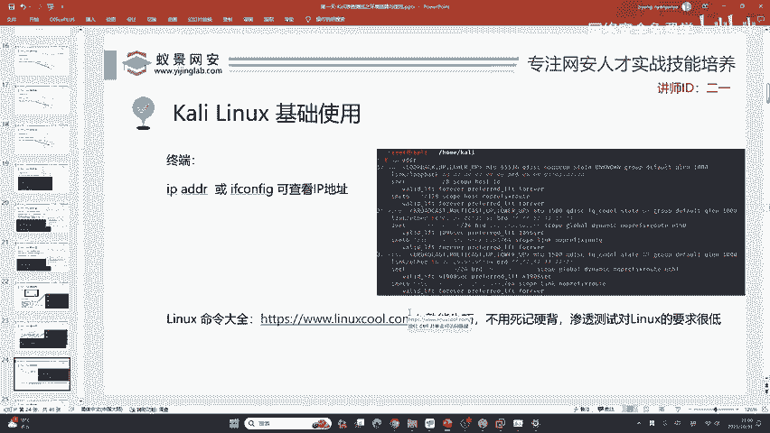

**核心概念：打开终端**
在桌面点击终端图标，或使用快捷键 `Ctrl + Alt + T` 即可打开终端。

---

## 终端基础与高效学习法

了解了桌面组件后，我们进入核心操作区域——终端。对于网络安全从业者而言，掌握终端的使用至关重要，但学习方法有讲究。

**核心概念：放大终端字体**
在终端中，按住 `Ctrl + Shift + +` 可以放大字体，方便阅读。

**核心概念：切换到root用户**
Kali默认不允许直接以root用户登录。为了获得最高权限进行操作，需要在终端中输入以下命令：
```bash
sudo su
```
然后输入默认密码 `kali`。输入密码时屏幕不会显示字符，这是Linux系统的正常设计，确保输入正确后按回车即可。成功切换后，命令提示符通常会变色（例如变为红色）。

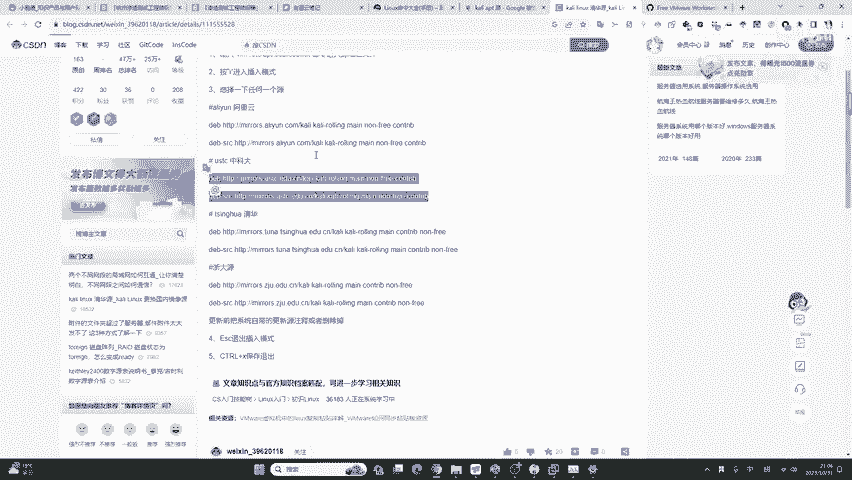

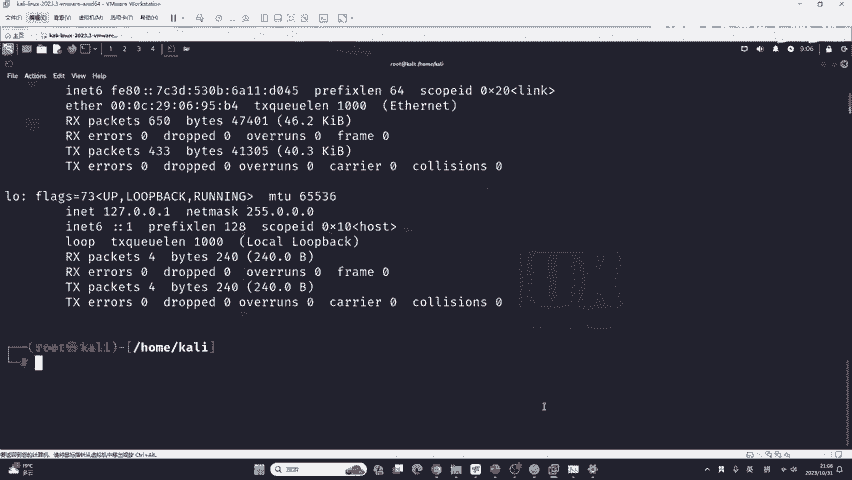

**核心概念：查看IP地址**
可以使用以下命令查看网络接口和IP地址：
```bash
ip addr
```
或者使用传统但Kali预装的命令：
```bash
ifconfig
```
在输出中，`inet` 后面跟随的地址就是IPv4地址。

**核心概念：Linux命令学习网站**
对于网络安全工作，无需死记硬背所有Linux命令。关键在于“熟能生巧”和“现学现用”。遇到不会的命令时，可以访问 **[Linux命令大全](https://www.linuxcool.com/)** 网站进行查询。该网站收录了绝大多数命令及其用法。

**注意**：`ip addr` 是Linux系统自带的命令，而 `ifconfig` 属于 `net-tools` 软件包。Kali作为集大成者，预装了这些工具以方便使用。

---

## 软件包管理：APT

上一节我们介绍了终端的基础操作，本节中我们来看看如何在Kali中安装和管理软件，这是扩展其功能的关键。

Kali使用 **APT** 作为软件包管理工具，其作用类似于手机的应用商店。由于Kali预装的工具可能无法满足所有需求，我们需要安装其他软件。第一步通常是“换源”，即将软件下载源从国外的官方源切换到国内的镜像源，以提升下载速度。

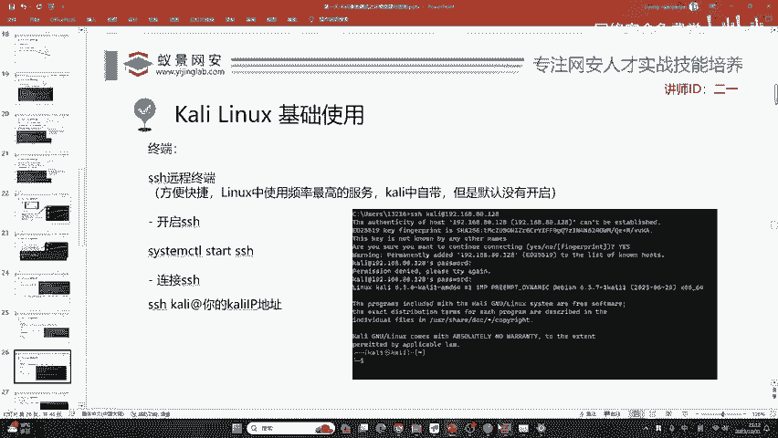

以下是使用阿里云镜像源替换默认源的步骤：

1.  使用文本编辑器打开APT的源列表配置文件：
    ```bash
    mousepad /etc/apt/sources.list
    ```
2.  删除文件内所有原有的内容。
3.  将以下阿里云的镜像源地址粘贴进去：
    ```
    deb https://mirrors.aliyun.com/kali kali-rolling main non-free contrib
    deb-src https://mirrors.aliyun.com/kali kali-rolling main non-free contrib
    ```
4.  保存并关闭文件。

**核心概念：更新软件包列表**
换源后，需要更新本地的软件包列表，使其与新的镜像源同步：
```bash
sudo apt update
```
**重要提示**：请勿执行 `sudo apt upgrade` 命令，它会升级所有软件，可能导致系统依赖冲突，引发各种问题。

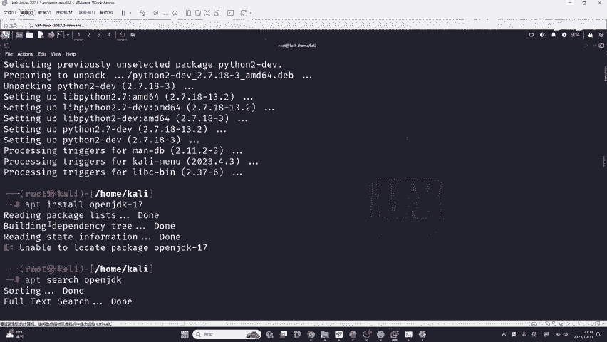

**核心概念：安装软件**
更新列表后，即可安装软件。语法为：
```bash
sudo apt install <软件包名>
```
例如，安装Python2开发工具包：
```bash
sudo apt install python2-dev
```
系统会提示确认，按回车继续即可自动完成下载、安装和配置。


**核心概念：搜索软件**
如果不确定软件包的确切名称，可以使用搜索功能：
```bash
sudo apt search <关键词>
```
例如，搜索OpenJDK：
```bash
sudo apt search openjdk
```

---

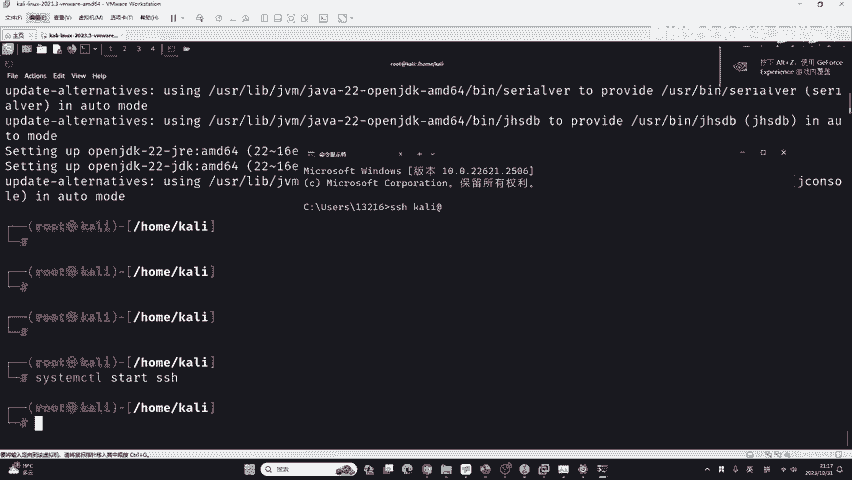

## 服务管理：以SSH为例

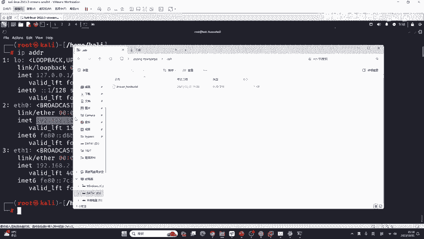

软件安装是基础，服务管理则是实际运维和渗透中经常接触的操作。本节我们以SSH服务为例，学习服务的启停。

SSH是Secure Shell的缩写，用于远程安全连接Linux服务器，是云时代使用频率最高的服务之一。Kali自带SSH服务，但默认没有开启。

**核心概念：启动SSH服务**
使用 `systemctl` 命令管理系统服务。启动SSH服务的命令是：
```bash
sudo systemctl start ssh
```
执行后若无报错，即表示服务已启动。

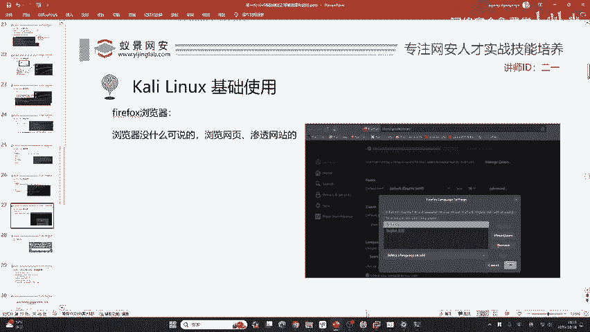

**核心概念：远程连接SSH**
在另一台机器（如你的Windows主机）上，打开命令提示符，使用以下命令连接Kali：
```bash
ssh kali@<你的Kali_IP地址>
```
例如：
```bash
ssh kali@192.168.1.100
```
首次连接时会询问是否信任主机指纹，输入 `yes` 继续。然后输入Kali的密码（`kali`），即可成功登录到远程终端。

---

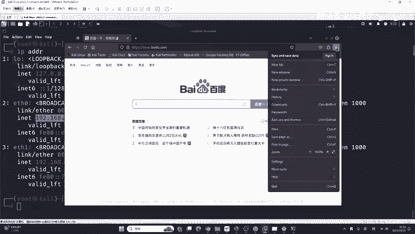

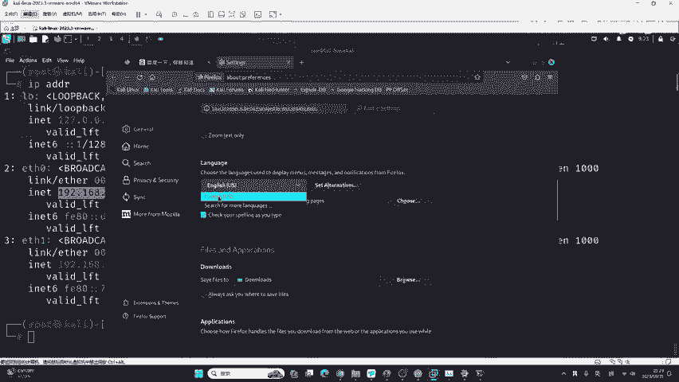

## 浏览器配置与官方工具库

最后，我们来看一个重要的应用——浏览器，并介绍如何利用Kali的官方资源。

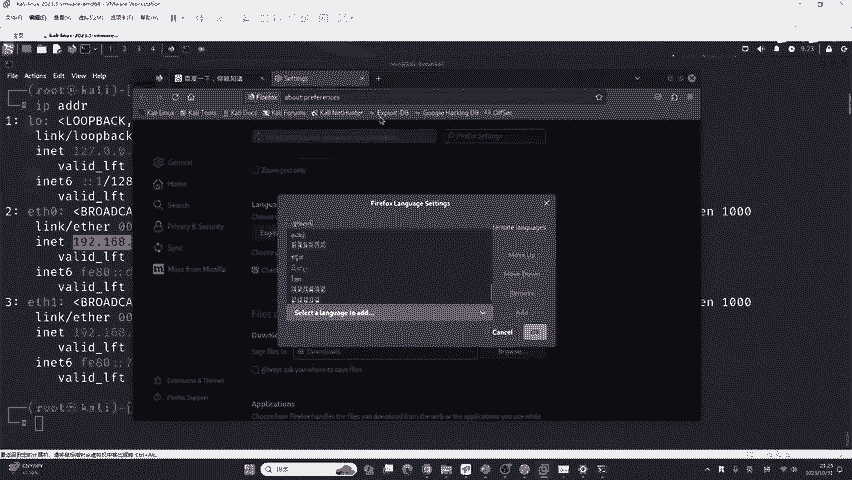

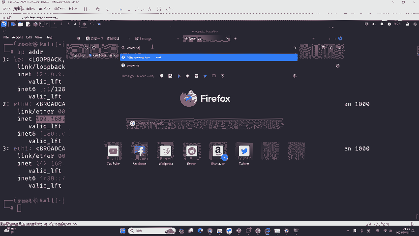

火狐浏览器是Kali的默认浏览器。有同学可能觉得英文界面不便，可以将其设置为中文。

以下是设置火狐浏览器为中文的步骤：

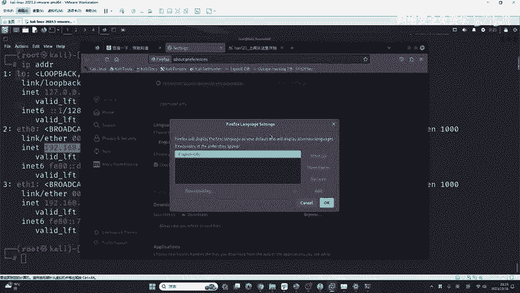

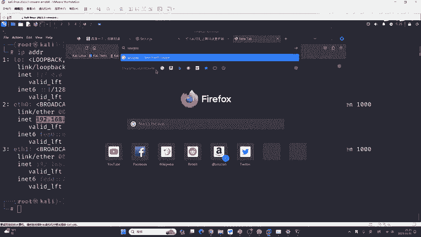

1.  打开火狐浏览器，点击右上角菜单，选择 **Settings**。
2.  在设置页面中，找到 **Language** 选项。
3.  点击 **Choose** 或 **Search for more languages**。
4.  在语言列表中，找到并添加 **简体中文**。
5.  将中文设为首选语言，重启浏览器后界面即变为中文。

**核心概念：Kali Tools 官方文档**
Kali Linux为所有预装工具维护了一个完整的在线文档库：**[Kali Tools](https://www.kali.org/tools/)**。
这个网站列出了每个工具的详细说明、用法示例和参数解释。当你不清楚某个工具如何使用时，可以在此网站搜索。例如，搜索 `nmap`，就能看到详细的用法介绍。如果英文阅读有困难，利用浏览器的网页翻译功能即可。

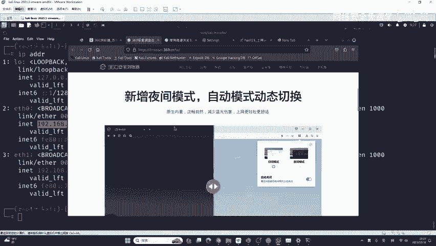

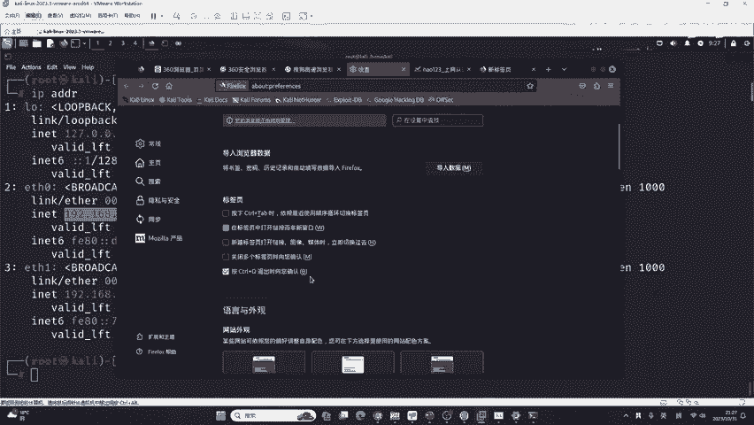

**重要提示**：无需试图掌握所有工具。应该根据实际渗透测试岗位的需求（如招聘要求中常提到的Nmap、Burp Suite等），有针对性地重点学习和练习相关工具。

---

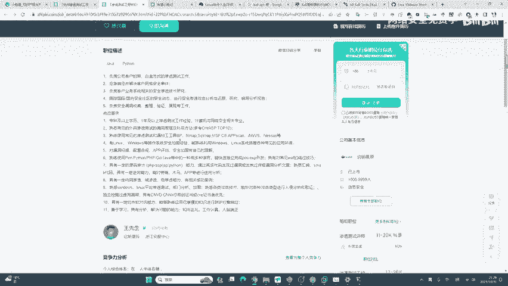

## 总结

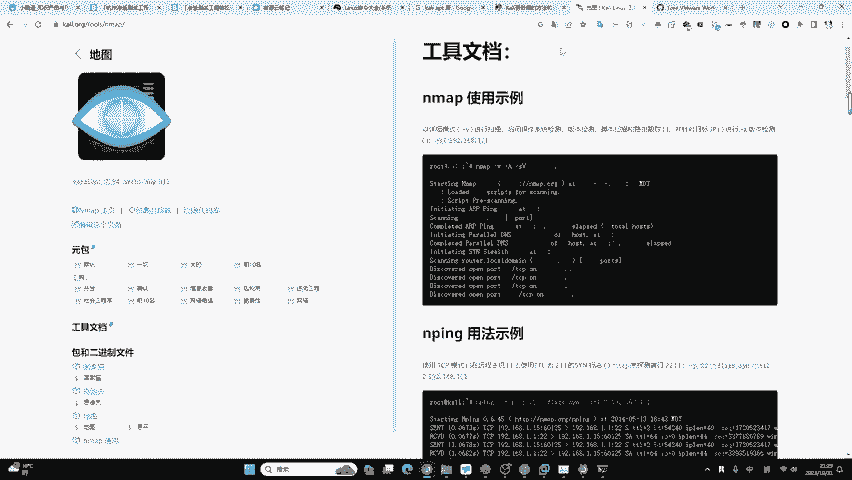

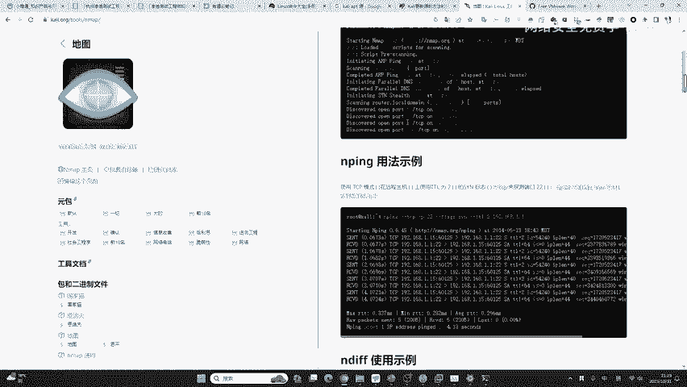

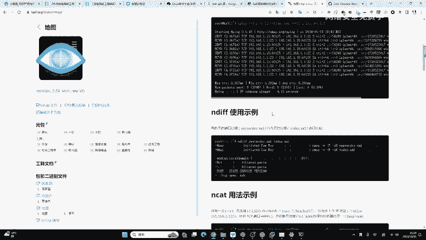

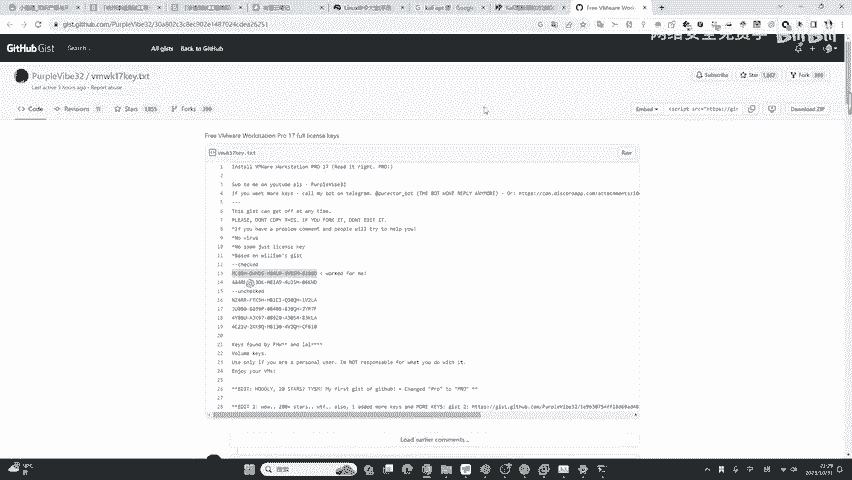

本节课中我们一起学习了Kali Linux的基础使用。我们从认识桌面环境开始，了解了终端的基本操作和高效学习Linux命令的方法。接着，我们掌握了使用APT软件包管理器进行换源、更新和安装软件的关键步骤。然后，以SSH服务为例，学习了Linux系统服务的管理。最后，我们配置了浏览器并介绍了Kali官方工具库这一宝贵的学习资源。

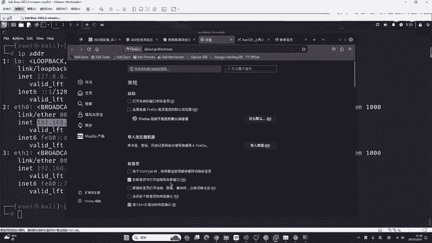

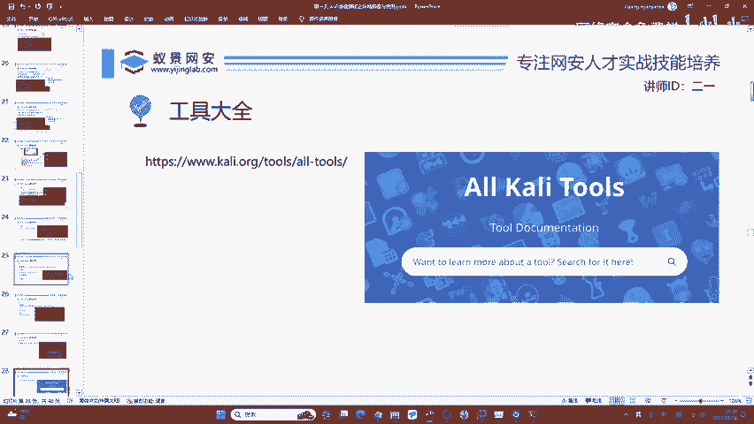

记住，对于网络安全学习者，使用Kali的重点在于“实用”和“聚焦”。不必纠结于成为Linux系统专家，而应将精力集中在与渗透测试、漏洞挖掘直接相关的工具和技能上，并善用搜索引擎和官方文档来解决具体问题。