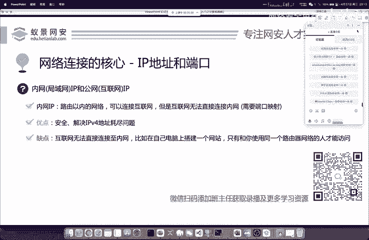
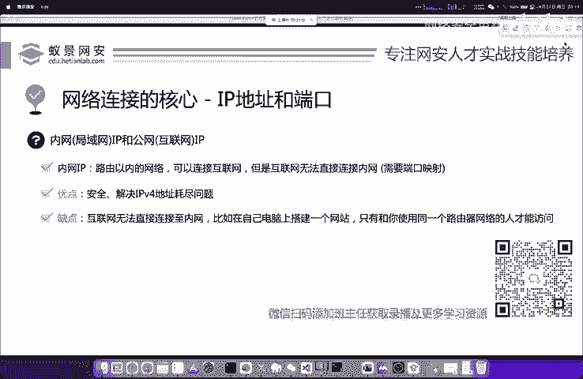
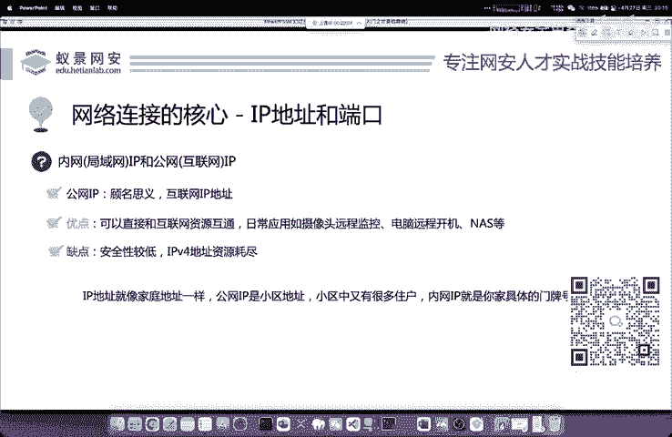
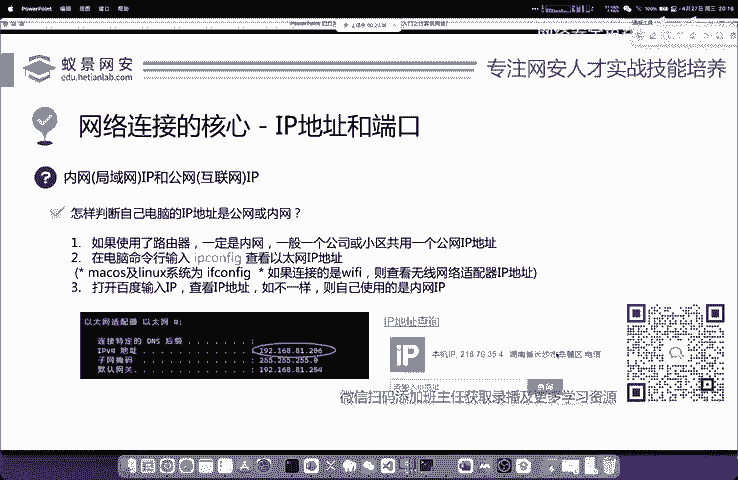

# 网络安全入门：P1：什么是IP地址

在本节课中，我们将要学习网络通信中最基础、最重要的概念之一：IP地址。理解IP地址是理解网络如何运作、如何进行网络渗透测试的第一步。

## 概述：网络通信的基础

上一节我们介绍了课程的整体框架，本节中我们来看看网络通信的基石。TCP和IP协议分别位于OSI模型的传输层和网络层，它们是网络通信的核心。我们常说的IP地址和端口，正是基于这两大协议。IP地址就是在互联网上标识每一台网络设备的唯一地址。

## IP地址的作用

IP地址是互联网上所有网络设备的唯一标识。它的核心功能是在互联网中定位计算机。

我们举一个形象的例子。假设张三想访问“核田晚安实验室”的网站。首先，张三必须知道“核田晚安实验室”服务器的IP地址。同样，当服务器返回学习资源时，也必须知道张三的IP地址。

这时你可能会想：我平常访问网站，输入的是域名（如 `www.baidu.com`），并不是IP地址。这涉及到了网络中的另一个重要协议：DNS（域名解析协议）。DNS的作用就是将我们容易记忆的域名，转换成服务器对应的IP地址，方便我们访问。其核心过程可以简化为：
```
域名 (如 www.baidu.com) --DNS解析--> IP地址 (如 14.215.177.39)
```
如果每次访问网站都需要输入一长串数字IP，将会非常不便且难以记忆。因此，DNS协议在TCP/IP架构中扮演了至关重要的角色。

## 内网IP与公网IP的区别



理解了IP地址的基本作用后，我们来看看一个对渗透测试至关重要的概念：内网IP和公网IP的区别。

首先，内网IP，顾名思义，是指内部网络（如家庭、公司内部）中使用的IP地址。当你通过路由器上网时，路由器会为你的电脑、手机分配一个内网IP（如 `192.168.1.100`）。整个内部网络通过路由器这一个出口，使用同一个公网IP去访问互联网。

公网IP则与内网IP完全相对，它是在互联网上全球唯一的地址。云服务器、部分企业网络或特殊宽带（如某些电信千兆宽带）会拥有独立的公网IP。



以下是两者的核心区别列表：
*   **可访问性**：拥有公网IP的设备，互联网上的其他设备可以直接访问它。而内网IP设备，互联网无法直接连接。
*   **稀缺性**：由于IPv4地址耗尽，普通家庭宽带通常不会分配独立的公网IP，整个小区或社区可能共享一个公网IP（即“大内网”）。
*   **应用场景**：搭建对外服务的网站、远程监控摄像头、自建游戏服务器让朋友联机等，都需要公网IP。若没有公网IP，则需要通过“端口映射”或“内网穿透”等技术来实现外部访问。

我们可以用一个形象的比喻来理解：**公网IP就像你所在的小区地址，而内网IP就像你家里的具体门牌号**。外卖员（互联网上的数据）需要先找到小区（公网IP），再根据门牌号（内网IP）才能把外卖（数据包）准确送到你手上。

## 如何查看自己的IP地址

了解概念后，我们来看看如何实际操作。判断自己使用的是内网IP还是公网IP非常简单。





你只需要打开电脑的命令提示符（Windows）或终端（Linux/macOS），输入以下命令：
```bash
ipconfig  # Windows 系统
ifconfig  # 或 ip addr # Linux/macOS 系统
```
在命令输出中，找到“以太网适配器”或“无线局域网适配器”下的 `IPv4 地址`，这就是你的**内网IP**。

同时，你可以打开浏览器，访问百度并搜索“IP”。百度显示的IP地址就是你的**公网IP**。

比较这两个IP地址：
*   如果它们**不相同**，说明你正处于内网中（这是最常见的情况）。
*   如果它们**相同**，则说明你拥有独立的公网IP。

## 总结

本节课中我们一起学习了网络基础的核心——IP地址。我们明确了IP地址作为网络设备唯一标识的核心作用，并通过DNS协议理解了域名与IP的转换关系。更重要的是，我们深入区分了内网IP与公网IP的概念、区别及实际意义，并学会了如何查看自己的IP地址。理解这些是后续学习网络扫描、漏洞探测和内网渗透等技术的重要基础。