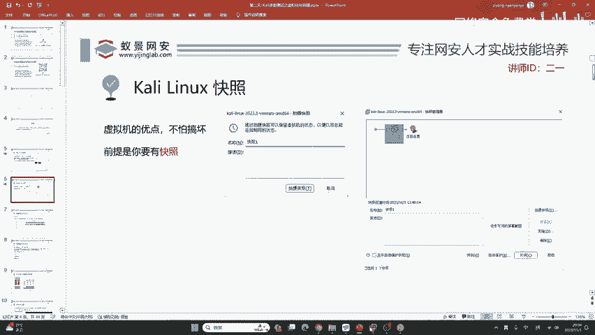
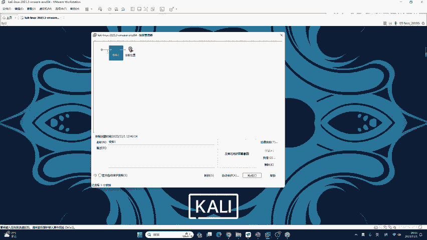
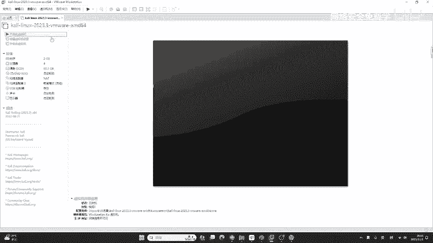
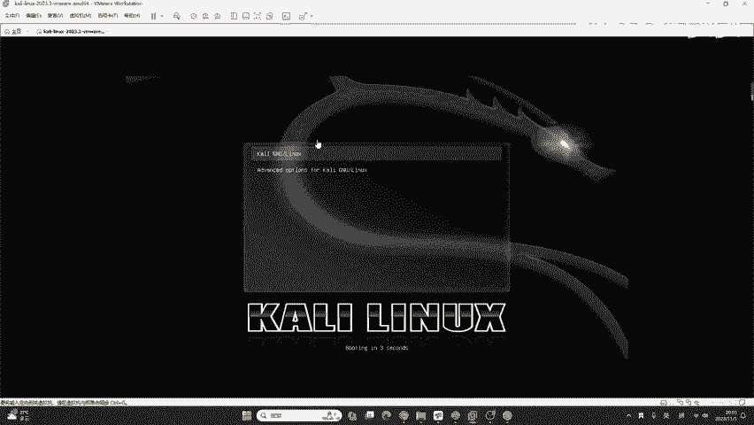
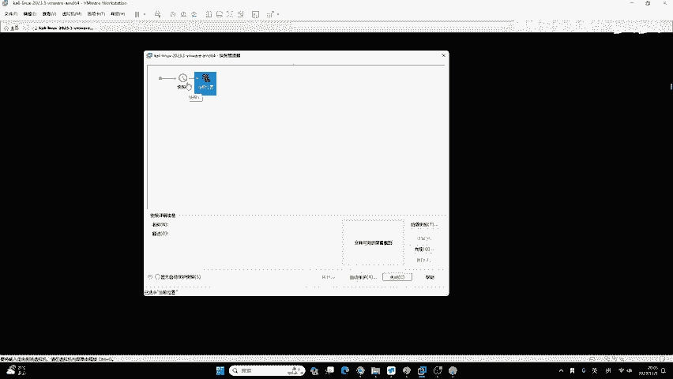
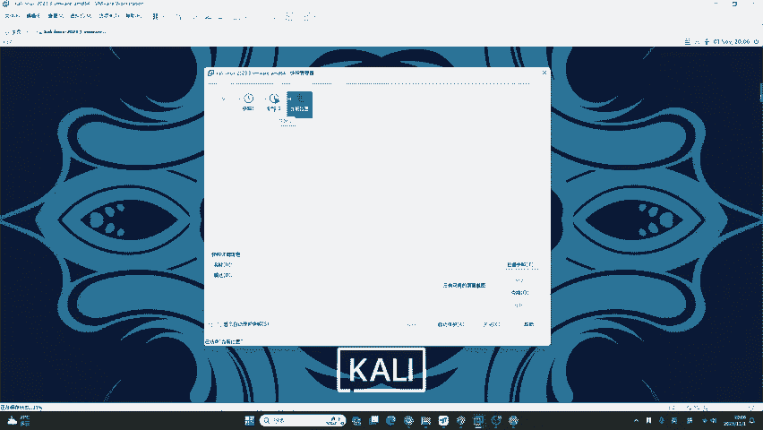

# Kali Linux 教程：P20：Kali Linux 快照

在本节课中，我们将要学习虚拟机快照功能。快照是虚拟机管理中的一个核心概念，它能帮助我们轻松地将系统恢复到某个特定时间点的状态，这对于学习和实验至关重要，尤其是在进行可能破坏系统的操作之前。

## 概述

在开始使用容器之前，我们必须了解VMware Workstation的快照功能。快照本质上是一个系统的还原点，其作用类似于系统还原。我们可以利用它将虚拟机恢复到创建快照时的状态。不仅VMware支持快照，其他所有虚拟化平台，包括大家未来工作中可能接触到的商用虚拟化平台，都具备类似的功能。

## 快照功能简介

快照功能非常简单，其核心作用是**系统还原**。我们可以把虚拟机恢复到快照创建时的状态。这不仅限于VMware，其他虚拟化平台如Parallels Desktop也支持此功能。

以下是常见的支持快照的虚拟化平台示例：
*   **VMware Workstation**
*   **Parallels Desktop**

## 快照的重要性

虚拟机的优点在于你不必害怕将其“搞坏”。因为只要你提前拍摄了快照，如果不小心配置错误或破坏了系统，只需恢复快照即可。但前提是**你必须预先创建快照**，虚拟机默认不会自动创建任何快照。

## 如何恢复快照

上一节我们介绍了快照的概念和重要性，本节中我们来看看如何实际操作。首先，我们演示如何恢复一个已存在的快照。

例如，在VMware中管理名为“Kali Linux 2023”的虚拟机，点击“管理此虚拟机的快照”按钮。打开快照管理器后，可以看到之前创建的快照（例如“快照一”）。选中目标快照，点击“转到”按钮，虚拟机便会开始恢复到该快照所记录的状态。

恢复过程需要稍等片刻。完成后，虚拟机就回到了拍摄“快照一”时的状态。这个演示说明，恢复操作的前提是**存在可用的快照**。

## 如何创建快照

既然恢复快照需要预先创建，那么接下来我们学习如何为Kali Linux虚拟机拍摄快照。

以下是创建快照的步骤：
1.  在VMware中，进入虚拟机的“快照”菜单。
2.  选择“拍摄快照”。
3.  在弹出的窗口中，为快照设置一个清晰的名称（例如“快照2”）并添加备注，以便日后识别。
4.  点击“拍摄快照”按钮开始创建。

快照的创建速度会显示在VMware窗口的左下角。根据硬盘的读写速度，整个过程通常需要几分钟。创建完成后，你就拥有了一个系统还原点。

## 快照的实际应用

在今天的课程或今后的实验中，如果你不小心破坏了Kali Linux系统，就可以立即恢复到上课前或实验前拍摄的快照。这避免了重新安装系统、重复配置APT源、启动SSH服务等一系列繁琐操作，极大地提升了学习效率。

## 总结

本节课中我们一起学习了Kali Linux虚拟机的快照功能。我们了解了快照作为**系统还原点**的核心价值，掌握了如何**创建**和**恢复**快照。记住，养成在关键操作前拍摄快照的习惯，能让你在网络安全学习和实验过程中更加从容，不怕犯错。