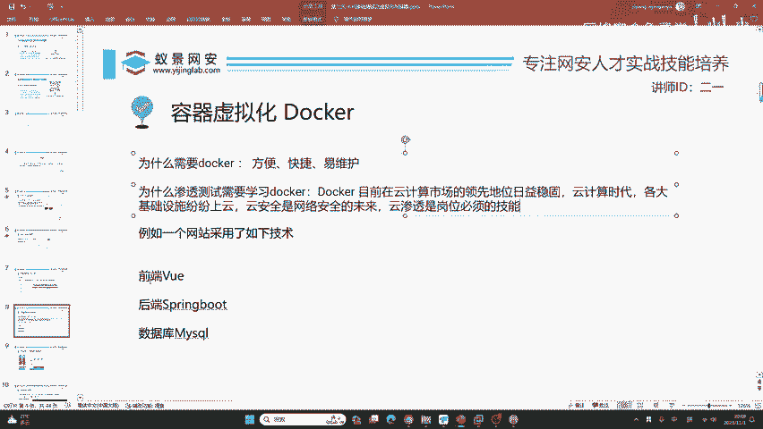
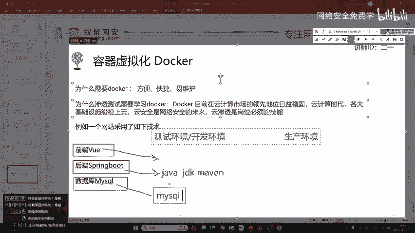
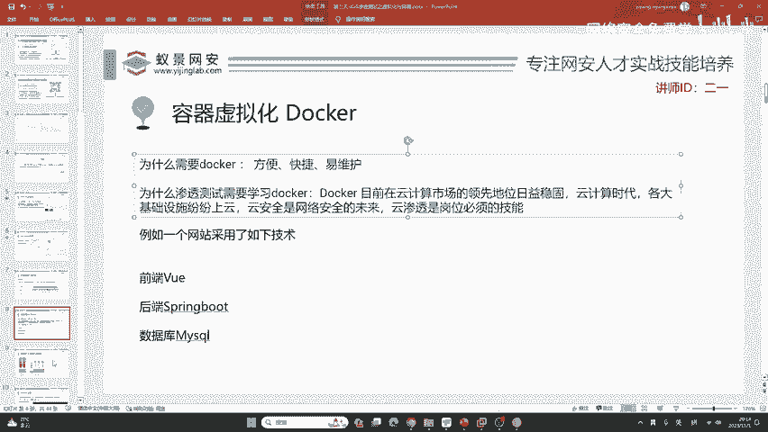

# 网络安全入门：P21：容器虚拟化Docker 🐳

在本节课中，我们将要学习容器虚拟化技术Docker。我们将了解Docker是什么，为什么它对IT工作者和网络安全从业者至关重要，以及它如何通过简化环境配置来提升效率。

## Docker是什么？

我们开始讲解容器虚拟化Docker。在安装Docker之前，必须清楚Docker是什么。

Docker是一个开源的应用容器引擎。它是一个用于构建、传送和运行应用程序的平台。这个定义直接翻译自Docker官方网站。

例如，在Docker官网上，对它的解释可以概括为三个核心动作：**构建**、**传送**和**运行**。它构建、传送和运行的对象是应用程序。各种各样的应用、开发程序和环境都可以使用Docker轻松搭建。

## 为什么要学习Docker？

上一节我们介绍了Docker的定义，本节中我们来看看学习Docker的必要性。

作为一个IT工作者，学习Docker有三个主要原因：**方便**、**快捷**和**易维护**。

那么，为什么在渗透测试的课程中要学习Docker呢？你需要知道学习这个东西的用途，才能提高兴趣并坚持下去。

首先，Docker目前在云计算市场的领先地位日益稳固。现在已经进入了云计算时代。你可以看到阿里云、腾讯云、华为云，以及国外的谷歌云、亚马逊云都在蓬勃发展。各大基础设施也纷纷上云。例如，银行会上金融云，党政事业机关和国企会上政务云，大学网站会上教育云。

**云安全是网络安全的未来，云渗透是现在岗位必须掌握的技能**。如果你想成为一名高级的渗透测试工程师，掌握云渗透的要求非常重要。因此，Docker是你必须掌握并精通的一道门槛。

## Docker为何方便快捷？

了解了学习Docker的重要性后，我们来看看它如何体现方便和快捷的特性。

想象一个网站的开发场景。很多同学是计算机相关专业的。如果你不熟悉这些名词，我现在来做解释。

正常的网站开发可能会使用以下三种技术：
*   **前端框架**：Vue
*   **后端框架**：Spring Boot
*   **数据库**：MySQL

这三种技术共同形成一个高交互式的网站。

在正常的公司里，通常需要维护两套环境：**测试环境（或开发环境）**和**生产环境**。

以下是具体的工作流程：

**1. 传统环境搭建的复杂性**

在测试环境中，搭建工作非常复杂：
*   首先需要为Vue框架搭建技术依赖，例如安装Node.js、NPM，配置Vue的特定版本。这个过程繁琐，不同版本间可能存在兼容性问题，导致运行效率低或出现Bug。
*   其次，需要为Spring Boot（一个基于Java的流行框架）配置后端环境。这包括安装适当版本的JDK（Java开发工具包）、Maven以及Spring Boot本身。这个过程同样耗时且麻烦。
*   最后，还需要配置MySQL数据库。数据库的配置更加复杂，通常有专门的数据库管理员（DBA）岗位来负责其安装、配置和安全性维护，耗费大量人力资源。

以上仅仅是测试环境。当需要搭建面向客户的**生产环境**时，需要将上述所有步骤重复一遍，并且额外考虑安全性问题。这导致整个配置过程极其繁琐、耗时，且调试困难。

**2. Docker带来的变革**

Docker应运而生，解决了上述问题。

如果使用Docker来搭建同样的网站：
*   前端的Vue应用可以打包成一个Docker容器来运行。
*   后端的Spring Boot应用也可以打包成一个Docker容器。
*   数据库MySQL同样可以打包成一个Docker容器。

我们只需要搭建这三个Docker容器，并将它们组合在一起，就能快速形成测试和开发环境。Docker容器非常安全且相互隔离，类似于虚拟机。

当需要部署生产环境时，我们只需将打包好的Docker容器复制一份即可，无需重复复杂的配置过程，也无需过度担忧环境差异带来的安全问题。

**总结**：一个公司想搭建一个网站，使用Docker可以将搭建时间从几天缩短到几分钟，并且更加安全可靠。

---

**本节课中我们一起学习了**：Docker作为容器引擎的基本概念，它在云计算和云安全时代对IT及网络安全从业者的重要性，以及它如何通过容器化技术极大地简化了应用程序环境的构建、部署和维护流程，实现了方便、快捷和易维护的目标。