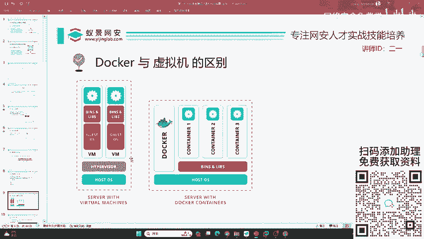
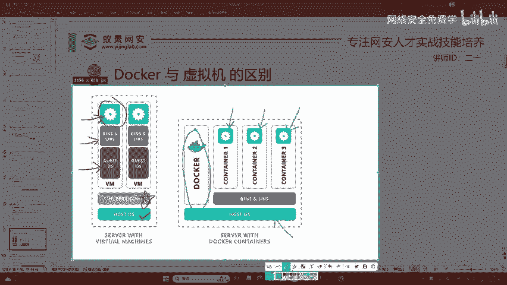

# 网络安全入门：P22：Docker与虚拟机的区别 🐳🆚🖥️

在本节课中，我们将要学习Docker容器技术与传统虚拟机（VM）的核心区别。理解这两者的差异，有助于我们明白为何在渗透测试或安全研究环境中，Docker正成为一种更受欢迎的选择。

---

## 概述

Docker以其便捷性著称，但它与我们熟悉的虚拟机究竟有何不同？我们为何倾向于在Kali Linux等环境中使用Docker，而不是直接安装在Windows或macOS等宿主机上？本节内容将解答这些问题。

---

## Docker与虚拟机的核心区别

Docker和虚拟机在实现“隔离化运行环境”这一目标上非常相似，但它们的架构和实现方式有本质不同。下图清晰地展示了这种区别。

上一节我们提到了Docker的便捷性，本节中我们来看看它在技术架构上是如何实现这种高效的。

### 虚拟机架构剖析

虚拟机，常缩写为VM（Virtual Machine）。其架构如左图所示。

*   **宿主机操作系统**：即`Host OS`，是我们真实的物理电脑运行的系统。
*   **虚拟化层**：在宿主机上需要安装一个虚拟化服务，例如`Hyper-V`（Windows）或`VMware`。现代CPU普遍支持硬件虚拟化技术，这使得虚拟机的运行成为可能。
*   **客户机操作系统**：在虚拟化层之上，每个虚拟机都拥有自己**完整**的操作系统内核，例如独立的Kali Linux、Ubuntu或Windows。
*   **系统环境与驱动**：在每个客户机操作系统中，还需要安装其运行所需的库文件、驱动等。例如，若想在虚拟机中流畅运行游戏，就必须为其安装专用的显卡驱动。
*   **应用程序**：最后，才是用户实际需要运行的软件或游戏。

你可以看到，应用程序如同被层层包裹。这种“套娃”式的结构导致了资源占用大、启动慢，并可能产生一定的性能损耗。当然，虚拟机的优势在于**完全隔离**，安全性极高。

### Docker架构剖析

接下来我们看今天的主角Docker，其架构如右图所示。

*   **宿主机操作系统**：同样是`Host OS`，例如Windows 11或macOS。
*   **Docker引擎**：我们直接在宿主机上安装Docker服务，它替代了虚拟机的`Hypervisor`层。
*   **容器化应用**：Docker引擎可以启动多个独立的容器，每个容器承载一个应用进程，例如一个Nginx Web服务器、一个MySQL数据库或一个Spring Boot后端应用。
*   **共享内核与精简依赖**：所有容器**共享宿主机的操作系统内核**。每个容器只需包含应用运行所必需的库文件和依赖（`libs`），而无需包含完整的操作系统。

通过对比两张图，我们可以清晰地发现Docker精简了以下部分：
1.  无需独立的虚拟化层（`Hypervisor`）。
2.  无需为每个环境安装完整的客户机操作系统。

这两个部分正是占用大量磁盘空间和系统资源的元凶。Docker的这种设计带来了显著优势：它直接共享宿主机的硬件资源（如CPU、内存、网络、显卡），无需在容器内重复安装驱动，因此**运行效率极高，几乎没有性能折损**。

---

## 关键区别总结

以下是Docker与虚拟机主要差异的对比列表：

*   **启动速度**
    *   **虚拟机**：慢，需要启动完整的操作系统。
    *   **Docker**：快，秒级启动，直接运行应用进程。
*   **性能与资源占用**
    *   **虚拟机**：占用资源多（CPU、内存、磁盘），存在一定性能开销。
    *   **Docker**：占用资源少，接近原生性能。
*   **隔离性**
    *   **虚拟机**：强，操作系统级别的完全隔离。
    *   **Docker**：进程级别的隔离，通过命名空间和控制组实现，安全性足够应对大多数场景。
*   **系统要求**
    *   **虚拟机**：需要CPU支持虚拟化技术，并安装庞大的虚拟化软件。
    *   **Docker**：主要依赖宿主机内核特性，部署更轻量。
*   **镜像体积**
    *   **虚拟机**：庞大，通常以GB为单位（包含整个操作系统）。
    *   **Docker**：小巧，通常以MB为单位（仅包含应用及依赖）。
*   **部署与迁移**
    *   **虚拟机**：迁移整个虚拟机文件（如`.vmdk`），笨重。
    *   **Docker**：通过`Dockerfile`定义环境，构建成镜像，迁移和分发极其方便。

---

## 为何在安全领域使用Docker？

理解了上述区别，就很容易明白Docker在网络安全领域的优势：
1.  **快速搭建靶场环境**：可以快速拉取并运行一个包含漏洞的Web应用（如DVWA）容器，无需配置复杂的虚拟机。
2.  **工具链管理**：每个安全工具（如sqlmap、nmap）可以封装在独立的容器中，避免版本冲突和依赖问题。
3.  **环境一致性**：确保在开发、测试、演示时环境完全一致，避免“在我机器上能运行”的问题。
4.  **资源高效**：在个人电脑上同时运行多个工具环境，Docker比开多个虚拟机更节省资源。

---

## 本节课总结

本节课中，我们一起学习了Docker容器技术与传统虚拟机的核心区别。我们剖析了二者的架构，明确了Docker通过**共享宿主机内核**和**仅打包应用依赖**的方式，实现了轻量、高效和便捷的部署。对于网络安全学习和实践而言，Docker是快速构建、管理和复现实验环境的利器。在接下来的课程中，我们将开始动手实践，安装并运行我们的第一个Docker容器。