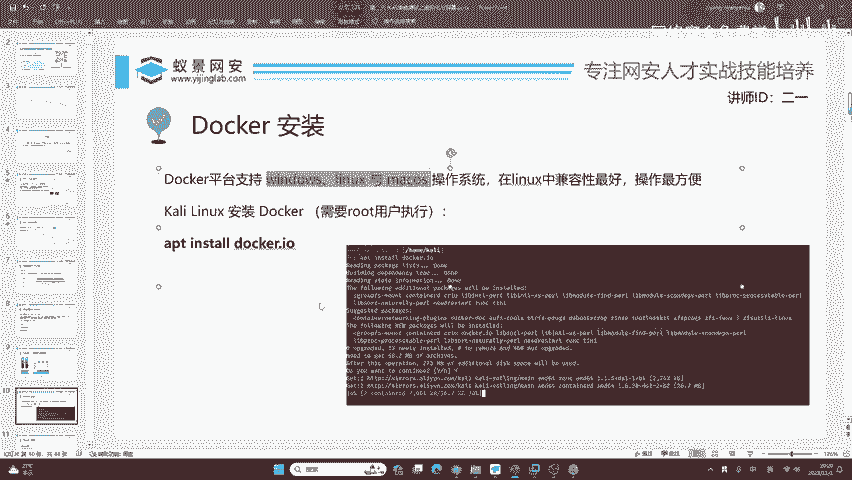
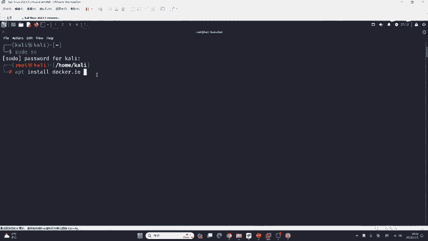
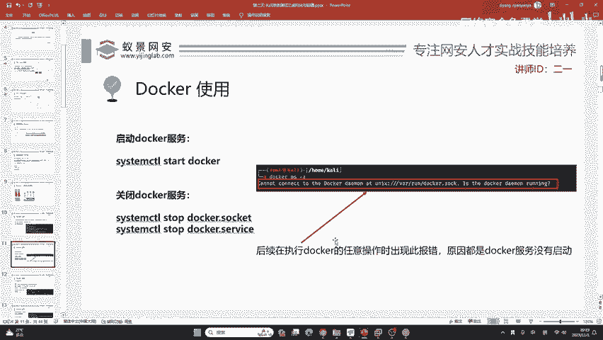

# 网络安全免费学：P23：Docker安装 🐳

在本节课中，我们将学习如何在Kali Linux系统上安装Docker。Docker是一种强大的容器化技术，能够帮助我们快速部署和运行各种应用环境，对于网络安全学习和实践非常有帮助。

---

## 为什么在Kali Linux上安装Docker？

上一节我们介绍了APT包管理器的基本使用，本节我们来看看为什么选择在Kali Linux上安装Docker。

Docker支持全平台，包括Windows、Linux以及macOS。然而，在Linux系统中，Docker的兼容性最好，操作也最方便。大家已经在上一节课学习了Kali Linux的基本使用，因此，我们将Docker安装到Kali上，可以同时学习Linux系统和Docker容器技术，有助于更好地掌握两者的共性与区别。



---

## 开始安装Docker

以下是安装Docker的具体步骤。首先，请确保你已经登录到你的Kali Linux系统。

如果你错过了之前的课程，没有关系。Kali Linux的安装非常简单，你只需联系课程班主任获取虚拟机文件，双击即可打开，无需复杂的镜像导入操作。通常不推荐在物理机上直接安装Kali，因为可能存在驱动兼容性问题。

打开Kali Linux的终端后，首先需要获取管理员权限。就像在手机应用商店安装应用需要验证身份一样，在Linux中安装软件也需要`root`权限。

输入以下命令切换到`root`用户：
```bash
su - root
```
系统会提示你输入密码，默认密码是 `kali`。

切换到`root`用户后，我们就可以使用APT包管理器来安装Docker了。Docker在APT仓库中的软件包名称是`docker.io`。

执行以下安装命令：
```bash
apt install docker.io -y
```
命令中的 `-y` 参数表示自动确认安装提示，这样安装过程会更流畅。

执行命令后，APT会从配置的软件源下载并安装Docker及其依赖。如果你在上一节课已经将APT源更换为国内镜像（如阿里云），下载速度会非常快。安装过程通常只需几分钟。

安装完成后，我们需要启动Docker服务，并设置它开机自启。以下是相关命令：

启动Docker服务：
```bash
systemctl start docker
```
设置Docker服务开机自启：
```bash
systemctl enable docker
```
为了验证Docker是否安装并运行成功，可以运行一个测试命令：
```bash
docker run hello-world
```
如果安装成功，这个命令会下载一个测试镜像并运行，终端将显示“Hello from Docker!”等欢迎信息。



---

## 课程总结

本节课中，我们一起学习了在Kali Linux上安装Docker的完整流程。我们首先了解了在Linux上使用Docker的优势，然后以`root`权限通过APT包管理器安装了`docker.io`软件包，最后启动了Docker服务并进行了验证。



成功安装Docker后，你就可以在后续的课程中，利用容器快速搭建各种靶场环境和安全工具，极大地提升学习与实践的效率。