# Docker使用：P24：Docker基础与靶场搭建 🐳

在本节课中，我们将学习Docker的基础知识，包括如何安装、配置以及使用Docker来快速搭建网络安全靶场。通过本教程，你将掌握Docker的核心概念和常用命令，无需预先掌握复杂的编程语言或环境配置，即可轻松部署各类应用程序。

---

## Docker安装与启动

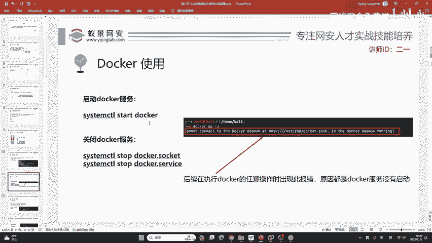

首先，Kali Linux系统在启动时会自动运行Docker服务。但如果你对Kali进行了关机或重启操作，Docker服务默认不会自动启动。此时，你需要手动启动Docker服务。

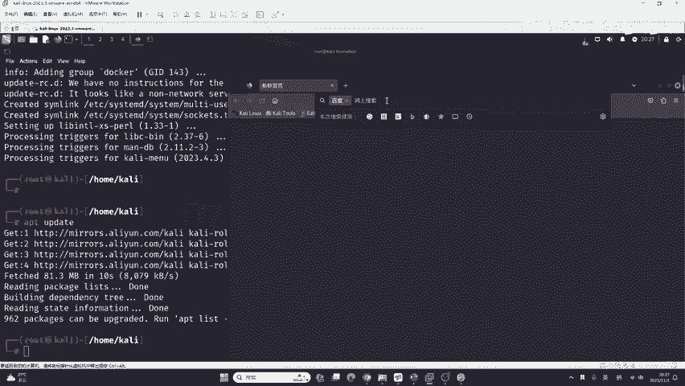

启动Docker服务的命令是：
```bash
systemctl start docker
```

### 常见安装问题与解决

以下是安装Docker时可能遇到的问题及其解决方法。

**问题：无法定位docker.io软件包**
如果在安装`docker.io`时提示“无法定位”，通常是因为你的Kali Linux软件源没有更新。你需要先更新软件源列表。

**解决方法：**
运行以下命令更新软件源：
```bash
apt update
```
更新完成后，再执行安装命令：
```bash
apt install docker.io
```
这类似于更新手机应用商店后才能下载最新应用。所有软件源（如清华源）都是开源免费的。

**问题：下载速度很慢**
下载速度慢通常与网络环境有关。如果你使用的是移动宽带或校园网，可能会遇到此问题。可以尝试将软件源切换为国内的镜像源（如阿里云）来提升速度。

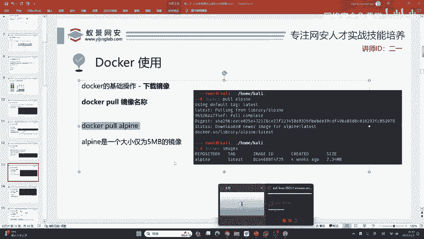

**问题：如何确认网络连接正常？**
在尝试下载任何软件前，请先确认你的Kali Linux可以正常联网。一个简单的测试方法是打开Firefox浏览器，访问百度（`www.baidu.com`）。如果能打开网页，则证明网络连接正常。

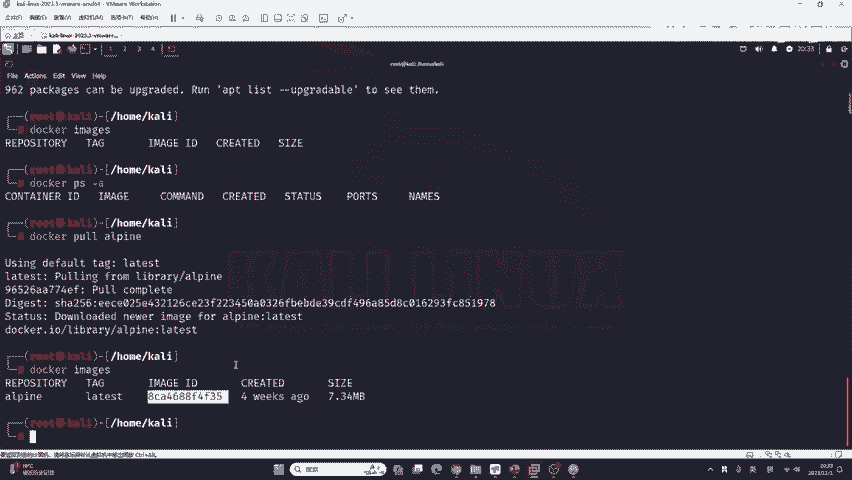

---

## Docker核心概念：镜像与容器

上一节我们解决了Docker的安装与网络问题，本节中我们来看看Docker的两个核心概念：**镜像**和**容器**。理解这两个概念是使用Docker的基础。

*   **镜像**：可以理解为应用程序的**静态模板**或**安装包**。它包含了运行应用所需的代码、库、环境配置和文件系统。类似于虚拟机的系统镜像文件（如`.iso`文件）。
    *   **公式/概念**：`镜像 = 应用程序的静态文件包`

*   **容器**：是**镜像的运行实例**。当你启动一个镜像时，就创建了一个容器。容器是隔离的、轻量级的运行环境，类似于一个已经安装并正在运行的虚拟机系统。
    *   **公式/概念**：`容器 = 运行中的镜像实例`

默认情况下，新安装的Docker中既没有镜像，也没有容器。

**查看命令：**
*   查看所有本地镜像：`docker images`
*   查看所有容器（包括已停止的）：`docker ps -a`

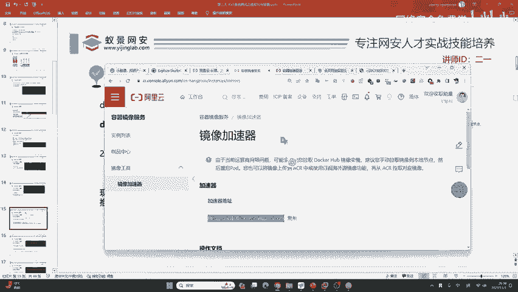

刚安装后执行这两个命令，输出都应该是空的，就像新安装的VMware里没有虚拟机一样。

---

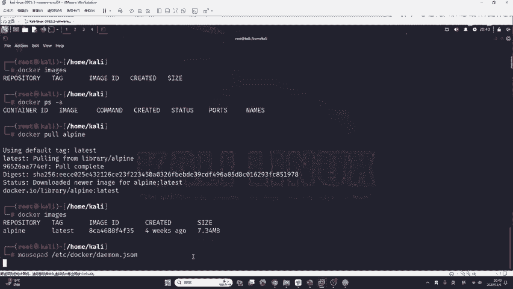

## 配置Docker镜像加速器

由于Docker的官方镜像仓库（Docker Hub）在国内访问可能很慢或无法连接，我们需要配置镜像加速器。这里推荐使用阿里云提供的免费加速服务。

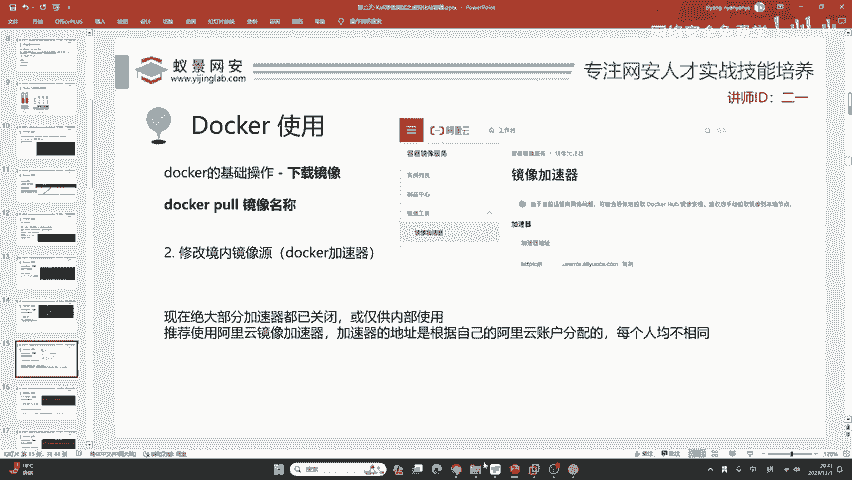

以下是配置阿里云镜像加速器的步骤：

1.  访问阿里云官网 (`aliyun.com`)，登录你的账号（可使用淘宝/支付宝账号）。
2.  进入控制台，搜索并进入 **“容器镜像服务”**。
3.  在左侧菜单找到 **“镜像工具” -> “镜像加速器”**。
4.  页面会显示为你分配的专属加速器地址。复制加速器地址（一个以 `https://` 开头的URL）。

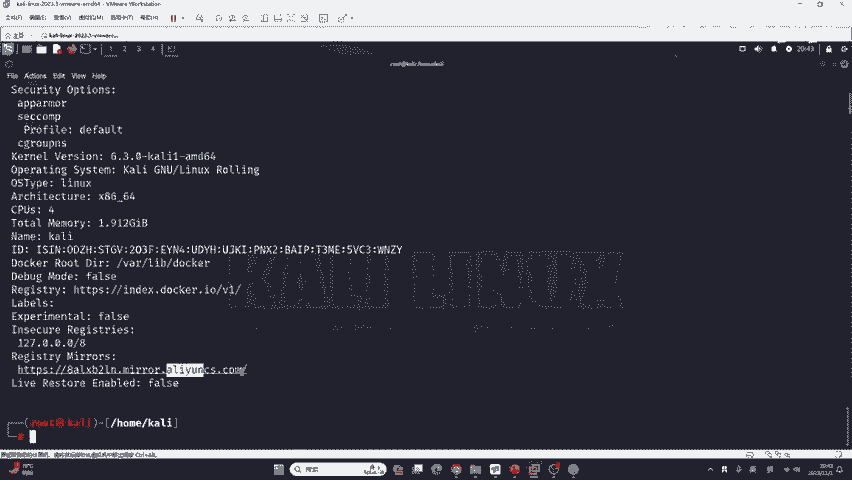

接下来，在Kali Linux中配置此加速器：

1.  使用图形化文本编辑器打开Docker的配置文件：
    ```bash
    mousepad /etc/docker/daemon.json
    ```
2.  将以下内容粘贴到文件中（请将 `你的加速器地址` 替换为刚刚复制的实际地址）：
    ```json
    {
      "registry-mirrors": ["你的加速器地址"]
    }
    ```
3.  保存并关闭文件。
4.  重启Docker服务使配置生效：
    ```bash
    systemctl restart docker
    ```
5.  验证配置是否成功：
    ```bash
    docker info
    ```
    在输出的信息中，如果看到包含 `aliyuncs.com` 的镜像仓库地址，说明加速器配置成功。

配置好加速器后，后续下载镜像的速度将会得到显著提升。

---

## Docker三大基础操作

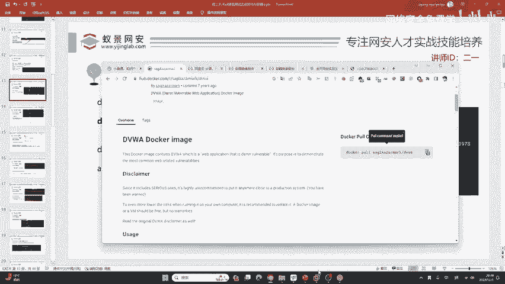

Docker的使用主要围绕三个核心操作：**拉取**、**运行**、**构建**。对于初学者和日常使用，掌握前两者至关重要。

1.  **Pull**：从镜像仓库下载镜像到本地。
    *   **命令**：`docker pull [镜像名称]`
    *   **示例**：`docker pull alpine` （下载一个仅5MB的测试镜像）

2.  **Run**：创建并启动一个容器。
    *   **命令**：`docker run [选项] [镜像名称]`
    *   **常用选项**：
        *   `-d`：后台运行容器。
        *   `--name [容器名]`：为容器指定一个名字。
        *   `-p [主机端口]:[容器端口]`：将容器的端口映射到主机的端口。

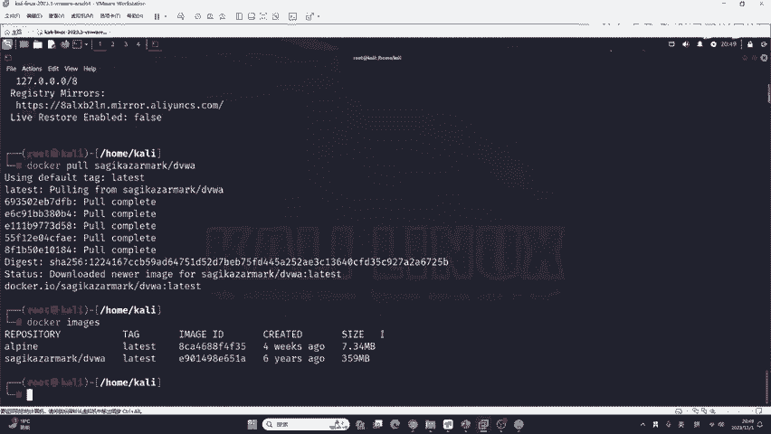

3.  **Build**：根据Dockerfile构建自定义镜像。（本入门教程暂不深入）

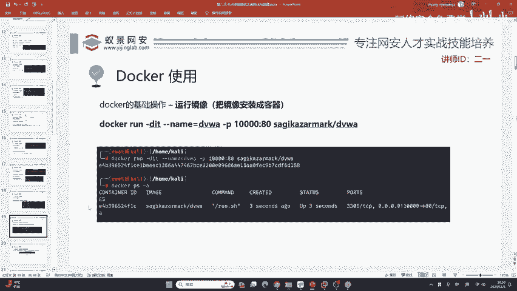

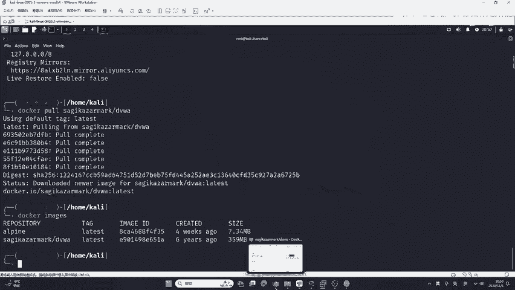

---

## 实战：使用Docker快速搭建靶场

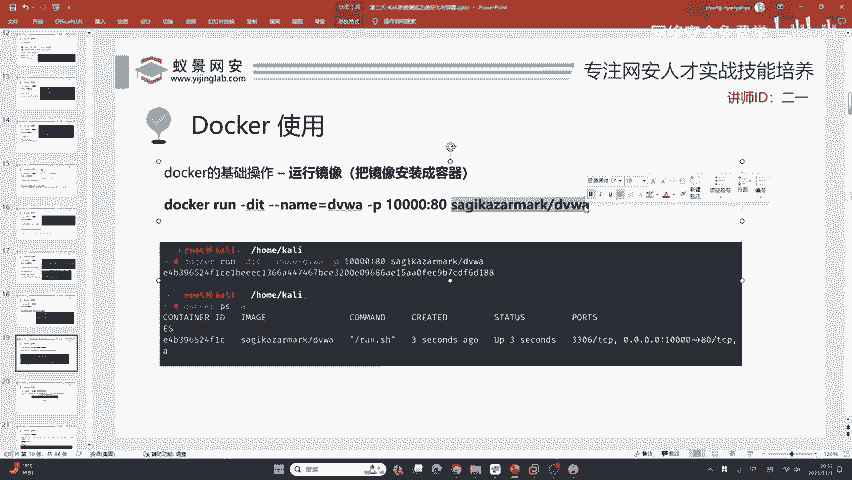

下面我们以搭建两个著名的网络安全练习靶场（DVWA和sqli-labs）为例，演示Docker的便捷性。传统搭建方式需要配置Web服务器、数据库和源码，而使用Docker仅需两条命令。

### 搭建DVWA靶场

DVWA是一个用PHP编写的漏洞靶场。

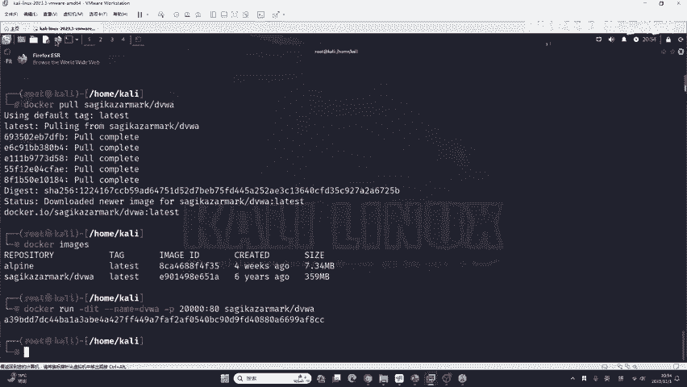

**步骤：**
1.  **拉取镜像**：从仓库下载DVWA镜像。
    ```bash
    docker pull vulnerables/web-dvwa
    ```
2.  **运行容器**：启动DVWA容器，并将容器的80端口映射到主机的20000端口。
    ```bash
    docker run -d --name dvwa -p 20000:80 vulnerables/web-dvwa
    ```
    *   `-d`：后台运行。
    *   `--name dvwa`：将容器命名为 `dvwa`。
    *   `-p 20000:80`：将容器内应用的80端口映射到宿主机的20000端口。
    *   `vulnerables/web-dvwa`：指定使用的镜像名称。

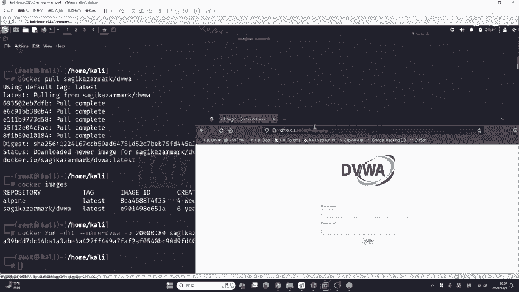

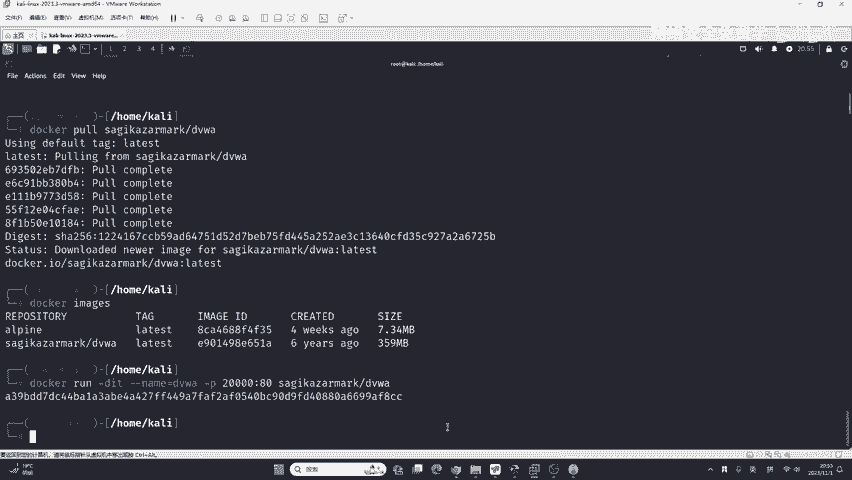

**访问靶场：**
等待几秒后，在Kali的浏览器中访问：`http://127.0.0.1:20000` 即可看到DVWA的登录界面。所有环境都已自动配置好。

### 搭建sqli-labs靶场

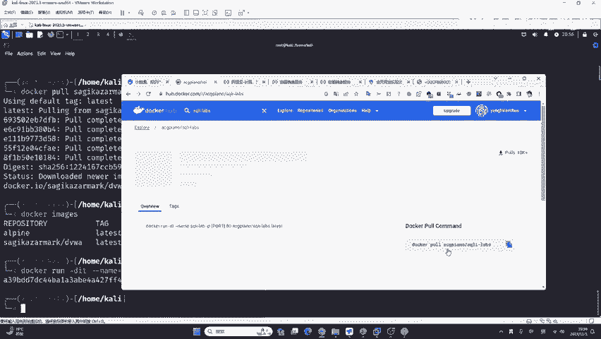

sqli-labs是一个专注于SQL注入练习的靶场。

**步骤：**
1.  **拉取镜像**：
    ```bash
    docker pull acgpiano/sqli-labs
    ```
2.  **运行容器**：（注意更换容器名和端口，避免冲突）
    ```bash
    docker run -d --name sqli -p 20001:80 acgpiano/sqli-labs
    ```

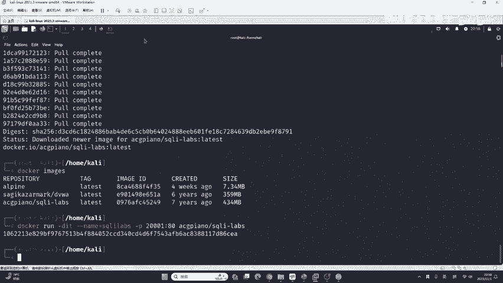

**访问靶场：**
在浏览器中访问：`http://127.0.0.1:20001`。

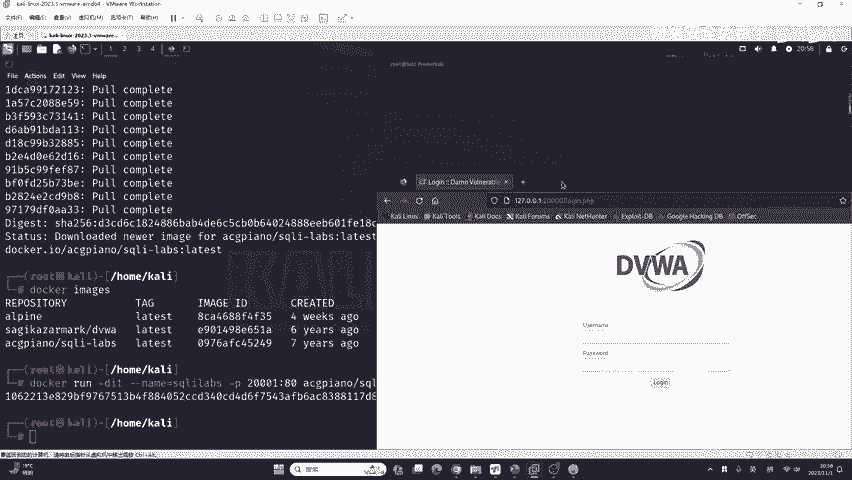

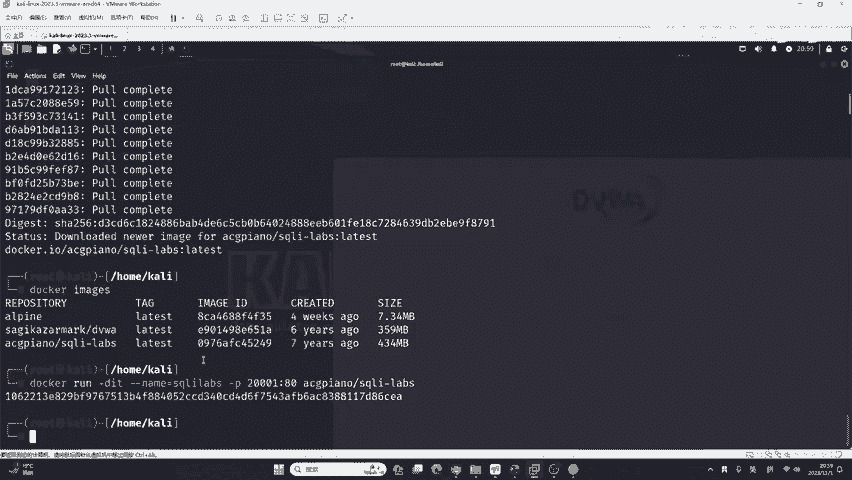

通过以上操作，你可以看到，无论靶场是用PHP、Java还是其他语言编写，Docker都能通过统一的 `pull` 和 `run` 命令快速部署，无需关心底层复杂的依赖和环境配置。

---

## 容器生命周期管理

容器像虚拟机一样，可以进行启动、停止、重启、删除和进入等操作。以下是管理容器生命周期的常用命令。

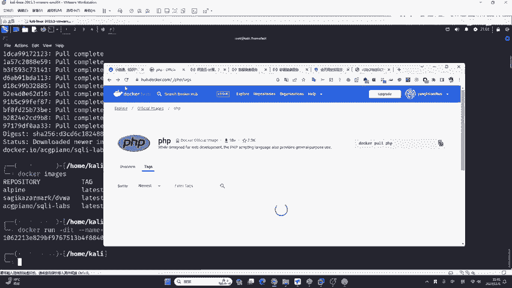

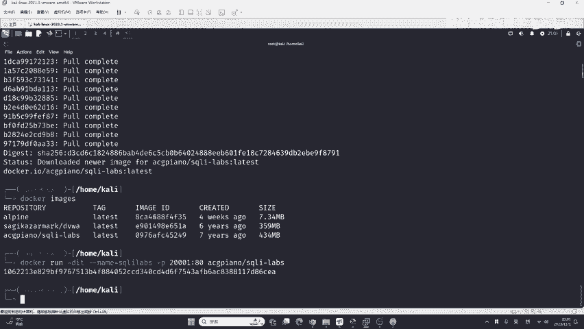

假设我们已有一个名为 `dvwa` 的容器。

*   **停止容器**：`docker stop dvwa`
*   **启动已停止的容器**：`docker start dvwa`
*   **重启容器**：`docker restart dvwa`
*   **进入容器内部**：此操作允许你进入容器的命令行环境进行调试。
    ```bash
    docker exec -it dvwa /bin/bash
    ```
    *   `-it`：分配一个交互式终端。
    *   `/bin/bash`：指定使用的Shell。
    *   退出容器内部命令行，输入 `exit`。
*   **删除容器**：`docker rm dvwa` （注意：删除前需先停止容器）

通常情况下，我们不需要进入容器内部操作。Docker的优势就在于开箱即用，避免手动配置的麻烦。

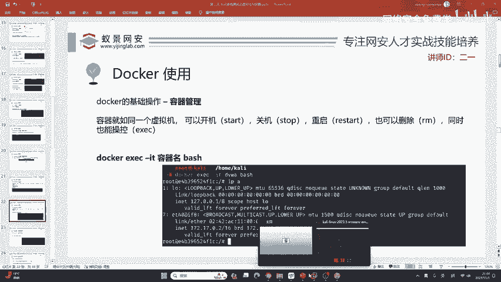

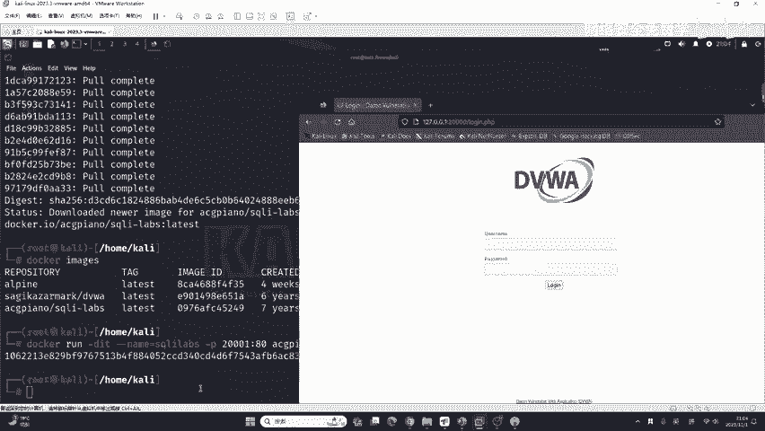

---

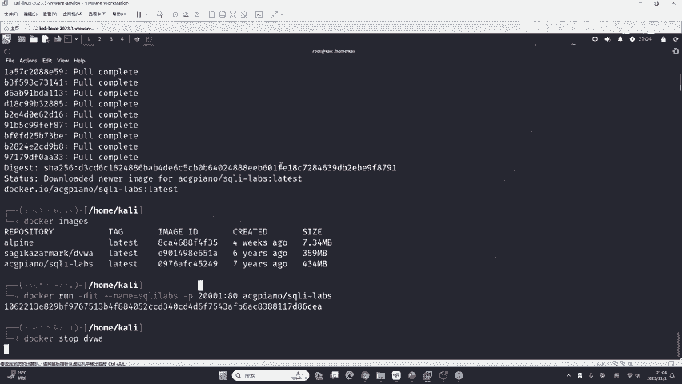

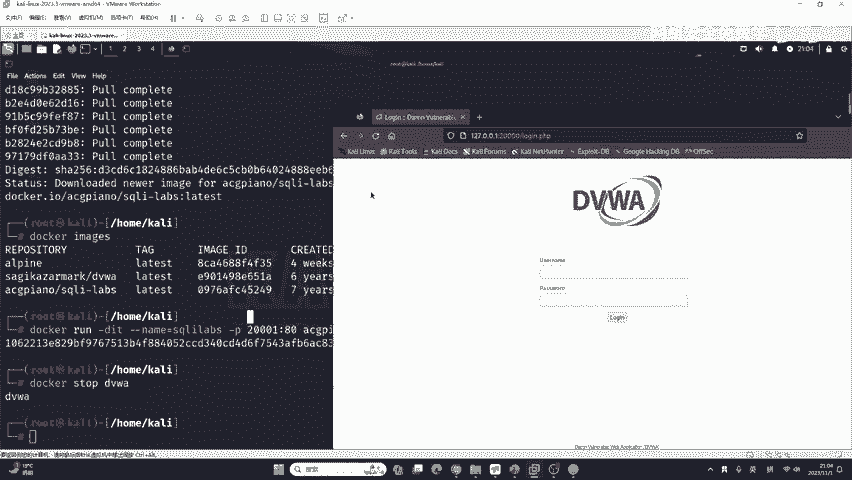

## 总结

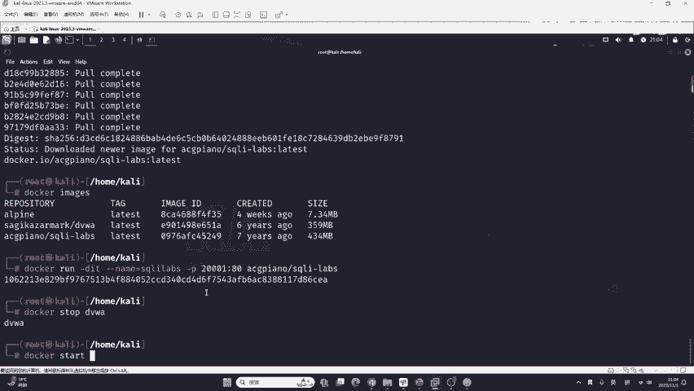

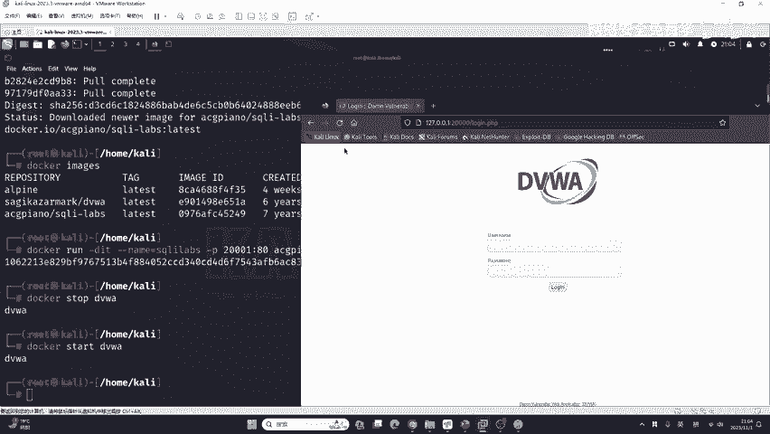

本节课中我们一起学习了Docker的基础知识和实战应用。

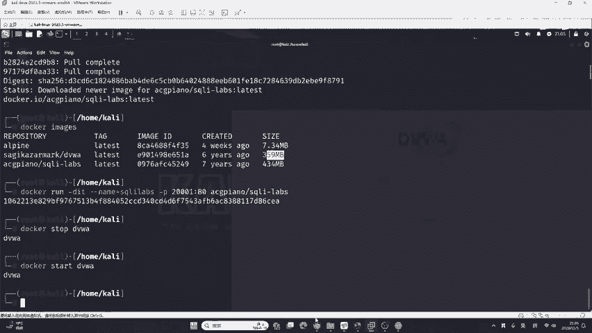


我们首先解决了Docker的安装与网络配置问题，然后理解了**镜像**和**容器**这两个核心概念。通过配置**阿里云镜像加速器**，我们解决了国内下载镜像慢的问题。

接着，我们掌握了Docker的三大基础操作，并重点练习了 **`pull`（拉取）** 和 **`run`（运行）** 命令。通过实战，我们使用短短两条命令就快速搭建了**DVWA**和**sqli-labs**两个复杂的网络安全靶场，体验了Docker“一次构建，处处运行”的便捷性。

最后，我们学习了容器的生命周期管理命令，如启动、停止、重启和进入容器，让你能全面管理Docker应用。

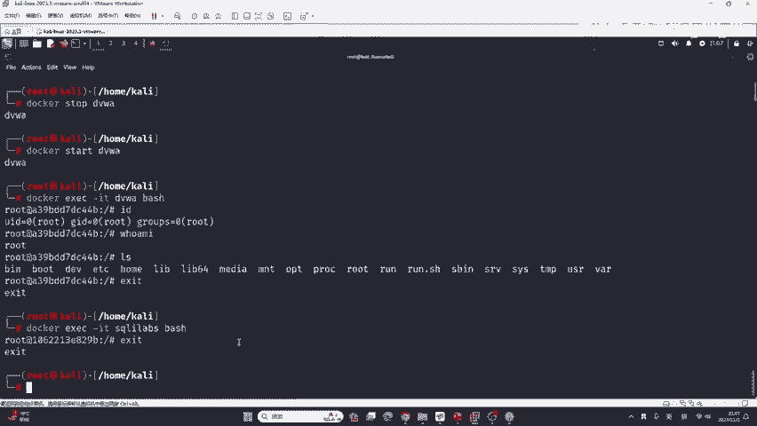

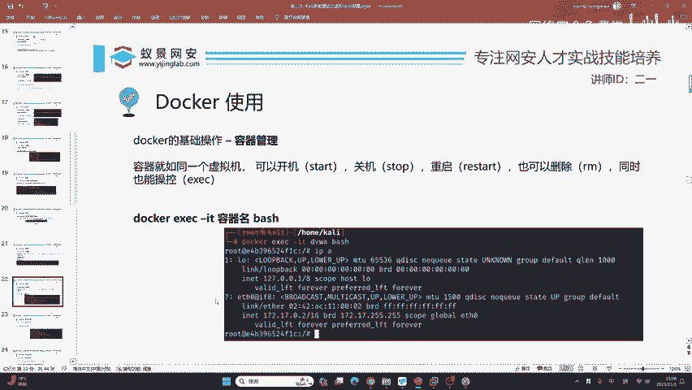

Docker Hub上拥有海量的应用镜像，从数据库、Web服务器到各种编程语言环境，你都可以通过相同的方式轻松获取和运行。掌握Docker将极大提升你在渗透测试、漏洞复现和环境搭建方面的效率。