# Docker进阶使用：P25：Docker Compose与漏洞靶场搭建 🐳

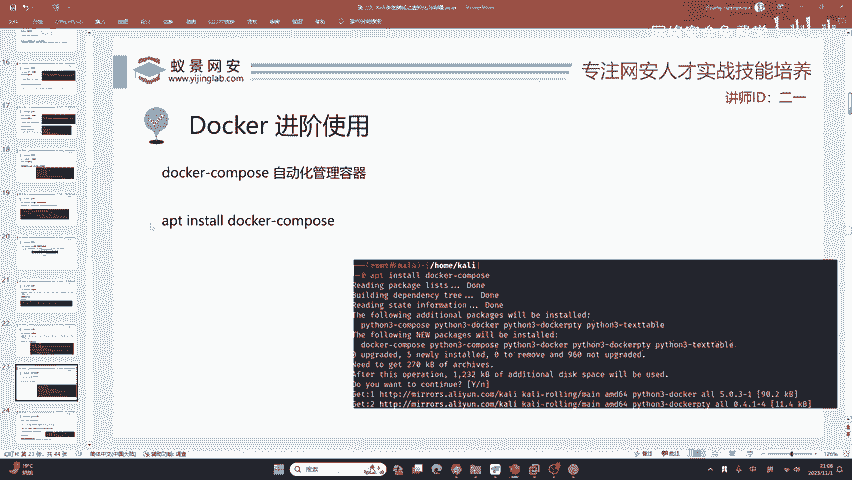

在本节课中，我们将要学习Docker的进阶工具——Docker Compose。我们将了解它如何解决多容器应用的协调问题，并学习如何使用它快速搭建网络安全学习中至关重要的漏洞靶场环境。

## 从单一镜像到分布式应用

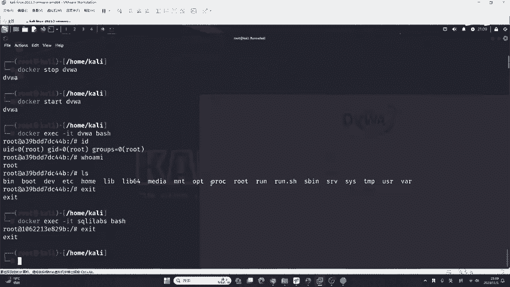

上一节我们介绍了Docker的基本操作，本节中我们来看看它在实际应用中的一个局限性。

Docker本身有一个小问题：我们下载和运行的通常是单一镜像。现代开发和计算机系统讲究“分布式”，这意味着数据库、网站等组件可能运行在各自独立的环境中。单一的Docker镜像无法满足这种分布式条件。

如果各个组件分开部署，就可能出现版本不兼容的问题，导致系统崩溃。因此，我们需要保证所有组件协调统一、稳定运行。这时，仅使用Docker本身就不够用了。

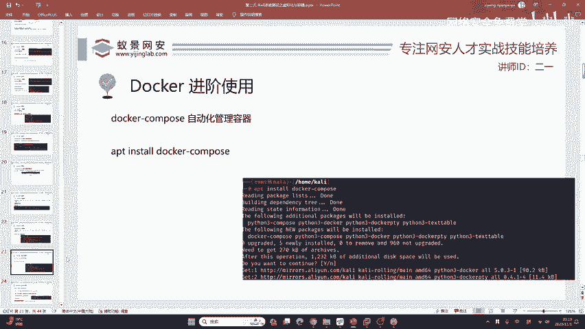

我们需要一个便捷的Docker管理平台，这个平台叫做 **Docker Compose**。它在网络安全领域使用非常广泛，因为它能极大地方便环境搭建。网络安全从业者通常不希望花费大量精力学习复杂的代码和配置，他们需要的是高效、便捷的工具。

## 安装Docker Compose

要使用Docker Compose，首先需要安装它。以下是安装步骤。

我们已经安装了Docker，但电脑上还没有Docker Compose。我们可以使用包管理器来安装它。

```bash
apt install docker-compose
```

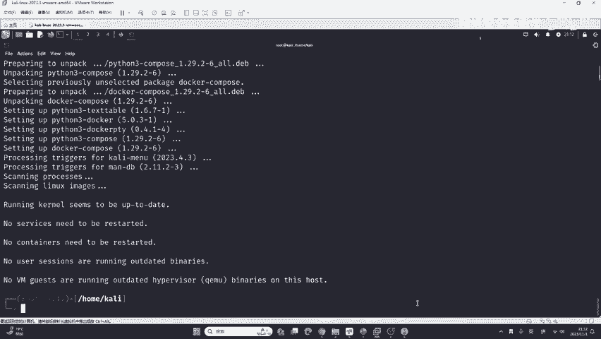

安装过程非常简单，你只需要在提示时输入 `yes` 并按下回车即可。这些操作不需要你精通Linux命令，在Windows或macOS上使用类似的包管理工具，指令也是基本相同的。

## 获取漏洞靶场合集：Vulhub

安装好Docker Compose后，我们需要告诉它具体要搭建什么应用。这里我们感谢安全研究员P牛，他整理了一个包含常见漏洞靶场、开发框架、组件和SDK的合集——Vulhub，里面有数百个环境，完全够我们使用。

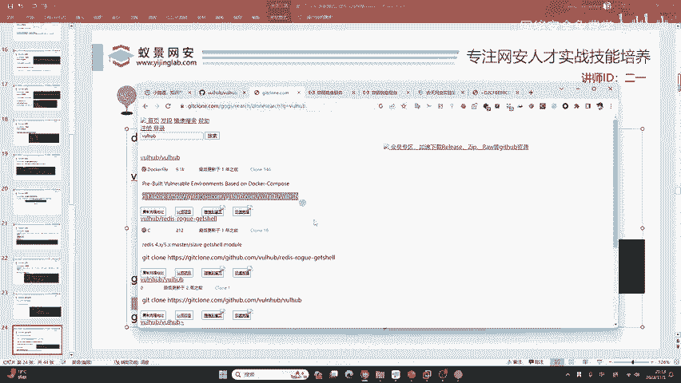

首先，我们需要下载Vulhub项目。由于GitHub在国内访问可能受限，这里提供一个加速访问的方法。

Vulhub托管在GitHub上。如果你可以正常访问GitHub，可以直接使用 `git clone` 命令下载。如果访问困难，可以使用GitHub加速服务。

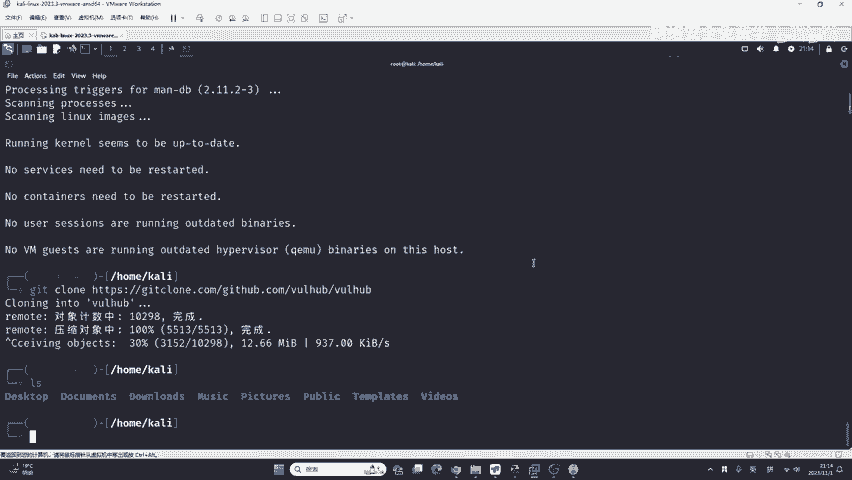

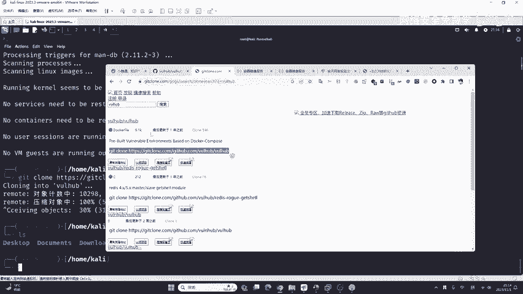

以下是使用加速服务下载的示例命令（具体加速链接可能会变化，请以实际提供的为准）：

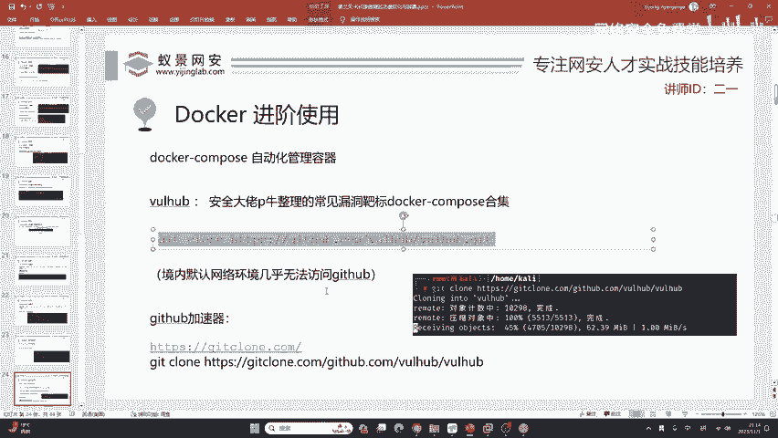

```bash
git clone https://gitclone.com/github.com/vulhub/vulhub.git
```

下载完成后，你会得到一个名为 `vulhub` 的文件夹。进入这个文件夹，可以查看其中的内容。

```bash
cd vulhub
ls
```

你会看到里面有很多目录，每个目录代表一个特定的漏洞环境或应用，例如 `flask`、`hadoop`、`java`、`mysql`、`php`、`spring`、`tomcat`、`wordpress` 等。你不需要完全了解每一个，只需关注你当前需要学习或测试的即可。

## 使用Docker Compose搭建漏洞环境

现在，我们学习如何使用Docker Compose来搭建这些漏洞环境。我们将以 `solr`（一个开源的Java搜索引擎）的某个漏洞环境为例。

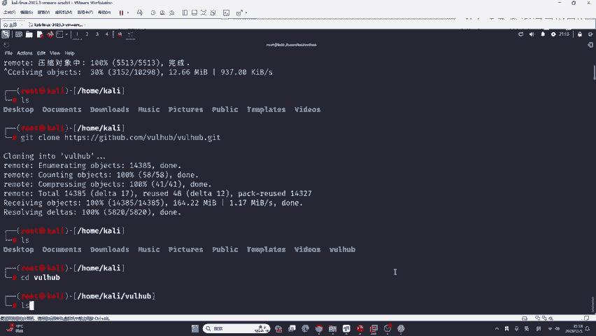

手动搭建Java环境非常麻烦，需要配置正确的JDK版本、Maven依赖等，极易出错。但使用Docker Compose和Vulhub，这个过程变得极其简单。

首先，进入你想要搭建的漏洞环境目录。Vulhub中的目录通常以CVE（公共漏洞暴露）编号命名。

```bash
cd solr/CVE-2019-17558
```

进入目录后，只需要执行一条命令：

```bash
docker-compose up -d
```

这条命令会自动下载所需镜像并启动容器。整个过程耗时主要取决于网络下载速度。通常在一两分钟内即可完成。如果是手动搭建，对于零基础者可能需要数小时。

命令执行成功后，如何访问这个服务呢？使用以下命令查看运行中的容器及其端口映射：

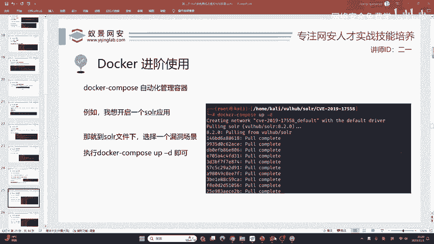

```bash
docker ps -a
```

在输出中，你可以找到对应容器的端口号（例如 `8983`）。然后在浏览器中访问 `http://你的IP地址:8983` 即可。

## 管理Docker Compose服务

当你不需要使用某个漏洞环境时，可以方便地将其关闭。

在对应的漏洞环境目录下，运行以下命令来停止并移除由 `docker-compose up` 启动的所有容器、网络等资源：

```bash
docker-compose down
```

执行后，该服务将停止，对应的网页也无法再访问。

如果你想再次启动它，只需重新运行 `docker-compose up -d` 即可。

## 再举一例：搭建Tomcat环境

为了加深理解，我们再以 `tomcat` 为例搭建一个环境。

进入Tomcat的某个漏洞环境目录：

```bash
cd tomcat/tomcat8
```

同样使用一条命令启动：

```bash
docker-compose up -d
```

启动后，使用 `docker ps -a` 查看端口（例如 `8080`），然后在浏览器访问 `http://你的IP地址:8080`，即可看到Tomcat的默认页面。

## 容器管理补充说明

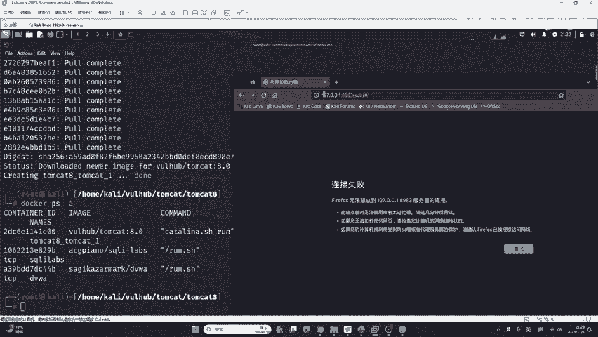

关于容器的管理，这里做一些补充说明。

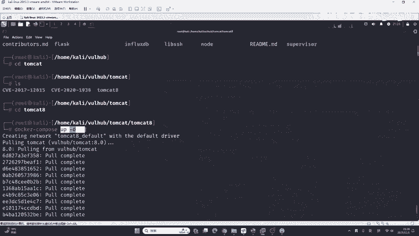

Docker Compose的 `down` 命令只会停止并清理当前目录下 `docker-compose.yml` 定义的容器组。

如果你想单独删除某个由 `docker run` 启动的容器（例如之前手动搭建的DVWA），可以使用Docker原生命令：

```bash
docker rm -f 容器名或容器ID
```

例如：
```bash
docker rm -f dvwa
docker rm -f sqli-labs
```

## 总结与展望

本节课中我们一起学习了Docker Compose的核心用法。我们了解到，Docker Compose是一个用于定义和运行多容器Docker应用的工具。通过Vulhub项目，我们可以一键搭建数百种包含已知漏洞的测试环境，这为网络安全学习提供了极大的便利。

我们掌握了关键步骤：
1.  **安装Docker Compose**：通过包管理器安装。
2.  **获取靶场**：下载Vulhub项目。
3.  **搭建环境**：进入特定漏洞目录，执行 `docker-compose up -d`。
4.  **访问测试**：使用 `docker ps -a` 查看端口并访问。
5.  **关闭环境**：在对应目录执行 `docker-compose down`。

Vulhub提供的这些漏洞靶场，就像士兵训练用的靶场。在真正对真实网站进行渗透测试之前，我们需要在这些安全的靶场中反复练习攻击技巧，理解漏洞原理，才能在实际工作中做到精准有效。

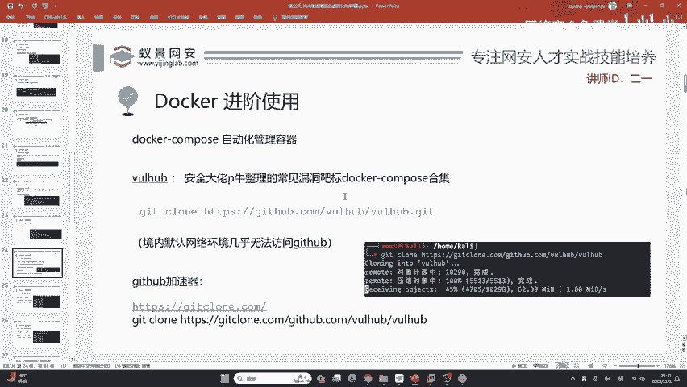

今天，我们学会了如何快速搭建这些靶场。接下来的课程，我们将深入这些靶场内部，去学习如何复现和利用其中的漏洞，例如Tomcat中的多个漏洞，或是Solr中的5个漏洞，探究其原理并掌握最合适的攻击方法。