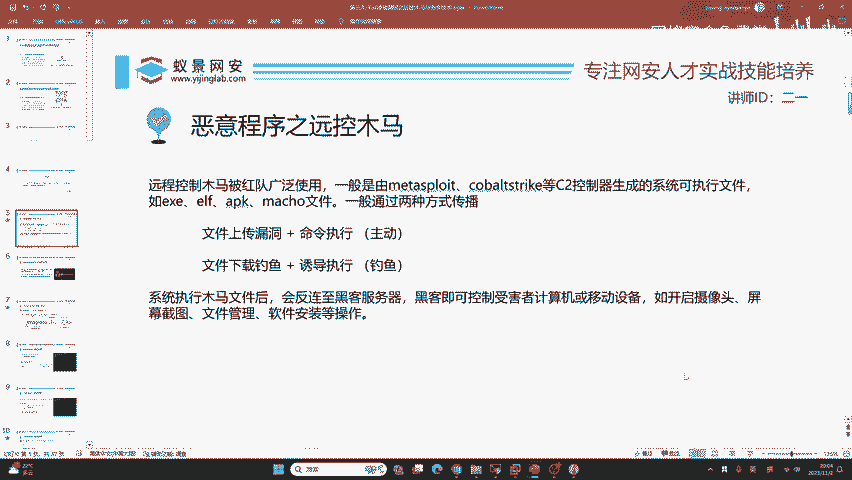
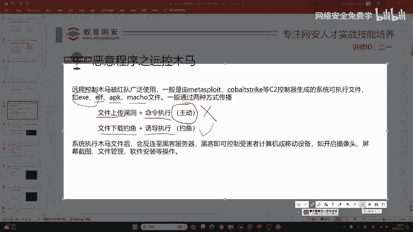
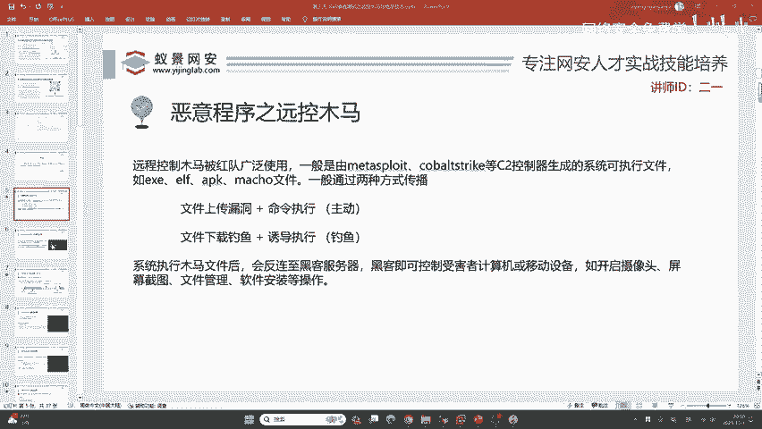

# 网络安全入门：P26：恶意程序之远控木马 🎯

在本节课中，我们将要学习远程控制木马的基础知识。我们将了解什么是远控木马，它与破坏性病毒的区别，以及它在实际网络攻防演练中的应用场景。课程将涵盖木马文件的类型、传播方式以及基本工作原理，为后续深入学习打下基础。

## 什么是远控木马？🤔

上一节我们介绍了课程概述，本节中我们来看看远控木马的核心定义。

远控木马是一种在渗透测试和攻防演练中，由攻击方（红队）经常使用的恶意程序。它与勒索病毒等破坏性程序不同，其核心目的是**控制**目标系统，而非破坏它。例如，某些国家支持的APT组织对西北工业大学的渗透，就使用了远程控制结合数据窃取的手段。破坏行为容易被发现，而隐蔽的控制则能长期潜伏。

## 木马文件类型科普 💾

了解了远控木马的目的后，我们需要知道它具体以何种形式存在。远控木马通常由C2（命令与控制）控制器软件生成，是特定操作系统的可执行文件。

以下是不同操作系统对应的可执行文件类型：

*   **EXE**: Windows操作系统的可执行程序。
*   **ELF**: Linux操作系统的可执行程序。
*   **APK**: Android操作系统的软件安装包。
*   **Mach-O**: macOS（苹果电脑）的可执行文件。

生成系统后门木马，主要就是生成上述四种类型的文件。

**关于安装包的补充说明**：
有同学提到MSI和DMG文件。MSI是Windows的安装包（Microsoft Installer），DMG是macOS的安装包，它们本身不是直接的可执行文件，但同样可以被构造成远控木马载体。

## 木马的传播方式 🎣

知道了木马的文件形态，接下来要思考如何将它传递给受害者。在实际工作中，主要有两种方式。

第一种是利用目标系统或网站的漏洞（如文件上传漏洞结合命令执行漏洞）主动上传并运行木马。然而，随着安全水平提升，这种方式的应用场景正在减少。

第二种，也是目前日益主流的方式，是**钓鱼**。以下是常见的钓鱼手段：

*   构造钓鱼文件
*   发送钓鱼邮件
*   搭建钓鱼网站
*   制作钓鱼二维码
*   伪装成正常应用程序

通过社会工程学等手段，诱导受害者**被动下载并执行**钓鱼文件。这种方式可以绕过防火墙和局域网限制，成功率较高，是现代红队攻击中比例渐增的手法。

## 木马的工作流程 🔄

当木马文件在受害者系统上被执行后，它会主动连接回黑客控制的服务器（即“返链”）。一旦连接建立，黑客便可以通过C2服务器对受害者的计算机或移动设备进行远程控制。

只要权限足够，黑客几乎可以执行所有操作，例如：
*   开启摄像头
*   进行屏幕截图
*   管理文件系统
*   安装或卸载软件

如果木马隐藏得当，钓鱼的成功率会大大增加。

## 基础木马生成实践 ⚙️

在初步了解了概念和流程后，我们将进入实践环节。请注意，本节我们先接触最基础的木马生成，暂不涉及免杀（绕过杀毒软件）或钓鱼技巧。

（此处为教程实践部分起始提示，具体生成步骤需根据实际工具和操作展开。）

---

本节课中我们一起学习了远程控制木马的基础知识。我们明确了远控木马以控制为核心目的，认识了针对不同系统的木马文件类型（EXE, ELF, APK, Mach-O），分析了通过漏洞利用和钓鱼两种主要的传播方式，并了解了木马执行后连接C2服务器的工作流程。这些概念是后续学习免杀技术、钓鱼手法等高级主题的重要基石。