# 网络安全：P28：杀毒软件绕过

在本节课中，我们将学习如何绕过杀毒软件。这是渗透测试中至关重要的一环，因为我们的攻击载荷（如木马）必须能够躲避目标计算机上安全软件的检测才能成功。我们将从了解杀毒软件的工作原理开始，逐步学习几种实用的绕过方法。

## 了解你的对手：主流杀毒软件

上一节我们介绍了课程目标，本节中我们来看看我们需要面对的主要对手——杀毒软件。要想成功绕过它们，首先必须了解它们。

以下是世界主流的杀毒软件，在工作中你会经常遇到它们，因为它们会拦截你的攻击行为。

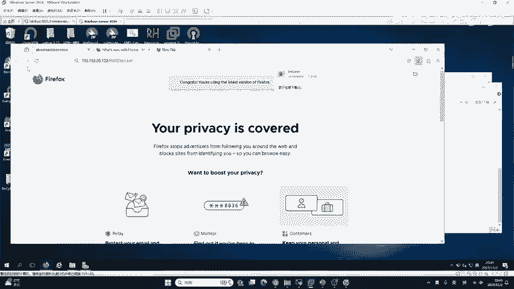

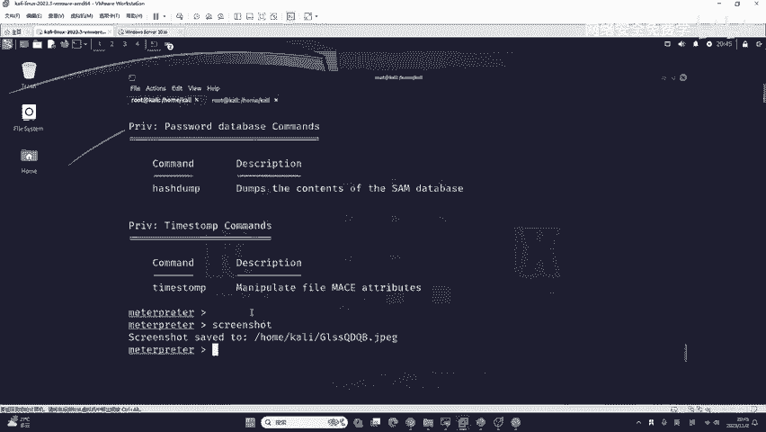

*   **国内软件**：
    *   **360**：查杀能力很强，但会附带广告。
    *   **火绒**：用户体验较好，但查杀能力略逊于360。
*   **国外软件**：
    *   **微软 Defender**：Windows系统自带，在Win11等新系统上效果很好。
    *   **McAfee**：知名杀毒软件。
    *   **Avira（小红伞）**：来自德国。
    *   **Bitdefender**：来自罗马尼亚。
    *   **AVG**：世界上使用人数最多的杀毒软件之一。
    *   **Kaspersky（卡巴斯基）**：来自俄罗斯，查杀能力很强。
    *   **ESET**：斯洛伐克的安全软件。
    *   **Trend Micro（趋势科技）**：来自中国台湾。

这些公司拥有顶级的安全研究员，因此不存在一种通用的、一劳永逸的绕过方法。安全是一个持续的攻防对抗过程。

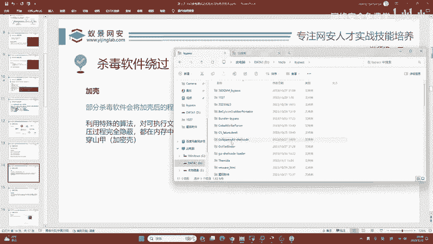

## 杀毒软件的工作原理

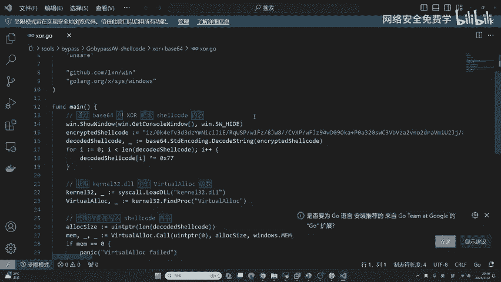

了解了对手是谁之后，我们需要知道它们是如何工作的。杀毒软件主要通过以下三种方式检测威胁：

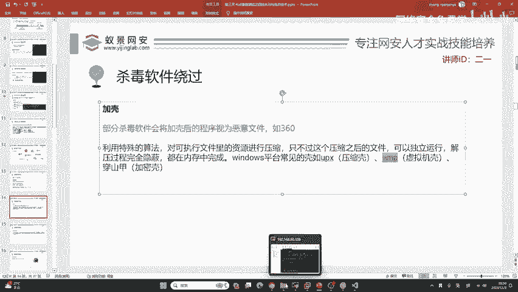

1.  **静态查杀**：
    *   这是最基础、最高效的方式。杀毒软件有一个病毒特征库，如同警方的“通缉令”。当文件特征与库中的恶意软件特征匹配时，就会被直接查杀。火绒、腾讯管家等常用此方式。
    *   **核心概念**：特征码匹配。`if (file_signature == known_malware_signature) { quarantine(); }`

2.  **云查杀**：
    *   这是非常强大的检测方式。当你运行或下载一个文件时，软件会将其上传到云端服务器（如360的“安全大脑”）进行深度分析。云端拥有更强大的计算能力和沙箱环境，能进行行为检测，因此更难绕过。

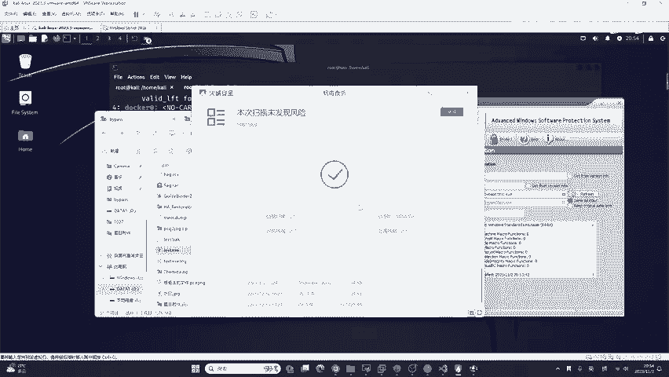

3.  **动态查杀（行为监控）**：
    *   即使文件本身绕过了检测，杀毒软件还会监控程序运行时的行为。例如，如果程序尝试截图、访问摄像头或调用敏感系统接口，高级杀软（如卡巴斯基、360）会追溯到这个进程并将其终止。
    *   **核心概念**：监控API调用和系统行为。`monitor_process(“screenshot”, “camera_access”);`

## 基础绕过方法：加壳

上一节我们了解了杀软如何工作，本节我们来看看第一种基础绕过技术：加壳。这种方法主要针对依赖静态查杀的软件。

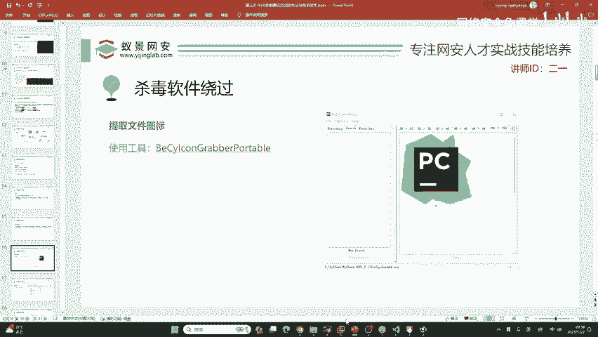

加壳是指利用特殊算法对可执行文件（如`.exe`）进行压缩或加密。加壳后的文件可以独立运行，解压过程在内存中完成。如果杀毒软件没有内存查杀能力，加壳就可能绕过它。

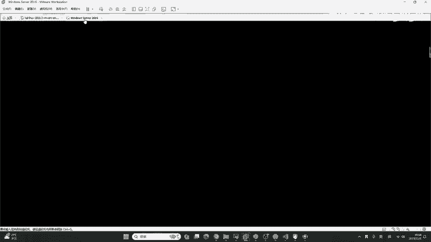

Windows平台常见的壳有三类：

*   **压缩壳**：如UPX，主要减小文件体积。
*   **虚拟机壳**：如VMProtect（VMP），通过虚拟机代码增加分析难度。
*   **加密壳**：如Themida（穿山甲），对代码段进行加密。

**操作演示**：
1.  假设我们有一个会被查杀的`test.exe`木马文件。
2.  使用加壳工具（如旧版的“ZProtect”）打开`test.exe`。
3.  点击“Protect”（保护）按钮，即可生成加壳后的文件。
4.  加壳后的文件可能绕过火绒等软件的静态查杀，但无法绕过具备云查杀和动态查杀的360或卡巴斯基。

**注意**：加壳有明显的缺点，部分杀软会将加壳程序本身视为可疑行为。例如，360可能会直接查杀加壳后的正常软件。

## 进阶绕过思路：捆绑与伪装

加壳技术有其局限性，本节我们探讨一种更隐蔽的思路：将木马与正常软件捆绑在一起，并进行伪装。

我们的目标是让木马文件看起来和正常程序一模一样。这里以远程控制软件“ToDesk”的安装程序为例。

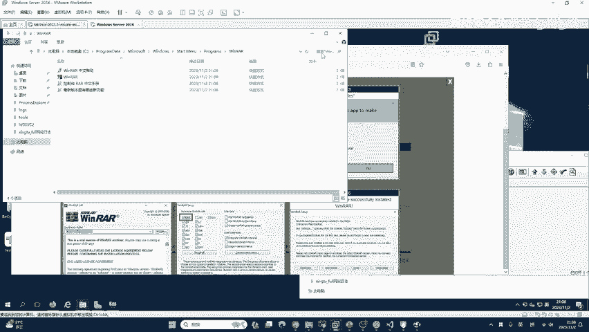

以下是实现伪装的关键步骤：

1.  **提取正常程序的图标**：
    *   使用工具（如“Resource Hacker”或专用图标提取工具）打开正常的`ToDesk_Install.exe`。
    *   将其图标资源导出为`.ico`文件。

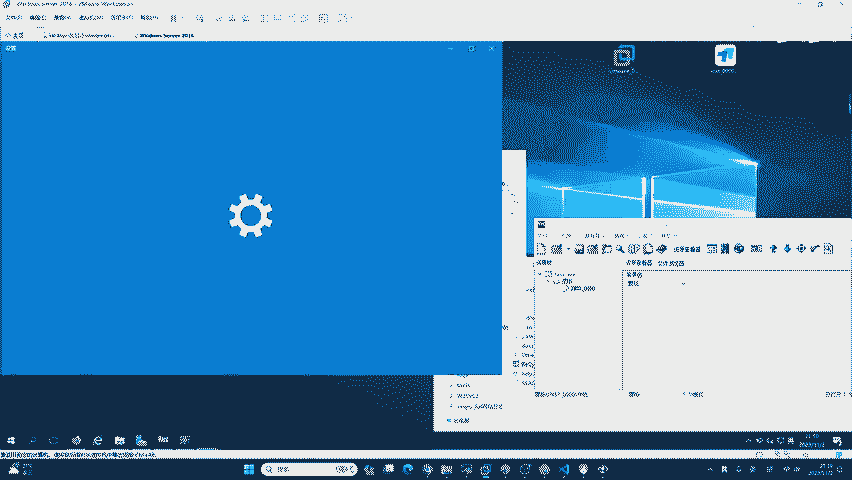

2.  **修改木马程序的图标**：
    *   使用资源编辑器（如“Resource Hacker”）打开我们的木马文件`test.exe`。
    *   删除或替换其原有的图标资源，将上一步提取的`.ico`图标导入并设置为程序图标。
    *   保存后，`test.exe`的图标就变得和`ToDesk_Install.exe`一样了。

3.  **捆绑文件（基础方法 - 使用WinRAR）**：
    *   选中正常的`ToDesk_Install.exe`和伪装后的木马`test.exe`。
    *   右键，选择“添加到压缩文件”。
    *   在压缩设置中，勾选“**创建自解压格式压缩文件**”。
    *   在“自解压选项”中设置：
        *   **解压路径**：设置为隐蔽目录，如`C:\Windows\Temp\`。
        *   **解压后运行**：先运行木马`test.exe`，再运行正常程序`ToDesk_Install.exe`。
        *   **模式**：选择“全部隐藏”，避免弹出解压窗口。
    *   点击确定，生成一个自解压的`.exe`文件（如`Desktop.exe`）。
    *   最后，将这个生成文件的图标也修改为`ToDesk`的图标，并重命名为类似`ToDesk_Setup.exe`的名字。

**效果与局限**：
*   对于普通用户，这个文件看起来就是正常的ToDesk安装包。运行时，会先静默释放并执行木马，再弹出正常的安装界面，极具迷惑性。
*   **局限性**：使用WinRAR自解压捆绑的方法，其行为特征已被主流杀软熟知，很容易被动态查杀拦截。这只是一种原理演示。

## 更高级的方法：代码实现捆绑

上一节用工具演示了捆绑原理，但工具特征明显。本节我们了解更高级、更灵活的方法：通过编程实现捆绑。

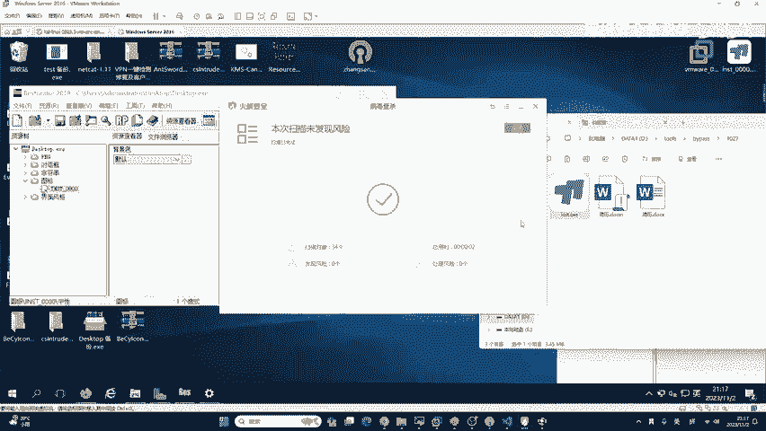

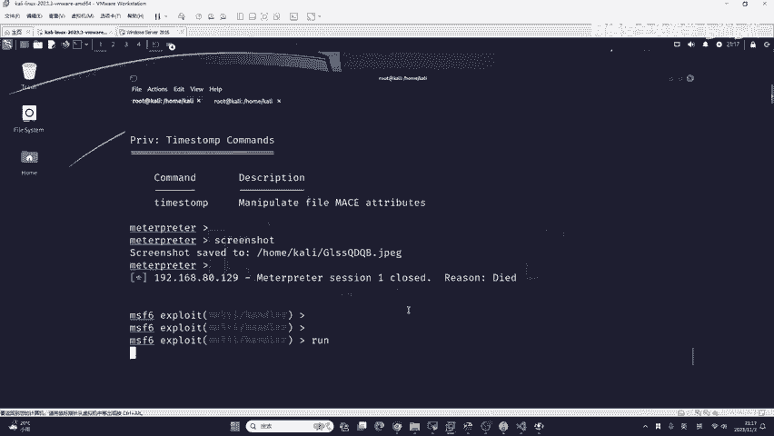

要实现无工具特征的捆绑，需要一定的编程能力。例如，可以使用C++或Go语言编写一个加载器（Loader）。这个加载器的功能是：
1.  将正常程序和木马程序的二进制数据作为资源嵌入到自身。
2.  运行时，在内存中解密并释放这两个文件到指定位置（如临时目录）。
3.  创建进程，先后执行木马和正常程序。

**伪代码示例**：
```cpp
// 伪代码，展示思路
int main() {
    // 1. 从自身资源中提取出“正常程序”和“木马程序”的二进制数据
    char* normalApp = extractResource("NORMAL_APP");
    char* malware = extractResource("MALWARE");

    // 2. 将二进制数据写入磁盘（C:\Windows\Temp\）
    writeToFile("C:\\Windows\\Temp\\normal.exe", normalApp);
    writeToFile("C:\\Windows\\Temp\\malware.exe", malware);

    // 3. 静默运行木马
    createHiddenProcess("C:\\Windows\\Temp\\malware.exe");
    // 4. 运行正常程序，展示给用户
    createProcess("C:\\Windows\\Temp\\normal.exe");

    return 0;
}
```
这种方法的好处是，捆绑逻辑完全自定义，没有第三方工具的固定特征。即使被杀软识别，也可以通过修改代码逻辑（如加密算法、释放流程）来快速变种，适应攻防对抗。

**给初学者的建议**：学习网络安全，**Python**是首选的编程语言，易于上手且生态强大，足以完成大部分自动化任务和脚本编写。在掌握Python和网络安全基础后，若对免杀、逆向等深度领域感兴趣，再根据需求学习C/C++或Go语言。

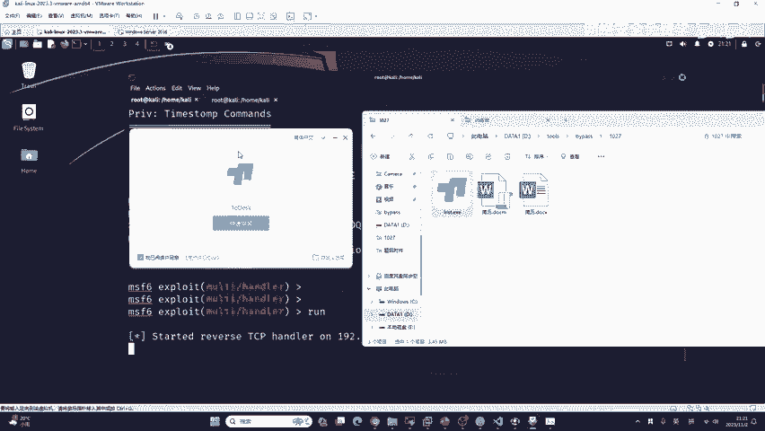

## 总结与核心要点

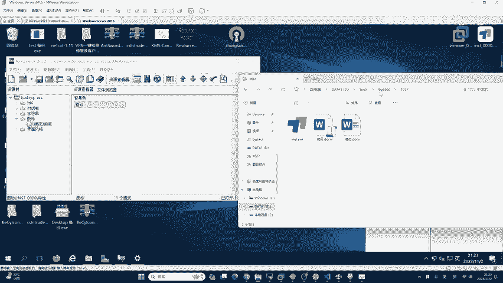

本节课中我们一起学习了杀毒软件绕过的基础知识。

*   **核心思想**：攻防对抗是持续的，没有永久有效的免杀技术。必须理解原理，才能随机应变。
*   **了解对手**：认识了主流杀软及其静态、云、动态三种查杀方式。
*   **基础技术**：学习了**加壳**的原理与操作，它主要对抗静态查杀。
*   **进阶思路**：掌握了**捆绑与伪装**的完整流程（图标替换、文件捆绑），这是社会工程学攻击的重要部分。
*   **高级方向**：了解了通过**自定义代码实现捆绑**的优势，这是摆脱工具特征、实现高质量免杀的关键。

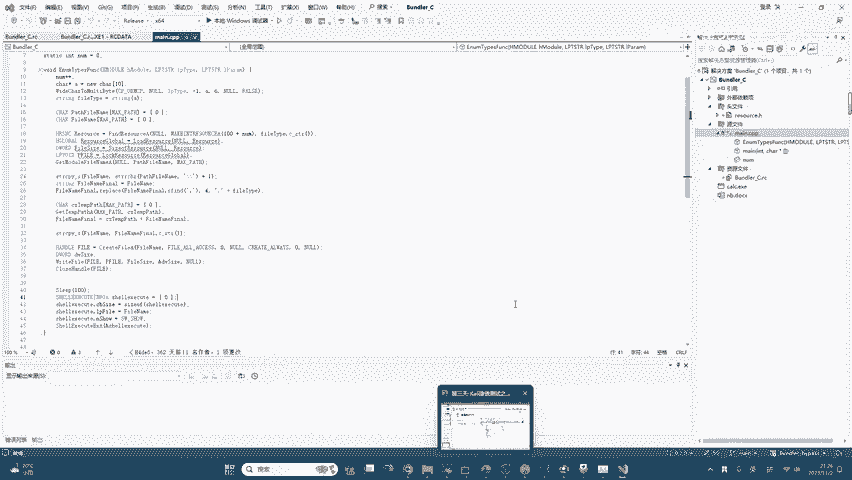

记住，所有技术都应用于授权的安全测试与学习。不断研究原理，保持技术更新，是网络安全从业者的必备素质。