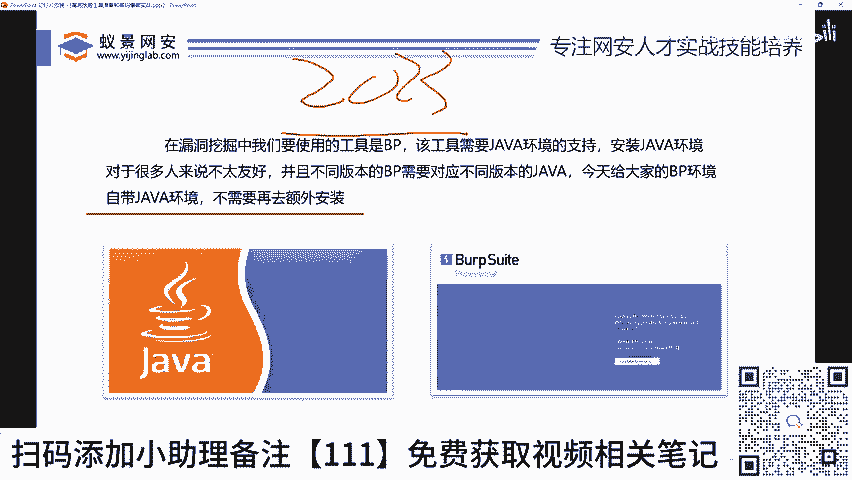
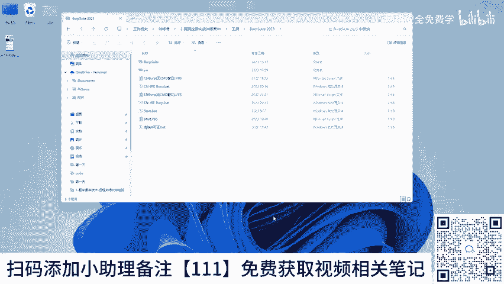
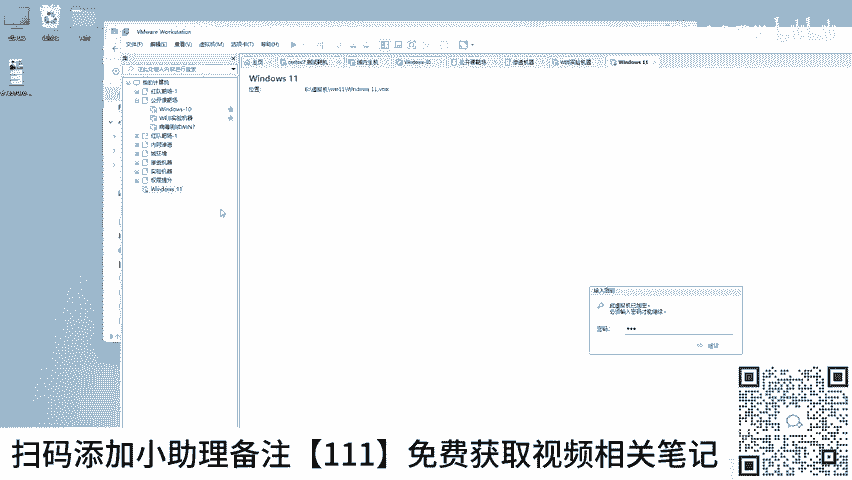
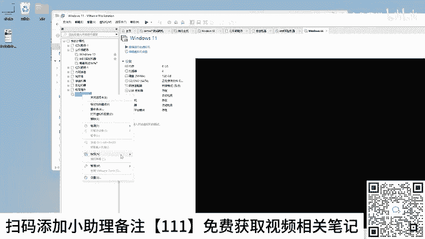
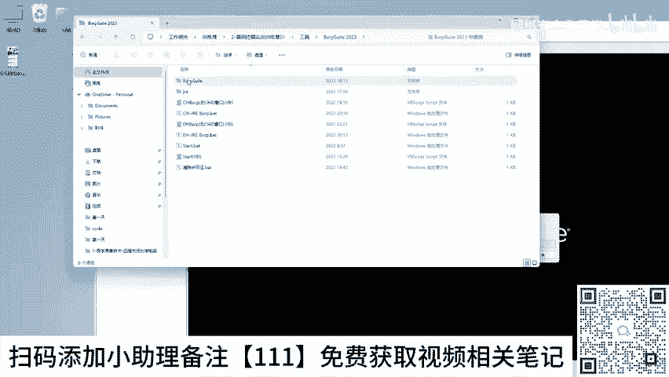
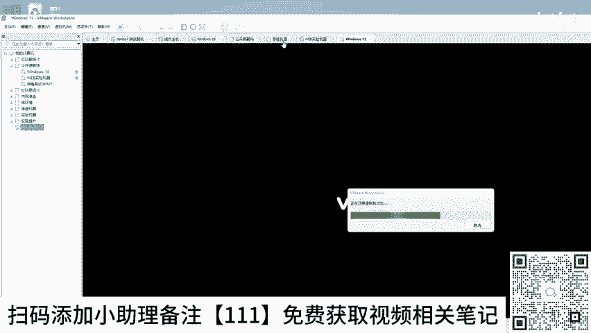

# 网络安全入门：P29：JDK安装和环境变量的配置

在本节课中，我们将学习如何为运行关键安全工具Burp Suite（简称BP）准备Java环境。Burp Suite是挖掘Web漏洞时最常用的工具之一，而Java环境是其运行的基础。我们将介绍一种无需复杂配置的简便方法，确保初学者也能顺利运行工具。

## 🛠️ 为什么需要Java环境？

上一节我们提到了Burp Suite的重要性，本节中我们来看看运行它的前提条件。Burp Suite是一个用于Web应用程序安全测试的工具，在挖掘网站（如京东、淘宝等）漏洞时，超过70%的情况会用到它。请注意，虽然Kali Linux等系统也集成了该工具，但在个人Windows系统上运行通常效率更高。

要运行Burp Suite，必须安装Java环境。然而，许多初学者在单独安装Java（如Java 8）和配置环境变量时常常遇到困难，甚至耗费数天时间。

为了解决这个难题，本教程提供的Burp Suite 2023中文版已**集成了Java环境**。这意味着你无需单独安装或配置Java，可以直接运行工具，简化了入门步骤。

## 📥 工具获取与准备

以下是获取工具的步骤。

1.  从提供的百度网盘链接（课程资料中）下载“BP2023”工具包。
2.  将下载好的工具包复制或解压到你的Windows 10或Windows 11电脑本地目录中。建议直接在物理机上操作，以获得最佳性能。

## 🚀 运行Burp Suite

接下来，我们演示如何运行已集成Java环境的Burp Suite。

1.  打开你存放工具的目录。
2.  找到可执行文件（通常为 `.jar` 或 `.exe` 文件）。
3.  双击该文件即可启动Burp Suite 2023中文版。

通过这种方式，无论你的电脑之前是否安装过Java，都能顺利运行最新版的Burp Suite工具，为后续的漏洞挖掘实践做好准备。

## 💎 课程总结

本节课中我们一起学习了运行Web安全测试工具Burp Suite的关键前置步骤——Java环境准备。我们了解到Burp Suite在漏洞挖掘中的核心地位，并掌握了一种无需复杂安装配置、直接双击即可运行的简便方法。这为后续实际进行漏洞挖掘与分析打下了坚实的基础。