# 网络安全入门：P2：什么是端口

在本节课中，我们将要学习网络通信中的一个核心概念——端口。理解端口是理解网络应用如何相互通信的基础。

## 概述

端口是网络通信中的关键标识。它帮助计算机区分不同的网络应用程序和服务，确保数据能够准确送达目标。本节将解释端口的定义、作用、分类以及如何查看系统中的端口。

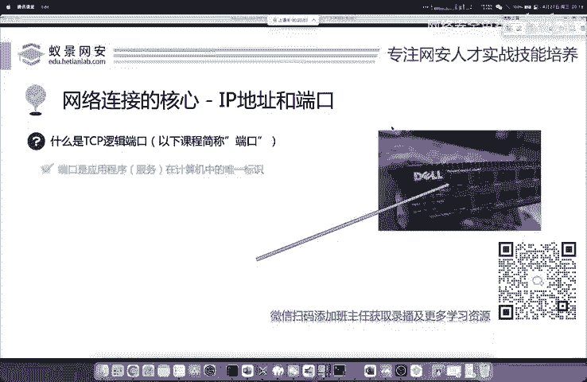

---

## 物理端口与逻辑端口

上一节我们介绍了网络的基本概念，本节中我们来看看端口。首先需要区分两种不同的端口。

您可能在路由器或交换机上看到过许多用于插网线的接口，这些是**物理端口**。它们负责物理层面的网络连接。

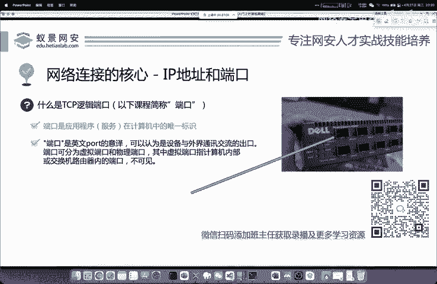

我们今天重点讲解的是操作系统虚拟出来的**逻辑端口**，也称为TCP/IP端口。逻辑端口是软件层面的概念，用于标识计算机上不同的网络应用程序或服务。

---

## 端口的作用

端口具体是做什么的呢？它的核心作用是实现应用程序的精准寻址。

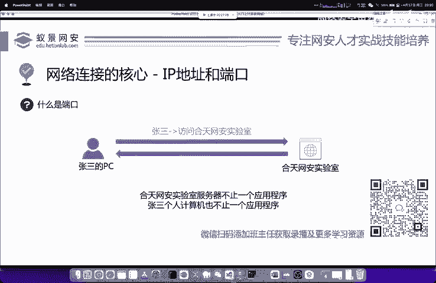

每台操作系统上都运行着多个网络应用，例如微信、QQ或浏览器。当我们发送一条微信消息时，这条消息需要准确到达目标电脑上的微信程序，而不是错发到其他程序（如QQ）。

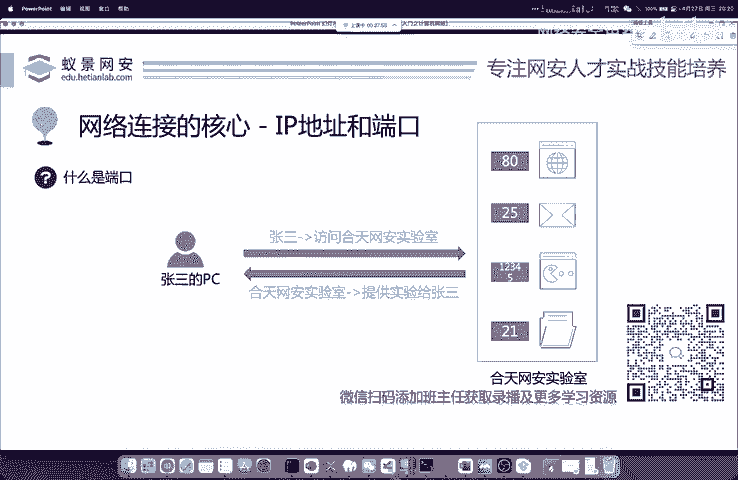

端口就是应用程序或服务在计算机上的**唯一标识**。通过“IP地址 + 端口号”的组合，网络数据可以精确地找到目标计算机上的特定程序。可以说，没有端口，仅凭IP地址无法完成应用层的网络通信。

---

## 端口的工作模型

为了更直观地理解，我们来看一个例子。假设张三要访问“核天网安实验室”的服务器。

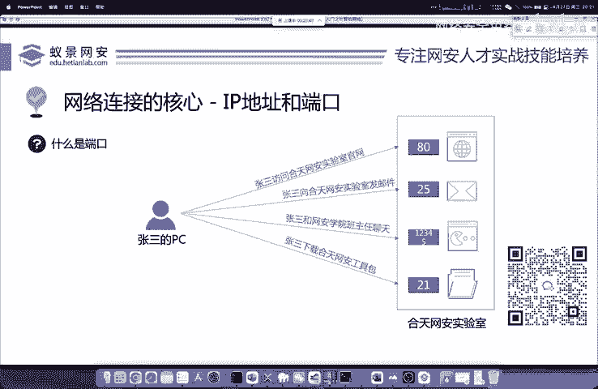

服务器（一个IP地址）上通常运行着多种服务，例如网站服务、邮件服务、文件传输服务等。这些服务分别运行在服务器不同的逻辑端口上。

当张三访问实验室的不同功能时，他实际上是在访问同一个IP地址下的不同端口：
*   浏览网站 → 访问 **Web服务端口**（如80端口）
*   发送邮件 → 访问 **邮件服务端口**（如25端口）
*   下载工具 → 访问 **文件服务端口**（如21端口）

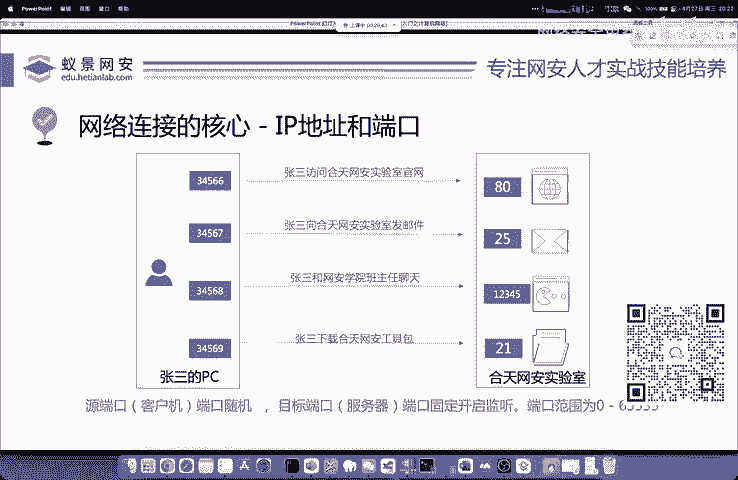

同时，张三自己的电脑也会为每个发起的网络连接分配一个**源端口**，用于接收返回的数据。这样就形成了“源IP:源端口”到“目标IP:目标端口”的端到端精确通信。这是TCP/IP协议的核心机制之一。

在数据包中，我们经常看到两个关键字段：
*   `source port`（源端口）
*   `destination port`（目的端口）

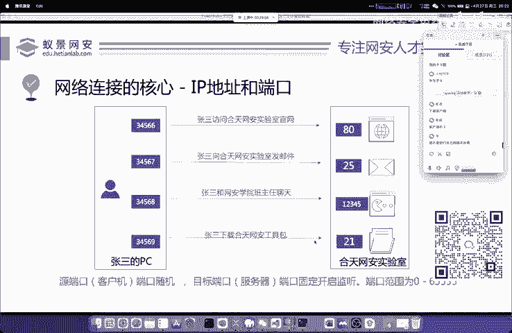

---

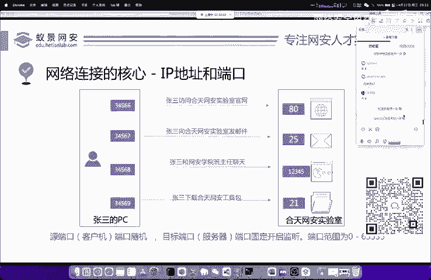

## 端口的范围与分类

逻辑端口的数量是有限的，其范围由TCP/IP协议规定。

TCP/UDP逻辑端口的范围是 **0 到 65535**。这是因为端口号使用16位二进制数表示，其最大值为 **2^16 - 1 = 65535**。

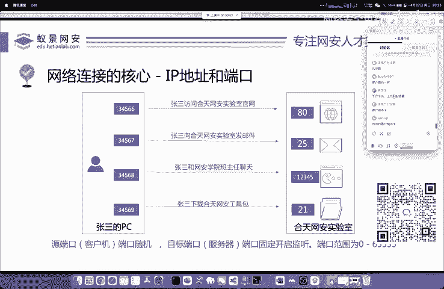

这个范围通常被分为三类：
*   **公认端口**：0 - 1023。分配给系统或知名服务使用（如HTTP:80, HTTPS:443, FTP:21）。
*   **注册端口**：1024 - 49151。分配给用户安装的应用程序使用。
*   **动态/私有端口**：49152 - 65535。通常用作客户端的临时源端口。


---

## 如何查看系统端口

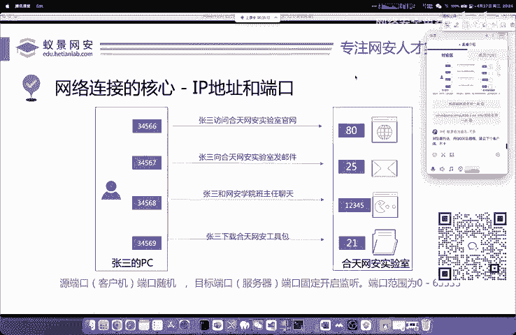

了解概念后，我们可以实践一下如何查看自己计算机上正在使用的端口。

以下是不同操作系统中查看网络连接和端口的常用命令：

**Windows系统：**
使用 `netstat` 命令。打开命令提示符（CMD），输入：
```cmd
netstat -ano
```
参数 `-ano` 表示显示所有连接、以数字形式显示地址和端口，并显示对应的进程ID。

**Linux/macOS系统：**
使用 `netstat` 或 `ss` 命令。在终端中输入：
```bash
# 使用 netstat
netstat -tunlp
# 或使用更现代的 ss 命令
ss -tunlp
```
这些命令能帮助你了解哪些端口正在监听连接，以及是哪个程序在使用它们。在渗透测试中，这是信息收集的常用步骤。

---

## 端口与Web渗透测试

我们为什么要特别关注端口，尤其是Web相关的端口呢？

因为对网站的渗透测试，很大程度上是针对**HTTP/HTTPS协议**及其默认端口（80/443）上运行的Web服务进行的。如果你不了解浏览器（客户端）如何通过端口与服务器上的Web服务进行通信，就无法理解攻击的入口点。

许多Web漏洞的挖掘和利用，都建立在对HTTP协议通信过程的深入分析和篡改之上。因此，理解端口是学习Web安全的第一步。

---

## 总结

本节课中我们一起学习了网络端口的核心知识：
1.  端口分为**物理端口**和**逻辑端口**，网络通信中主要指逻辑端口。
2.  端口是**应用程序的网络标识**，与IP地址结合实现数据的精准传输。
3.  端口的工作模型基于 **“IP:端口”** 的配对，区分源端口和目的端口。
4.  端口号范围是 **0-65535**，并分为公认端口、注册端口和动态端口。
5.  可以使用 `netstat` 或 `ss` 命令查看系统的端口使用情况。
6.  理解端口，特别是Web服务端口，是进行**网络安全渗透测试**的重要基础。

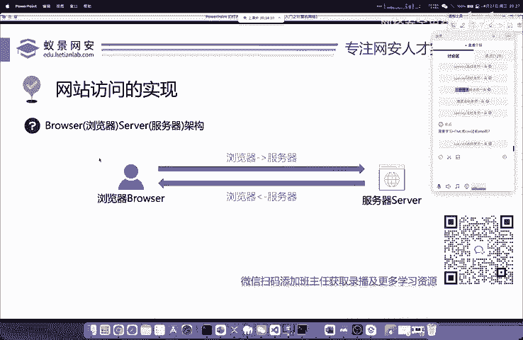

掌握端口的概念，将为后续学习更复杂的网络协议和攻击技术打下坚实的基础。