# 网络安全入门：P30：Burp Suite 安装与激活指南 🔧

在本节课中，我们将学习网络安全渗透测试中一个至关重要的工具——Burp Suite的安装与激活方法。Burp Suite是进行Web漏洞挖掘、安全测试的核心工具，理解其原理和掌握其安装是后续所有学习的基础。

## 工具原理：理解“中间人”角色

在开始安装之前，我们先了解一下Burp Suite的核心工作原理。它本质上扮演着一个“中间人”或“代理”的角色。

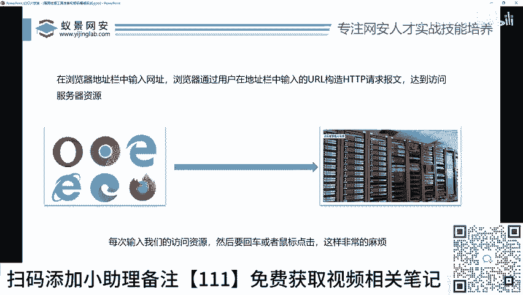

我们正常的网站访问流程是这样的：你的浏览器（客户端）通过网线将请求（例如访问“百度”）发送给服务器，服务器处理后再将结果返回给你的浏览器。这个过程是直接且透明的。

```
[你的浏览器] <-----> [目标服务器]
```

而Burp Suite介入后，流程变为：

```
[你的浏览器] <-----> [Burp Suite] <-----> [目标服务器]
```

你的所有网络流量都会先经过Burp Suite，再由它转发给目标服务器；服务器的响应也会先返回给Burp Suite，再由它传回你的浏览器。这就好比你想去超市买东西，但你把钱给了女朋友（Burp Suite），由她代你去购买并带回商品。

**核心价值**在于，Burp Suite拦截下流量后，我们可以对这些数据进行**查看、修改、重放或丢弃**。例如：
*   **修改请求**：将访问“百度”的请求，在Burp Suite中修改为访问另一个网站。
*   **丢弃请求**：直接丢弃请求，导致浏览器永远收不到响应。
*   **分析请求**：仔细检查请求的每个参数，寻找可能的安全漏洞。

正是这种对网络流量的完全控制能力，使得Burp Suite成为Web安全测试的瑞士军刀。

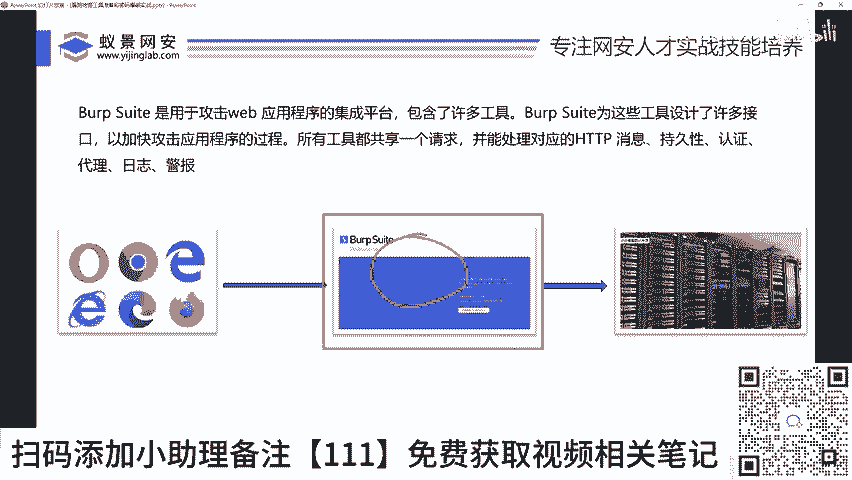

## 安装与激活步骤详解

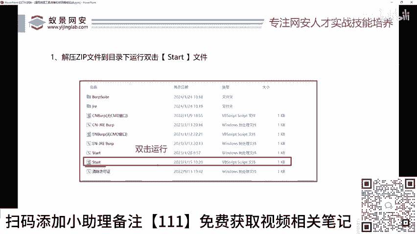

理解了原理后，我们开始进行具体的安装与激活操作。请确保你已从提供的资料中获取了Burp Suite的安装包。

### 第一步：启动安装加载器

首先，找到并运行名为 `Start` 的可执行文件。这个文件是激活过程的引导程序。

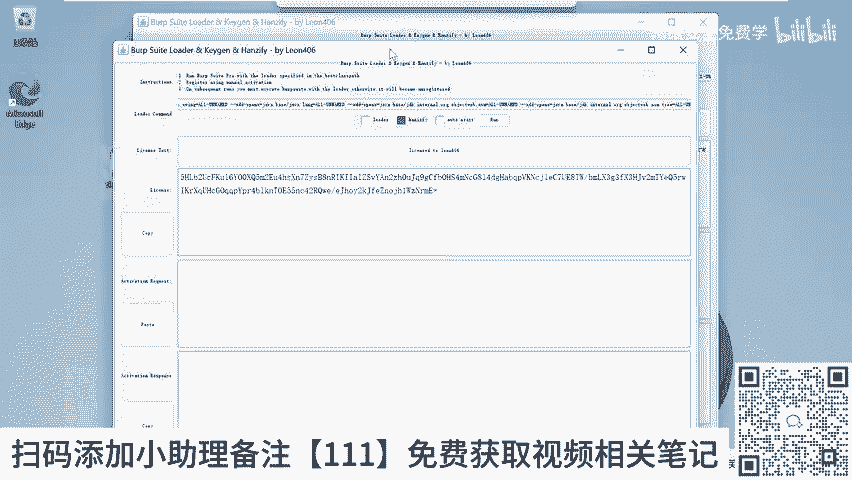

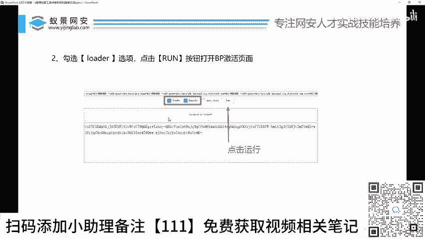

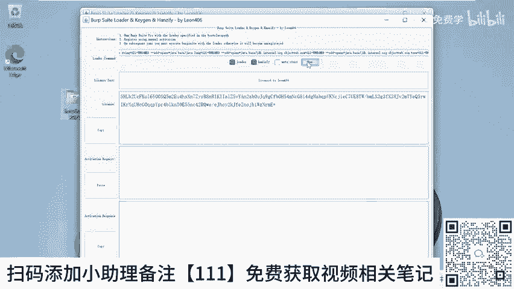

```
双击 `Start` 文件
```

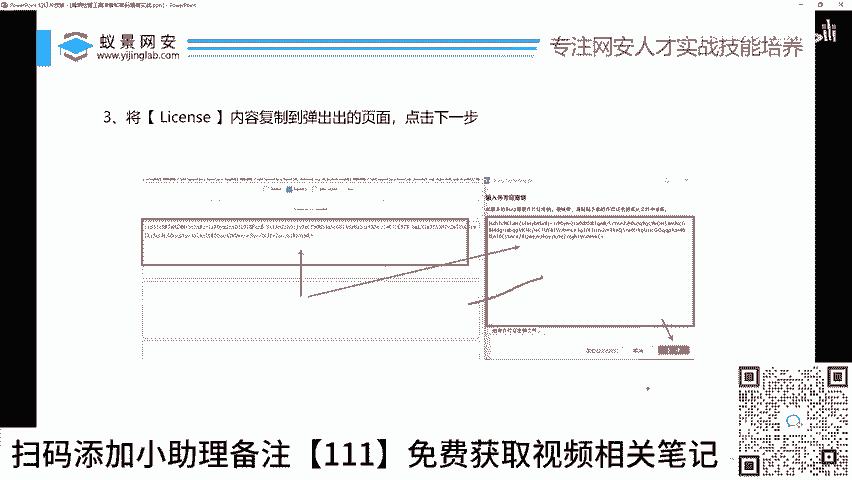

运行后，屏幕上会弹出一个配置窗口。

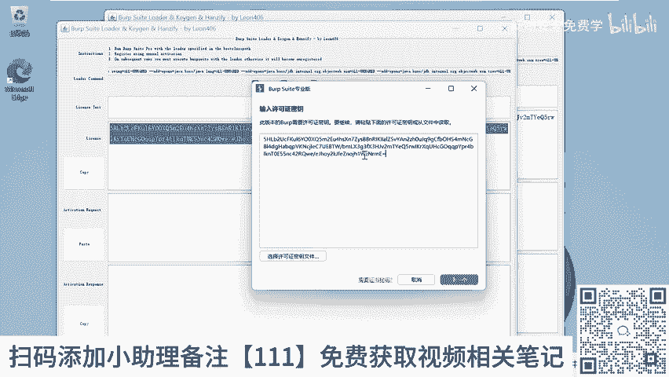

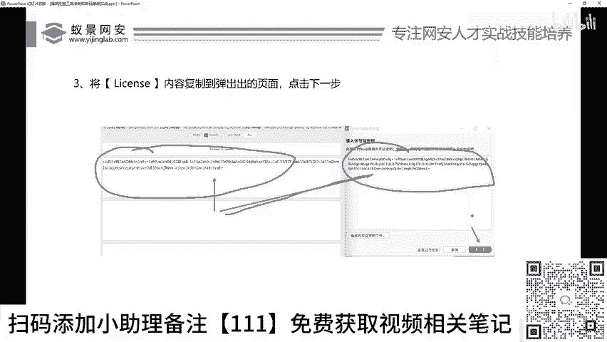

### 第二步：配置并运行Burp Suite

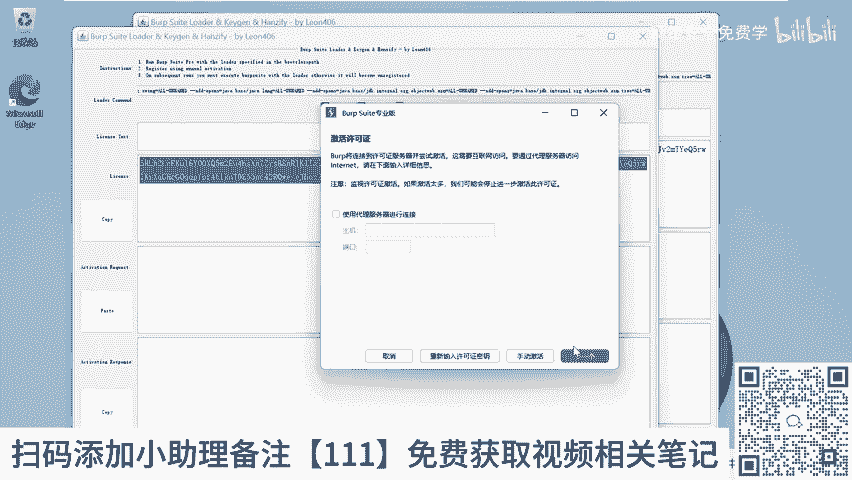

在打开的配置窗口中，你需要进行以下操作：
1.  勾选窗口中的两个日志选项（通常标记为 “Log” 或类似名称）。
2.  点击 **`Run`** 按钮。

这个操作会启动Burp Suite程序，并进入激活界面。此时，请点击 **`Accept`** 按钮接受许可协议。

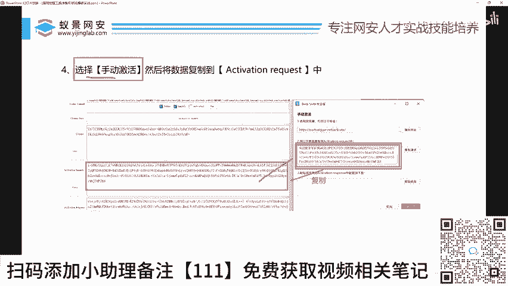

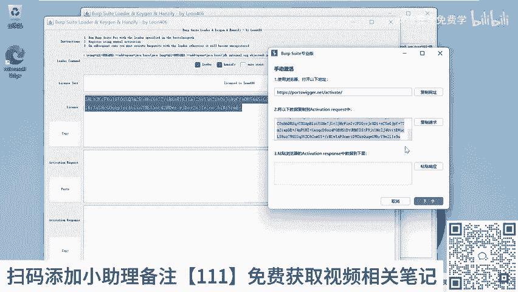

### 第三步：复制激活码（第一次复制）

启动激活器（即`Run`工具）后，界面中会显示一段特定的激活码。请完整复制这段代码。

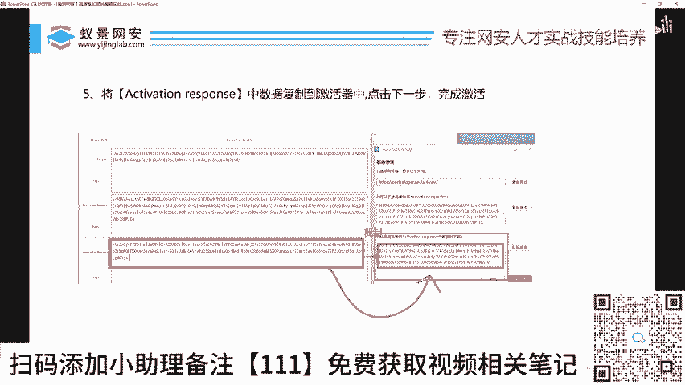

```
从“激活器”窗口中复制激活码
```

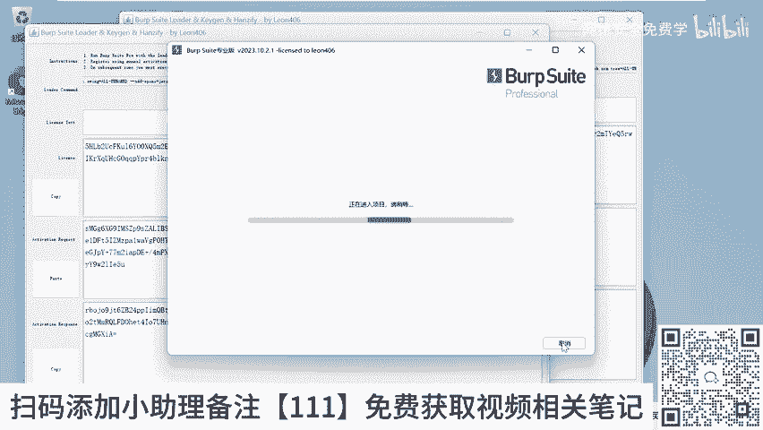

### 第四步：在Burp Suite中粘贴并选择手动激活

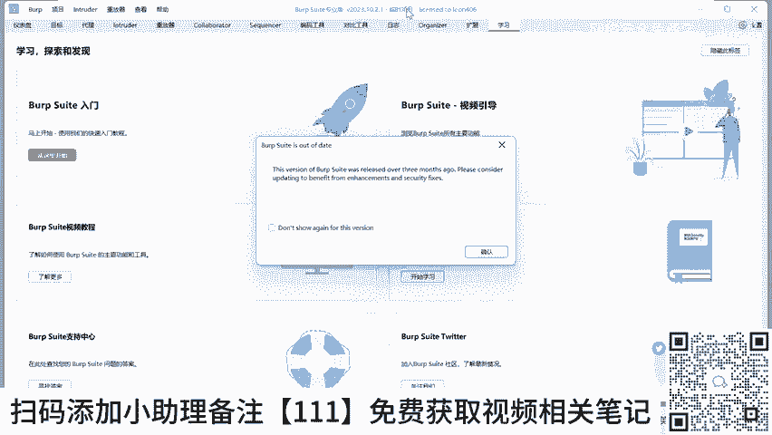

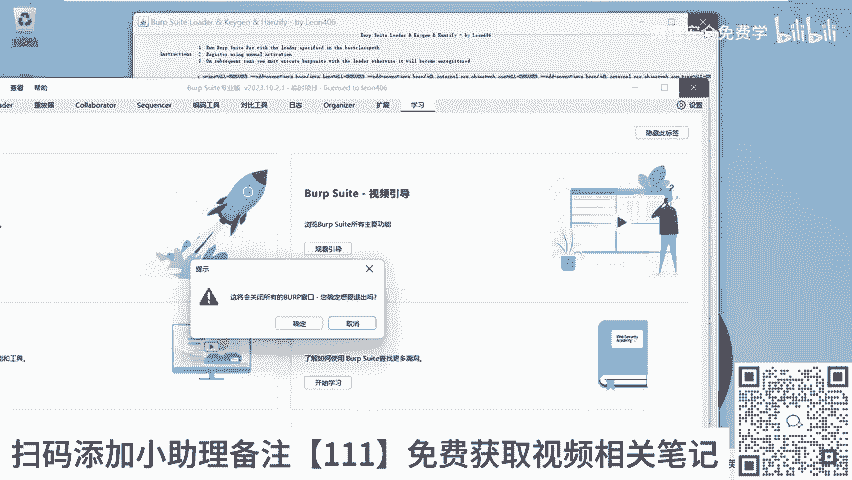

切换到Burp Suite的激活窗口，将上一步复制的激活码粘贴到指定的输入框中。然后，点击 **`Next`** 按钮。

在接下来的界面中，选择 **`Manual activation`**（手动激活）选项。此时，Burp Suite会生成另一段请求代码。

### 第五步：完成激活验证（第二次复制与粘贴）

这是激活的关键步骤，分为两小步：
1.  将Burp Suite生成的**请求代码**全部复制。
2.  切换回“激活器”窗口，将代码粘贴到中间区域的输入框中。
3.  此时，“激活器”会自动生成一段**响应代码**。请复制这段响应代码。
4.  再次切换回Burp Suite窗口，将响应代码粘贴到对应的输入框中。
5.  点击 **`Next`** 按钮。

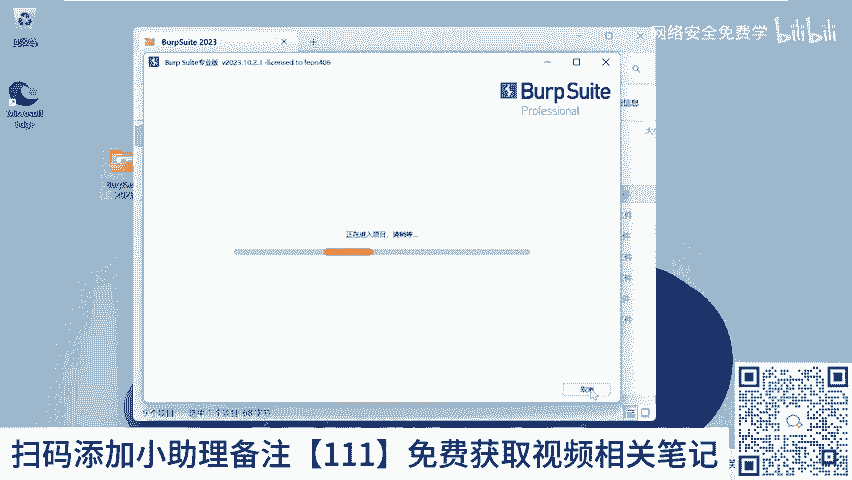

操作完成后，Burp Suite会提示激活成功。点击 **`Start Burp`** 即可启动已激活的Burp Suite。

### 后续使用说明

激活过程只需进行一次。以后每次使用时，你只需直接运行文件夹中的 `CN`（中文版）或 `EN`（英文版）可执行文件即可。

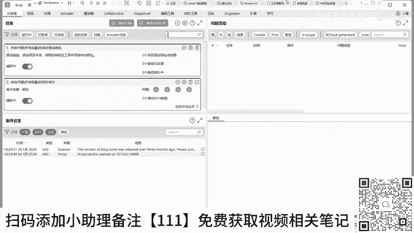

如果提示删除旧配置文件，直接确认删除即可，这不会影响激活状态。

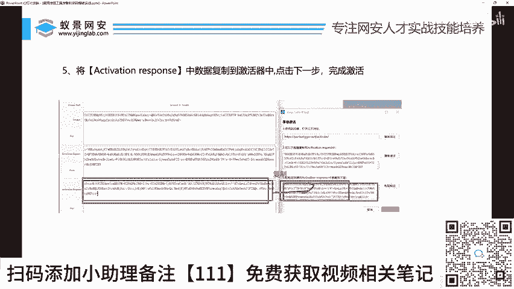


## 界面初览与总结

启动Burp Suite后，你会看到包含多个功能模块的界面，如`Target`（目标）、`Proxy`（代理）、`Scanner`（扫描器）等。初次接触可能觉得复杂，但不必担心，在后续课程中我们将逐一讲解核心功能的使用。

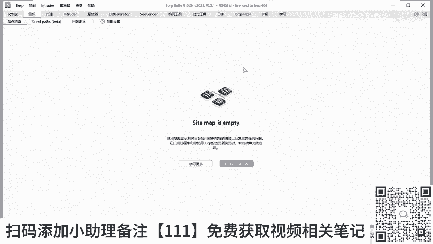

**本节课总结**：
我们一起学习了Burp Suite作为“中间人”代理工具的核心原理，并一步步完成了它的下载、安装与激活全过程。你现在已经拥有了进行Web渗透测试最强大的工具之一。请确保你的Burp Suite已成功激活，为接下来的实战操作做好准备。