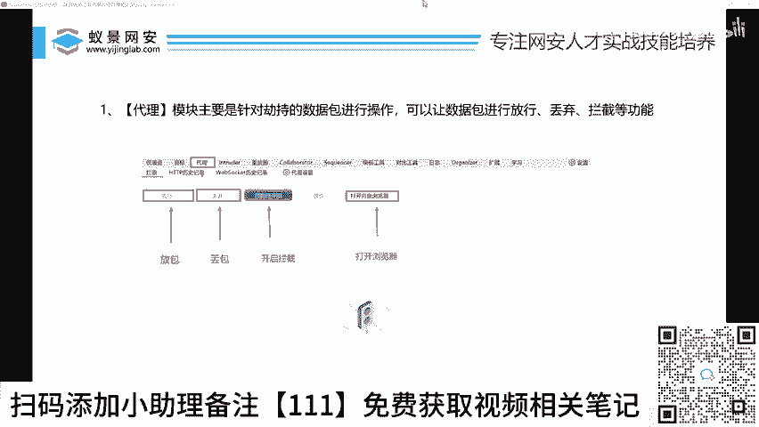
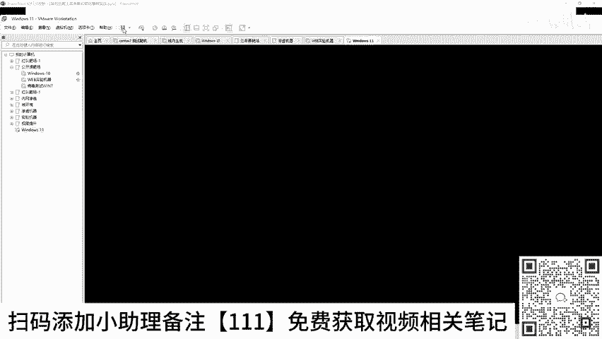
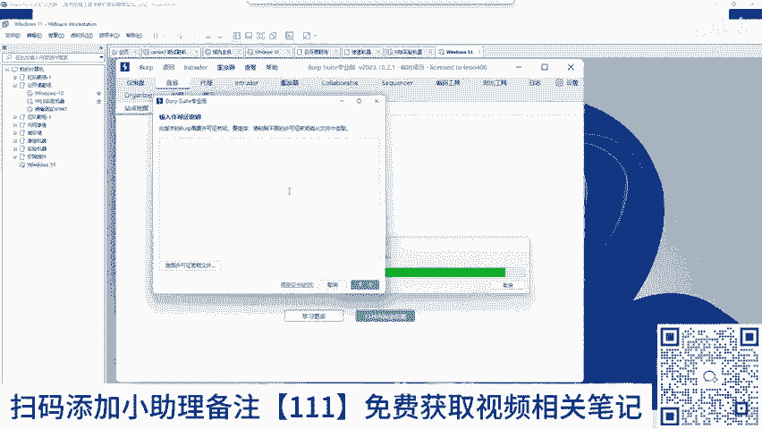
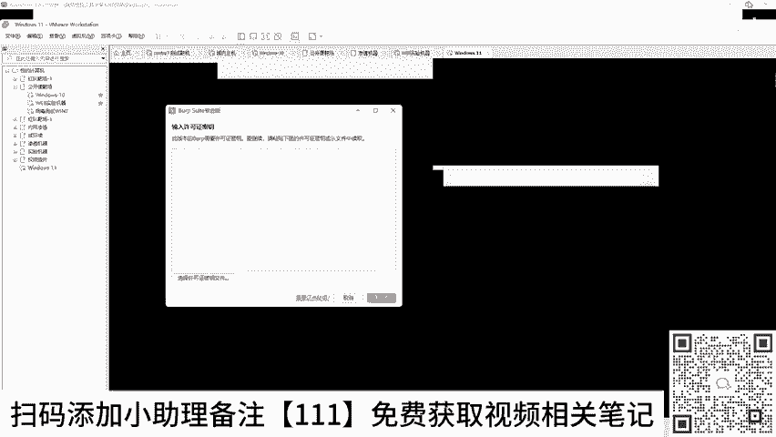
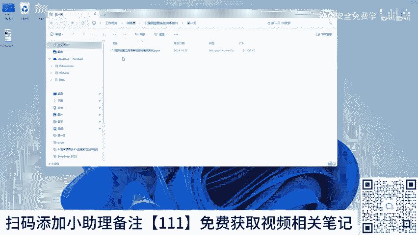
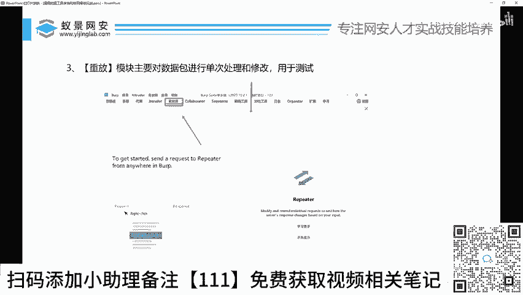

# Burp Suite 入门教程：P31：BP工具的基本使用操作指南

## 📖 概述
在本节课中，我们将学习网络安全渗透测试中至关重要的工具——Burp Suite（简称BP）的三个核心功能。掌握这些功能，你将能够完成日常工作中80%-90%的抓包、改包和漏洞测试任务。课程内容设计简单直白，适合初学者入门。

---

## 🔧 第一部分：代理模块

上一节我们概述了本课程的目标，本节中我们来看看BP的第一个核心功能：代理模块。代理模块是BP进行网络流量拦截和分析的基础。

代理模块位于BP主界面的“Proxy”标签页下。它的核心作用是拦截浏览器与目标服务器之间的所有HTTP/HTTPS通信，让你能够查看、修改或放行这些数据。

以下是代理模块需要掌握的四个关键操作：

1.  **打开内置浏览器**：后续进行漏洞挖掘时，务必从BP的内置浏览器发起访问。这避免了手动配置系统代理和安装证书的复杂过程，实现“开箱即用”。
2.  **拦截开关**：控制BP是否拦截经过的流量。开启时（按钮呈橙色），流量会被暂停在BP中；关闭时，流量直接放行。
3.  **放行**：当流量被拦截后，点击此按钮允许当前数据包继续发送至目标服务器。
4.  **丢弃**：当流量被拦截后，点击此按钮将当前数据包丢弃，不会发送至服务器。

**操作演示**：开启拦截后，在BP内置浏览器中访问 `www.baidu.com`，你会发现页面加载卡住。此时在BP的代理拦截界面可以看到百度的请求数据包。点击“放行”，请求被发送，浏览器页面正常显示；若点击“丢弃”，则请求被终止，浏览器显示加载失败。

可以将此过程类比为高速公路收费站：拦截开关控制闸杆的起落（拦截/放行），而“放行”和“丢弃”则决定对每一辆具体的车（数据包）是放行通过还是拒绝通行。

---

## ⚙️ 第二部分：Intruder模块

在掌握了如何抓包之后，本节我们来看看如何对数据包进行批量测试。Intruder模块是BP中用于自动化攻击和测试的强大工具，常用于密码爆破、参数模糊测试等场景。

Intruder模块位于BP主界面的“Intruder”标签页。它的核心功能是“批处理”，即自动替换HTTP请求中的特定参数值，并发送大量变体请求，然后对服务器的响应进行分析。

**核心概念解释**：假设你在测试一个登录接口，用户名是 `admin`，密码未知。你可以用BP拦截登录请求，然后在Intruder模块中将密码字段（例如 `password=123`）标记为攻击点。接着，提供一个密码字典（如 `123456`, `admin`, `password`, `abc123` 等）。Intruder会自动用字典中的每个密码替换原请求中的密码值，并逐个发送请求。通过观察服务器的响应（如响应长度、状态码、返回内容），可以判断哪个密码是正确的。

与接下来要讲的Repeater模块不同，Intruder是**自动化、批量**的测试工具。

---

## 🔁 第三部分：Repeater模块

上一节我们介绍了用于批量测试的Intruder，本节中我们来看看用于手动、单次测试的Repeater模块。这两个模块相辅相成，共同构成了BP的改包测试体系。

Repeater模块位于BP主界面的“Repeater”标签页。它的功能是手动修改单个HTTP请求，并可以反复地发送这个修改后的请求，同时观察每次的响应变化。

**功能对比**：
*   **Intruder**：**批量测试**。用于跑字典、进行模糊测试、暴力破解等需要发送大量请求的场景。
*   **Repeater**：**手动单次测试**。用于精细地修改某个参数（如Cookie、ID值），并观察服务器响应的细微变化，非常适合漏洞验证和逻辑分析。

例如，在Proxy中抓到一个数据包，你可以右键选择“Send to Repeater”。在Repeater中，你可以将参数 `id=1` 改为 `id=2` 或 `id=1'`（测试SQL注入），然后点击“Send”发送请求，立即在右侧窗口看到服务器返回的结果。

---

## 💡 总结与进阶思考

本节课我们一起学习了Burp Suite的三个核心功能：**代理抓包**、**Intruder批量测试**和**Repeater手动重放**。掌握这三点，你已具备了使用BP进行基础Web渗透测试的能力。

课程最后，你可能会产生新的疑问：数据包里的这些内容（如请求头、参数、Cookie）具体是什么意思？修改哪里才能发现漏洞？这涉及到HTTP协议和网站运行原理的更深层知识。

**下一步学习建议**：理解网站如何工作（客户端-服务器模型、HTTP请求/响应结构）是看懂和利用数据包的关键。建议在学习BP工具的同时，补充关于HTTP协议、HTML表单、会话管理（Cookie/Session）等基础知识，这样你的漏洞挖掘之路会更加顺畅。