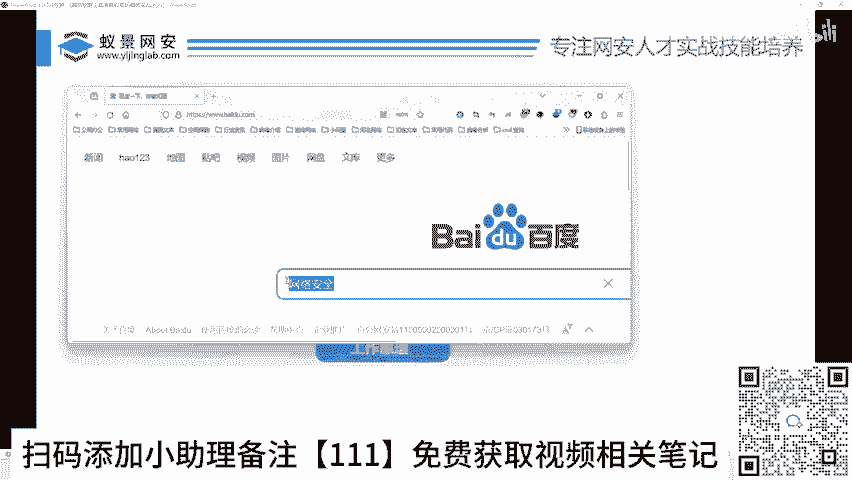
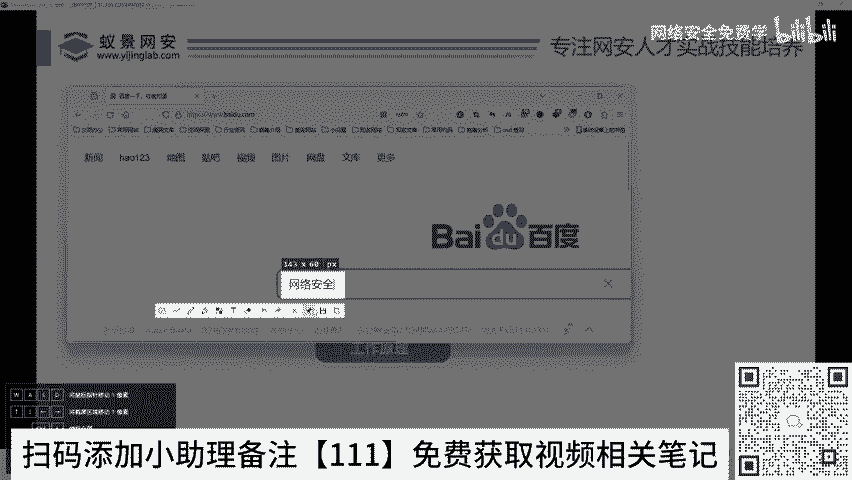
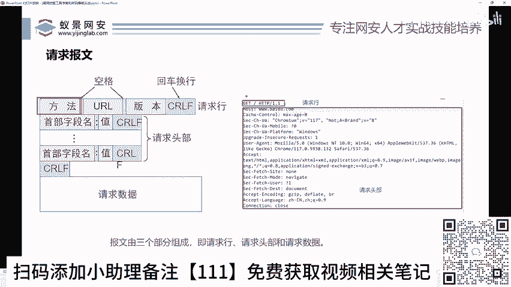
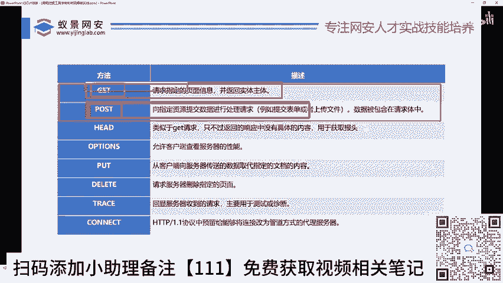
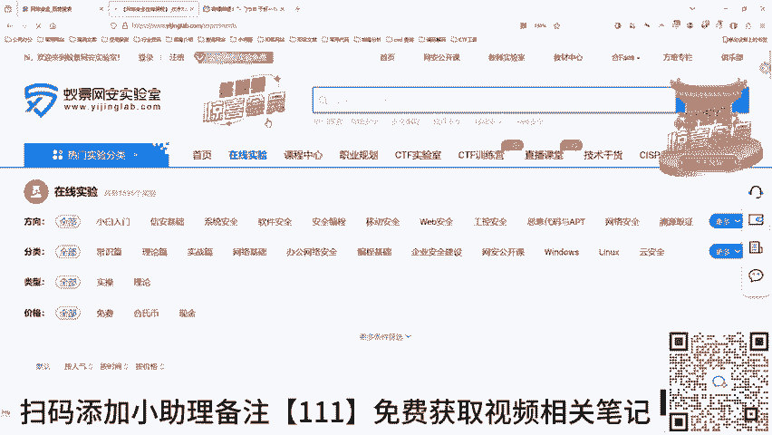
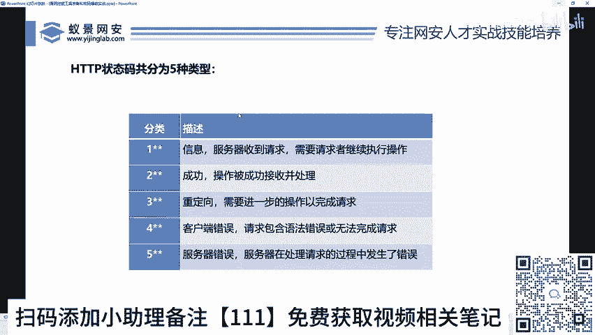

# 网络安全入门：P32：网站运行原理和HTTP协议介绍 🖥️

在本节课中，我们将要学习网站运行的基本原理以及HTTP协议的核心概念。理解这些是进行漏洞挖掘和网络安全分析的基础。

## 网站运行原理与HTTP协议概述 🌐

HTTP协议是超文本传输协议。理解协议的一个通俗方式是将其看作一种“语言”。例如，两个中国人交流使用中文。同理，你的浏览器要与百度服务器“对话”，就需要使用HTTP这种“语言”或协议。HTTP被设计用于Web浏览器和Web服务器之间的通信。

## HTTP协议的版本演进 📜

与语言会发展演变一样，HTTP协议也有其版本迭代过程。
*   **HTTP/0.9**：早期版本，功能较少。
*   **HTTP/1.0**：功能得到增强。
*   **HTTP/1.1**：**当前最广泛使用的版本**，功能更完善，通信效率更高。

版本升级意味着功能更丰富、语法更灵活、传输效率和信息承载能力更强。

## HTTP通信的工作原理 🔄



上一节我们介绍了HTTP协议本身，本节中我们来看看它是如何在实际中工作的。其核心模型是“请求-响应”。



1.  **客户端（浏览器）**：例如，你在浏览器地址栏输入 `www.baidu.com` 并搜索“网络安全”。
2.  **发送请求**：点击回车瞬间，包含“网络安全”关键词的**请求**通过网络发送给百度服务器。
3.  **服务器处理**：百度服务器收到请求。
4.  **返回响应**：服务器处理请求后，将“网络安全”相关的搜索结果作为**响应**返回给你的浏览器。
5.  **客户端展示**：你的浏览器接收并解析响应，将网页内容展示给你。

这个过程类似于你（客户端）对朋友（服务器）说一句话（请求），朋友听到后给你一个回复（响应）。

## 深入HTTP报文结构 📦

仅仅知道有请求和响应还不够，我们需要能看懂它们的具体内容，这些内容被称为“报文”。

### 捕获HTTP报文

我们可以使用代理工具（如Burp Suite）拦截浏览器发送的请求。例如，访问 `www.baidu.com` 时，工具会拦截到发送给百度的请求报文。

### 解析请求报文

一个HTTP请求报文主要包含以下三部分：

**1. 请求行**
位于报文第一行，格式为：`方法 URL 协议版本`
*   **方法**：表示请求的类型。最常见的是 `GET` 和 `POST`。
    *   `GET`：通常用于**获取**资源，如直接访问网页、点击链接。
    *   `POST`：通常用于**提交**数据，如登录时提交账号密码、上传文件。
*   **URL**：要访问的资源地址，如 `/` 表示网站的根目录。
*   **协议版本**：如 `HTTP/1.1`。

**示例请求行：**
```
GET / HTTP/1.1
```

**2. 请求头**
在请求行之后，包含一系列键值对，格式为 `字段名: 值`。它提供了关于请求或客户端的附加信息。
以下是常见的请求头字段：
*   `Host`：指定要访问的服务器域名（如 `www.baidu.com`）。
*   `User-Agent`：标识客户端浏览器和操作系统的信息。
*   `Cookie`：包含客户端的身份认证等状态信息。
*   `Accept-Language`：声明客户端能理解的语言。

**3. 请求体**
并非所有请求都有。`GET` 请求通常没有请求体，而 `POST` 请求会将提交的数据（如表单内容、文件）放在这里。

### 解析响应报文

服务器返回的响应报文结构如下：

**1. 状态行**
位于响应报文第一行，格式为：`协议版本 状态码 状态描述`
*   **状态码**：三位数字，表示请求的处理结果。
    *   `2xx`：**成功**。例如 `200 OK` 表示请求成功。
    *   `3xx`：**重定向**。需要客户端进一步操作以完成请求。
    *   `4xx`：**客户端错误**。例如 `404 Not Found` 表示请求的资源不存在。
    *   `5xx`：**服务器错误**。服务器处理请求时出错。
*   **状态描述**：对状态码的简短文字说明。

**示例状态行：**
```
HTTP/1.1 200 OK
```

**2. 响应头**
与请求头类似，包含服务器返回的元信息，如服务器类型、内容类型等。



**3. 响应体**
这是响应报文的核心，包含了服务器返回的实际内容。例如，访问百度时，响应体就是构成百度首页的HTML、CSS、JavaScript代码。你的浏览器会解析这些代码，最终渲染成你看到的网页界面。

## 核心概念总结与回顾 🎯

本节课中我们一起学习了网站通信的基础——HTTP协议。






*   **HTTP协议** 是浏览器与服务器通信的“语言”。
*   通信基于 **请求-响应** 模型：客户端发起请求，服务器返回响应。
*   HTTP报文分为 **请求报文** 和 **响应报文**。
*   **请求报文** 包含：
    *   **请求行**（方法、URL、版本）
    *   **请求头**（附加信息）
    *   **请求体**（提交的数据，`POST`请求常用）
*   **响应报文** 包含：
    *   **状态行**（版本、状态码、描述）
    *   **响应头**（服务器信息）
    *   **响应体**（返回的实际内容，如网页代码）
*   最常用的两种请求方法是：
    *   `GET`：用于获取资源。
    *   `POST`：用于提交数据。
*   **状态码** 快速判断结果：`2xx`成功，`4xx/5xx`错误。



理解并能够分析HTTP报文，是后续进行Web漏洞挖掘、渗透测试和安全分析的关键第一步。在接下来的课程中，我们将学习如何利用这些知识来发现和利用安全漏洞。