# 网络安全实战：P33：实战利用BP挖掘口令漏洞

在本节课中，我们将学习如何利用Burp Suite（BP）工具，通过实战案例来挖掘与账号密码相关的安全漏洞。我们将从真实案例入手，理解漏洞原理，并一步步演示如何发现和验证这些漏洞。

## 概述

账号密码是系统安全的第一道防线，但往往也是最薄弱的一环。本节课我们将聚焦于利用Burp Suite工具，实战挖掘两类常见的口令相关漏洞：**用户枚举**和**弱口令/密码泄露**。我们将通过真实的漏洞赏金案例和本地靶场环境，手把手教你从发现到验证的完整流程。

## 案例引入：理解漏洞的价值

在进入实战操作之前，我们先通过几个真实案例，了解这类漏洞的实际形态和价值。这能帮助你建立直观的认识，明白我们所学技术的实际应用场景。

### 案例一：UC浏览器的用户枚举漏洞

第一个案例来自UC浏览器（阿里巴巴旗下）的一个注册页面。

*   **漏洞场景**：在用户注册时，输入一个已存在的用户名（例如“alice”），系统会明确提示“该用户名已存在，请用其他用户名”。
*   **漏洞原理**：攻击者可以利用此响应差异，批量测试大量用户名（如“bob”、“jack”等）。通过观察系统返回的是“用户名已存在”还是其他提示（如“注册成功”或“密码错误”），就能判断哪些用户名已在系统中注册。
*   **漏洞名称**：这种漏洞称为**任意用户枚举**。
*   **实际价值**：该漏洞被提交到漏洞赏金平台后，获得了80元人民币的奖励。挖掘方法正是使用Burp Suite的批量测试功能。

这个案例表明，一个看似简单的提示信息差异，就可能构成安全漏洞。

### 案例二：后台系统的弱口令与SQL注入

第二个案例涉及一个需要账号密码登录的后台管理系统。

*   **漏洞场景**：发现一个后台登录页面，但不知道账号密码。
*   **攻击过程**：
    1.  使用Burp Suite对登录接口进行**暴力破解**，尝试了大量常见的用户名和密码组合（字典攻击），最终成功破解出正确的账号密码。
    2.  登录系统后，在内部功能点中利用SQL注入扫描工具（如sqlmap），发现了一个**SQL注入漏洞**。
*   **实际价值**：该SQL注入漏洞属于“零日漏洞”（未被公开的漏洞），具有较高价值。虽然最终选择上报给国家信息安全漏洞平台（CNVD）而非出售，但其潜在价值可达数千元。

这个案例的关键在于**突破登录入口**。一旦进入系统，发现深层漏洞的难度会大大降低。

### 案例三：企业系统的弱口令与信息泄露

第三个案例同样是一个后台系统。

*   **漏洞场景**：通过弱口令（账号：`admin`，密码：`123456`）成功登录某集团后台系统。
*   **危害**：在系统内访问到了包含集团组织架构、员工姓名、手机号、身份证号、家庭住址等敏感信息的文件。
*   **实际价值**：此漏洞因危害较大，同样获得了CNVD颁发的原创漏洞证明。

这些案例都获得了与“衡水中学学生获信息安全奖项”新闻中同类型的CNVD证书，证明了其技术价值和合法性（在授权或合规范围内挖掘）。

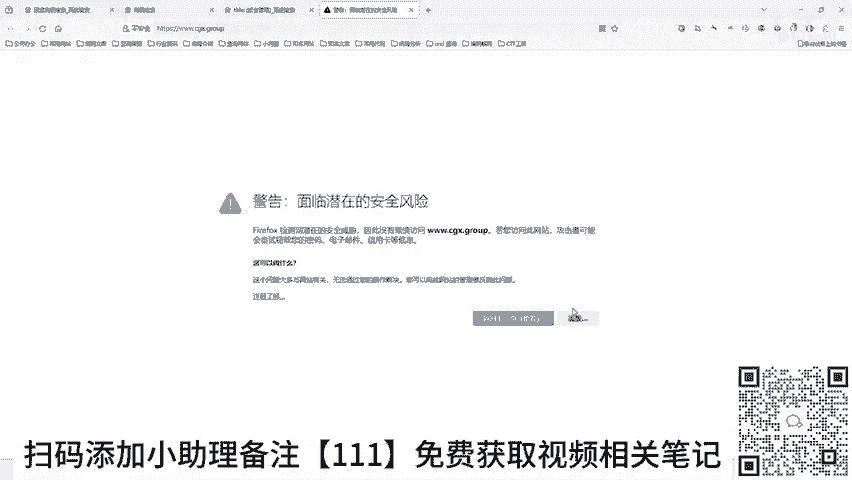

## 漏洞类型与挖掘思路

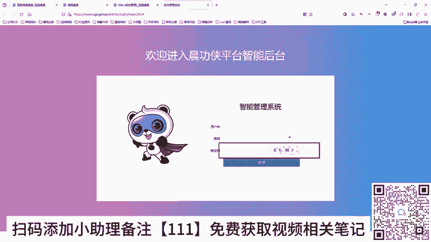

基于以上案例，我们可以总结出几种常见的账号密码相关漏洞：

1.  **用户枚举**：系统对已存在用户和不存在用户的返回信息有差异，导致攻击者可以批量探测有效用户名。
2.  **弱口令**：账号密码设置得过于简单或常见（如`admin/123456`），容易被暴力破解或猜测。
3.  **密码泄露**：密码被硬编码在网页前端源代码、JavaScript文件或配置文件中，可直接查看。

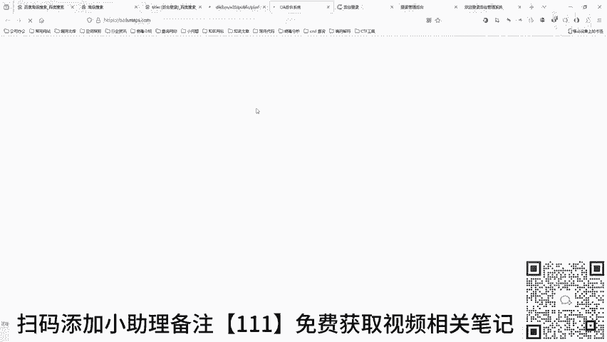

那么，如何开始寻找这类漏洞呢？核心思路是**寻找登录入口**。

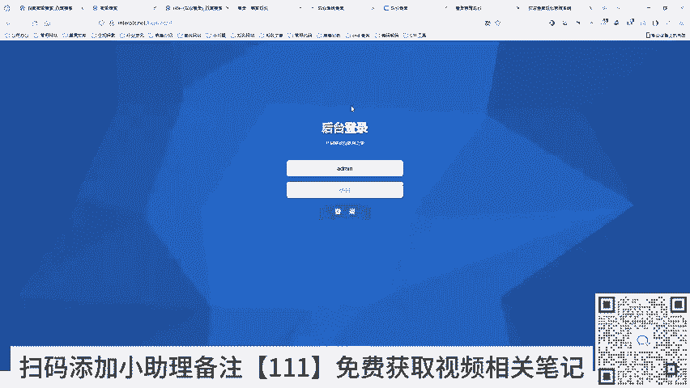

## 实战演练：寻找与测试登录入口

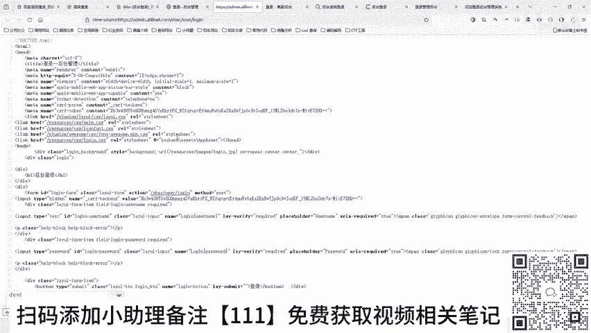

我们将使用**百度高级搜索**来寻找可能存在漏洞的测试目标（请注意：未经授权的测试属于违法行为，以下仅为教学演示，请仅在授权环境或专用靶场中练习）。

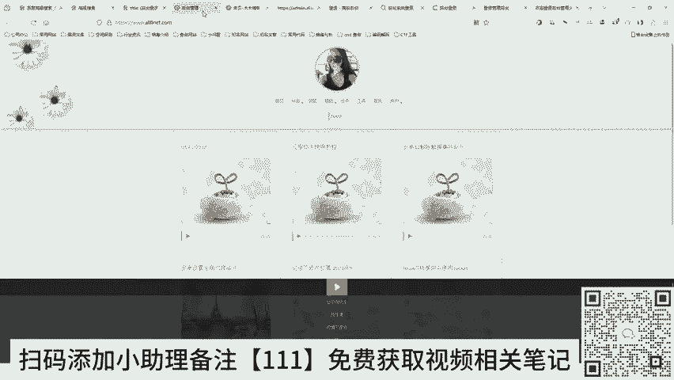

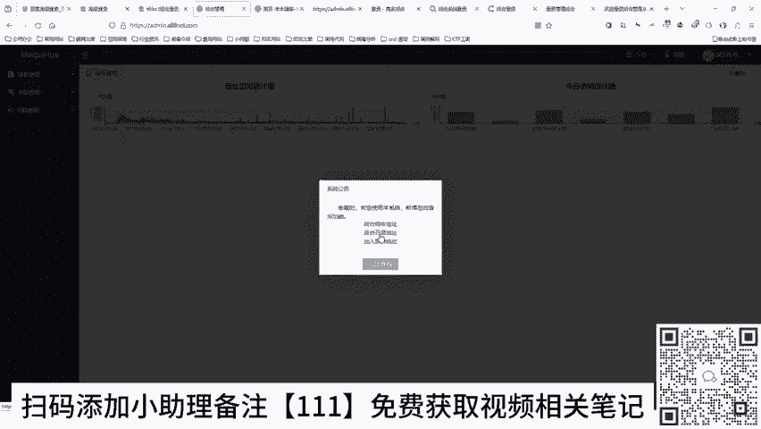

**搜索技巧**：在百度搜索中，使用 `intitle:后台登录` 或 `intitle:后台管理` 等语法，可以精准找到标题中含有这些关键词的网页，其中很多就是系统的登录页面。

我们会发现大量后台登录页面。教学演示中，我们筛选出两个具有代表性的例子进行讲解。

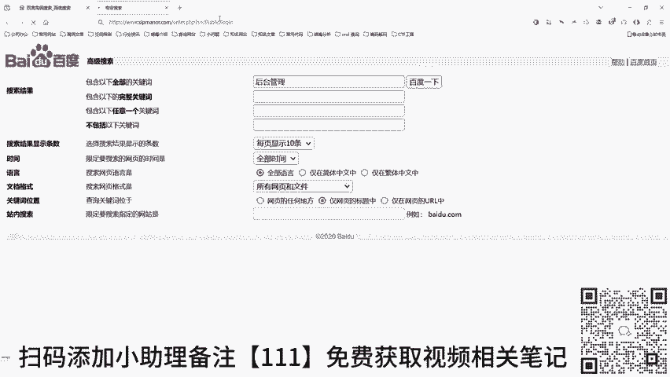

### 示例一：密码明文泄露

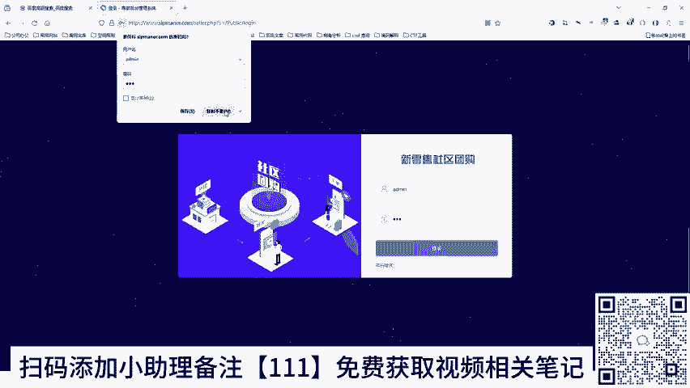

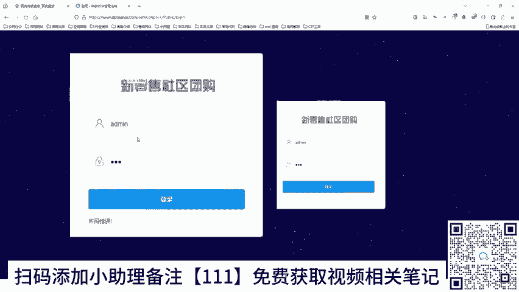

打开第一个网站，发现其登录框下方直接显示了默认账号密码：`demo / 123456`。

*   **测试**：直接使用这组凭据尝试登录，成功进入系统后台。后台中存在真实的用户数据、博客文章和访问记录，证明这不是演示系统，而是真实的、存在漏洞的站点。
*   **漏洞原理**：这种将凭据直接展示在页面上的行为，属于严重的**密码泄露**。更隐蔽的情况是密码被写在网页的HTML源码或JavaScript代码中，需要按`F12`打开开发者工具进行搜索才能发现。

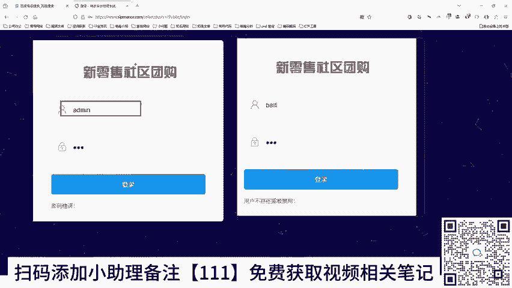

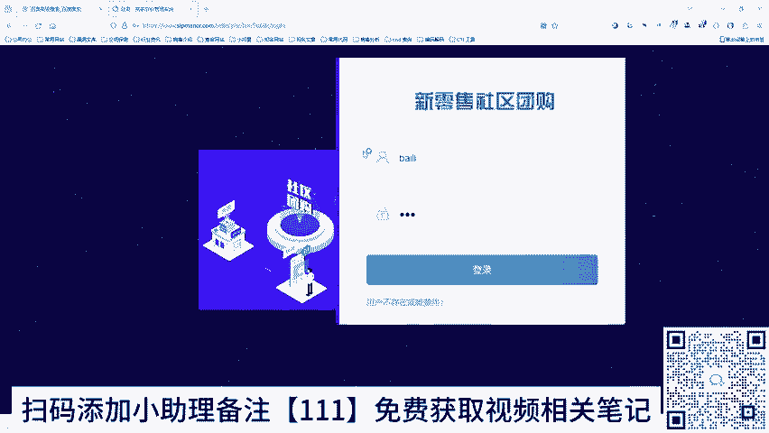

### 示例二：用户枚举漏洞

打开第二个网站（新零售社区）。

*   **测试步骤**：
    1.  输入用户名 `admin`，任意密码（如`123`），点击登录。系统返回“**密码错误**”。
    2.  输入一个随机用户名（如`baili`），相同密码，点击登录。系统返回“**用户不存在或被禁用**”。
*   **漏洞原理**：系统对“用户存在但密码错误”和“用户不存在”两种情况返回了**不同的错误信息**。攻击者利用这个差异，就能批量验证哪些用户名是系统中存在的（即`admin`存在）。这就是典型的**用户枚举漏洞**。

发现存在用户枚举漏洞后，下一步就是对存在的用户（如`admin`）进行密码暴力破解。

## 使用Burp Suite进行暴力破解

我们将在本地漏洞靶场（如DVWA、Pikachu等）中演示完整的暴力破解流程。请确保你是在合法的靶场环境中进行以下操作。

**核心步骤**：

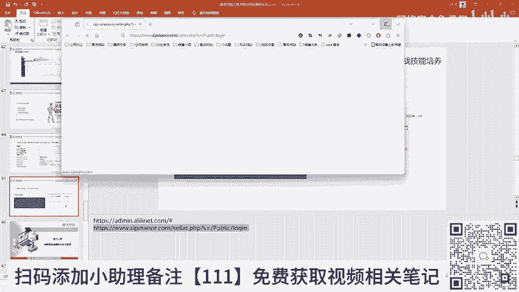

1.  **拦截请求**：在Burp Suite中开启代理拦截，在靶场登录页面输入已知用户名（如`admin`）和一个错误密码，点击登录。Burp Suite会拦截到这个HTTP请求数据包。
2.  **发送到Intruder**：在拦截到的数据包上右键，选择 `Send to Intruder`。Intruder是Burp Suite用于自动化攻击和参数爆破的模块。
3.  **设置攻击位置**：
    *   在Intruder的 `Positions` 标签页，清除默认标记。
    *   在请求数据包中，用鼠标选中密码参数的值（即我们输入的错误密码）。
    *   点击 `Add §` 按钮，将这个值标记为攻击点。Burp Suite会用 `§` 符号将其包围。
4.  **配置攻击载荷（Payload）**：
    *   切换到 `Payloads` 标签页。
    *   这里可以加载密码字典。你可以使用Burp自带的简单字典，也可以导入自己收集的更强大的字典文件（如课程提供的“常用密码字典.txt”）。
    *   点击 `Load...` 从文件导入你的密码字典。
5.  **开始攻击**：点击 `Start attack` 按钮，Burp Suite会开始自动用字典中的密码替换标记位置，并发送大量请求。
6.  **分析结果**：攻击完成后，如何判断哪个请求是成功的？
    *   **关键指标：响应长度（Length）**。通常，登录失败和登录成功的页面内容长度不同。
    *   在攻击结果列表中，观察每个请求的响应长度。找出长度与其他大多数请求明显不同的那一个。
    *   点开这个特殊长度的请求，查看响应内容，通常会看到“登录成功”、“跳转”等关键词，从而确认破解出了正确密码。

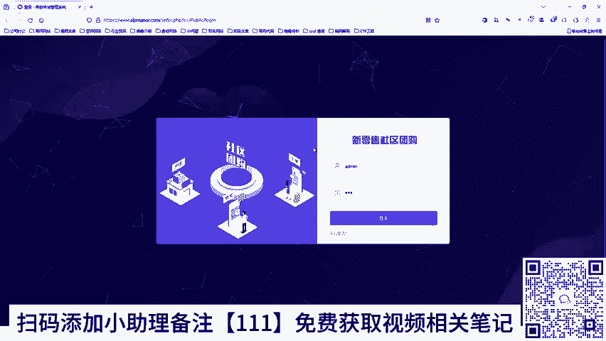

以下是配置攻击的代码逻辑示意（非实际代码，用于理解过程）：
```http
# 原始拦截的请求（密码位置已被标记）
POST /login HTTP/1.1
Host: target.com
...
username=admin&password=§wrongpassword§

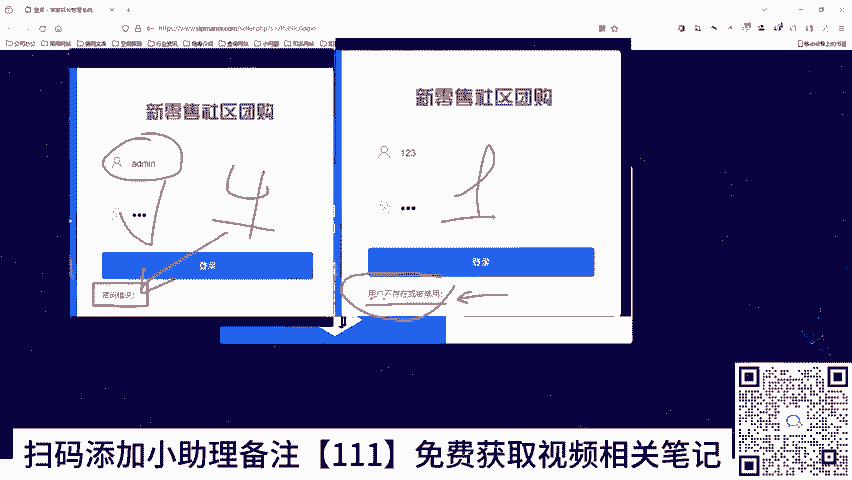

# Intruder的工作就是不断替换 §wrongpassword§ 部分
# 第一次尝试：password=123456
# 第二次尝试：password=password
# 第三次尝试：password=admin
# ... 直到字典耗尽
```

通过以上流程，我们就完成了从发现登录页面、识别用户枚举漏洞到实施密码暴力破解的全过程。UC浏览器的80元漏洞、以及案例二中的后台突破，都是采用与此完全相同的技术方法挖掘的。

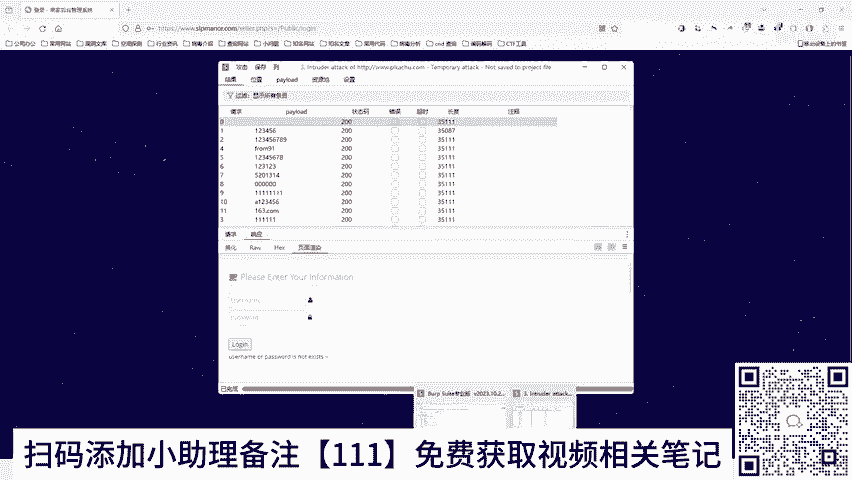

## 总结与预告

本节课中，我们一起学习了利用Burp Suite挖掘口令相关漏洞的实战技能：

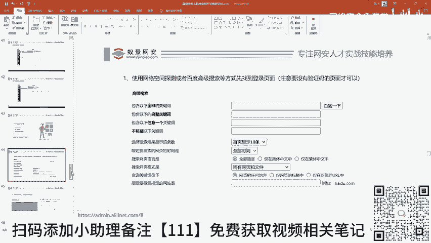

1.  **理解了漏洞价值**：通过真实赏金案例和CNVD证书，认识到用户枚举、弱口令等漏洞的严重性和实际收益。
2.  **掌握了挖掘思路**：使用搜索引擎高级语法寻找登录入口，并通过差异响应识别用户枚举漏洞。
3.  **演练了核心操作**：在授权靶场中，完整演练了使用Burp Suite拦截请求、设置Intruder攻击、加载字典并进行密码暴力破解的流程，并学会了通过**响应长度**判断攻击结果。

当然，现实中的系统往往没有这么简单，它们会设置验证码（图片、短信）来防止自动化攻击。**不要灰心，这正是我们下节课要攻克的内容**。在下一讲中，我们将学习如何绕过或利用这些验证码机制，发现诸如短信轰炸、验证码回显、绑定绕过等更深入的漏洞。

请记住：所有技术学习都应在法律和道德允许的范围内进行，使用本地靶场或获得明确授权的系统进行练习，是成为一名合格安全研究员的第一步。