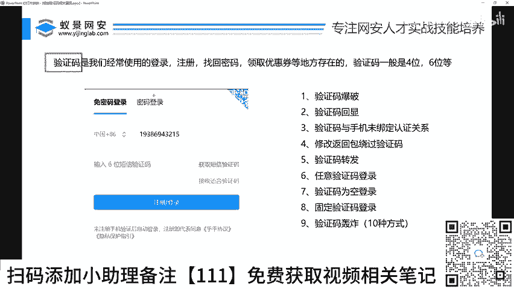
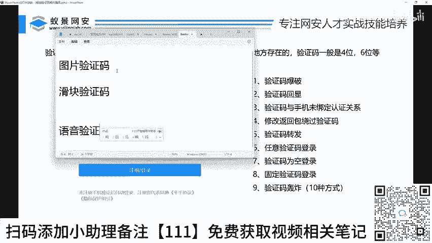
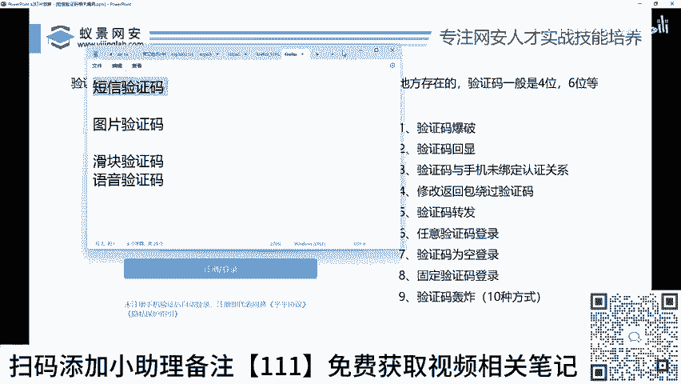
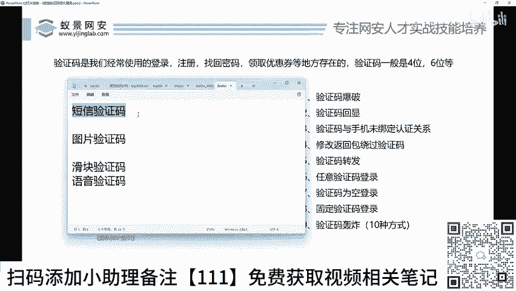
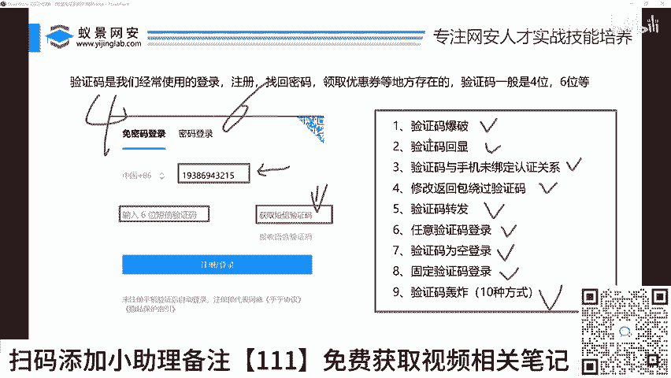

# 网络安全：P34：短信验证码相关逻辑漏洞介绍 🔓

在本节课中，我们将要学习短信验证码相关的常见逻辑漏洞。这些漏洞是渗透测试和Web安全中经常遇到的一类问题，理解它们有助于我们评估和加固系统的安全性。

## 验证码类型概述

验证码是用于区分人类用户和自动化程序的一种安全机制。市面上存在多种验证码形式。

以下是几种常见的验证码类型：
*   **短信验证码**：通过手机短信发送的数字或字母组合。
*   **图片验证码**：显示包含扭曲数字或字母的图片，需要用户识别并输入。
*   **滑块验证码**：通过拖动滑块完成拼图或轨迹验证。
*   **语音验证码**：通过语音电话播报验证码内容。

每种验证码都有其对应的攻击方式。本节课我们聚焦于**短信验证码**，因为它在各类应用（如用户注册、登录、密码找回）中使用最为广泛，可能占据了百分之七八十的市场份额。

## 短信验证码漏洞原理

短信验证码的功能模块通常很简单：用户输入手机号，点击“获取验证码”，系统将一串数字（通常是4位或6位）发送到对应手机，用户输入这串数字以完成验证。

我们的核心目标是学习**绕过**这个限制的思路，即在不知道正确验证码或非本人手机号的情况下，突破验证，从而可能访问他人的账户或系统。针对不同位数的验证码，存在不同的攻击方式。

## 九种常见漏洞类型

关于短信验证码的漏洞或绕过方法，可以归纳为以下九种主要类型。

以下是九种具体的漏洞类型：
1.  **短信验证码爆破**：利用工具自动、大量地尝试所有可能的验证码组合（如0000-9999），直到猜中为止。
2.  **短信验证码回显**：验证码在页面的HTML源代码、响应包或前端JavaScript变量中直接显示出来。
3.  **验证码与手机号未绑定认证**：系统在验证时，只检查输入的验证码是否正确，而未校验该验证码是否由当前请求的手机号接收。
4.  **返回包返回验证码**：服务器在响应“获取验证码”的请求时，直接在HTTP响应包的数据体中返回了验证码明文。
5.  **短信验证码转发**：攻击者诱骗受害者将收到的验证码转发给自己，从而完成验证。
6.  **短信验证码任意验证码登录**：系统存在逻辑缺陷，导致输入任意验证码（甚至特定字符串）都能通过验证。
7.  **短信验证码为空**：提交请求时，验证码参数为空值（NULL或空字符串）也能通过校验。
8.  **短信验证码固定**：系统使用一个长期不变或非常容易预测的固定验证码（如“000000”）。
9.  **短信验证码轰炸**：利用接口缺陷无限制地发送验证码短信，对目标手机号进行骚扰攻击。

这些都属于短信验证码相关的安全漏洞。在实际测试中，只要能发现其中任何一个漏洞，都可能存在安全风险。当然，挖掘漏洞需要针对正确的目标和场景。

## 总结

本节课中，我们一起学习了短信验证码的常见逻辑漏洞。我们首先了解了验证码的多种类型，并明确了本节课的重点是短信验证码。接着，我们分析了短信验证码的基本工作原理和攻击目标。最后，我们详细列举并简要解释了九种主要的绕过或利用方式，包括爆破、回显、绑定缺失等。理解这些漏洞是进行有效安全测试和防御的基础。