# 网络安全：P35：短信验证码爆破漏洞挖掘 🔓

在本节课中，我们将要学习一种非常基础但常见的网络安全漏洞——短信验证码爆破。我们将了解其原理、利用方法，并使用Burp Suite工具进行实际操作演示。

## 概述

短信验证码爆破是一种利用系统未对验证码输入次数进行限制的漏洞，通过自动化工具尝试所有可能的验证码组合，从而在有效期内获取正确验证码的攻击方式。

## 原理与技巧

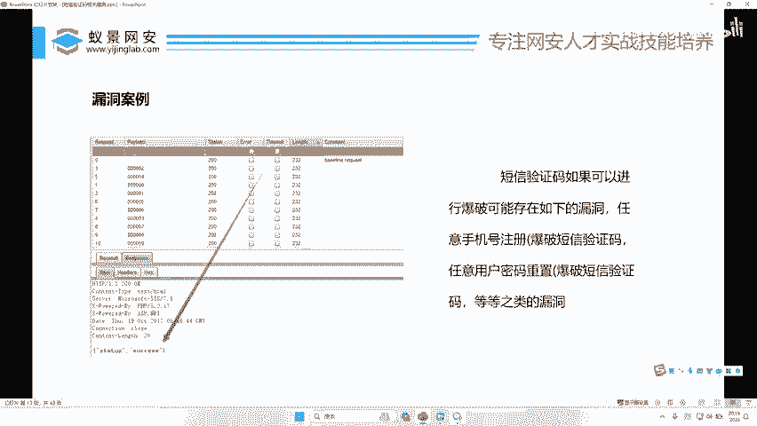

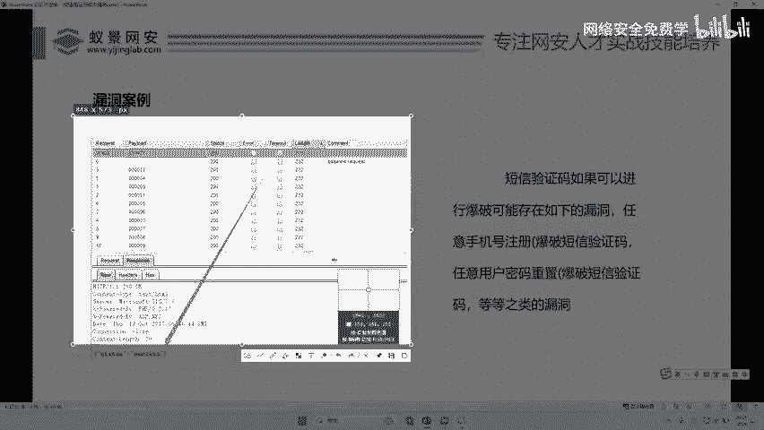

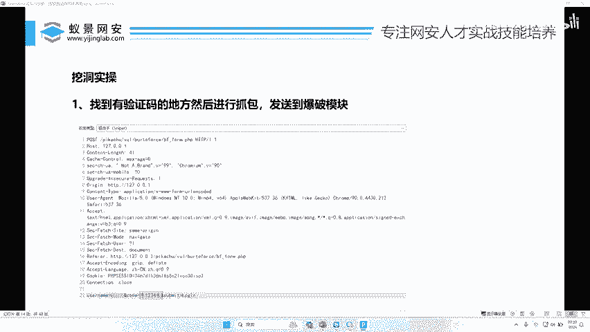

上一节我们介绍了课程概述，本节中我们来看看短信验证码爆破的具体原理。


短信验证码在发送给用户时，通常有一个时间限制，例如5分钟或10分钟。假设一个手机号收到的验证码是`474675`，但攻击者并不知道这个具体数字。

对于攻击者而言，可以尝试从`0001`到`9999`（假设是4位验证码）逐个猜测。这总共是1万种可能。如果系统没有限制尝试次数，攻击者就可以在短时间内（例如一分钟）尝试所有组合，从而找到正确的验证码。

**核心公式**：对于n位纯数字验证码，可能的组合总数为 `10^n` 种。例如，4位验证码有 `10^4 = 10000` 种可能。

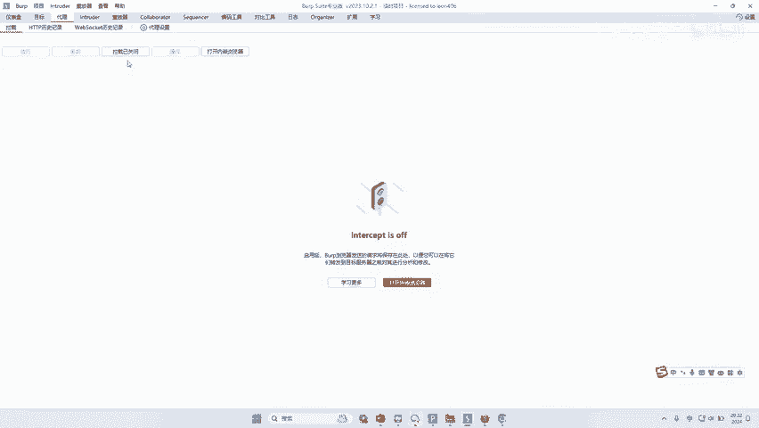

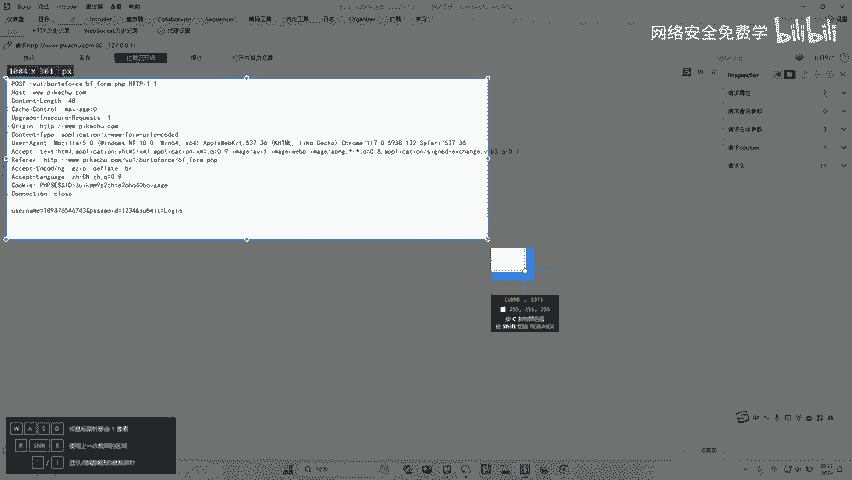

漏洞存在的根本原因是系统只校验了验证码的有效期，但没有对输入错误次数进行限制。如果在开发时限制为只能错误输入5次，那么爆破攻击就无法成功。

以下是短信验证码爆破的攻击流程示意图：

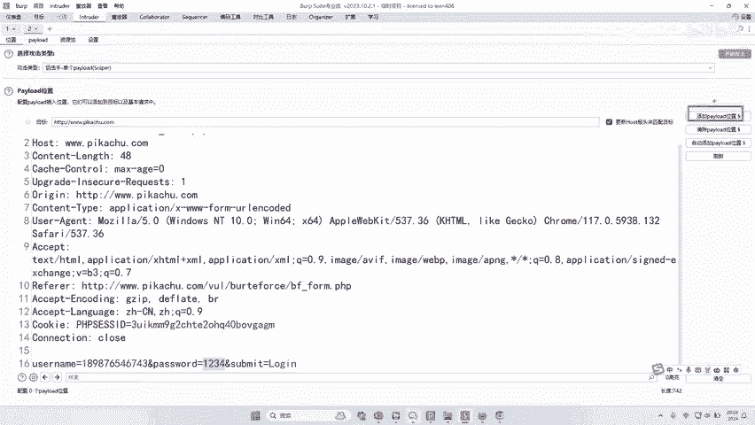

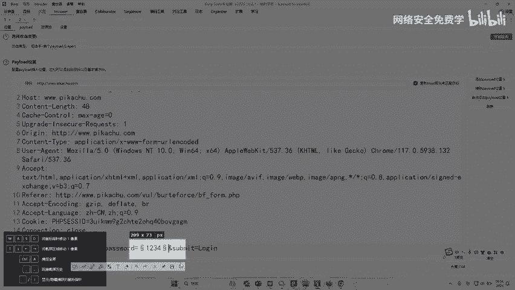

1.  攻击者获取目标手机号（例如女朋友的手机号）。
2.  触发系统向该手机号发送验证码。
3.  攻击者准备一个从`0001`到`9999`的密码表。
4.  使用工具将表中的验证码逐个提交到系统登录接口进行尝试。
5.  当尝试到正确验证码时，即可成功登录。

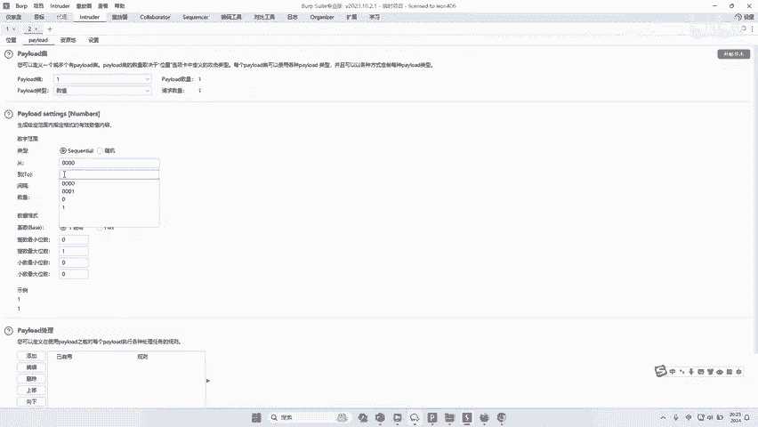

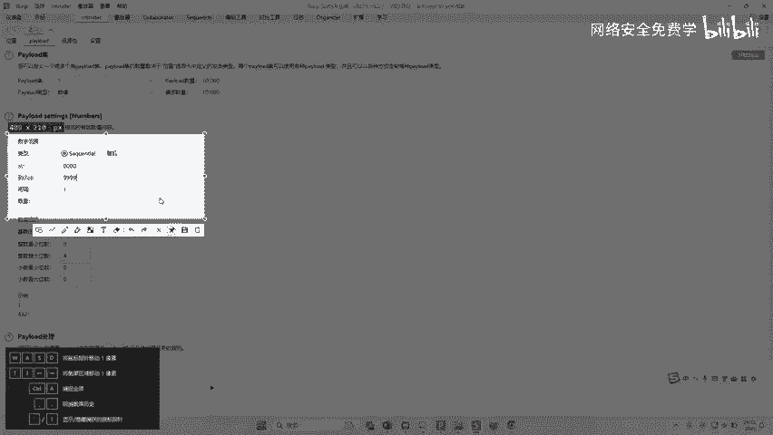

## 实战案例演示

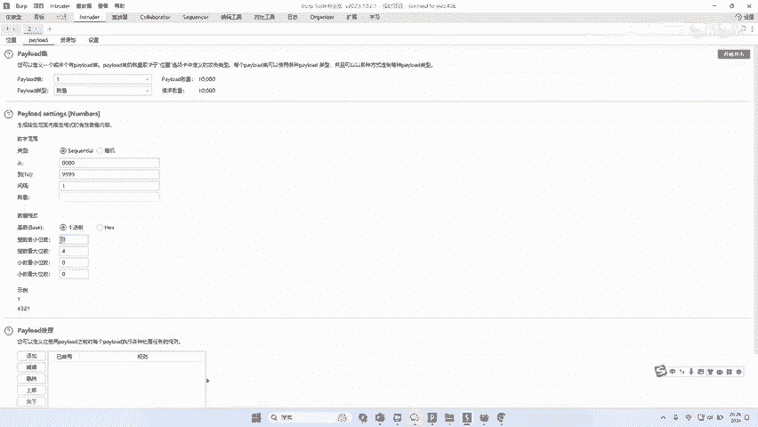

理解了原理之后，本节我们将通过一个实际案例来演示整个操作过程。

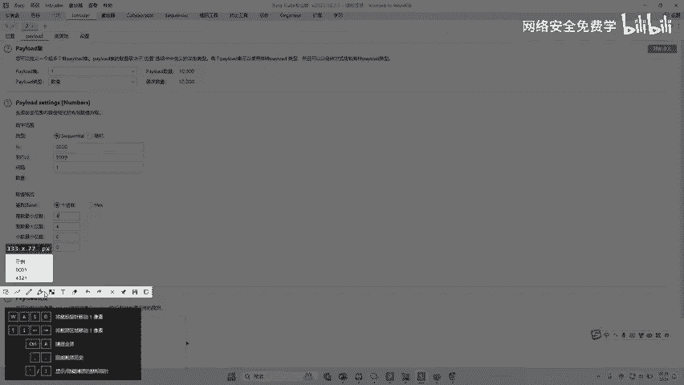

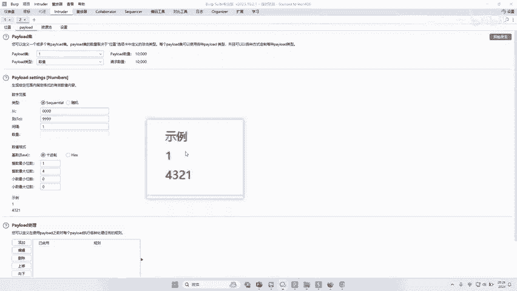

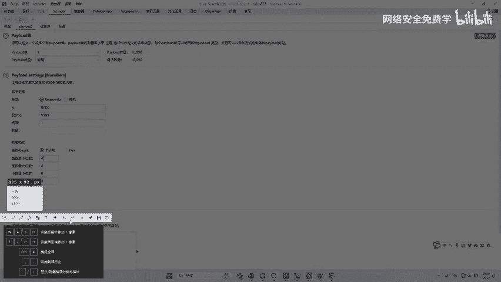

这是一个真实的漏洞挖掘案例。目标的验证码是6位数字，正确验证码为`031421`。通过从`000000`到`999999`进行尝试，发现正确验证码的HTTP响应长度（216）与其他错误请求的响应长度（232）不同，从而成功识别并利用该漏洞登录了系统。

**核心技巧**：通过对比HTTP响应长度的差异来判断请求是否成功，是自动化爆破中常用的方法。

接下来，我们将使用Burp Suite工具来演示如何操作。本课程涉及的所有操作都只使用这一个工具。

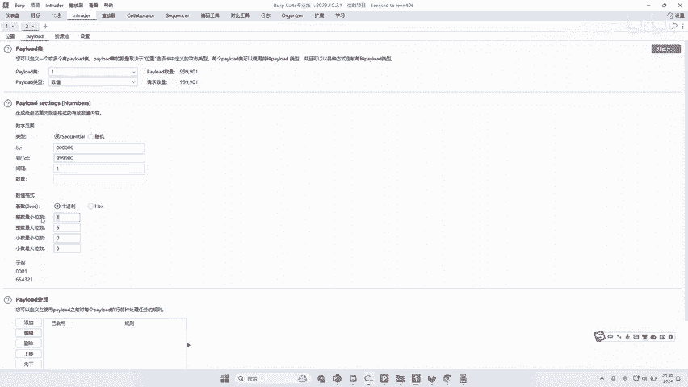

## 使用Burp Suite进行爆破

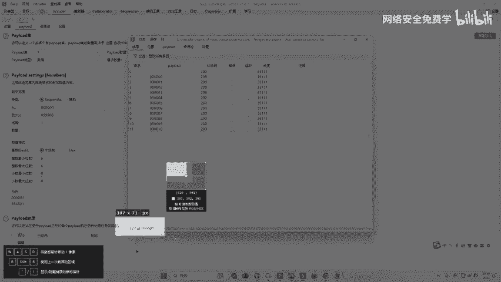

上一节我们看了一个案例，本节中我们来看看具体的操作步骤。

以下是使用Burp Suite进行短信验证码爆破的详细步骤：

1.  **启动并配置代理**：首先打开Burp Suite，并确保代理功能已开启。
2.  **捕获登录请求**：使用Burp Suite的内置浏览器访问目标网站。输入手机号并点击“发送验证码”。在输入框随意填写一个4位或6位数字（根据你事先了解的验证码位数），然后点击登录。此时，Burp Suite会拦截到这个包含验证码数据的HTTP请求包。
3.  **发送到Intruder模块**：在拦截到的请求包上右键，选择 `Send to Intruder`。
4.  **设置攻击位置**：在Intruder模块的 `Positions` 标签页，先点击 `Clear §` 清除所有默认标记。然后选中请求中代表验证码的参数值（例如 `code=1234` 中的 `1234`），点击 `Add §` 按钮，将其标记为需要爆破的位置。此时该参数会被 `§` 符号包围，例如 `code=§1234§`。
5.  **配置Payload（攻击载荷）**：切换到 `Payloads` 标签页。这是关键步骤，我们不需要外部的密码字典。
    *   **Payload类型**：在 `Payload Sets` 区域，将 `Payload type` 设置为 `Numbers`。
    *   **设置范围**：在 `Payload Options` 区域进行配置。
        *   **From**: 设置为 `0`
        *   **To**: 设置为 `9999` (对于4位验证码) 或 `999999` (对于6位验证码)
        *   **Step**: 设置为 `1`，表示逐个递增。
        *   **Min integer digits** 和 **Max integer digits**: 都必须设置为验证码的位数（如4或6），以确保生成 `0001` 这样的格式，而不是 `1`。
6.  **开始攻击**：点击 `Start attack` 按钮，Burp Suite会开始自动尝试所有可能的验证码。
7.  **分析结果**：攻击完成后，在结果列表中，可以通过排序 `Length`（响应长度）或 `Status`（状态码）列，找到与其他绝大多数响应不同的那个请求。该请求所携带的验证码即为正确的验证码。

**代码示意**：Burp Suite Intruder 的Payload配置逻辑类似于以下循环：
```python
for i in range(0, 10000): # 4位验证码
    verification_code = str(i).zfill(4) # 补零到4位，如 0001
    send_request(verification_code) # 发送携带该验证码的请求
```

## 高阶技巧与注意事项

在基础操作中，我们假设了4位验证码。但在实际中可能会遇到更复杂的情况。

**情况一：6位验证码爆破时间过长**
6位验证码有100万种组合，在5-10分钟内可能无法跑完。解决方案是“分批爆破”：
*   思路：将100万个数字分成多个区间（例如10个10万的区间）。
*   操作：将同一个请求包复制到多个Burp Suite的Intruder任务中，每个任务设置不同的Payload范围（如0-99999, 100000-199999...），同时运行以缩短总耗时。

**情况二：漏洞报告与“技巧”**
在实际漏洞挖掘和提交报告时，需要关注以下几点：
1.  **漏洞命名**：漏洞名称应根据爆破成功后的实际危害来定义，而不是攻击方式本身。例如：
    *   爆破后能登录他人账户 -> **任意用户登录漏洞**
    *   爆破后能修改他人密码 -> **任意用户密码重置漏洞**
2.  **概念验证（PoC）技巧**：在向企业提交漏洞报告时，为了在有限条件下证明漏洞存在，可以采用一种方法：使用自己的两个手机号（A和B）。用手机号A正常接收一次验证码，了解其格式和大致数字规律。然后在针对手机号B进行爆破测试时，将Payload范围设定在手机号A收到的验证码数值附近的一个较小区间内（例如，如果A收到`786453`，则测试B时设定范围从`786000`到`787000`）。这样只需尝试1000次即可“命中”，从而向企业证明“系统未对验证码尝试次数做限制”这一漏洞点。**请注意，这只是为了高效证明漏洞存在的一种测试策略，在报告中应如实描述测试过程。**

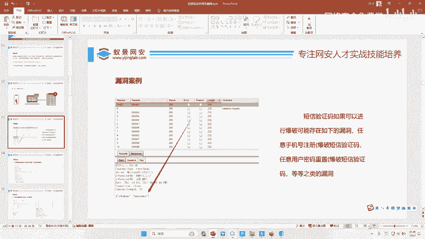

## 总结

本节课中我们一起学习了短信验证码爆破漏洞。
*   **原理**：利用系统未限制验证码错误尝试次数的缺陷，在有效期内暴力枚举所有可能组合。
*   **工具**：主要使用Burp Suite的Intruder模块。
*   **关键步骤**：捕获请求、标记爆破位置、配置数字型Payload、分析结果。
*   **核心要点**：漏洞的命名源于其造成的实际危害（如任意用户登录）；在实际测试中，可通过合理的测试设计来高效验证漏洞存在。

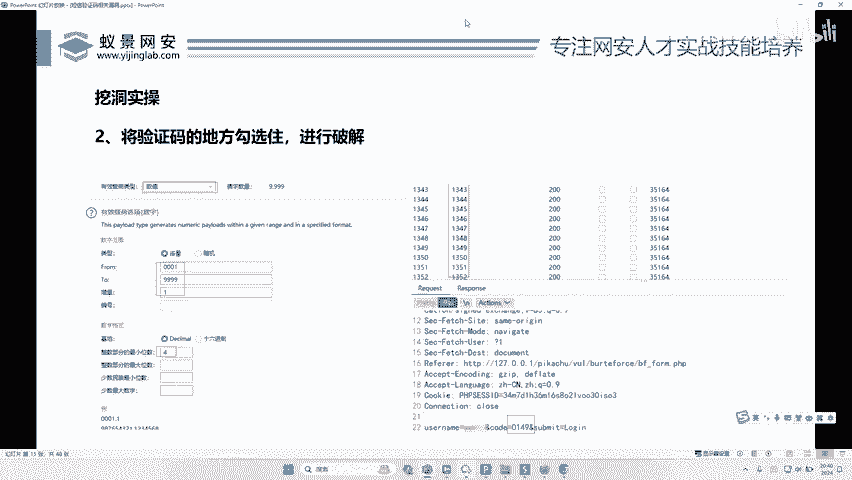

这种漏洞的修复方案非常简单：在服务端对同一手机号、同一会话在单位时间内的验证码错误尝试次数进行严格限制（例如5次），超过次数则锁定该手机号或会话一段时间。