# 网络安全入门：P36：验证码回显漏洞挖掘 🔍

在本节课中，我们将要学习一种常见的Web安全漏洞——短信验证码回显漏洞。我们将了解其原理、危害，并通过实际案例和操作步骤，学习如何发现和验证此类漏洞。

## 概述：什么是短信验证码回显漏洞？


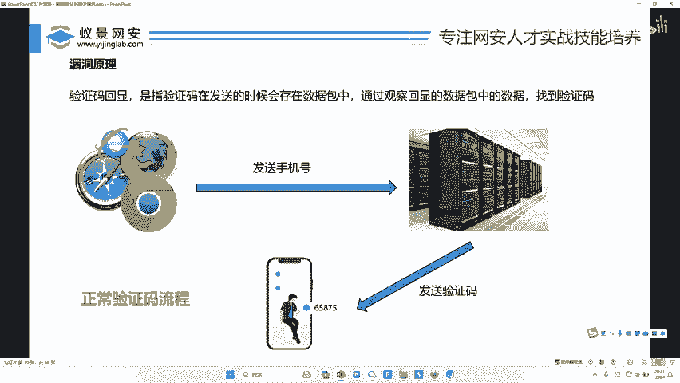


短信验证码回显漏洞，是指网站在处理用户请求发送短信验证码时，错误地将验证码明文或可逆加密后的内容，直接包含在返回给用户浏览器的响应数据包中。这使得攻击者无需接收手机短信，即可直接从前端数据中获取验证码，从而绕过验证码的验证机制。

上一节我们介绍了验证码相关的安全风险，本节中我们来看看一个具体的漏洞类型。

## 漏洞原理分析 🔬

要理解这个漏洞，首先需要了解正常的短信验证码发送流程。

### 正常流程

1.  用户在浏览器中输入手机号，点击“发送验证码”。
2.  浏览器将包含手机号的请求数据包通过网络发送给服务器。
3.  服务器收到请求后，生成一个随机验证码，并通过短信网关将该验证码发送到用户填写的手机号上。
4.  用户从手机短信中获取验证码，并在网站上输入以完成验证。

**核心流程公式**：
`用户请求（含手机号） -> 服务器 -> 生成验证码 -> 发送短信至手机`

### 存在漏洞的错误流程

某些开发人员由于疏忽，在实现上述流程时犯了错误。

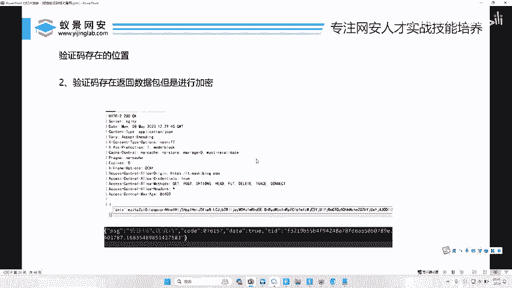

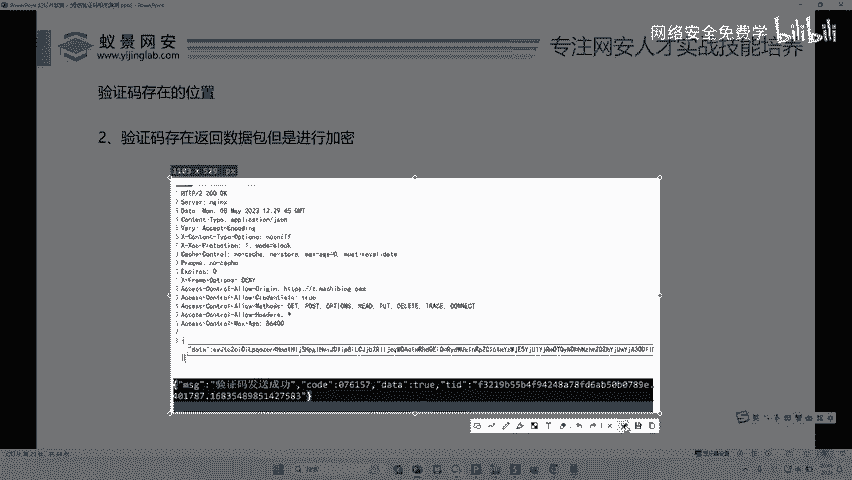

1.  前两步与正常流程相同：用户提交请求，服务器生成验证码。
2.  服务器在通过短信网关发送验证码的同时，**错误地将验证码也添加到了返回给浏览器的HTTP响应包中**。
3.  这样，攻击者无需查看手机，只需使用抓包工具（如Burp Suite）拦截并查看服务器的响应数据，就能直接看到验证码。

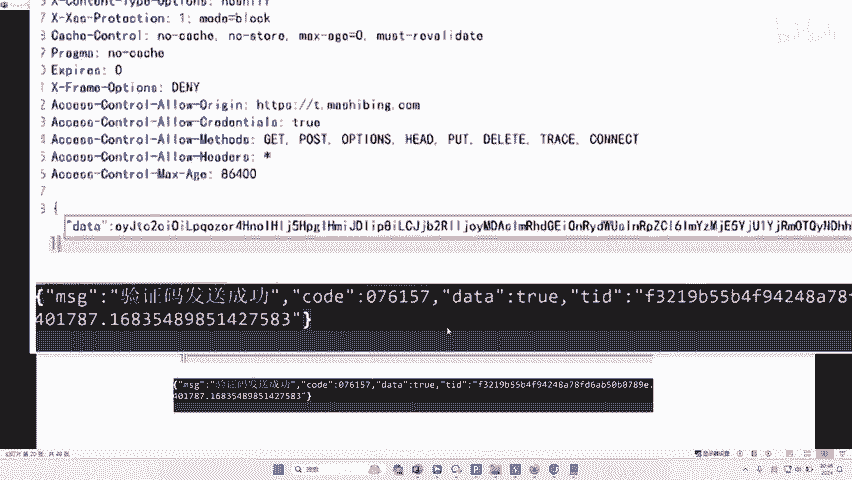

**漏洞流程公式**：
`用户请求（含手机号） -> 服务器 -> 生成验证码 -> [发送短信至手机] + [将验证码回显至HTTP响应]`

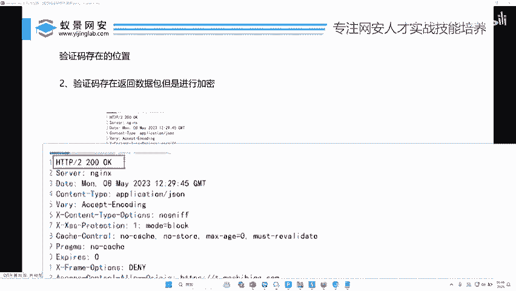

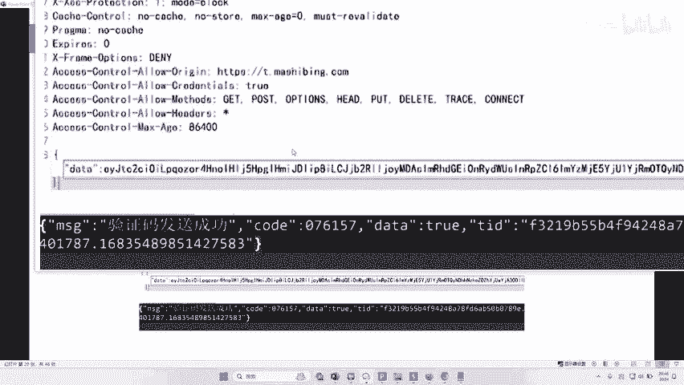

简单来说，漏洞的本质是**服务器将本该保密（仅通过短信通道传递）的验证码，通过Web响应通道又“回显”给了用户**。

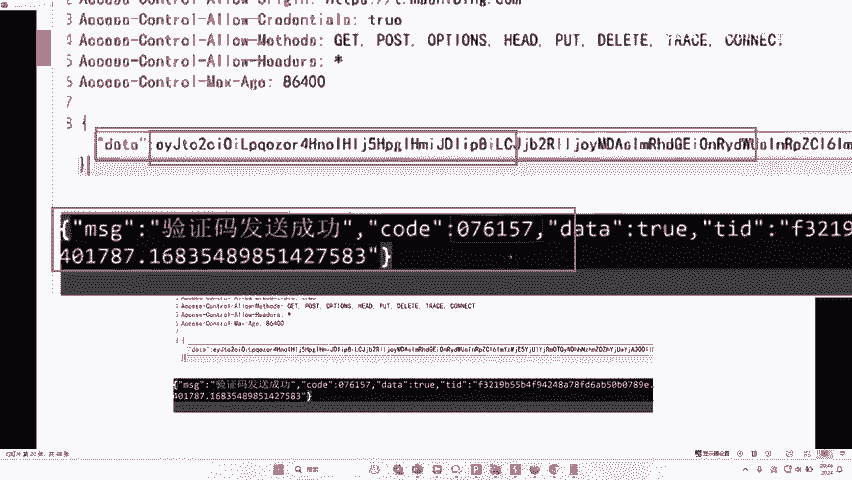

## 漏洞案例展示 📄

有人认为这种漏洞很少见或不可能存在，但实际上，由于开发者疏忽，这类漏洞在互联网产品中并不罕见。以下是两个真实案例。

以下是两个漏洞响应的关键信息：

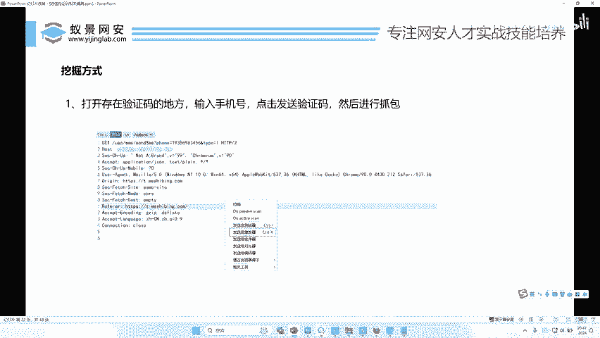

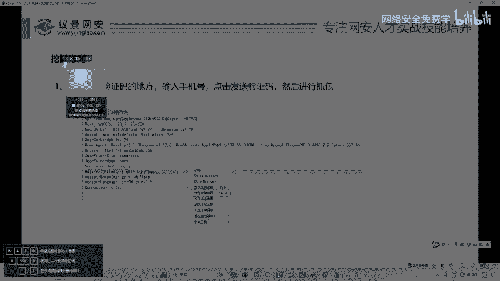

*   **案例一**：在HTTP 200 OK的响应包中，直接包含了 `code: 714477` 字段，这正是发送到手机上的短信验证码。
*   **案例二**：在响应包的 `data` 字段中，存在一段经过Base64编码的数据。解码后，里面清晰包含了 `code: 076157` 字段。

这些案例证明，验证码可能以明文或简单编码的形式，直接出现在JSON响应、HTML注释，或其他响应数据字段中。

## 漏洞挖掘实战演练 🛠️

了解了原理和案例后，我们来看看如何在实际测试中发现这类漏洞。

**重要声明**：所有安全测试必须在获得明确授权的范围内进行，例如针对自己的资产、拥有书面授权的测试目标，或合法的漏洞众测平台。未经授权的测试是违法的。

以下是挖掘短信验证码回显漏洞的标准步骤：


1.  **定位测试点**：找到需要短信验证码的功能，如用户注册、登录、修改密码等页面。
2.  **准备抓包工具**：启动Burp Suite等代理抓包工具，并配置浏览器代理。
3.  **拦截请求**：在测试页面输入手机号（可使用临时或测试号码），点击“获取验证码”按钮。此时，Burp Suite应拦截到对应的HTTP请求包。
4.  **查看响应**：将拦截到的请求发送到Burp Suite的 **Repeater** 模块。在Repeater中再次发送该请求，然后重点观察 **Response** 面板。
5.  **分析响应内容**：仔细检查响应体的全部内容，寻找可能包含验证码的字段。常见关键词包括 `code`、`verifyCode`、`smsCode`、`captcha` 等。验证码可能是明文数字，也可能是经过Base64等简单编码后的字符串。
6.  **验证判断**：如果在响应中找到了疑似验证码的值，将其与手机上实际收到的短信验证码进行对比。如果一致，则确认存在“验证码回显漏洞”。

**核心操作代码（逻辑描述）**：
```python
# 1. 发送获取短信验证码的请求
request = send_request(phone_number=“目标手机号”)

# 2. 捕获服务器响应
response = get_response(request)

# 3. 关键步骤：分析响应内容，而非等待手机短信
if “验证码关键词” in response.text:
    suspected_code = extract_code(response.text)
    # 4. 尝试使用该码进行验证
    result = verify(suspected_code)
    if result == “成功”:
        print(“存在验证码回显漏洞！”)
```

## 漏洞修复建议 🛡️

对于开发人员而言，修复此漏洞至关重要。

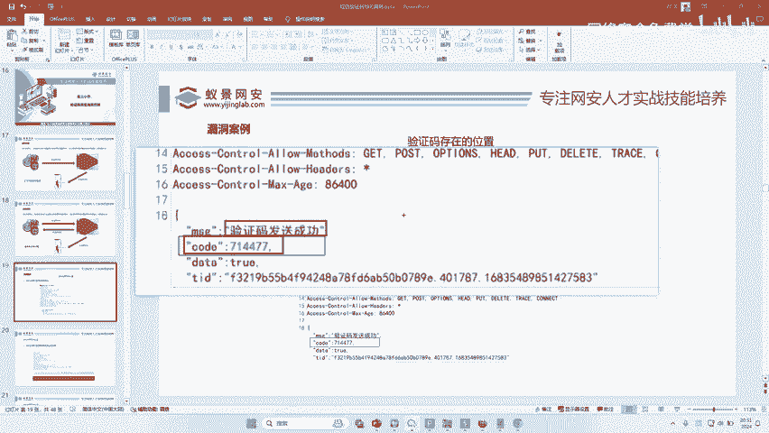


以下是修复此漏洞的核心要点：

*   **绝不回传**：服务器端在发送短信验证码后，在返回给客户端的HTTP响应中，**绝对不能包含验证码明文或可逆的密文**。只能返回“发送成功”或“发送失败”等状态信息。
*   **服务端校验**：验证码的校验必须完全在服务器端进行。客户端提交的验证码应与服务器Session或缓存中存储的对应手机号的验证码进行比对。
*   **最小化信息**：错误提示信息应模糊化，例如使用“验证码错误”，而非“验证码已过期”或“验证码不匹配”，以防信息泄露。

## 总结与回顾 📝

本节课中我们一起学习了短信验证码回显漏洞。

*   **原理**：由于开发疏忽，服务器将短信验证码错误地包含在HTTP响应中返回给浏览器。
*   **危害**：攻击者可绕过短信接收环节，直接获取验证码，导致验证机制失效。
*   **挖掘**：通过抓包工具拦截“获取验证码”的请求，并重点分析其响应包内容，寻找明文的或简单编码的验证码字段。
*   **修复**：确保验证码只通过短信通道传递，不在Web响应中回显，并在服务端完成校验。

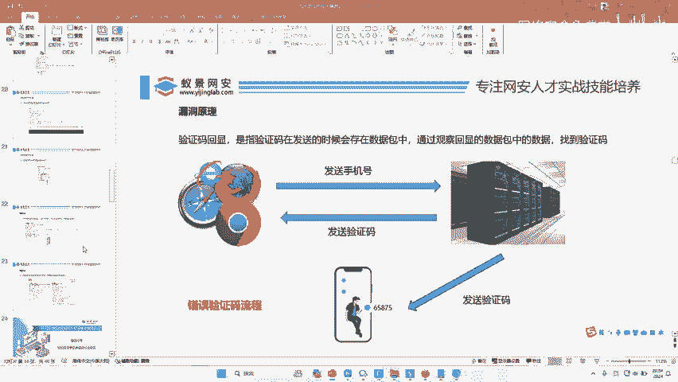

这个漏洞的挖掘过程相对直接，是Web安全测试中的一个基础但有效的检查点。掌握它，能帮助你更好地理解应用系统中数据流的安全边界。