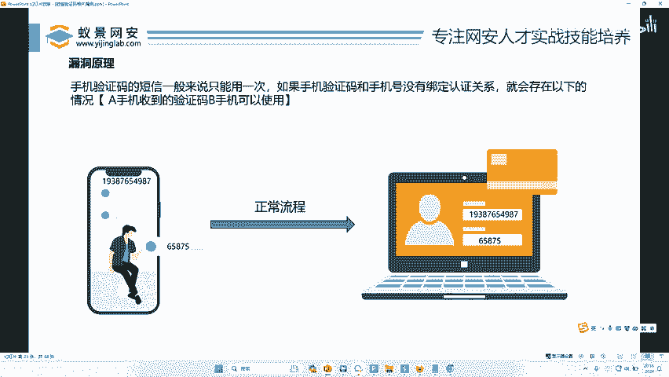
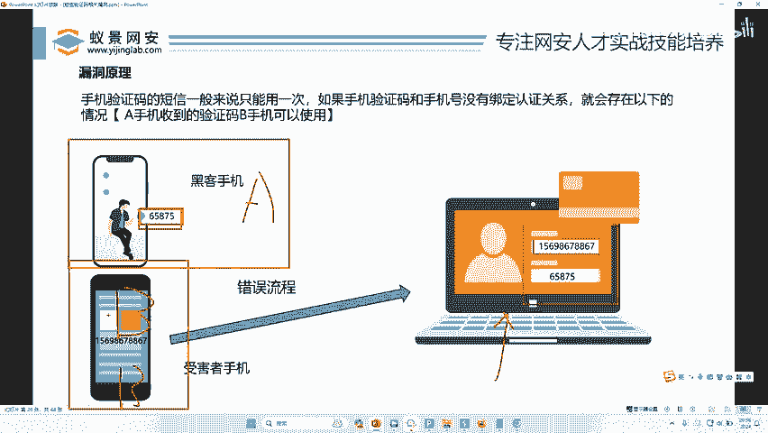
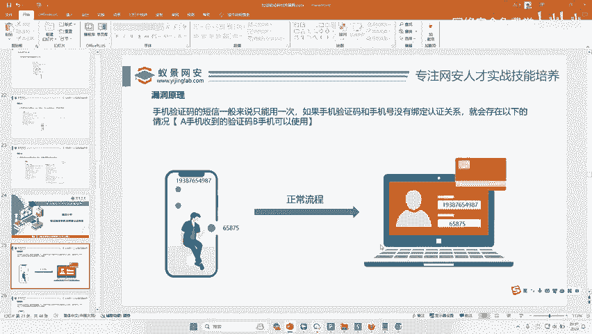
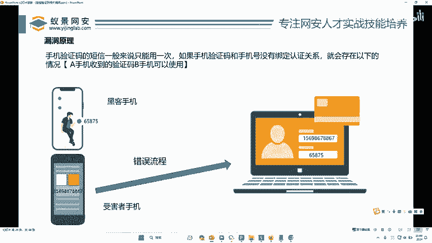
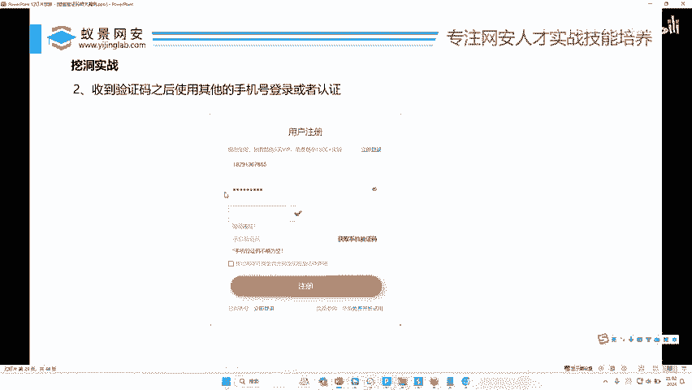
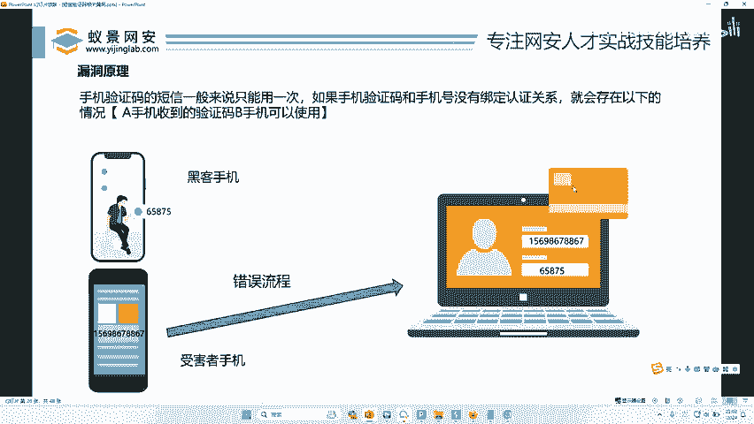
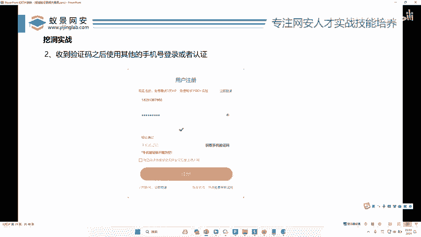

# 网络安全：P37：验证码与手机未绑定认证关系 🔐

在本节课中，我们将要学习一个非常常见的网络安全漏洞：**短信验证码与手机未绑定认证关系**。这个漏洞可能导致攻击者利用自己的验证码，成功登录或注册他人的账号，从而造成严重的安全风险。




## 漏洞原理

上一节我们介绍了短信验证码的基本应用场景。本节中我们来看看“未绑定认证关系”的具体原理。

短信验证码通常用于注册、登录、找回密码等场景。其核心安全假设是：**一个验证码只能被其对应的手机号使用一次**。如果系统在验证时，没有严格检查验证码与接收手机号的绑定关系，就会产生漏洞。

以下是漏洞的核心逻辑：
*   **正常流程**：手机号A请求并收到验证码X，使用`(A, X)`组合完成验证。
*   **漏洞流程**：攻击者用自己的手机号B请求并收到验证码Y。在提交验证时，将组合改为`(目标手机号A, 攻击者验证码Y)`。如果系统仅验证Y是否正确，而不校验Y是否由A请求，则验证通过。



用简单的伪代码表示漏洞逻辑：
```python
# 漏洞代码示例（错误逻辑）
def verify(sms_code, phone_number):
    stored_code = get_code_from_session() # 从会话中取出最后生成的验证码
    if sms_code == stored_code: # 只验证码是否匹配，未检查手机号
        return True # 验证通过
    else:
        return False



# 正确逻辑应同时验证手机号
def verify_correctly(sms_code, phone_number):
    stored_code = get_code_for_phone(phone_number) # 根据手机号取出对应的验证码
    if sms_code == stored_code:
        return True
    else:
        return False
```

## 攻击演示与影响

理解了原理后，我们通过一个注册场景来演示攻击过程。

以下是攻击步骤：
1.  **获取验证码**：攻击者在网站注册页面，输入自己的手机号（例如 13800138000），点击“获取验证码”。
2.  **接收验证码**：攻击者手机收到验证码（例如 123456）。
3.  **替换手机号**：攻击者将表单中的手机号字段修改为目标受害者的手机号（例如 13900139000），但填入自己收到的验证码（123456）。
4.  **提交注册**：点击提交。如果存在漏洞，系统将成功为受害者手机号注册一个新账号。

此漏洞的影响非常严重：
*   **任意账号注册**：攻击者可批量注册大量垃圾账号。
*   **账号劫持**：在登录场景下，攻击者可能直接登录他人账号。
*   **密码重置**：在找回密码场景下，攻击者可重置他人账号密码。

## 漏洞挖掘方法



这个漏洞的挖掘方法非常简单直接，无需复杂工具。

以下是手动测试步骤：
1.  寻找任何带有“发送短信验证码”功能的页面（如注册、登录、绑定手机、修改密码）。
2.  使用自己的手机号A获取验证码。
3.  在提交请求前，将请求中的手机号参数修改为另一个手机号B，但保持验证码不变。
4.  提交请求，观察是否操作成功（如注册成功、登录成功、密码修改成功）。
5.  如果成功，则证明存在“验证码与手机号未绑定认证关系”漏洞。

当然，你也可以使用Burp Suite等工具拦截和修改HTTP请求包来完成测试，但对于此漏洞，手动测试通常更加高效。

## 类似漏洞与总结





本节课中我们一起学习了“验证码与手机未绑定认证关系”漏洞。它本质上是一种**业务逻辑漏洞**，源于开发者在设计验证流程时，忽略了关键的身份绑定环节。

这个漏洞与一些“签约漏洞”或“薅羊毛”漏洞在思路上有相似之处，都是利用了系统在处理连续、关联操作时，对用户身份或操作上下文校验不严的缺陷。例如，某些连续包月服务在首次签约时优惠力度大，攻击者可能通过多个账号交替签约、解约的方式来持续享受优惠。



**总结**：短信验证码是常见的安全验证手段，但其安全性完全依赖于后台逻辑的严谨性。安全测试人员务必对每一个发送验证码的功能点进行“绑定关系”测试，确保验证码与请求者身份强关联，才能有效防范此类风险。