# 网络安全入门：P38：验证码转发漏洞 🔐

在本节课中，我们将要学习一种常见的逻辑漏洞——验证码转发漏洞。我们将了解其原理、利用方法，并通过实际案例演示如何发现和验证此类漏洞。

## 漏洞原理

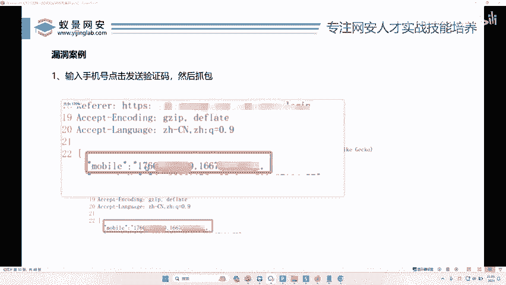

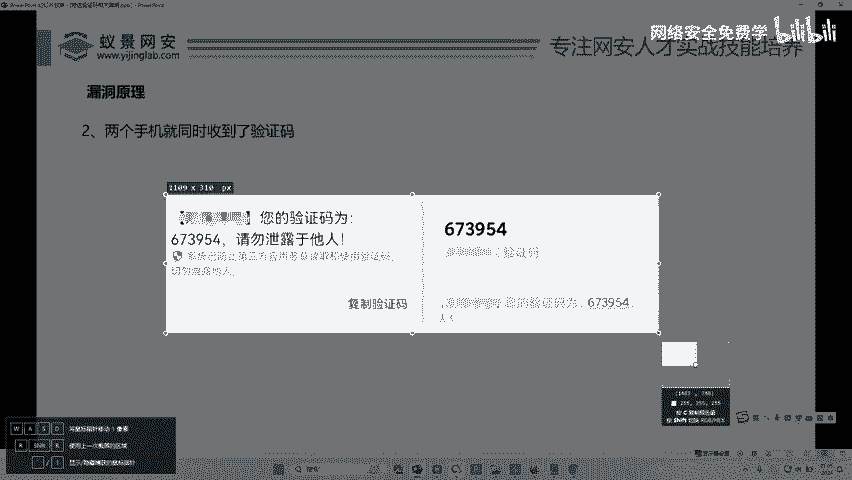

上一节我们介绍了多种逻辑漏洞，本节中我们来看看验证码转发漏洞。

有些开发人员在接收和处理用户提交的手机号时，使用了循环或数组的方式，但没有对手机号的格式或数量进行严格校验。这导致攻击者可以同时将验证码发送到多个手机号上。

## 正常流程与异常流程

以下是验证码发送的正常流程与存在漏洞时的异常流程对比。

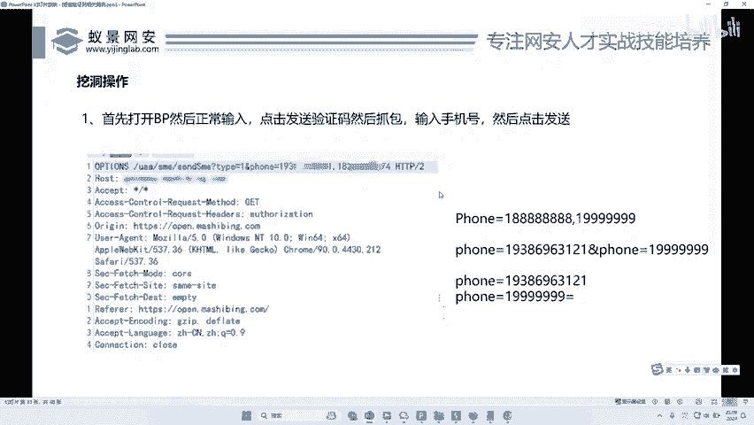

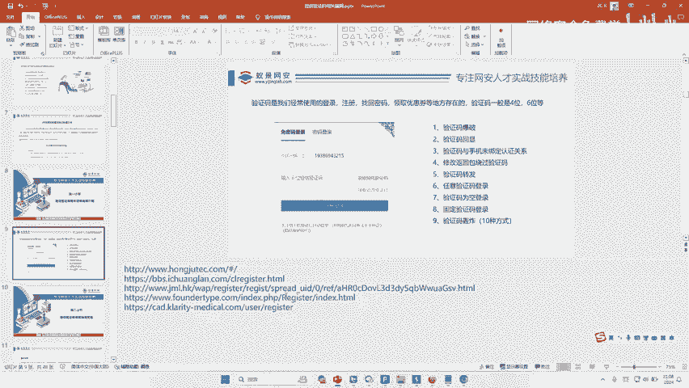

*   **正常流程**：用户在页面输入一个手机号，服务器收到后，向该手机号发送一个验证码。
*   **异常流程**：攻击者通过技术手段，在一次请求中提交了两个手机号。服务器处理时，向第一个手机号发送了验证码，同时也向第二个手机号发送了相同的验证码。

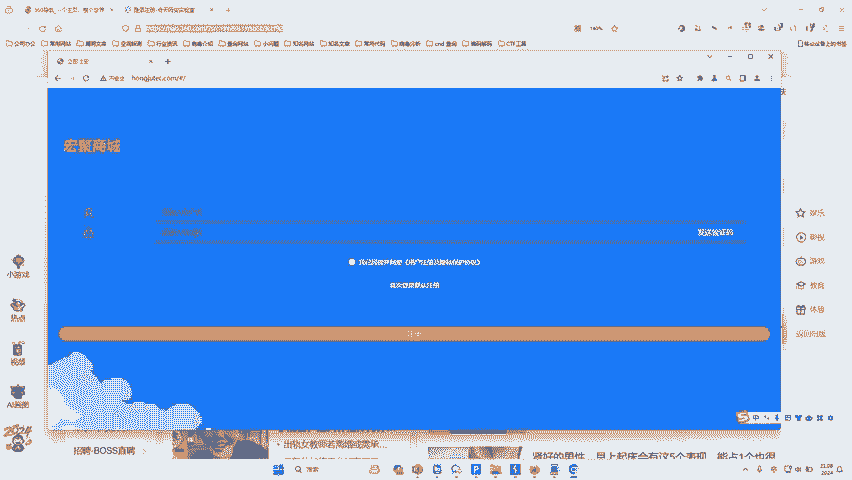

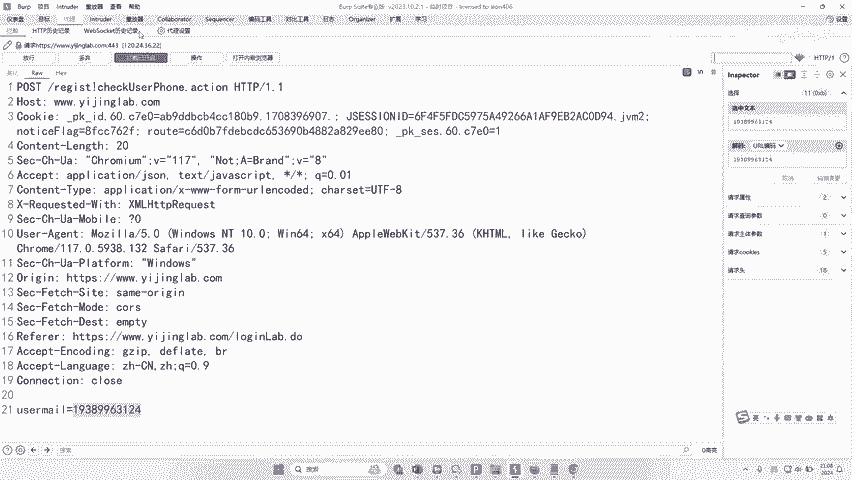

## 漏洞利用方法

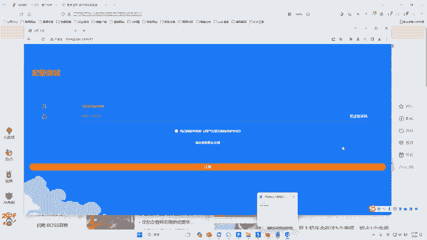

既然在页面的输入框里通常只能输入一个手机号，那么如何提交两个呢？答案是使用抓包工具（如Burp Suite）拦截并修改请求。

以下是利用Burp Suite进行测试的几种常见方法：

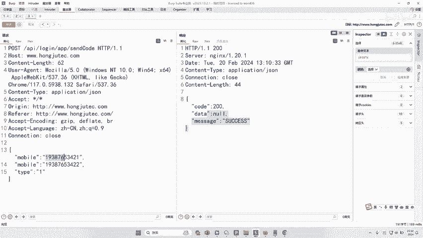

1.  **添加分隔符**：在手机号参数值后面添加逗号（`,`）或空格，再跟上第二个手机号。
    *   示例代码：`mobile=13800138000,13900139000`
2.  **参数污染**：重复提交同一个参数名，但赋予不同的值。
    *   示例代码：`mobile=13800138000&mobile=13900139000`
3.  **数组形式**：如果后端以数组方式接收，可以尝试提交数组格式的数据。
    *   示例代码：`mobile[]=13800138000&mobile[]=13900139000`
4.  **换行符**：在参数值中通过换行来分隔多个手机号。
    *   示例代码：
        ```
        mobile=13800138000
        13900139000
        ```

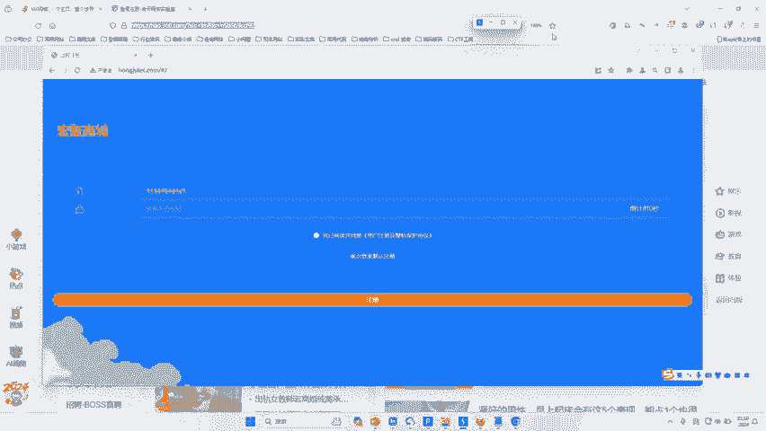

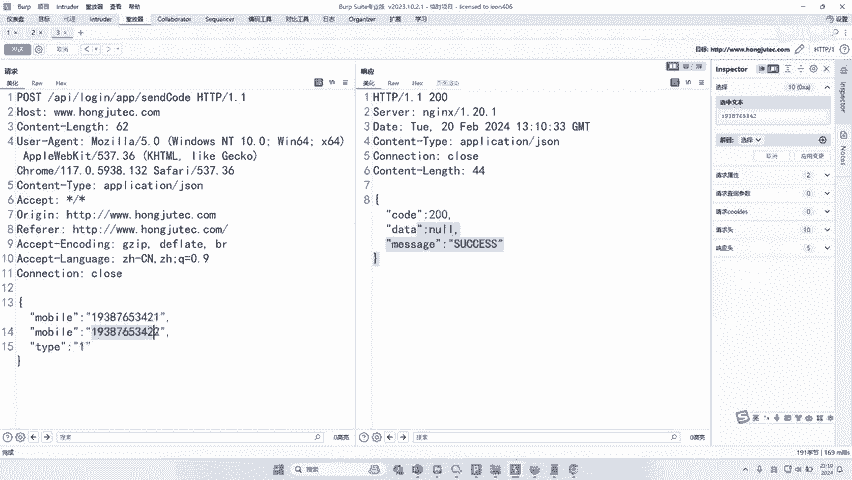

**操作步骤简述**：
1.  使用Burp Suite拦截发送验证码的HTTP请求。
2.  将请求发送到Repeater模块。
3.  修改`mobile`（或类似名称）参数，尝试上述多种方法。
4.  发送修改后的请求，观察服务器响应。如果返回成功，且两个手机号都收到了验证码，则漏洞存在。

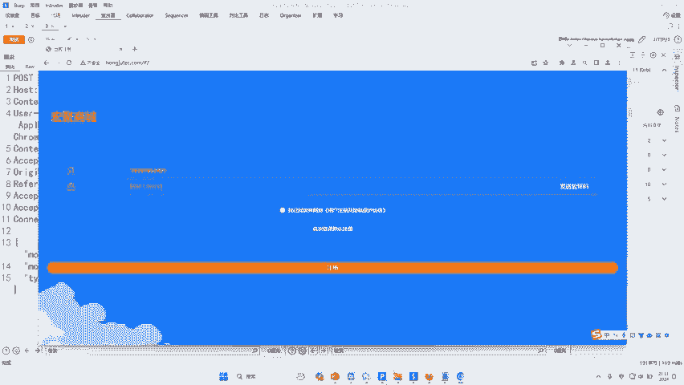

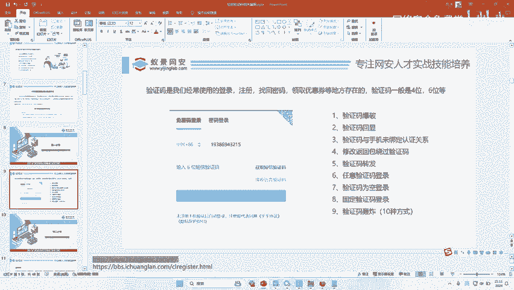

## 实际案例演示

接下来，我们通过一个模拟案例来演示如何测试。

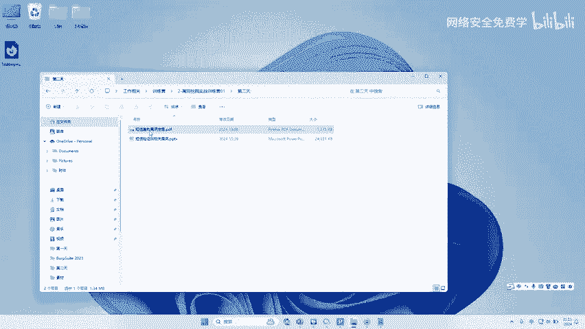

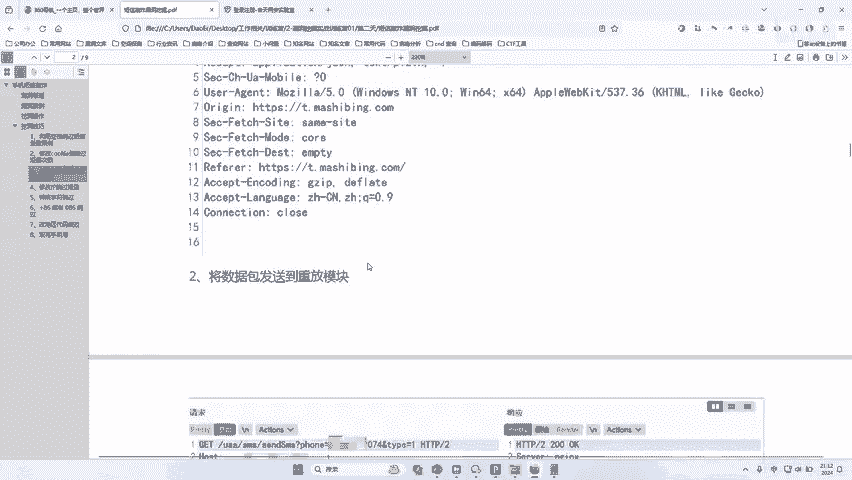


1.  访问目标网站的注册或登录页面，找到发送短信验证码的功能点。
2.  开启Burp Suite代理，拦截点击“发送验证码”按钮时产生的请求。
3.  在Burp Suite的Repeater中，尝试修改手机号参数。例如，将`mobile=13800138000`修改为`mobile=13800138000,13900139000`。
4.  点击发送。如果服务器返回“success”或类似成功信息，则可能触发了漏洞。此时，两个手机号可能会收到相同的验证码。

## 漏洞危害

验证码转发漏洞的危害在于可能导致**任意用户注册**或**账户接管**。

攻击者可以这样利用：
*   在第一个手机号位置填写受害者的手机号。
*   在第二个手机号位置填写自己的手机号。
*   服务器同时向两个号码发送相同的验证码。
*   攻击者使用受害者手机号进行注册或登录操作，但输入自己手机上收到的验证码。
*   由于验证码正确，攻击者便能以受害者的身份成功注册或登录系统。

## 拓展与总结

本节课中我们一起学习了验证码转发漏洞的原理、测试方法及危害。这是一种因后端校验不严导致的逻辑漏洞。

作为拓展，与之相关的另一种常见攻击是“短信轰炸”，即利用接口在短时间内向同一手机号发送大量验证短信，造成骚扰。防御此类漏洞的关键在于服务端进行严格的校验，包括：验证手机号格式的唯一性和合法性、对单手机号的请求频率进行限制、以及避免使用不安全的参数接收方式。

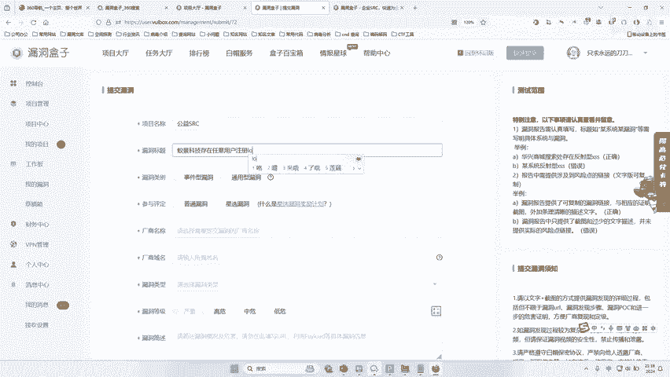

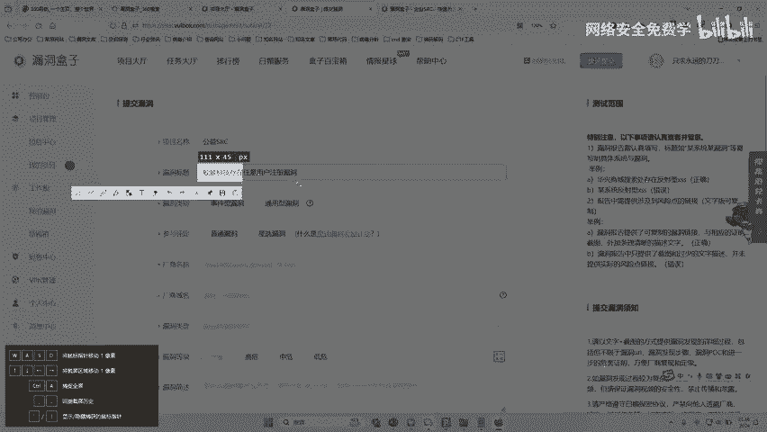

> **安全建议**：开发人员应在服务端对输入进行强校验，例如使用正则表达式确保手机号格式正确，并确保每个请求只处理一个手机号。

---

**附录：漏洞挖掘与提交**

对于希望深入实践的同学，可以将发现的漏洞提交到相关平台。主要分为两类：
*   **企业SRC**：如阿里巴巴、腾讯等公司自建的漏洞收集平台，只接收自身产品的漏洞，并提供奖金。
*   **公益SRC/漏洞平台**：如漏洞盒子、补天等，接收各类公益或企业漏洞，根据漏洞价值给予积分或奖金。

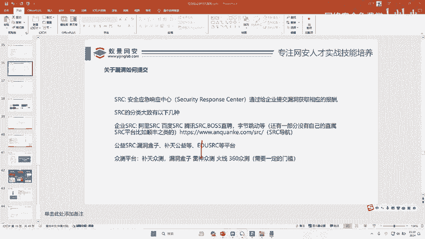

**初学者建议**：可以从公益SRC平台开始尝试，提交漏洞前请务必仔细阅读平台的漏洞提交规范和安全测试规则，确保测试行为在授权和合法范围内进行。在经验不足时，最好有经验者指导，避免因测试方法不当而对系统造成实际损害或引发法律风险。