# 网络安全入门：P39：常见FUZZ姿势和工具及字典

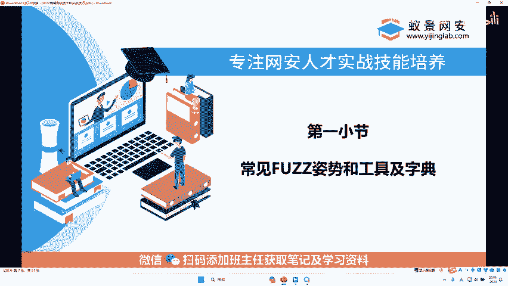

在本节课中，我们将要学习网络安全渗透测试中的一项核心技术——FUZZ（模糊测试）。我们将了解FUZZ的基本概念、它在漏洞挖掘中的重要作用，并通过实战案例和工具介绍，帮助你掌握如何运用FUZZ技术发现潜在的安全问题。

## 什么是FUZZ？🤔

上一节我们介绍了网络安全的基本范畴，本节中我们来看看FUZZ这个核心概念。

FUZZ，全称为Fuzzing，中文常译为“模糊测试”或“模糊”。它并非指某个具体的漏洞，而是一种测试思路和方法。

**FUZZ的核心定义是：在已知某些特定条件的前提下，对未知部分进行逐个猜测和测试。**

为了便于理解，我们可以举一个生活中的例子：使用支付宝进行大额转账时，系统有时会提示“请填写收款人姓氏首字”，例如已知收款人名为“*伟”。此时，你需要猜测他的姓氏。常见的猜测可能是“王伟”、“李伟”、“张伟”。这个根据已知信息（名）去猜测未知部分（姓）的过程，就类似于FUZZ的思想。

在网络安全中，这种思想被广泛应用。例如，在知道一个用户名（如 `admin`）后，尝试用常见密码字典（如 `123456`、`password`）去猜测其密码，这个过程也是一种FUZZ。

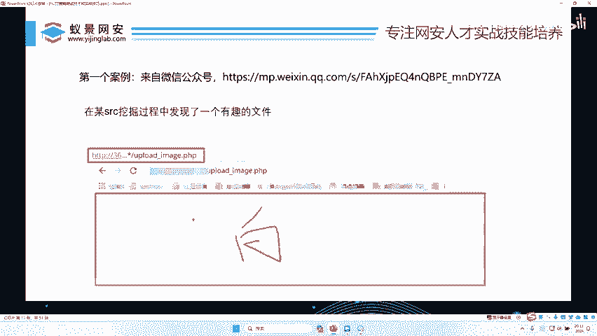

## FUZZ的应用场景 🎯

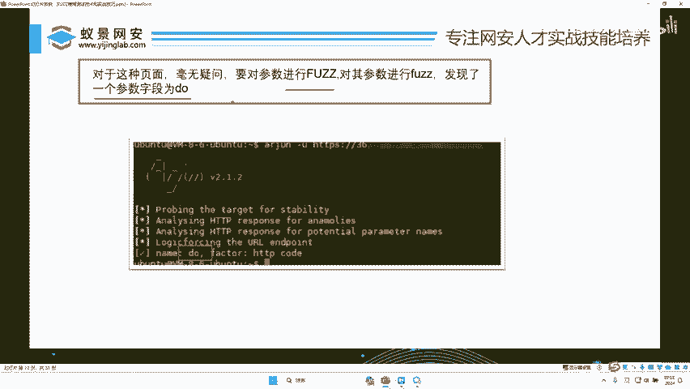

理解了FUZZ是一种“猜测”思想后，我们来看看它在实际漏洞挖掘中具体用在哪些地方。以下是FUZZ技术常见的应用场景：

*   **破解密码**：对登录接口的密码字段进行枚举尝试。
*   **扫描参数**：对Web页面的URL参数（如 `?id=1` 中的 `id`）进行发现和测试。
*   **测试漏洞**：对已知参数输入各种Payload，测试是否存在SQL注入、XSS等漏洞。
*   **扫描目录/文件**：猜测网站服务器上隐藏的目录或文件路径（如 `/admin/`、`/backup.zip`）。
*   **发现子域名**：猜测目标网站可能存在的其他子域名（如 `dev.example.com`）。

可以说，FUZZ技术贯穿了渗透测试的绝大部分过程，是安全研究员发现漏洞的“利器”之一。

## 实战案例：FUZZ如何挖到漏洞 💰

理论需要结合实践。下面我们通过一个公开的漏洞挖掘案例，看看FUZZ是如何发挥关键作用的。

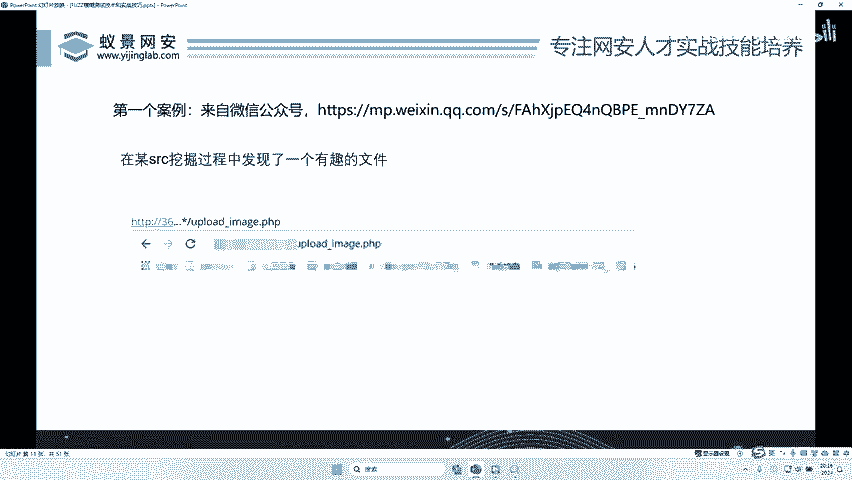

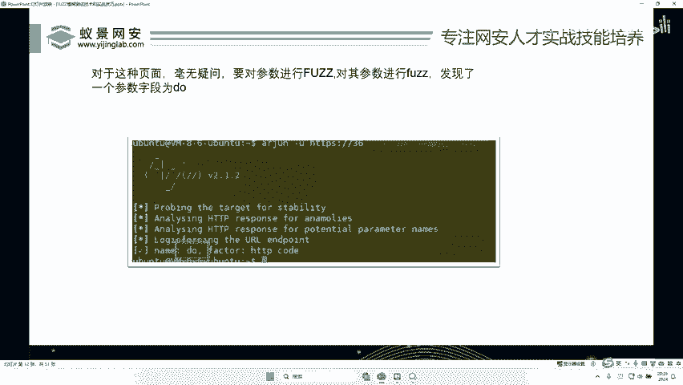

研究者发现一个网址：`http://www.example.com/upload.php`，但访问后是一个空白页面，没有任何功能显示。

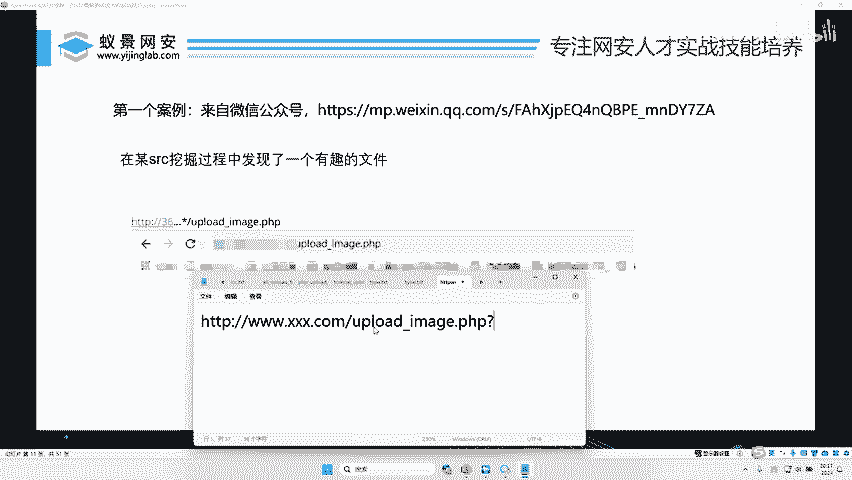

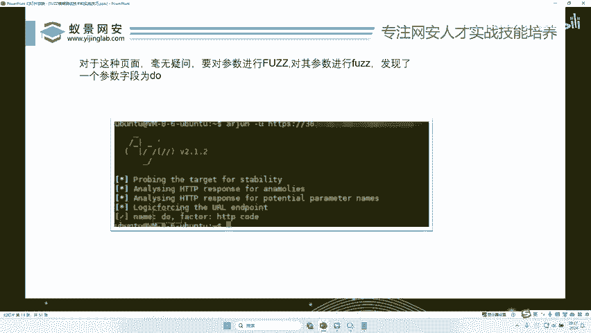

面对一个“空白”页面，很多人可能无从下手。但研究者运用了FUZZ思路：
1.  **FUZZ参数名**：他猜测这个 `upload.php` 文件可能需要接收参数才能工作。于是，他使用工具对 `?` 后的参数名进行枚举猜测（例如尝试 `?a=1`， `?b=1`， `?action=1`）。
2.  **发现有效参数**：经过FUZZ，他发现当参数为 `?do=upload` 时，页面发生了变化，出现了一个文件上传功能界面。
3.  **FUZZ文件路径**：成功上传Webshell（木马文件）后，他需要知道文件被保存在服务器的哪个路径下。他继续对可能的目录路径进行FUZZ猜测（如 `/upload/`， `/upload/images/`），最终成功定位到文件，并实现了对服务器的控制。

通过这个案例可以看到，正是通过两次关键的FUZZ（参数名和文件路径），研究者将一个看似无用的空白页面，变成了一个可利用的文件上传漏洞入口，从而发现了安全风险。

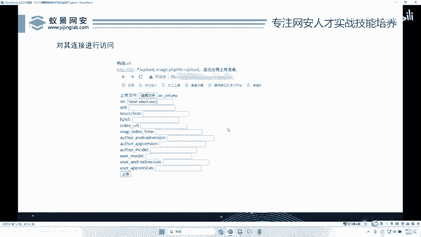

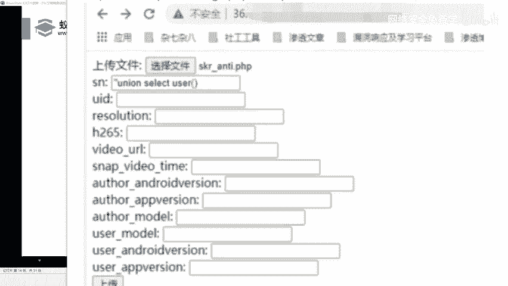

## FUZZ的必备工具：字典 📚

上一节我们看到了FUZZ的威力，但一个新的问题出现了：面对海量的可能性（如成千上万个参数名、无数种路径组合），我们如何高效地进行“猜测”呢？本节中我们来看看FUZZ的核心工具——字典。

手动枚举是不现实的。这时就需要使用“字典”。字典是一个文本文件，里面按行存储了经过整理的、在特定场景下出现概率较高的候选词集合。

例如：
*   **参数名字典**：包含 `id`, `name`, `action`, `do`, `file` 等常见参数名。
*   **路径字典**：包含 `/admin/`, `/backup/`, `/uploads/`, `/config.php` 等常见目录和文件名。
*   **密码字典**：包含 `123456`, `admin`, `password`, `qwerty` 等弱口令。

使用工具进行FUZZ时，只需将合适的字典载入，工具便会自动使用字典中的每一项去替换测试位置，并观察反馈结果，从而极大地提升了测试效率和覆盖率。

以下是提供给初学者的一些字典分类示例：

*   **参数字典**：包含数万至数十万个常见参数名，用于发现隐藏的URL参数。
*   **路径字典**：用于发现隐藏的目录、文件或备份文件。
*   **子域名字典**：包含常见的子域名前缀（如 `www`, `mail`, `dev`, `test`），用于扩大攻击面。
*   **漏洞Payload字典**：针对特定漏洞（如SQL注入、XSS、命令执行）的测试载荷集合。
*   **用户名/密码字典**：用于爆破登录凭证的弱口令集合。

选择合适的字典是FUZZ成功的关键一步。在后续的实战环节中，我们将学习如何为不同场景挑选和使用字典。

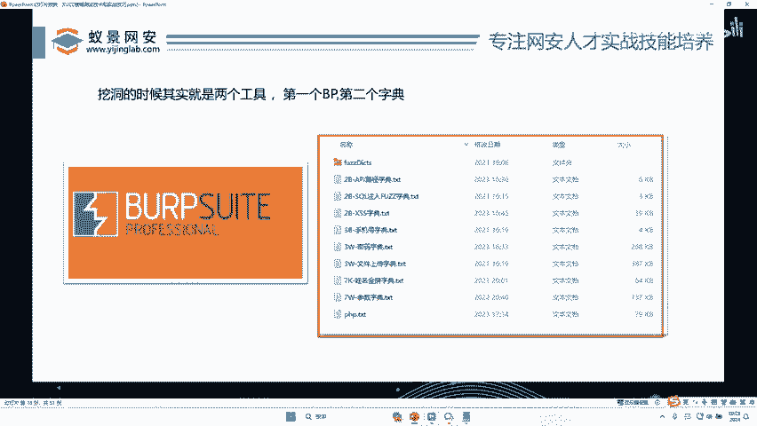

## 总结 📝

本节课中我们一起学习了网络安全中重要的FUZZ技术。

我们首先明确了**FUZZ是一种基于已知信息对未知部分进行系统化猜测的安全测试思想**。它并非特指某个工具，而是一种方法论。

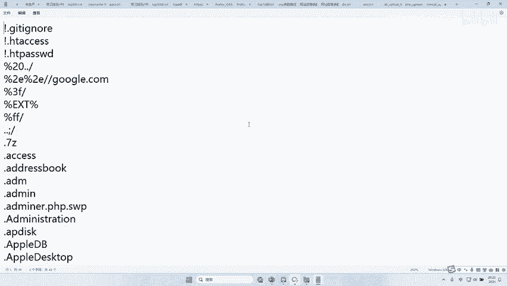

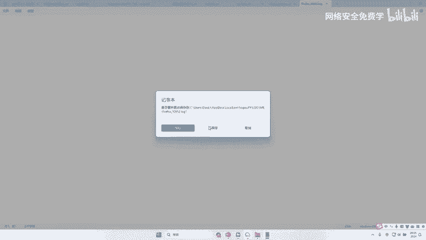

接着，我们探讨了FUZZ的广泛应用场景，包括密码爆破、参数发现、漏洞检测等，它渗透在渗透测试的各个环节。

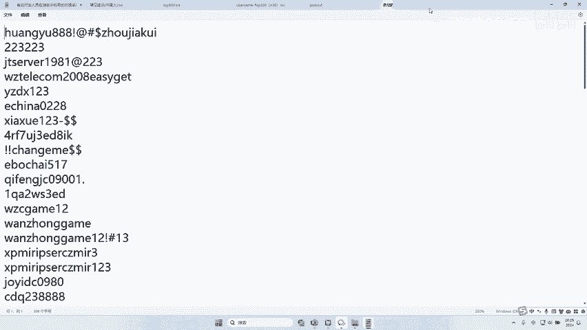

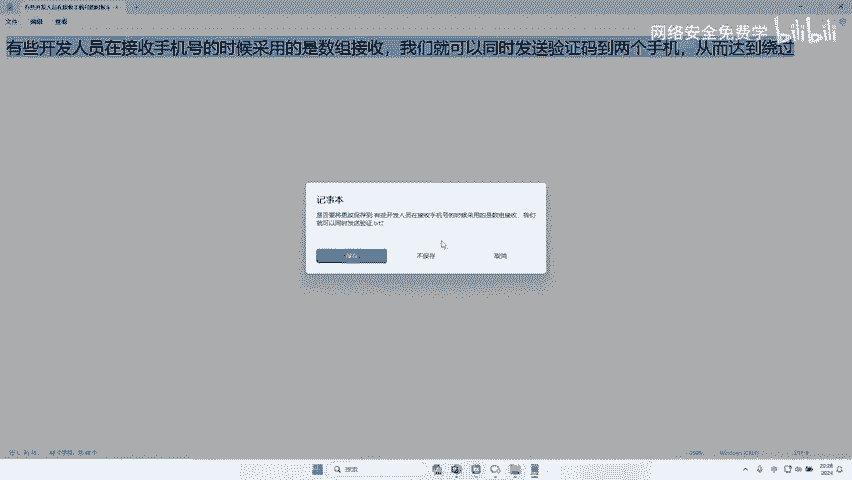

通过一个文件上传漏洞的实战案例，我们直观地看到了FUZZ如何从看似无用的信息中，逐步挖掘出关键的攻击路径（参数名 `do` 和文件路径）。

最后，我们认识到**字典是FUZZ高效进行的基石**。它为我们提供了经过优化的猜测范围，使得自动化测试成为可能。

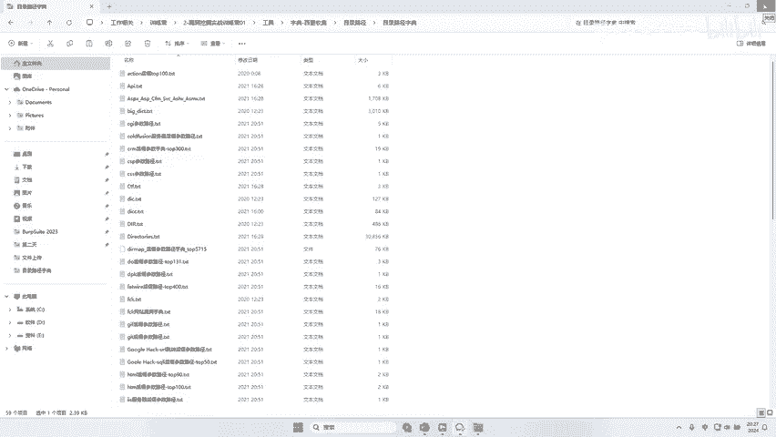

掌握FUZZ的思想，并学会结合字典与工具进行实践，将为你打开漏洞挖掘的大门。在接下来的课程中，我们将进入实战，学习具体的FUZZ工具和操作流程。