网络安全入门：P3：什么是HTTP 🌐

在本节课中，我们将要学习网络通信的基础——HTTP协议。了解HTTP是理解网站如何工作、以及后续进行渗透测试和安全分析的第一步。我们将从最基础的概念讲起，确保初学者能够轻松跟上。

---

### 渗透测试需要学习前端开发吗？

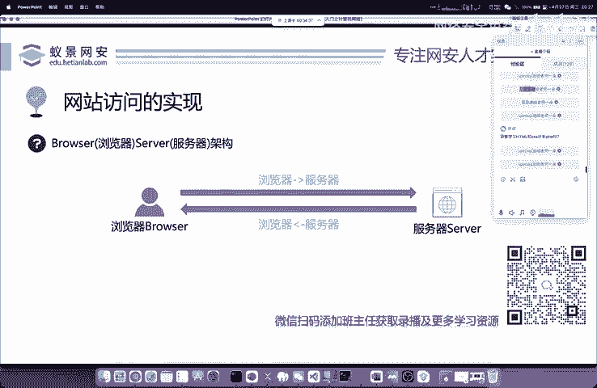

有同学问，学习渗透测试是否需要去学习HTML、CSS、PHP。答案是不需要。你可以学习PHP，但CSS是前端开发的工作，它相当于将一个简陋的房子装修美观。这是前端工程师的职责。

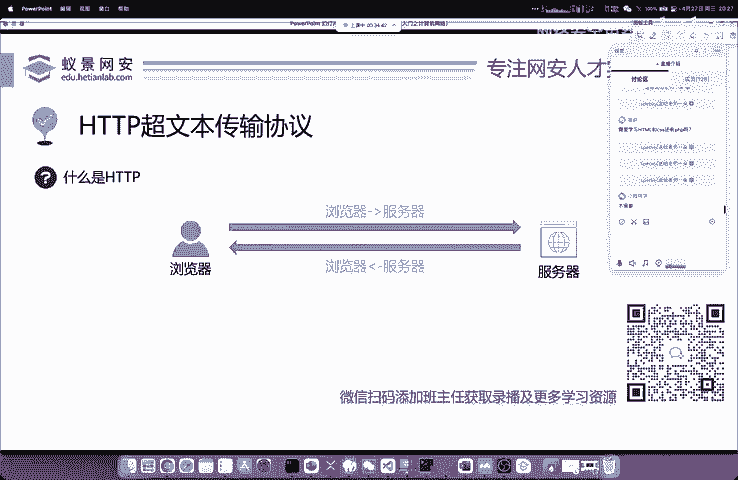

对于渗透测试而言，我们并不关心网站是否美观。一个外观华丽但存在漏洞的网站，其安全性依然很差。反之，一个外观简陋但安全防御做得非常好的网站，可能就没有漏洞。JavaScript可以学习，但编程语言并非渗透测试的核心技能。我认识的许多从事安全服务的人员，可能连Python都不会写，甚至敲不出C语言的`printf`函数，但他们依然可以胜任工作。进入岗位后，再根据需要慢慢学习相关技能即可。

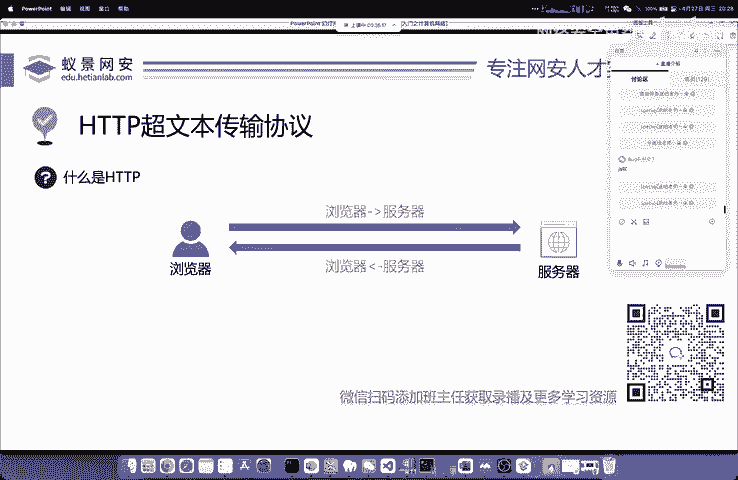

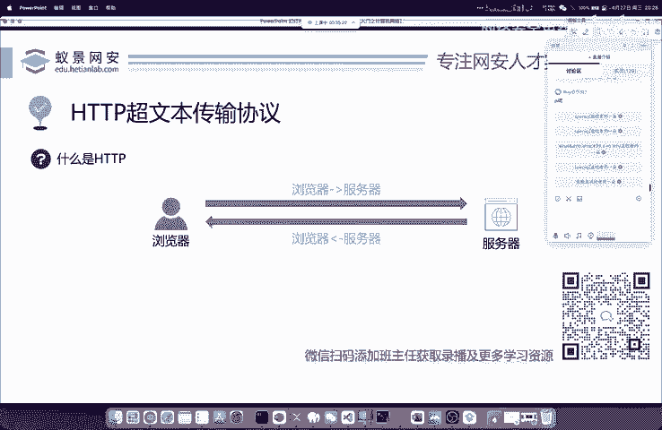

下面，我们来讲解网站访问是如何实现的。

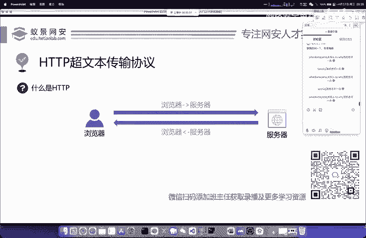

---

### 网站访问的实现基础：HTTP协议

网站访问的核心是**HTTP**，即**超文本传输协议**。有同学问学习开发对安全是否有帮助，答案是肯定的。掌握编程语言当然有帮助，计算机的根本离不开编程语言和操作系统。学习了肯定有益，但不学也不会有太大问题。

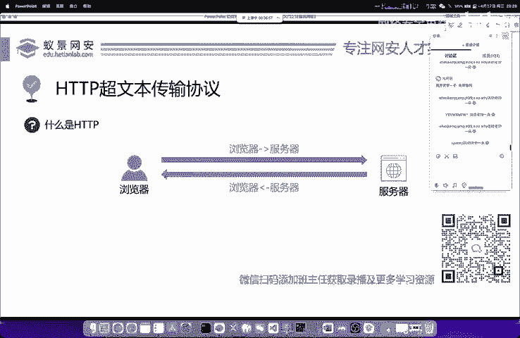

---

### 浏览器与服务器的交互

那么，浏览器和服务器是如何进行交互的呢？我们首先需要了解“协议”这个概念。

**为什么需要协议？**
协议定义了浏览器和服务器之间传输数据的标准格式。这就像中国人和美国人沟通，需要先确定一种共同的语言，比如都用英语，这样才能有效交流。浏览器和服务器之间也是如此，它们需要遵循一个公认的规则，这个规则就是**HTTP协议**。它是国际公认的标准，我们只需要学习并理解它即可。

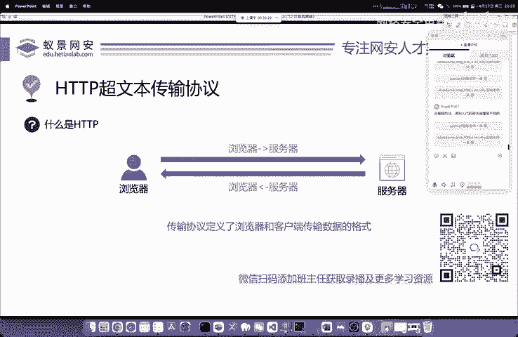

---

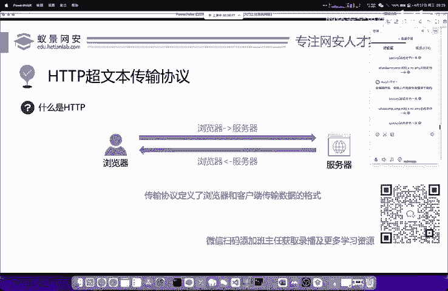

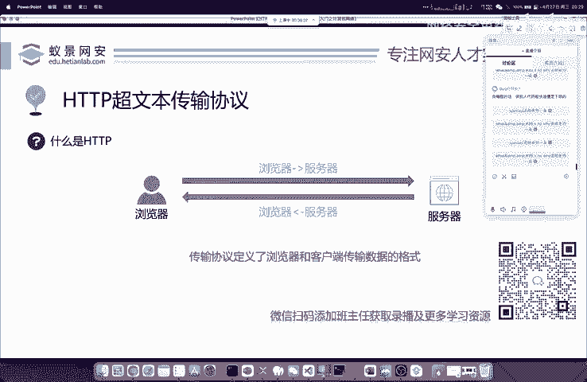

### HTTP的核心概念：请求与响应

当我们用浏览器访问一个网站时，这个过程可以分为两步：

1.  **请求**：浏览器向服务器发送访问要求。这个过程英文称为 **Request**。
2.  **响应**：服务器处理浏览器的请求，并将相应的内容（比如搜索的结果、网页的HTML代码）返回给浏览器。这个过程英文称为 **Response**。

下面我们来看看HTTP协议的一些关键特点。

---

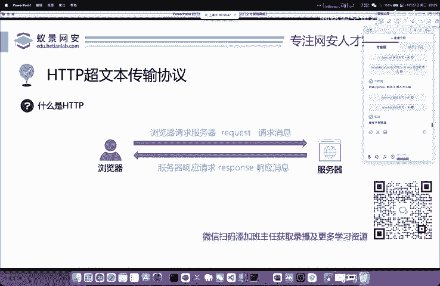

### HTTP协议的特点

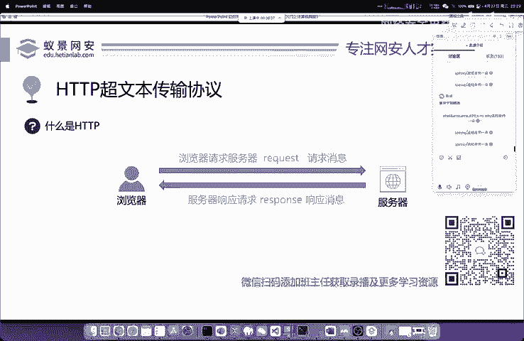

以下是HTTP协议的几个核心特点：

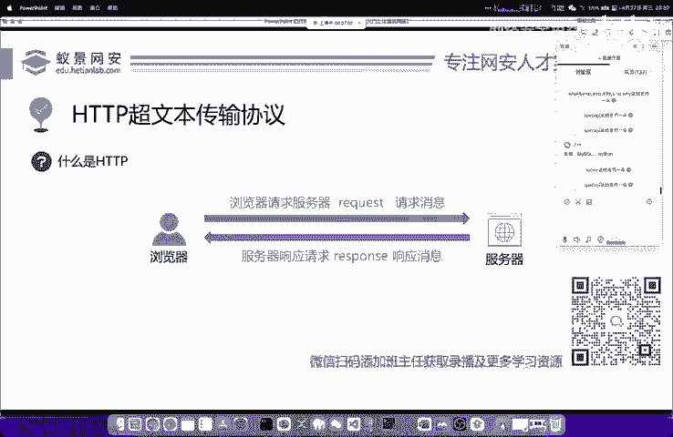

1.  **基于TCP/IP体系结构**：HTTP协议建立在可靠的TCP/IP通信基础之上。
2.  **默认端口**：HTTP协议默认使用**80端口**。既然是“默认”，就意味着可以更改，但实践中绝大多数网站都使用80端口，我们记住这一点即可。

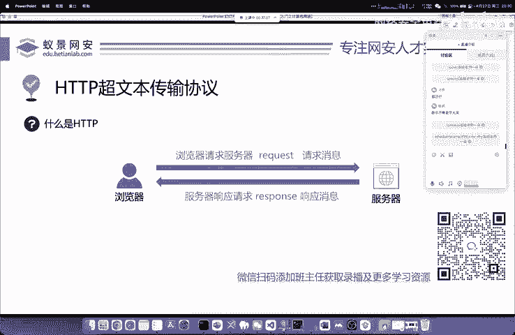

说到这里，有同学可能会发现，现在访问很多网站时，地址栏显示的是 **HTTPS**，而不是HTTP。

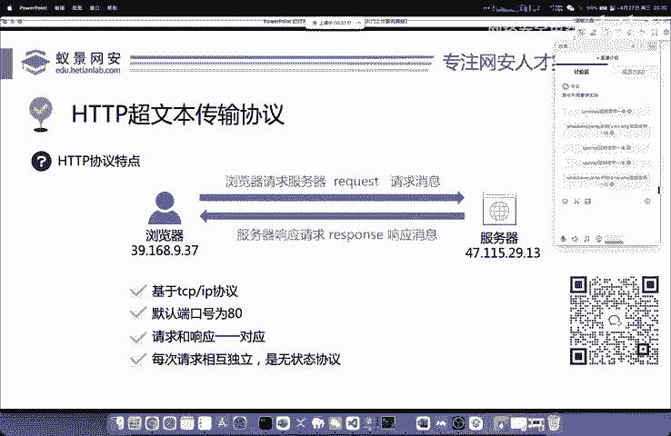

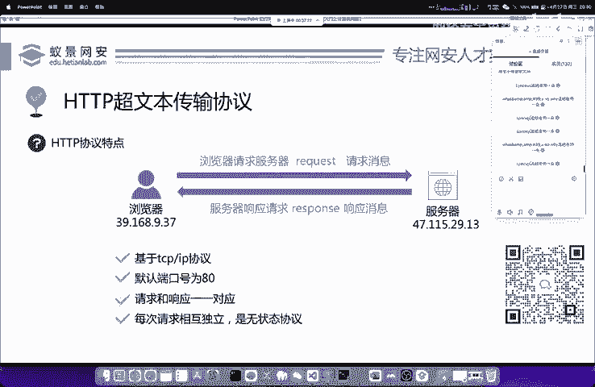

---

### HTTP vs. HTTPS

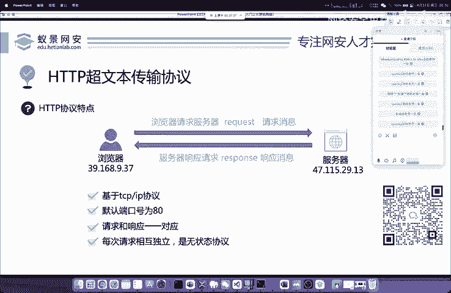

**什么是HTTPS？**
你可以从两个角度来理解HTTPS：

1.  **安全的HTTP**：HTTPS中的“S”代表 **Security**，即“安全的超文本传输协议”。
2.  **基于SSL的HTTP**：HTTPS中的“S”也可以理解为 **SSL**。这意味着HTTPS是使用了SSL（或其继任者TLS）加密证书的HTTP协议。

这两种理解方式都是正确且相通的，记住任何一个都可以，两个都理解则更好。HTTPS在HTTP的基础上增加了加密层，使得数据传输过程更加安全。

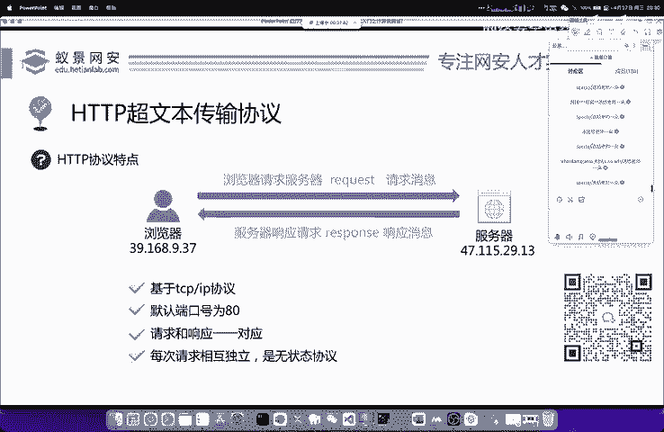

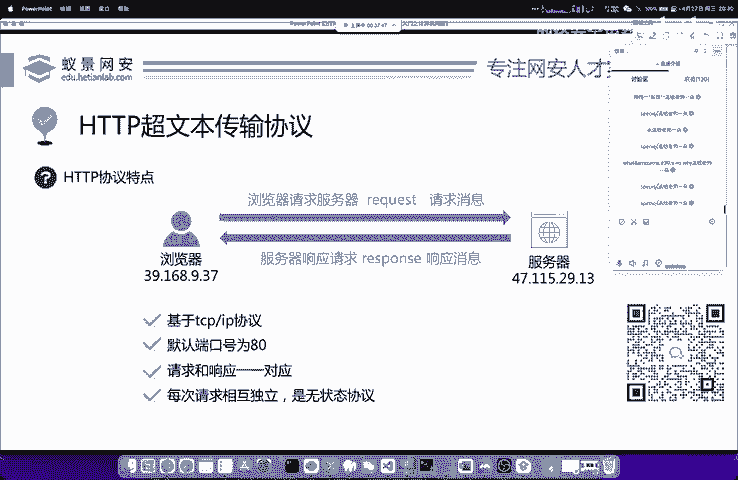

---

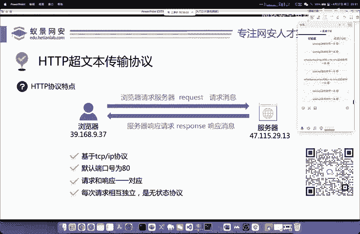

### 总结

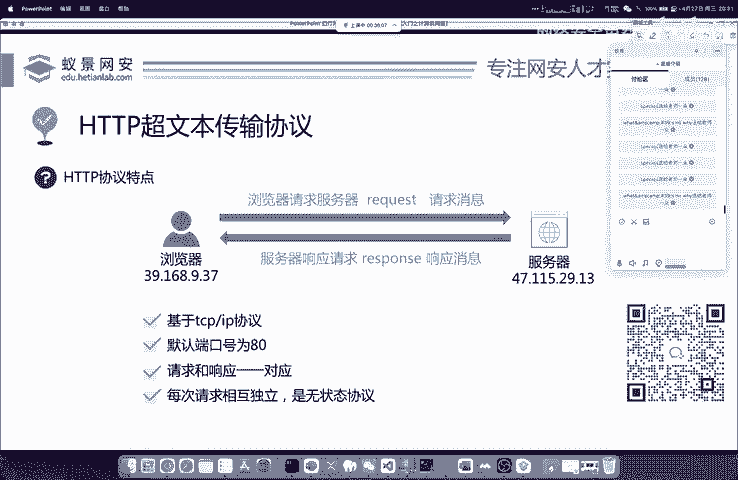

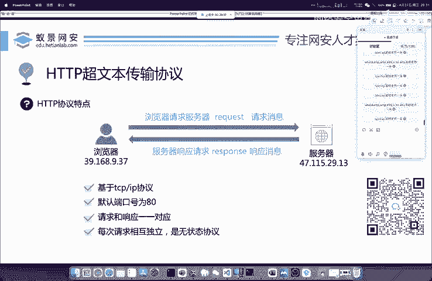

本节课中，我们一起学习了网络通信的基石——HTTP协议。

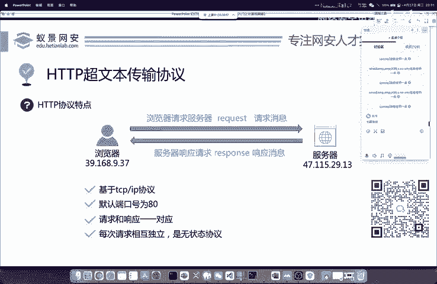

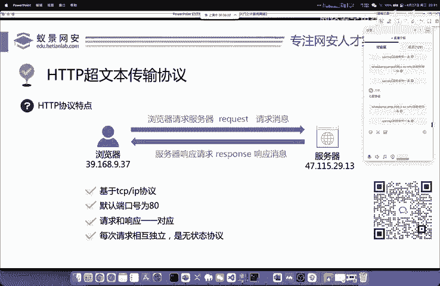

我们首先明确了学习渗透测试无需深入前端开发（如CSS）。接着，我们了解了**协议**的作用是规范通信格式。然后，我们掌握了HTTP通信的两个基本动作：**请求**和**响应**。之后，我们学习了HTTP基于TCP/IP、使用默认**80端口**等特点。最后，我们区分了**HTTP**与其安全版本**HTTPS**，知道HTTPS通过加密来保护数据传输的安全。

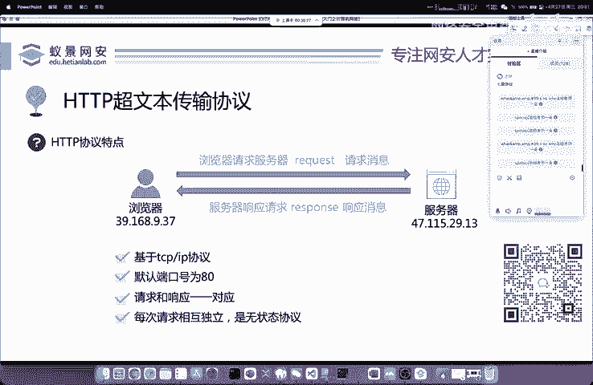

理解HTTP是打开网络安全世界大门的第一把钥匙，在后续的学习中，我们会频繁地与它打交道。