# 网络安全：P40：未知目录、信息泄露、备份文件等漏洞中的FUZZ技术

在本节课中，我们将学习一种在渗透测试中非常实用的技术——FUZZ（模糊测试）。当面对看似“空白”或信息匮乏的网站时，FUZZ技术能帮助我们主动发现隐藏的目录、文件、备份数据等关键资产，从而打开漏洞挖掘的突破口。

## 概述：何时需要FUZZ技术？🤔

上一节我们介绍了常规的漏洞扫描方法，但在实际测试中，我们经常会遇到一些“无从下手”的网站。本节中，我们来看看在哪些情况下，FUZZ技术会成为我们的得力工具。

以下是几种典型的、需要用到FUZZ技术的情况：
*   **网站是空白页面**：访问网站后，页面内容空空如也，没有任何功能点或链接。
*   **常规扫描器无果**：使用自动化工具扫描后，没有发现任何有价值的功能点（如登录、注册等）。
*   **测试陷入僵局**：对目标网站进行了一段时间的测试后，感觉已经“山穷水尽”，不知道下一步该测什么。

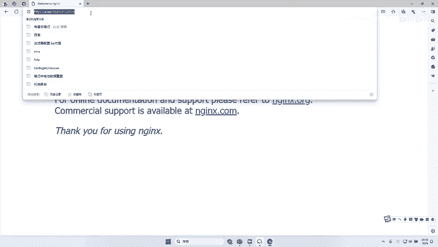

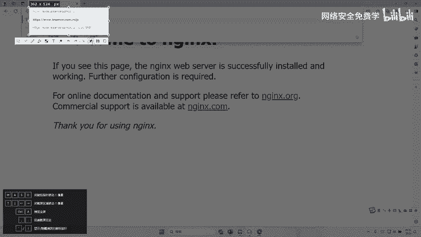

## 实战演示：FUZZ的应用场景 🎯

为了让大家有更直观的理解，我们来看几个具体的网站示例。

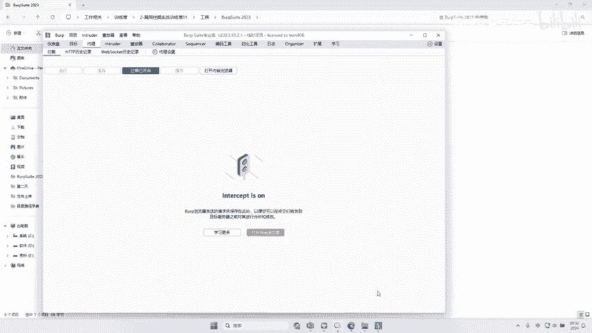

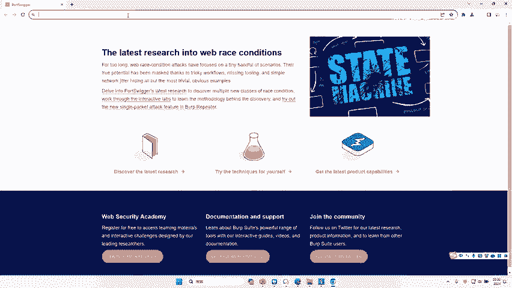

**示例一：完全空白页面**
假如给你一个如下图所示的网站，页面干干净净，没有任何可点击的元素。在这种情况下，你很难通过常规的点击和浏览来发现漏洞。

**示例二：仅有简单提示的页面**
又或者，你遇到一个如下图所示的网站，页面只显示“UR server is not running”等简单提示，同样缺乏交互功能。

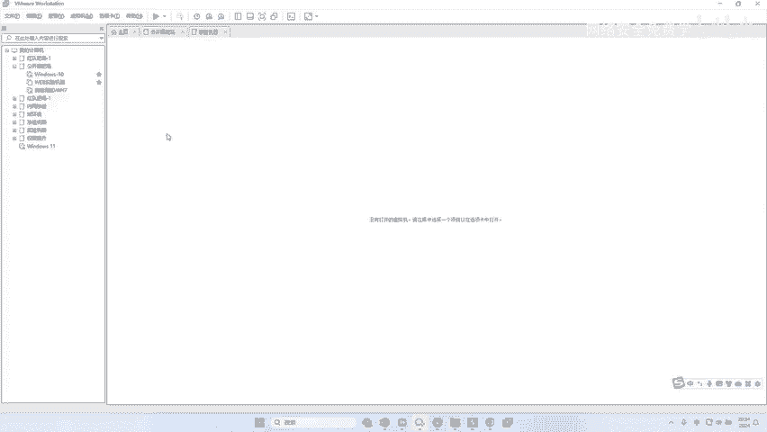

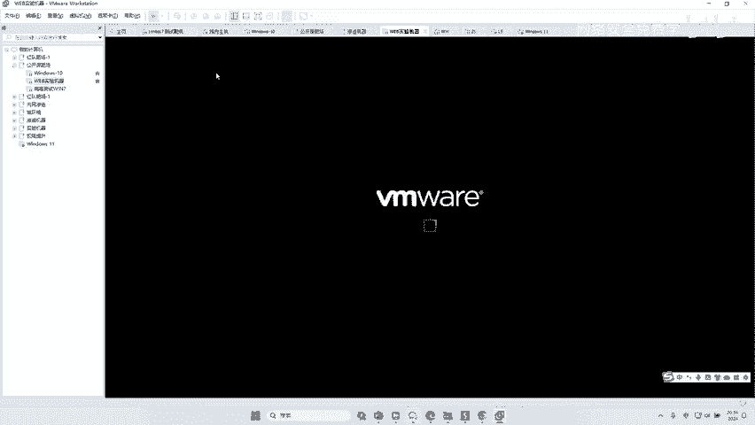

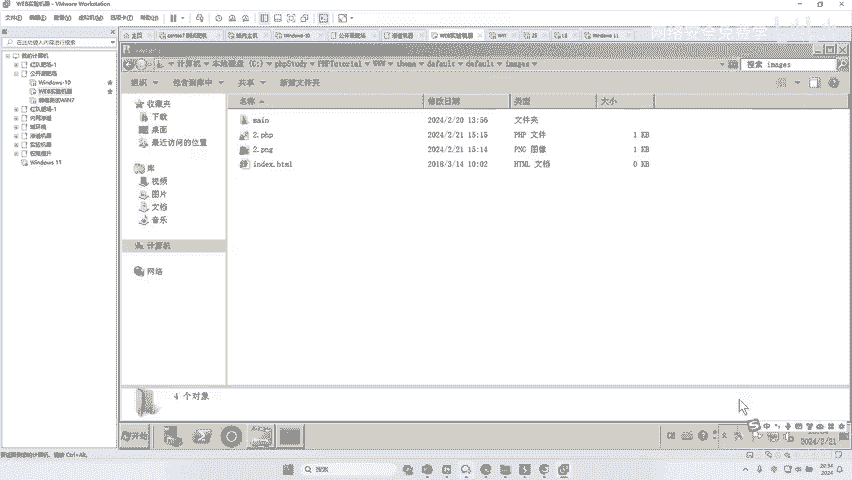

面对这类网站，常规的测试手段往往失效。这时，我们就需要借助FUZZ技术来“主动探索”。

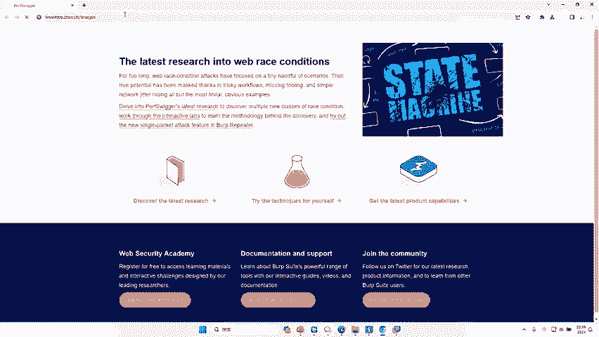

## 第一步：目录FUZZ 📁

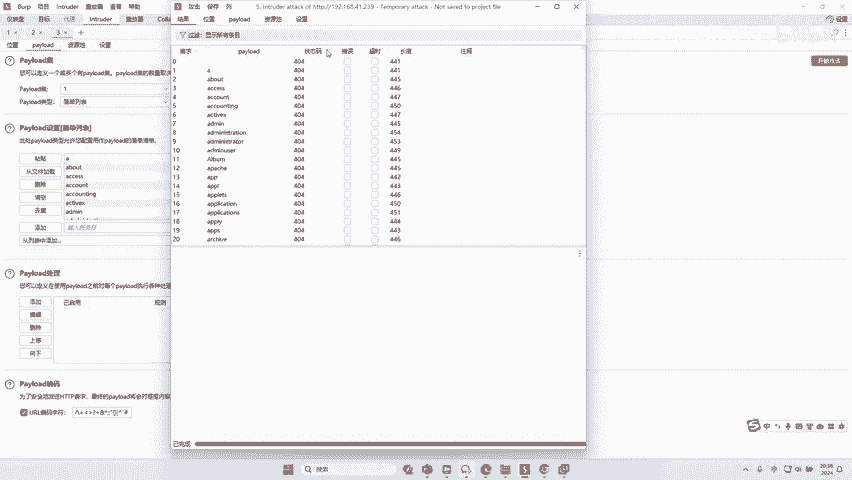

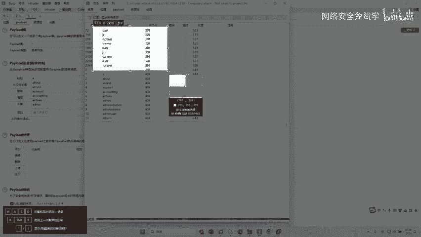

上一节我们看到了需要FUZZ的场景，本节中我们来看看具体如何操作。首先从**目录FUZZ**开始。

**什么是目录FUZZ？**
我们知道，一个网站通常由许多文件夹（目录）构成，例如 `js/`、`css/`、`data/` 等。目录FUZZ就是系统地猜测并尝试访问目标网站可能存在的这些目录。

**手动尝试示例：**
例如，对于目标网站 `http://example.com`，我们可以手动在浏览器地址栏尝试：
*   `http://example.com/js/` （猜测是否存在js目录）
*   `http://example.com/admin/` （猜测是否存在后台目录）
如果返回`404 Not Found`，则说明目录不存在；如果返回`200 OK`或`301/302`重定向，则很可能存在。

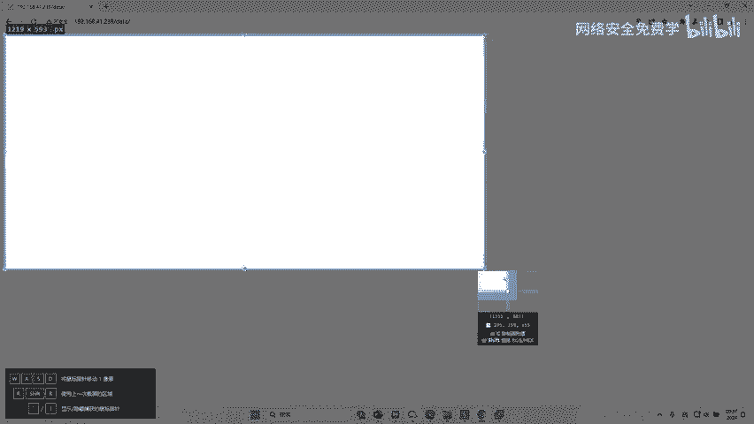

**自动化工具FUZZ：**
手动尝试效率极低。我们使用Burp Suite的Intruder模块进行自动化FUZZ。
1.  在Burp中拦截对目标网站的访问请求。
2.  将请求发送到Intruder模块。
3.  在Positions标签页，清除默认的Payload位置，并选中URL路径中我们希望进行FUZZ的部分（例如，选中路径中的某个单词）。
4.  在Payloads标签页，选择或加载一个包含常见目录名的字典（如 `admin`, `backup`, `data`, `images` 等）。
5.  开始攻击，并观察响应状态码和长度。状态码为`200`、`301`、`302`等，且响应长度与其他明显不同的条目，很可能就是存在的目录。

如下图所示，通过FUZZ，我们发现了 `data`、`js`、`system` 等目录。

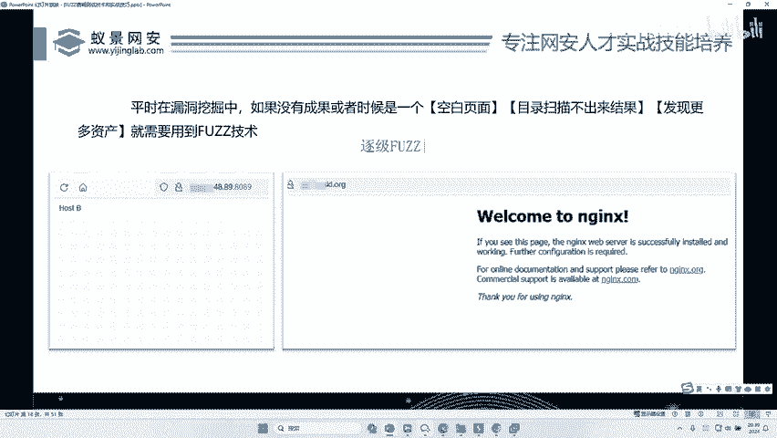

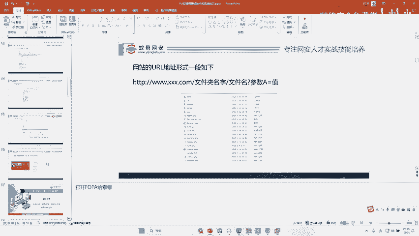

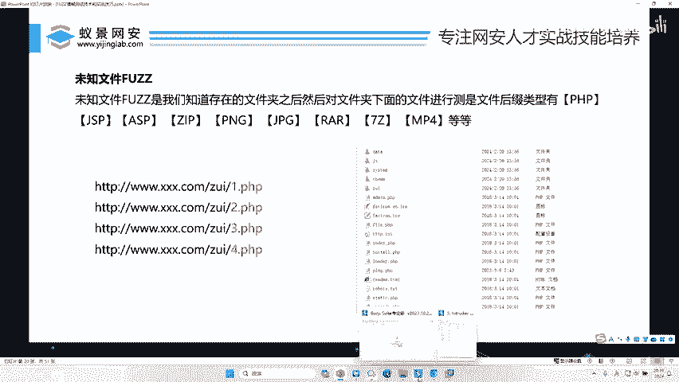

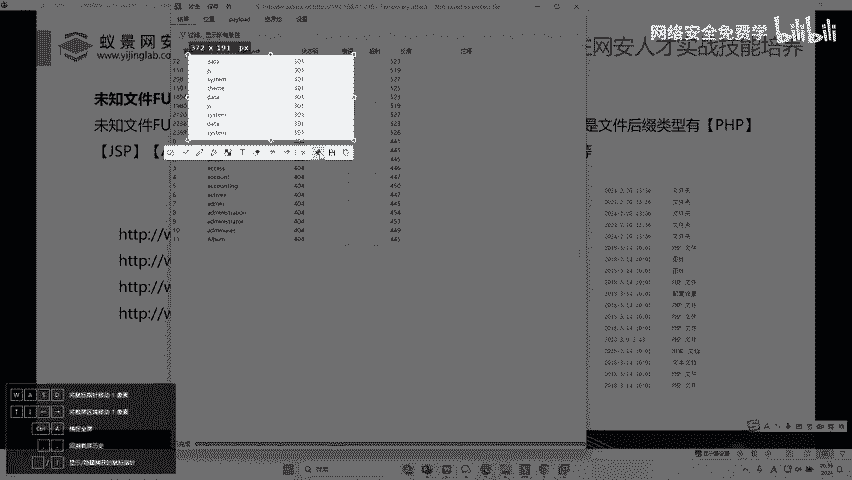

**访问发现的目录：**
随后，我们可以直接访问这些发现的目录，例如 `http://target.com/data/`，以进一步探查其中的内容。

## 深入：逐级FUZZ与文件FUZZ 🔍

上一节我们介绍了如何发现一级目录，但资产挖掘往往需要更深入。本节中我们来看看如何对目录结构进行更深层次的探索。

**逐级FUZZ思想：**
发现了 `data/` 目录后，这个目录下可能还有子目录（如 `data/backup/`）或文件。我们需要对已发现的目录**逐级进行FUZZ**，即一层一层地猜测其下的子目录和文件，不断扩大我们的资产地图。

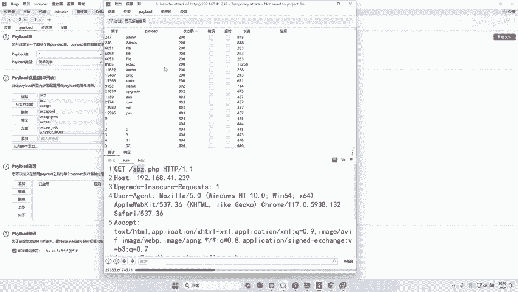

**文件FUZZ：**
除了目录，我们更需要关注具体的文件。网站可能包含各种类型的文件，例如 `.php`、`.jsp`、`.zip`、`.bak`、`.sql` 等。

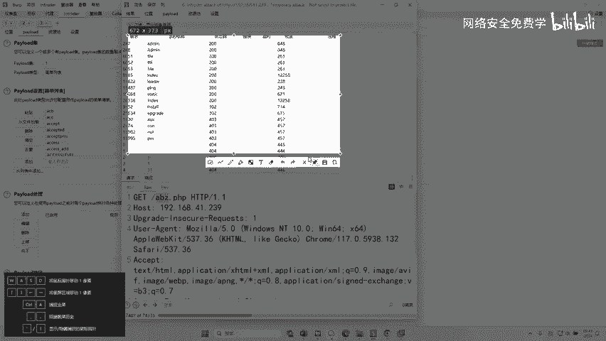

以下是进行文件FUZZ的步骤：
1.  在Intruder中，设置Payload位置为文件后缀名之前的部分。例如，针对 `http://target.com/[FUZZ].php` 进行测试。
2.  使用专门的**文件名字典**（如 `admin`、`index`、`config`、`backup` 等）进行FUZZ。
3.  分析结果，重点关注状态码为`200`的响应。

如下图所示，通过文件FUZZ，我们成功发现了 `admin.php`、`file.php`、`index.php` 等多个文件。

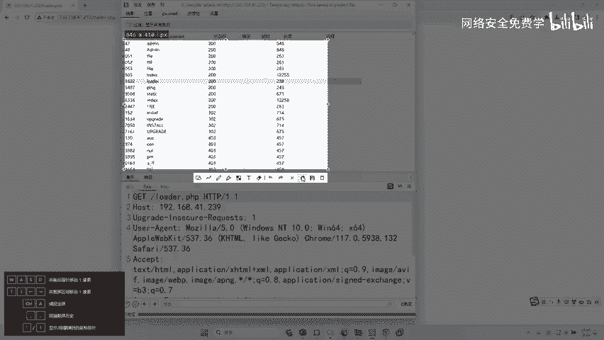

**访问发现的文件：**
尝试访问这些文件，例如 `http://target.com/admin.php`，很可能就直接找到了网站的后台登录入口，这为后续的漏洞测试（如弱口令、爆破）提供了关键路径。

## 核心价值与实战案例 💰

通过以上演示，我们可以看到FUZZ技术的核心思想：**当目标表面无懈可击时，通过系统性的猜测和枚举，挖掘其隐藏的、未公开的资产（目录、文件、参数等），这些资产往往因为疏于管理而存在安全风险。**

**实战案例分享：**
一个真实的漏洞案例可以很好地说明其价值。安全研究员曾在对某大型企业平台的测试中，通过目录FUZZ发现了一个不起眼的目录（如 `upload/` 或 `image/`），进而对该目录进行文件FUZZ。
*   **FUZZ过程**：尝试 `http://target.com/upload/1`，`http://target.com/upload/2` ...
*   **惊人发现**：服务器直接返回了用户上传的手持身份证照片等敏感信息，编号从1连续到上万。
*   **漏洞本质**：这是一个典型的**敏感信息泄露**漏洞，由于开发人员未对目录访问权限进行控制，也未对资源ID做鉴权，导致任何人都可以遍历下载所有用户敏感文件。
*   **漏洞奖励**：此类高危漏洞通常能获得厂商数千元的奖励。

这个案例清晰地表明，FUZZ技术本身并不复杂，但其在发现“深藏不露”的高危漏洞方面，效果极其显著。

## 总结 📝

本节课中我们一起学习了网络安全渗透测试中的一项基础但至关重要的技术——FUZZ（模糊测试）。
1.  **应用时机**：当目标网站信息匮乏、常规扫描无效时，应启用FUZZ。
2.  **核心操作**：
    *   **目录FUZZ**：猜测并发现隐藏的网站目录结构。
    *   **文件FUZZ**：在已知或根目录下，猜测并发现隐藏的特定类型文件（如 `.php`、`.bak`）。
    *   **逐级FUZZ**：对已发现的目录递归地进行上述操作，深度挖掘资产。
3.  **工具使用**：熟练使用Burp Suite Intruder等工具，搭配高质量的字典，是高效FUZZ的关键。
4.  **核心价值**：FUZZ的目的是发现**未知资产**，这些资产是后续漏洞挖掘（如信息泄露、未授权访问、备份文件泄露等）的起点。

记住，很多高额赏金的漏洞，起点往往就是一个通过耐心FUZZ发现的、看似普通的隐藏目录或文件。保持耐心，系统性地进行枚举，你会有意想不到的收获。