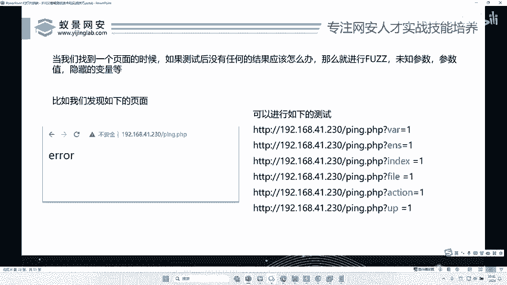
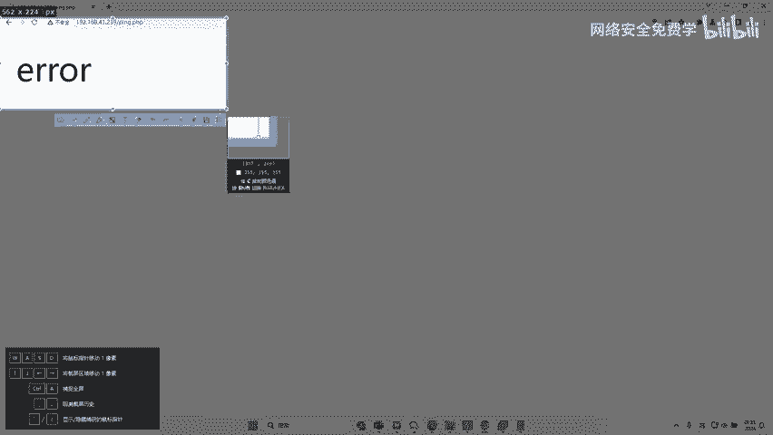
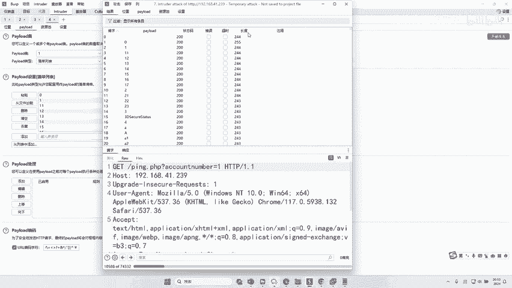
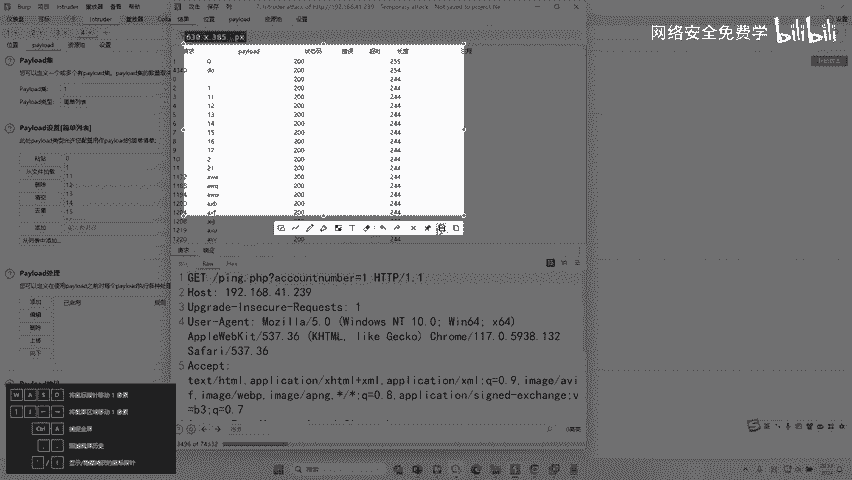
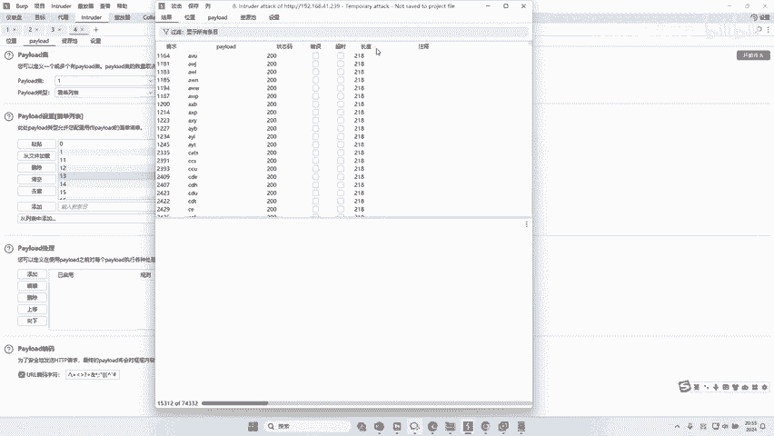
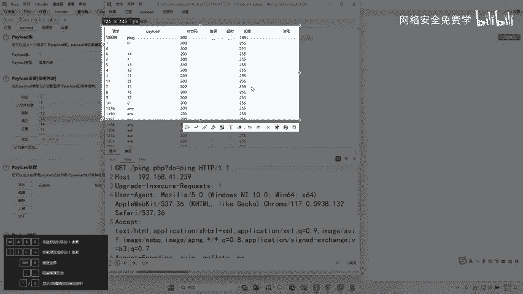
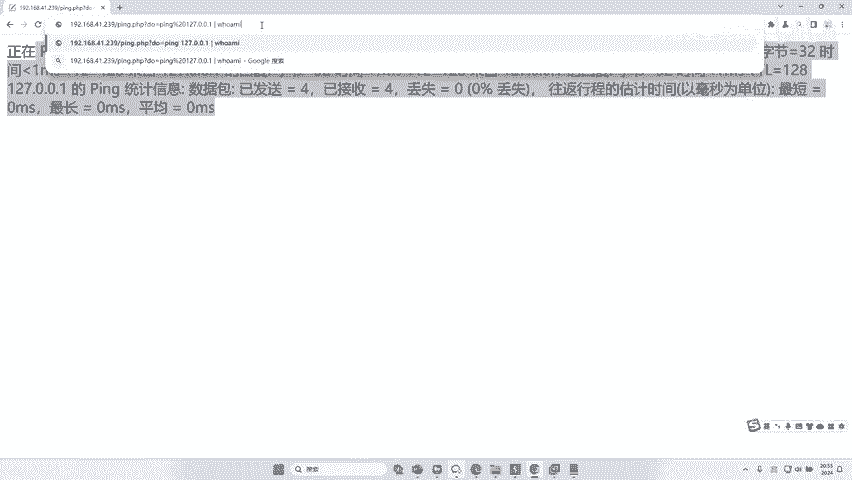
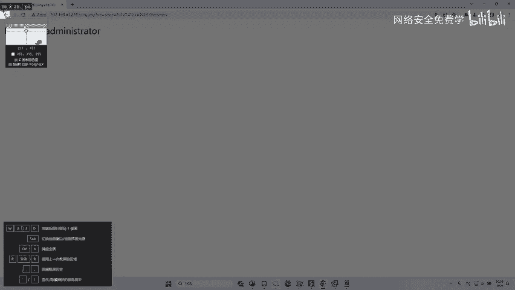
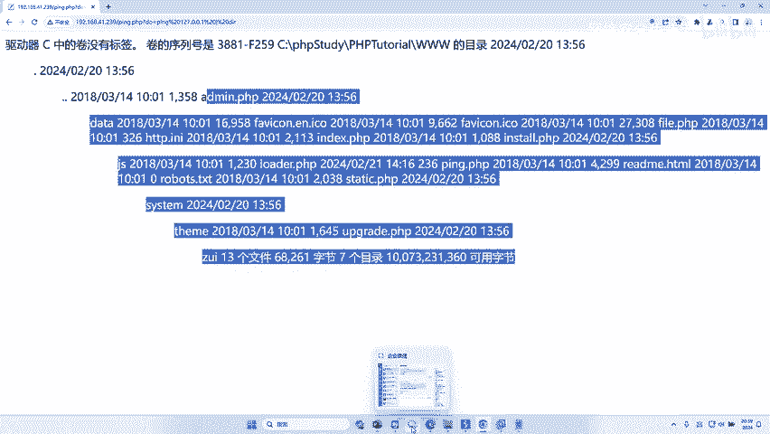
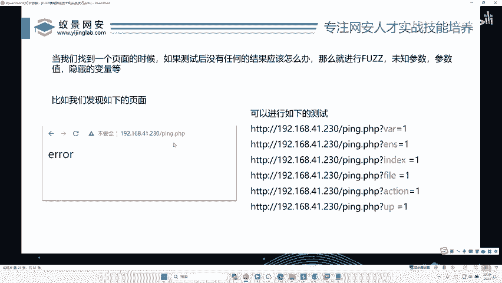

# 网络安全渗透测试：P41：账号密码、隐藏变量、未知参数中的FUZZ骚姿势

在本节课中，我们将学习如何利用FUZZ（模糊测试）技术，在渗透测试中挖掘那些隐藏在账号密码、隐藏变量和未知参数中的安全漏洞。我们将通过一个实战案例，演示如何通过逐层FUZZ，最终发现并利用一个严重的远程命令执行（RCE）漏洞。



## 概述：什么是FUZZ？


上一节我们介绍了FUZZ的基本概念。本节中，我们来看看如何将FUZZ技术应用于更复杂的场景，例如寻找那些不在明面上的参数。


## 实战案例：发现隐藏参数



我们以一个名为 `ping.php` 的页面为例。这个页面看起来很简单，没有明显的参数。


面对这样一个页面，我们如何寻找漏洞？关键在于，它可能接收一些我们不知道的隐藏参数。

以下是第一步操作流程：

1.  使用Burp Suite拦截对 `ping.php` 页面的请求。
2.  在请求中随意添加一个参数，例如 `a=1`。
3.  在Burp Suite的Intruder模块中，将这个参数值 `1` 设置为FUZZ的载荷位置。
4.  加载一个包含常见参数名的字典（例如 `admin`, `id`, `user`, `cmd` 等）。
5.  发起FUZZ攻击，并观察响应。






攻击完成后，我们通过对比响应长度或状态码来寻找异常。在本例中，我们发现当参数名为 `du` 时，响应长度与其他参数明显不同。

## 深入FUZZ：挖掘参数值

找到可疑参数 `du` 后，我们将其填入请求中：`du=1`。发送请求后，页面提示“参数错误”，这证实了 `du` 是一个有效参数，只是其值 `1` 不正确。

接下来，我们需要对 `du` 参数的值进行FUZZ。

以下是第二步操作流程：



1.  在Burp Suite Intruder中，将载荷位置设置在 `du` 参数的值上。
2.  再次加载一个常见值的字典（或与上下文相关的字典，如 `ping`, `test`, `exec` 等）。
3.  发起第二轮FUZZ攻击。





攻击结果显示，当 `du` 参数的值为 `ping` 时，响应内容与其他值截然不同。





## 漏洞验证与利用：从FUZZ到RCE

我们将请求修改为 `du=ping` 并发送。页面返回了ping命令的执行结果，这表明此处存在命令执行功能。

为了验证是否存在远程命令执行（RCE）漏洞，我们尝试注入系统命令。使用管道符 `|` 可以连接多个命令。

**原始请求：**
```
GET /ping.php?du=ping 127.0.0.1 HTTP/1.1
```

**注入命令的请求：**
```
GET /ping.php?du=ping 127.0.0.1 | whoami HTTP/1.1
```


服务器返回了当前系统用户信息，这成功证明了RCE漏洞的存在。攻击者可以利用此漏洞执行任意系统命令。

以下是攻击者可以执行的部分命令示例：

*   **查看网络配置：** `du=ping 127.0.0.1 | ipconfig`
*   **查看系统用户：** `du=ping 127.0.0.1 | net user`
*   **强制关机：** `du=ping 127.0.0.1 | shutdown -s -f -t 0`
*   **列出目录文件：** `du=ping 127.0.0.1 | dir`

**核心漏洞原理：**
该漏洞的本质是服务器未对用户输入的参数 `du` 的值进行严格过滤和校验，直接将其拼接到了系统命令中执行。
**危险代码示例（模拟）：**
```php
$command = "ping " . $_GET[‘du‘];
system($command); // 直接执行系统命令
```

## 总结

本节课中我们一起学习了如何通过FUZZ技术挖掘隐藏漏洞。



1.  **第一层FUZZ**：用于发现未知或隐藏的参数名。
2.  **第二层FUZZ**：在发现有效参数后，对其可能的值进行模糊测试，以触发异常行为。
3.  **漏洞利用**：通过分析FUZZ结果，识别出命令执行点，并利用管道符等技巧注入恶意命令，实现远程命令执行（RCE）。



这种“逐级FUZZ”的方法是渗透测试中寻找逻辑漏洞和未知入口点的强大手段。在实战中，许多高危漏洞（如本例中的RCE）正是通过这样细致耐心的测试被发现的。