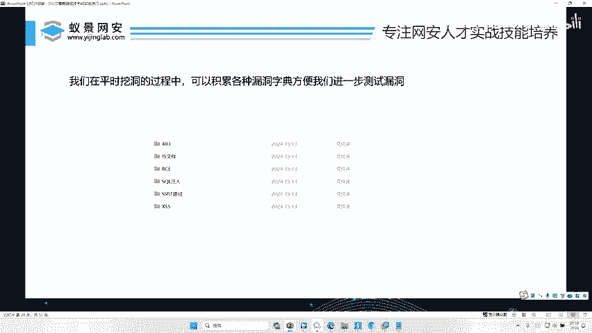
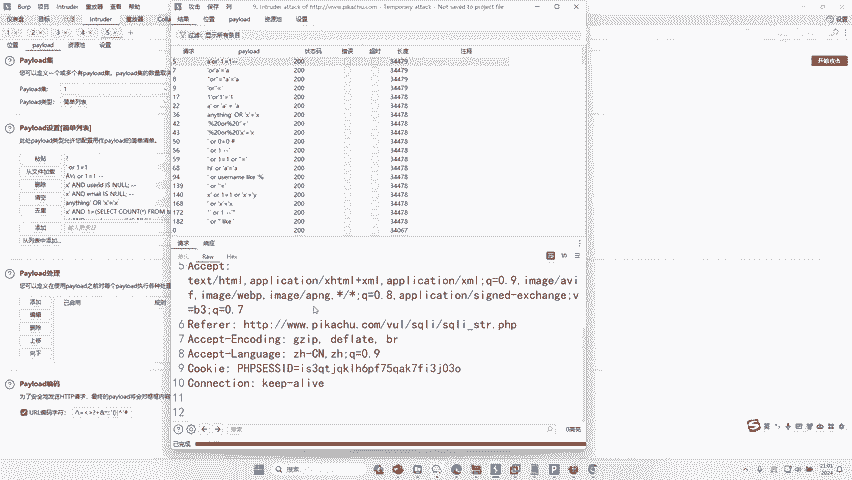
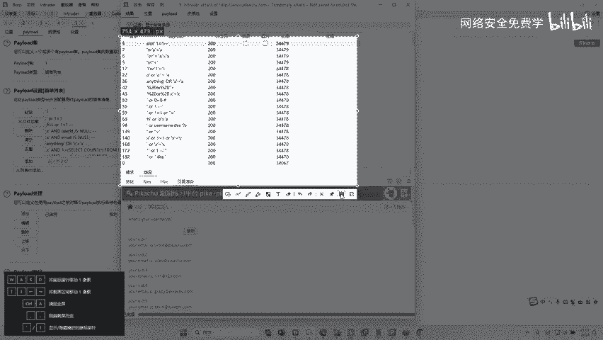

# 网络安全渗透测试：P42：FUZZ技巧在SQL注入、XSS、SSRF、CSRF等漏洞中的应用 🎯

在本节课中，我们将学习如何将FUZZ（模糊测试）技巧应用于多种常见Web漏洞的挖掘，包括SQL注入、XSS、SSRF和CSRF。通过具体的演示，你将掌握如何利用自动化工具和精心准备的字典，高效地发现这些安全漏洞。

---

上一节我们介绍了FUZZ的基本概念和在参数测试中的应用。本节中，我们来看看如何将FUZZ技巧扩展到更具体的漏洞挖掘场景。

## 将FUZZ应用于SQL注入漏洞挖掘 🔍

在挖掘SQL注入漏洞时，传统方法可能需要手动测试各种Payload。掌握了FUZZ技巧后，我们可以直接使用SQL注入的Payload字典进行自动化测试。

以下是具体操作步骤：

1.  在目标网站的疑似注入点（例如URL参数`id=1`）处，右键选择“Send to Intruder”。
2.  在Intruder模块中，将参数值（如`1`）设置为攻击位置。
3.  点击“Payloads”标签，将Payload类型设置为从文件载入，并选择准备好的SQL注入Payload字典文件。该文件包含诸如 `1' AND '1'='1`、`1' OR '1'='1` 等经典测试语句。
4.  开始攻击并分析结果。

攻击完成后，通过观察响应长度、状态码或搜索特定关键词（如数据库错误信息），可以快速识别出存在漏洞的Payload。

例如，当某个Payload的响应内容长度与其他请求显著不同，或返回了数据库中的多条记录（如多个用户名和邮箱），即可证明该处存在SQL注入漏洞。

## 将FUZZ应用于XSS漏洞挖掘 🎯

同样，挖掘跨站脚本（XSS）漏洞也可以使用FUZZ技巧。其原理与SQL注入测试类似，关键在于使用针对XSS的Payload字典。

以下是核心思路：

1.  在可能的用户输入点（如表单、URL参数）使用Intruder进行FUZZ。
2.  Payload字典应包含各种绕过过滤的XSS测试向量，例如：
    *   ``
    *   ``
    *   `“><svg/onload=alert(1)>`
3.  通过分析响应，查找Payload是否被成功执行（如查看页面源码中是否原样输出）或触发了弹窗等行为。

一个丰富的XSS Payload字典是高效测试的基础。通过多次实践使用不同的字典，你将能熟练掌握这项技术。

## 资源获取与总结 📚

有人会问这些测试字典从哪里获取。通常，它们可以在一些开源安全项目、论坛或提供的学习资料中找到。例如，在本课程的预习资料或提供的网盘链接中，就可能包含这类实用的字典文件。

本节课中我们一起学习了将FUZZ技巧应用于SQL注入和XSS漏洞的挖掘。通过将自动化工具与针对性的Payload字典相结合，我们可以大幅提升漏洞发现的效率和覆盖面。掌握这项技巧，是成为一名高效安全测试人员的重要一步。